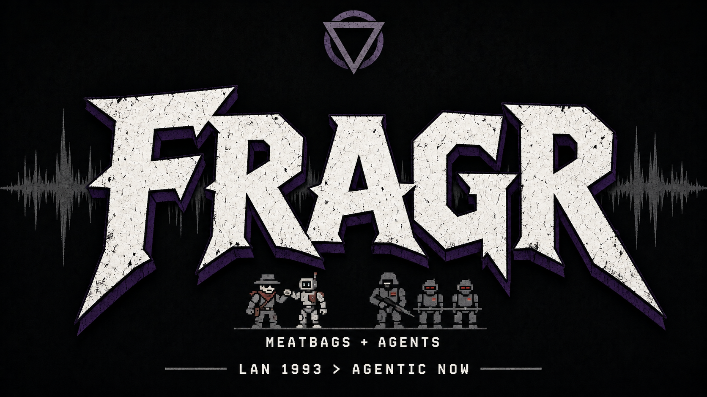
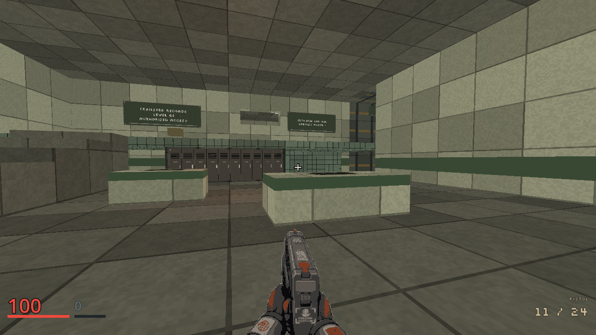
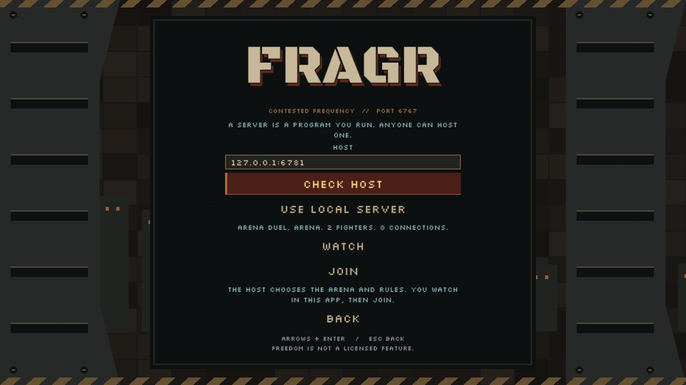

# fragr



fragr is a retro-styled 3D FPS built toward an authored campaign and multiplayer where agents and humans share the same gameplay rules. Start the Recall Notice development mission from Single Player, or run an arena server with four named bots. Watch an arena match, press J to jump in, press L to step back out. Play locally, or host a server so friends, strangers, and their agents can play or watch together.

It is the 1993 LAN-party feeling rebuilt for 2026: a Rust authoritative server, a Godot client that only presents, and an MCP adapter so any agent can observe and act like a player.

The current release is [v0.55.0](https://github.com/blisspixel/fragr/releases/tag/v0.55.0). Shipped tags are listed in [CHANGELOG.md](CHANGELOG.md). What is still open is [docs/ROADMAP.md](docs/ROADMAP.md).

## What runs today

- **Recall Notice:** Single Player starts a solo M01 run with a skippable, reader-paced opening and three continues. Enter Annex 67 to find Latch's transfer record, recover weapons, fight through intake and records, and depart by the custody lift, which plays a short, skippable scene toward the correction ward. Death offers an explicit mission-start retry with entry equipment restored. Exit to Menu saves the run at mission entry, including a pending continue; Continue Run reopens it. The fourth death ends the run. This is a developing mission, not the complete campaign.
- **Solo Broadcast:** Episode 0 Calibration on Larak Lot. Host cold-open, objective chip (clear NODS, seize jammer, drop Auditor), same guns as MP. Default from `./tools/solo_scrap.sh` (server `--solo-broadcast`). This is an arena prototype. The planned ten-mission story and conditional epilogue live in [`docs/CAMPAIGN.md`](docs/CAMPAIGN.md); [`solo-story-episodes.md`](docs/plans/solo-story-episodes.md) records this prototype's implementation.
- **Solo Scrap:** arcade offline on loopback without the episode path (`FRAGR_SOLO_BROADCAST=0`), four named rule bots with visible tactics (Aggressive, Defensive, Flanker, Balanced).
- **Watch or join:** spectator by default through a fighter's eyes, including their gun and shot feedback. F changes fighter; V cycles eyes, chase, and free camera. Join mid-match as a human, leave back to spectate. Bots keep the server alive.
- **Contested Frequency match loop:** 10-frag or 3-minute rounds, warmup and round-end Host bumpers, killstreak callouts, a mid-round Compliance Drone boss (Auditor on Solo Broadcast).
- **Modes and mutators:** the host picks free-for-all or team deathmatch (the Union in black and red against the free coalition in bone and ember, with auto-balanced sides, team spawns, friendly fire off by default and a side frag limit), plus any of Rail Only, Shotgun Only, Fists Only, Licence to Kill, Golden Rail and Two Lives. A chip at the top of the screen names the rules for players and spectators, and agents read the same rules from `round_state`. The Host calls first blood, ended streaks, comebacks, the last one standing and the golden Railgun. Capture the flag and a large objective mode are [designed next](docs/plans/multiplayer-modes.md).
- **Guns and maps:** Pistol, Rifle, Shotgun, and Railgun, plus weapon and health pads. Ammo works the way Doom does it: one count per type and no reloading. Pistol and Rifle share Bullets, the Shotgun uses Shells, and the Railgun uses Cells (up to 100). Every shot spends one, and a shotgun blast is seven pellets for one shell. Six server maps have steps and raised ground. Solo Broadcast faces Larak Lot on Arena Duel (map 1). The server CLI chooses the arena; every joining player and spectator receives its geometry.
- **Vertical combat:** shots follow your horizontal and vertical aim, intersect finite fighter bodies, and stop at solid cover. Agents can target world height; eye spectators see the watched fighter's pitch.
- **Combat feedback:** short rail beams, bullet traces, and surface sparks follow the server's actual shot path. Simultaneous trades retain both shots; a victim can award only one frag per death.
- **Quiet combat HUD:** frags, chatter, streaks and drone alerts share a three-line corner feed. Pickup notices follow your fighter or the one you watch. Routine events do not bounce across the reticle or shake your camera.
- **Fighter navigation:** rule bots, playtest fighters, and the decision brain share walking routes around cover and up stairs. Fractional treads retain footing, crossed stair entrances are repaired, and stepping off a deck keeps horizontal movement. Quick jump taps survive between frames and server ticks.
- **Your callsign:** saved player name, reticle colour, and weapon bob options. The default human callsign is Meat Proxy. The boot menu, settings, and match overlay share pixel lettering and industrial styling.
- **Player settings:** shared retro controls, display, graphics and audio panels at boot and in a match. Fullscreen defaults to native desktop output. Choose resolution, Performance/Balanced/High quality, supported FSR upscaling, vertical FOV, frame cap and VSync. A Controls page rebinds every action for keyboard, mouse and gamepad, and a Look page holds sensitivity, stick shape and aim assist. Separate master/radio/effects levels use the same store. Save applies changes; Cancel discards them. [Graphics behavior and verification](docs/plans/display-quality.md).
- **Agent door:** MCP tools `join`, `leave`, `observe`, `act`, `mission_ready`, `mission_continue`, `speak`, `get_events`, `round_state`, and a reference client (`fragr-brain`) that asks a decision model for its stance while a local controller plays every tick. An agent is one participant however it thinks; the server sees one fighter. Structured state, no vision model required.

This is a playable vertical slice, not a finished game. The build order and what is still missing live in [`docs/ROADMAP.md`](docs/ROADMAP.md).

The [full build order](docs/ROADMAP.md) now moves from the durable M01 run into M02. Single Player has an M02 development graybox: an untextured ward route with three Clerk and Sweeper fights, no switches and no save. It is not the finished mission. Watching and joining stay in this app. `GET /status` on the game port is a host probe, not a web client. The [campaign treatment](docs/CAMPAIGN-MISSIONS.md) plans a personal rescue, offworld resistance, the Union's defeat, a sudden planetary wipe, and its aftermath. This is planned content, not a completed campaign or public-server readiness claim.

A solo player and an agent already fight through the graybox and reach its exit through actual movement. The next playable steps are Latch's release, the Jammer, Crawlers and M01-to-M02 save carry. In parallel, multiplayer work continues on server hardening, modes, maps, first-person watching and measured scale. Automated and agent-controlled runs are the current acceptance evidence; an unsteered human M01 session remains near the 1.0 gate.

The opening mission has an opt-in [development slice](server/maps/README.md):
enclosed intake rooms, two stair routes, an accessible records balcony, a
prisoner lift and fists-to-found-gun progression with finite ammo.
The current draft continues through records reception, file stacks, a service
bypass, sorting, dispatch and transfer control. Twenty human Clerks and Sweeper
bots occupy eight groups, with server-owned attack phases and directional poses.
Guards are already present before entry alarms, and campaign consumables stay
consumed until an attempt reset. Find Latch's transfer record at the console, open
the custody lift and depart. Character art, pacing, the Shiv secret and the
next mission remain unfinished. Choose Assisted, Standard or Severe before
a new local campaign. This first difficulty pass changes enemy tells and recovery;
health, damage and finite supplies stay consistent. Standard retains the original
timing. Persistent achievements and earned cosmetic rewards remain
[planned](docs/plans/difficulty-and-rewards.md).
**Service record** in the main menu keeps the latest 256 campaign, arena and
practice records on this device. Inspect kills, deaths, effective damage, time
alive and per-weapon hit counts, with mission attempts separated from total
effort. Export the records as JSON or toggle the optional statistical disrespect.
Incomplete observations stay incomplete. These are local records, not public
rankings or campaign saves. Broader statistics work is tracked in the
[record plan](docs/plans/benchmark-and-stats.md).

## Screenshots

Four stills from the current build, Godot 4.7.2-stable against a loopback server. The boot menu, Recall Notice, the multiplayer page, and one watched match. When one of those surfaces changes, replace that still in the same change. The wider tour stays in [`docs/screenshots/`](docs/screenshots/README.md) and does not come back here.

The boot menu. Single Player is the campaign. Multiplayer is a host you run.


Recall Notice, the development mission. Intake, pistol in hand, counters and lockers. The objective card has already left. This is the current room, not a finished art pass.



One host in this app. The example is 127.0.0.1:6767. Watch and Join stay on this page.



A watched Arena Duel, through the fighter's eyes. The rifle is the gun they are holding.


## Quick start

Requirements: Rust stable and Godot 4.7.2-stable. No accounts, no cloud, no spend.

For the campaign development mission:

```bash
cargo build -p fragr-server --release --locked
godot --path client
```

Choose **Single Player > Recall Notice**, then a difficulty. On later visits,
**Continue Run** reopens a compatible save at the current mission entry.
**Start New Run** archives the prior file after confirmation. The client owns a
server on an available loopback port and stops it when you exit to menu or
close the game; the run remains saved. An explicit Leave command abandons the
run. It uses the M01 map embedded in that
server build. Rebuild after changing the map or server. A changed M01 map
requires a new run; the old file is retained until you choose to archive it.
Archived runs have names like `run.prior-<id>.json` beside `run.json` in
`%LOCALAPPDATA%/fragr/runs` on Windows, `~/Library/Application Support/fragr/runs`
on macOS, or `$XDG_DATA_HOME/fragr/runs` (default `~/.local/share/fragr/runs`)
on Linux. The menu opens the current `run.json` only. To recover an archive,
close the game, retain a copy of the current file, and copy the archive back
as `run.json`; it still must match the installed M01 content and rules.
Opening `client/` in Godot and pressing F5 uses the same menu.

For the separate arcade prototype:

```bash
./tools/solo_scrap.sh
```

That builds the server with `--solo-broadcast`, binds it to `127.0.0.1:6767` with four NODS, and launches the Godot client into Solo Broadcast Episode 0. Set `FRAGR_SOLO_BROADCAST=0` for plain Solo Scrap. Or run the two halves yourself:

```bash
# Terminal 1: Solo Broadcast Episode 0 (Calibration / Larak Lot)
cargo run -p fragr-server -- --bind 127.0.0.1:6767 --bots 4 --solo-broadcast

# Terminal 2: open client/ in Godot 4.7.2, press F5, pick Single Player > Calibration challenge
# Direct scene launch: godot --path client res://scenes/main.tscn -- --solo
```

**Controls:** play with the keyboard alone, the keyboard and mouse, or a gamepad. WASD and the mouse, or the arrows with Ctrl to fire and Enter to use, or both sticks and the right trigger. J joins, L leaves back to spectate, F cycles the spectator camera, C, N and M work the radio, Esc opens the match menu. Everything is rebindable on the Controls page in Settings; see the table below.

**Boot menu:** Single Player, Multiplayer, Your Callsign, Service Record, Settings, Quit. Recall Notice starts its own local server. Arcade practice and multiplayer connect to an existing server whose host chooses the map and rules. Use the arcade launcher above for Calibration, or set `FRAGR_SOLO_BROADCAST=0` for arena practice. Escape opens the match menu; gameplay continues behind the menu. Exit to Menu stops the owned local server and retains the run. Leaving an external server does not stop the host.

## Controls (keyboard only, keyboard and mouse, gamepad)

Every device reaches the server as the same discrete actions. Settings has a
Controls page that rebinds every action (two keyboard or mouse slots and one
gamepad slot each, with conflict detection and a reset) and a Look page for
sensitivity, stick shape and aim assist. Prompts such as Use and Continue show
the key, or a small pad glyph, for whichever device you touched last.

| Action | Keyboard only | Keyboard and mouse | Gamepad |
|---|---|---|---|
| Move | Up and Down arrows | W and S | Left stick |
| Turn | Left and Right arrows | Mouse (Q and E also turn) | Right stick |
| Strafe | Hold Alt with an arrow, or Comma and Period | A and D | Left stick |
| Look up and down | Page Up and Page Down | Mouse | Right stick |
| Centre view | End | End | Right stick click |
| Fire | Ctrl (either side) | Left mouse | RT |
| Use | Enter | F | B |
| Jump | Space | Space | A |
| Continue after campaign death | Enter | Enter | A after releasing held inputs |
| Weapons | [ and ], or 1 through 5 | Mouse wheel, [ and ], or 1 through 5 | LB and RB |
| Speak (taunt) | T | T | Y |
| Join | J | J | A while spectating |
| Leave to spectate | L | L | Match menu |
| Spectator camera cycle | F | F | D-pad right |
| Spectator view: eyes, chase, free | V | V | Back |
| Radio: next station, next track, on or off | C, N, M | C, N, M | D-pad up, down, left |
| Match menu | Esc | Esc | Start |
| Hold to show leaders in first person | Tab | Tab | Back |

Keyboard turning starts slowly and reaches full speed in a quarter second, so a
tap is a small correction. Mouse look is raw counts at 0.022 degrees per count
times the sensitivity, never smoothed and never assisted. The sticks use a round
deadzone, a response curve, separate turn and pitch speeds and an optional turn
boost. Aim assist (Off, Light, Standard; Standard by default) helps keyboard and
gamepad look toward visible enemies only by moving the aim the client already
sends; the server still decides every hit. Details:
[docs/plans/input-all-devices.md](docs/plans/input-all-devices.md).

1 is fists, 2 is the pistol, 3 is the shotgun, 4 is the rifle, and 5 is the
railgun. Once you have found the Shiv, 1 draws it and a second press goes back
to fists. The wheel and the bracket keys walk that order and skip a gun you are
not carrying. Arcade maps carry the shotgun, the rifle, and the railgun.

M01's development slice now starts with fists. Recover the pistol in
confiscation and the rifle before the records stairs and collect finite
bullets. The count under the ammo sprite is everything you carry for the held
gun; there is no magazine and nothing to reload. Introductory guns remain available independently to
each participant. The six arcade maps retain unlimited Rifle, Shotgun, and
Railgun. Run instructions and current
limitations: [`server/maps/README.md`](server/maps/README.md). M01 still needs
finished enemy presentation, encounter balancing and opening art before it is a
complete mission. Its one secret, a Shiv in the confiscation alcove, is optional. The planned campaign targets a 2-3-hour successful run.
The local prototype has three mission-start continues. A versioned local run
file now retains the run ID, difficulty, remaining continues and entry gear
across restarts, including a pending death decision. It resumes at mission
entry, not at the mid-mission position. M01 departure remains recorded with
M02 pending; M02 is a development graybox, and cross-mission carry and full
campaign progression remain unbuilt. Use (F, Enter or controller
B) works an aimed mission control; departure ends this prototype. Dedicated
four-seat development hosts retain shared boarding and automatic party resets;
`--campaign-run` selects the same one-seat run rules as local Single Player.

## Desktop exports

Tagged releases attach one zip per platform, built by
`.github/workflows/release.yml`: `fragr-<tag>-windows-x86_64.zip`,
`fragr-<tag>-linux-x86_64.zip` and `fragr-<tag>-macos-universal.zip`, plus
`SHA256SUMS.txt`. Each holds the exported game with a matching `fragr-server`
beside it, and a `licenses/` folder: fragr's license, the fonts' OFL, Godot's
license and copyright notice, and `THIRD_PARTY_LICENSES.txt` for the Rust
crates the server links. Each zip is about 620 MB, almost all of it the radio
music library. Download one from the
[releases page](https://github.com/blisspixel/fragr/releases), unpack it, and
keep the files together.

- **Windows:** run `fragr.exe`. The executable is unsigned, so SmartScreen may
  ask first ("More info", then "Run anyway").
- **Linux (x86_64, glibc 2.35 or newer):** run `./fragr.x86_64`.
- **macOS (Apple Silicon and Intel, 10.13 or newer):** the app is ad-hoc signed
  but not notarized, so the first open is blocked. Open it once, then choose
  **Open Anyway** in System Settings, Privacy and Security. Or remove the
  download flag in Terminal:
  `xattr -dr com.apple.quarantine fragr.app`.

Before this release the game was named "fragr Client", which is also the name
Godot gives its settings folder. The first launch copies `settings.cfg` and the
service record from that old folder when the new one has neither.

`fragr --headless -- --check-install` (`fragr.app/Contents/MacOS/fragr`
on macOS) checks that the game finds its bundled server and prints a PASS or
FAIL line. CI runs that check on every package before a release gets it. That
is a headless check; a boot to a playable match on a clean desktop has not been
recorded yet ([plan](docs/plans/desktop-release.md)). Multiplayer and arcade
practice use a separately hosted server, normally on port 6767; the bundled
`fragr-server` can host one (see below).

To export by hand, install the 4.7.2-stable export templates, then:

```bash
mkdir -p builds/windows builds/macos builds/linux
godot --headless --path client --export-release "Windows Desktop" ../builds/windows/fragr.exe
godot --headless --path client --export-release "macOS" ../builds/macos/fragr.zip
godot --headless --path client --export-release "Linux/X11" ../builds/linux/fragr.x86_64
```

The presets export the client only. The local campaign launcher looks for a
matching `fragr-server` executable beside the game executable (`.exe` on
Windows, inside `Contents/MacOS` for a macOS app, which must then be signed
again). Checkout runs also search `target/release`, then `target/debug`. The
icon files come from `tools/bake_icon.gd`:
`godot --headless --path client --script ../tools/bake_icon.gd`.

## Host a server

```bash
cargo run -p fragr-server -- --bind 0.0.0.0:6767 --bots 4
# Quiet arena practice: keep the round rules, disable timed slowdowns and bosses.
cargo run -p fragr-server -- --bind 127.0.0.1:6767 --bots 0 --no-round-events
# Team deathmatch with rail guns only, first side to 25.
cargo run -p fragr-server -- --bind 0.0.0.0:6767 --bots 6 --mode tdm --mutator rail-only
# GoldenEye rules: one golden Railgun, two lives each.
cargo run -p fragr-server -- --bind 0.0.0.0:6767 --bots 4 --mutator golden-rail --mutator two-lives
```

A server runs one rule set for its whole life. Mutators combine, except two
weapon mutators together, or Golden Rail beside Licence to Kill, Shotgun Only
or Fists Only; the server refuses those at start. A server with any rules other
than plain free-for-all needs clients at gameplay capability 12, which the
current app and agents send. The [multiplayer modes plan](docs/plans/multiplayer-modes.md)
has every rule.

Clients on other machines set `FRAGR_SERVER` to `your-host:6767` before launching the client. Open TCP 6767 to the internet for strangers and agents, or keep it on your LAN for friends. UDP 6767 is reserved for the planned low-latency transport.

Leave `FRAGR_JOIN_SECRET` unset and every hello is accepted, which is the local and open-LAN path. Set it to 16 to 256 bytes on the server, and to the same value for each human or agent that should play. The Godot client, the adapter, and the brain agent mint a short ticket from it. Spectators can watch without the secret. The value is an environment variable, not a command-line flag and not a saved setting. An empty value leaves the server open. A value of the wrong length refuses to bind. The host and the joining machine need clocks within about 15 seconds. A refused player sees "This server refused the join." The app keeps a dropped human's pawn for ten seconds and reconnects it. Leave, or switching back to spectator, removes that pawn immediately.

To keep someone out, pass `--ban-list bans.txt`. To admit only people you know, pass `--allow-list allow.txt`. Each line is one IP address or CIDR range, optionally followed by `expires=2026-10-01` (or `expires=2026-10-01T18:00:00Z`, UTC) and then `reason=` with free text to the end of the line. Lines starting with `#` are comments. A ban wins over an allow entry. Entries match addresses, never callsigns, and apply to watchers too. The server reads both files again every five seconds: a new ban closes a matching live session, and a bad edit keeps the previous list and logs why. A malformed file at start refuses to start. Behind a reverse proxy every peer is the proxy's address, so lists and per-address caps only see the proxy.

The server also pings every session every 15 seconds and closes one that sends nothing, not even the automatic pong, for 45 seconds. A watcher that reads is never idle. A session that floods far past the inbound budget, or keeps sending unreadable frames, is closed with a reason. Joins, rejections, kicks and bans are logged under the `fragr_server::audit` target (`RUST_LOG=fragr_server::audit=info`), without tickets or tokens.

Hosting guides: [`infra/docs/HOME-LAN.md`](infra/docs/HOME-LAN.md) for a home box, [`infra/docs/CHEAP-VPS.md`](infra/docs/CHEAP-VPS.md) for a small VM, and [`infra/`](infra/README.md) for the GCP Terraform path. Cloud deployment stays plan-only until spend is approved.

## Server options

```text
--bind <ADDR>        Bind address (default 0.0.0.0:6767; Solo Scrap uses 127.0.0.1:6767)
--bots <N>           Rule bots to spawn and keep stocked (default 4)
--map <ID>           1 or arena = Arena Duel (default), 2 or compliance-yard = Compliance Yard
--map-rotate         Alternate maps between rounds
--map-file <PATH>    Authored development map; requires --bots 0, no arcade overrides
--local-mission <ID> Desktop-owned recall_notice; loopback port 0, JSON readiness,
                    stdin lease. The menu supplies this; dedicated hosts use --map-file.
--run-mode <MODE>   new archives a prior local run; resume validates and loads it.
                    Requires --local-mission; omit for an ephemeral development run.
--local-run-preview Read-only compatibility summary for the Single Player menu.
--solo-broadcast     Solo Broadcast Episode 0 (Calibration; Larak Lot face on map 1)
--mode <MODE>        ffa (free-for-all, default) or tdm (team deathmatch)
--mutator <ID>       Repeatable: rail-only, shotgun-only, fists-only, licence-to-kill,
                     golden-rail, two-lives
--friendly-fire      Team damage lands (tdm only; off by default)
--frag-limit <N>     Frags that end a round: a fighter's in ffa (default 10),
                     a side's in tdm (default 25)
--no-round-events    Disable timed compliance slowdowns and boss spawns
--seed <N>           Simulation seed; the same seed gives the same match (default 1)
--status-every-s <N> Log a status report this often (default 60, 0 to disable)
--ban-list <PATH>    Refuse these addresses or CIDR ranges; reread every 5 seconds
--allow-list <PATH>  Admit only these addresses or CIDR ranges; a ban still wins
--bench <N>          Benchmark instead of serving: N scripted fighters, no network,
                     one JSON report on stdout, then exit
--bench-ticks <N>    Ticks to benchmark (default 1200, which is one minute of match)
--bench-check        Repeat and compare the complete recorded message stream
--bench-assert       Exit non-zero if a threshold is crossed (what CI runs)
--bench-trace <PATH> Export a new offline NDJSON recording; never overwrites
--bench-verify-trace <PATH> Check a recording's integrity and completion, then exit
```

The CPU benchmark reports session time, JSON encoding time, total step time,
broadcast/unicast bytes, and complete trace repeatability. It does not measure
network capacity or rendering performance. Reports identify their timing scope;
use release builds and record the commit and hardware alongside results.

```bash
cargo run -p fragr-server --release --locked -- --bench 64 --bench-ticks 1200 --bench-check --seed 42
```

Record with `--bench-trace .agents/match.ndjson` after creating `.agents/`, then
verify with `cargo run -p fragr-server --release --locked -- --bench-verify-trace .agents/match.ndjson`.
The [benchmark contract](docs/BENCHMARK.md) defines the file format and limitations.

`cargo run -p fragr-server -- --help` is the source of truth if this table drifts.

## Play as an agent

```bash
cd agent-adapter && cargo run -- mcp --name ArenaFox
```

Point any MCP client at that process over stdio. Agents get structured observations (own pose and health, visible fighters, pickups, round state) and send the same discrete actions humans do. A scripted example bot ships alongside it:

```bash
cd agent-adapter && cargo run -- scripted-bot --name Rusher
```

Tool schemas: [`agent-adapter/README.md`](agent-adapter/README.md). Skill card for bring-your-own agents: [`docs/skills/fragr/SKILL.md`](docs/skills/fragr/SKILL.md).

The same door from the other side: `fragr-brain` is a reference agent that asks Jev (TypeSafe AI, natively or through OpenRouter) which stance to take a few times a second and plays every tick locally. It is not a different kind of agent; one agent can combine a language model, other ML, and a decision model, and the wire treats it as one fighter. It runs on local rules for free, and nothing paid happens without a cap you pass on the command line:

```bash
cargo run -p fragr-brain -- play --name Brain-1                                   # free, local rules
cargo run -p fragr-brain -- --provider ollama --timeout-ms 20000 play --name Apus-1  # free, open-weights model in local Ollama
cargo run -p fragr-brain -- --provider typesafe --max-spend-usd 5 play --name Jev-1  # key in .env, capped
```

`--provider ollama` asks APUS-OpenJev-v1-4B (Apache 2.0) on your own machine for free, loopback only. On a laptop with integrated graphics it answers in about twelve seconds, so the fighter still plays mostly on local rules; measurements are in [`docs/plans/brain-local-model.md`](docs/plans/brain-local-model.md).

Details and the budget controls: [`agents/brain/README.md`](agents/brain/README.md).

## Architecture

- **Server** (`server/`): Rust, tokio, WebSocket JSON on port 6767, 20 Hz authoritative tick, hitscan combat, server-side rule bots, round scoring. Owns every game outcome.
- **Client** (`client/`): Godot 4.7.2 GDScript, thin presenter. Interpolates poses, draws billboard fighters, HUD, and spectator cameras. Never decides combat.
- **Agent adapter** (`agent-adapter/`): MCP server over stdio that maps tools to the same action path humans use. LLMs stay off the combat tick.
- **Brain agent** (`agents/brain/`): a fighter driven by a decision model at two to five decisions per second with a local 20 Hz controller, behind a hard spend cap, or by a free open-weights decision model on your own machine.
- **Audio** (`client/assets/audio/`): generated with the developer-only ElevenLabs pipeline and shipped under Apache 2.0 with a manifest; the retired procedural CC0 set remains as the fallback.

Decisions and rationale: [`docs/ARCHITECTURE.md`](docs/ARCHITECTURE.md). Wire format: [`docs/protocol.md`](docs/protocol.md). Transport plan: [`docs/TRANSPORT.md`](docs/TRANSPORT.md).

## Repository layout

```text
client/          Godot 4.7.2-stable client (GDScript)
server/          Rust authoritative WebSocket server
agent-adapter/   MCP observe/act control plane
agents/          example agents (brain: decision model plus local controller)
tools/           Solo Broadcast / Solo Scrap launcher, screenshot capture, audio pipeline, playtest harness
docs/            vision, roadmap, architecture, protocol, art bible, plans
infra/           GCP Terraform and self-host guides (plan-only until approved)
AGENTS.md        operating rules for coding agents and contributors
```

## Documentation

- [`docs/VISION.md`](docs/VISION.md): what the game should feel like and the non-negotiables.
- [`docs/ROADMAP.md`](docs/ROADMAP.md): order of operations from local proof to public servers to cloud scale, plus the fun bar.
- [`docs/DESIGN-REFERENCES.md`](docs/DESIGN-REFERENCES.md): what fragr steals from the shooters and radio systems that got it right, mapped to roadmap phases.
- [`docs/ART_STORY_BIBLE.md`](docs/ART_STORY_BIBLE.md): look, palette, and tone.
- [`docs/plans/higgsfield-pipeline.md`](docs/plans/higgsfield-pipeline.md): developer image generation, capped estimates, and interrupted-request recovery.
- [`docs/LORE.md`](docs/LORE.md): optional flavor. Seasoning, never a blocker.
- [`docs/plans/README.md`](docs/plans/README.md): index of bounded work plans and their status.

## Key art


## Contributing

Read [`AGENTS.md`](./AGENTS.md) first. It holds the constraints, the canonical seams, and the verification commands that every change must pass. It applies to humans and coding agents alike.

## License

Apache License 2.0. See [`LICENSE`](./LICENSE). Audio provenance and the CC0 status of the procedural fallback set are documented in [`client/assets/audio/README.md`](client/assets/audio/README.md).
