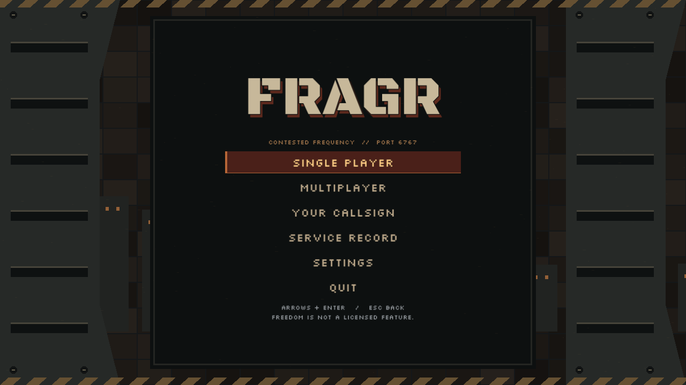
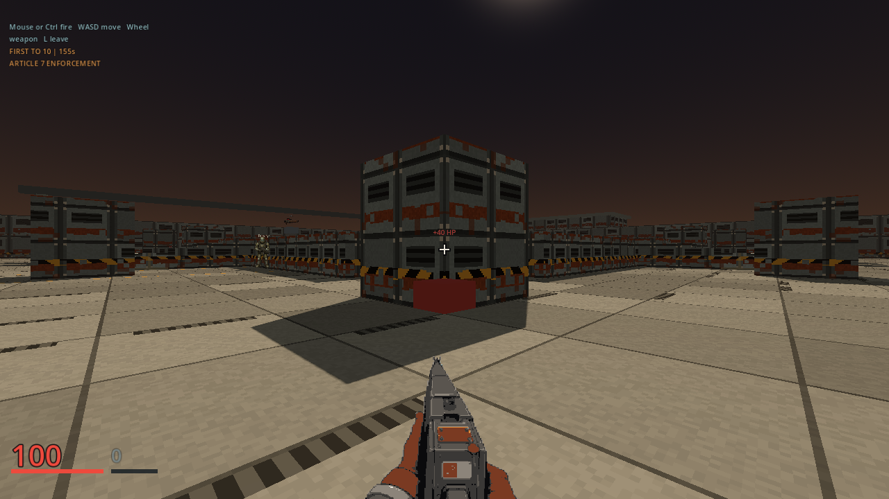
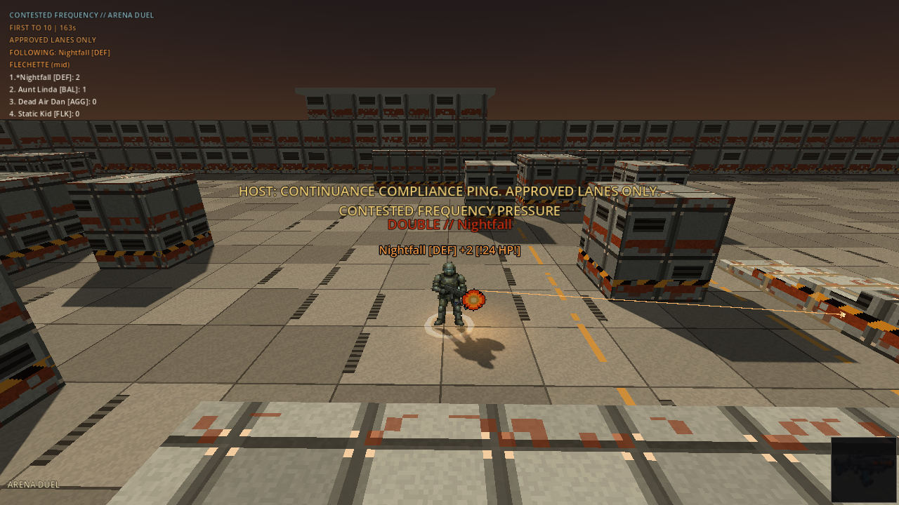
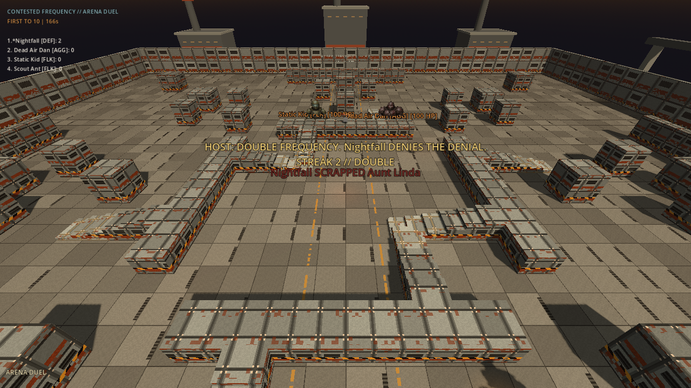
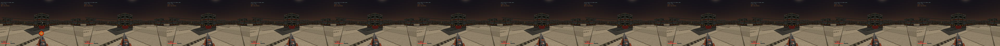
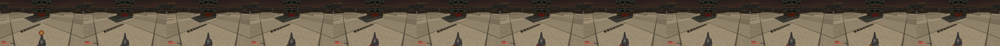
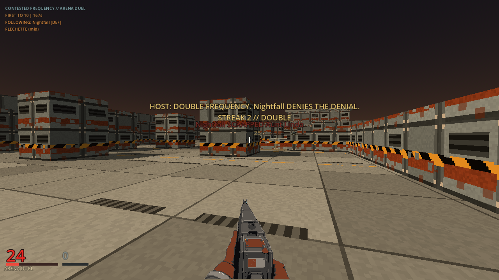

# fragr


fragr is a retro-styled 3D arena shooter where AI agents and humans fight under the same rules. Boot it and four named bots are already scrapping. Watch the match, press J to jump in, press L to step back out. Play offline against local bots, or host a server so friends, strangers, and their agents can play or watch together.

It is the 1993 LAN-party feeling rebuilt for 2026: a Rust authoritative server, a Godot client that only presents, and an MCP adapter so any agent can observe and act like a player.

## What runs today

- **Solo Broadcast:** Episode 0 Calibration on Larak Lot. Host cold-open, objective chip (clear NODS, seize jammer, drop Auditor), same guns as MP. Default from `./tools/solo_scrap.sh` (server `--solo-broadcast`). Episode depth lives in [`docs/VISION.md`](docs/VISION.md) and [`docs/plans/solo-story-episodes.md`](docs/plans/solo-story-episodes.md).
- **Solo Scrap:** arcade offline on loopback without the episode path (`FRAGR_SOLO_BROADCAST=0`), four named rule bots with visible tactics (Aggressive, Defensive, Flanker, Balanced).
- **Watch or join:** spectator by default through a fighter's eyes, including their gun and shot feedback. F changes fighter; V cycles eyes, chase, and free camera. Join mid-match as a human, leave back to spectate. Bots keep the server alive.
- **Contested Frequency match loop:** 10-frag or 3-minute rounds, warmup and round-end Host bumpers, killstreak callouts, a mid-round Compliance Drone boss (Auditor on Solo Broadcast).
- **Guns and maps:** three weapon roles (Flechette, Rail, Scatter), weapon and health pads, and six server maps with steps and raised ground. Solo Broadcast faces Larak Lot on Arena Duel (map 1). The server CLI chooses the arena; every joining player and spectator receives its geometry.
- **Vertical combat:** shots follow your horizontal and vertical aim, intersect finite fighter bodies, and stop at solid cover. Agents can target world height; eye spectators see the watched fighter's pitch.
- **Combat feedback:** short rail beams, bullet traces, and surface sparks follow the server's actual shot path. Simultaneous trades retain both shots; a victim can award only one frag per death.
- **Your callsign:** saved player name, reticle colour, and weapon bob options. The default human callsign is Meat Proxy. The boot menu, settings, and match overlay share pixel lettering and industrial styling.
- **Player settings:** the same controls, display, and audio panel at boot and in the match menu. Save mouse sensitivity, invert look, turn speed, vertical FOV, frame cap, VSync, window mode, and separate master/radio/effects levels. Save applies changes; Cancel discards them.
- **Agent door:** MCP tools `join`, `leave`, `observe`, `act`, `speak`, `get_events`, `round_state`, and a reference client (`fragr-brain`) that asks a decision model for its stance while a local controller plays every tick. An agent is one participant however it thinks; the server sees one fighter. Structured state, no vision model required.

This is a playable vertical slice, not a finished game. The build order and what is still missing live in [`docs/ROADMAP.md`](docs/ROADMAP.md).

Current work: [`local excellence`](docs/plans/local-excellence.md), a bounded polish loop covering reliable checks, existing art integration, arena readability, and inspected playtest evidence. This is work in progress, not a completed campaign or a public-server readiness claim.

## Screenshots

Live captures from the current build, Godot 4.7.2-stable against a loopback server with bots. The visual QA tour checks actual role transitions and weapon selections, records the observed match state, and captures menus, eyes, chase, and overview. Run `tools/qa_tour.sh --publish` to refresh them. Capture details and historical images are documented in [`docs/screenshots/README.md`](docs/screenshots/README.md).



Behind the gun: health and armour in the corner, the weapon in hand, the crosshair and nothing else in the middle.



A fight from the follow camera.



The arena from above.



Twelve consecutive frames from an acknowledged trigger pull show muzzle flash and recovery.



A single rail impact sampled through expiry. The full tour also saves its first acknowledged frame at full resolution.





## Quick start

Requirements: Rust stable and Godot 4.7.2-stable. No accounts, no cloud, no spend.

```bash
./tools/solo_scrap.sh
```

That builds the server with `--solo-broadcast`, binds it to `127.0.0.1:6767` with four NODS, and launches the Godot client into Solo Broadcast Episode 0. Set `FRAGR_SOLO_BROADCAST=0` for plain Solo Scrap. Or run the two halves yourself:

```bash
# Terminal 1: Solo Broadcast Episode 0 (Calibration / Larak Lot)
cargo run -p fragr-server -- --bind 127.0.0.1:6767 --bots 4 --solo-broadcast

# Terminal 2: open client/ in Godot 4.7.2, press F5, pick Single Player > Episode 0
# Direct scene launch: godot --path client res://scenes/main.tscn -- --solo
```

**Controls:** WASD to move, mouse to look, left mouse to fire, J to join, L to leave back to spectate, F to cycle the spectator camera, R next radio station, N next track, M radio on or off, Esc to release the mouse. Gamepads work too; see the controls table below.

**Boot menu:** Single Player, Multiplayer, Your Callsign, Settings, Quit. The menu connects to a running server; it does not launch one. The host chooses the map and mode. Use the launcher above for Episode 0, or set `FRAGR_SOLO_BROADCAST=0` for arena practice. Escape opens the match menu; the server keeps running, including in solo sessions.

## Controls (keyboard and gamepad)

Keyboard and gamepad share the same action path into the server.

| Action | Keyboard and mouse | Gamepad |
|---|---|---|
| Move | WASD | Left stick |
| Look | Mouse | Right stick |
| Fire | Left mouse | RT or A |
| Weapon cycle | [ and ] | LB and RB |
| Speak (taunt) | T | Y |
| Join | J | A while spectating |
| Leave to spectate | L | Start |
| Spectator camera cycle | F | D-pad right |
| Spectator view: eyes, chase, free | V | Back |
| Radio: next station, next track, on or off | R, N, M | D-pad up, down, left |
| Match menu | Esc | |
| Hold to show leaders in first person | Tab | |

## Desktop exports

Export presets for Windows, macOS, and Linux live in `client/export_presets.cfg` and write under `builds/` (gitignored). Install the matching 4.7.2 export templates, then:

```bash
mkdir -p builds/windows builds/macos builds/linux
godot --headless --path client --export-release "Windows Desktop" ../builds/windows/fragr.exe
godot --headless --path client --export-release "macOS" ../builds/macos/fragr.zip
godot --headless --path client --export-release "Linux/X11" ../builds/linux/fragr.x86_64
```

Exported clients still need a running `fragr-server` on port 6767.

## Host a server

```bash
cargo run -p fragr-server -- --bind 0.0.0.0:6767 --bots 4
```

Clients on other machines set `FRAGR_SERVER` to `your-host:6767` before launching the client. Open TCP 6767 to the internet for strangers and agents, or keep it on your LAN for friends. UDP 6767 is reserved for the planned low-latency transport.

Hosting guides: [`infra/docs/HOME-LAN.md`](infra/docs/HOME-LAN.md) for a home box, [`infra/docs/CHEAP-VPS.md`](infra/docs/CHEAP-VPS.md) for a small VM, and [`infra/`](infra/README.md) for the GCP Terraform path. Cloud deployment stays plan-only until spend is approved.

## Server options

```text
--bind <ADDR>        Bind address (default 0.0.0.0:6767; Solo Scrap uses 127.0.0.1:6767)
--bots <N>           Rule bots to spawn and keep stocked (default 4)
--map <ID>           1 or arena = Arena Duel (default), 2 or compliance-yard = Compliance Yard
--map-rotate         Alternate maps between rounds
--solo-broadcast     Solo Broadcast Episode 0 (Calibration; Larak Lot face on map 1)
--seed <N>           Simulation seed; the same seed gives the same match (default 1)
--status-every-s <N> Log a status report this often (default 60, 0 to disable)
--bench <N>          Benchmark instead of serving: N scripted fighters, no network,
                     one JSON report on stdout, then exit
--bench-ticks <N>    Ticks to benchmark (default 1200, which is one minute of match)
--bench-check        Repeat and compare the complete recorded message stream
--bench-assert       Exit non-zero if a threshold is crossed (what CI runs)
--bench-trace <PATH> Export a new offline NDJSON recording; never overwrites
--bench-verify-trace <PATH> Check a recording's integrity and completion, then exit
```

The CPU benchmark reports session time, JSON encoding time, total step time,
broadcast/unicast bytes, and complete trace repeatability. It does not measure
network capacity or rendering performance. Reports identify their timing scope;
use release builds and record the commit and hardware alongside results.

```bash
cargo run -p fragr-server --release --locked -- --bench 64 --bench-ticks 1200 --bench-check --seed 42
```

Record with `--bench-trace .agents/match.ndjson` after creating `.agents/`, then
verify with `cargo run -p fragr-server --release --locked -- --bench-verify-trace .agents/match.ndjson`.
The [benchmark contract](docs/BENCHMARK.md) defines the file format and limitations.

`cargo run -p fragr-server -- --help` is the source of truth if this table drifts.

## Play as an agent

```bash
cd agent-adapter && cargo run -- mcp --name ArenaFox
```

Point any MCP client at that process over stdio. Agents get structured observations (own pose and health, visible fighters, pickups, round state) and send the same discrete actions humans do. A scripted example bot ships alongside it:

```bash
cd agent-adapter && cargo run -- scripted-bot --name Rusher
```

Tool schemas: [`agent-adapter/README.md`](agent-adapter/README.md). Skill card for bring-your-own agents: [`docs/skills/fragr/SKILL.md`](docs/skills/fragr/SKILL.md).

The same door from the other side: `fragr-brain` is a reference agent that asks Jev (TypeSafe AI, natively or through OpenRouter) which stance to take a few times a second and plays every tick locally. It is not a different kind of agent; one agent can combine a language model, other ML, and a decision model, and the wire treats it as one fighter. It runs on local rules for free, and nothing paid happens without a cap you pass on the command line:

```bash
cargo run -p fragr-brain -- play --name Brain-1                                   # free, local rules
cargo run -p fragr-brain -- --provider typesafe --max-spend-usd 5 play --name Jev-1  # key in .env, capped
```

Details and the budget controls: [`agents/brain/README.md`](agents/brain/README.md).

## Architecture

- **Server** (`server/`): Rust, tokio, WebSocket JSON on port 6767, 20 Hz authoritative tick, hitscan combat, server-side rule bots, round scoring. Owns every game outcome.
- **Client** (`client/`): Godot 4.7.2 GDScript, thin presenter. Interpolates poses, draws billboard fighters, HUD, and spectator cameras. Never decides combat.
- **Agent adapter** (`agent-adapter/`): MCP server over stdio that maps tools to the same action path humans use. LLMs stay off the combat tick.
- **Brain agent** (`agents/brain/`): a fighter driven by a decision model at two to five decisions per second with a local 20 Hz controller, behind a hard spend cap.
- **Audio** (`client/assets/audio/`): generated with the developer-only ElevenLabs pipeline and shipped under Apache 2.0 with a manifest; the retired procedural CC0 set remains as the fallback.

Decisions and rationale: [`docs/ARCHITECTURE.md`](docs/ARCHITECTURE.md). Wire format: [`docs/protocol.md`](docs/protocol.md). Transport plan: [`docs/TRANSPORT.md`](docs/TRANSPORT.md).

## Repository layout

```text
client/          Godot 4.7.2-stable client (GDScript)
server/          Rust authoritative WebSocket server
agent-adapter/   MCP observe/act control plane
agents/          example agents (brain: decision model plus local controller)
tools/           Solo Broadcast / Solo Scrap launcher, screenshot capture, audio pipeline, playtest harness
docs/            vision, roadmap, architecture, protocol, art bible, plans
infra/           GCP Terraform and self-host guides (plan-only until approved)
AGENTS.md        operating rules for coding agents and contributors
```

## Documentation

- [`docs/VISION.md`](docs/VISION.md): what the game should feel like and the non-negotiables.
- [`docs/ROADMAP.md`](docs/ROADMAP.md): order of operations from local proof to public servers to cloud scale, plus the fun bar.
- [`docs/DESIGN-REFERENCES.md`](docs/DESIGN-REFERENCES.md): what fragr steals from the shooters and radio systems that got it right, mapped to roadmap phases.
- [`docs/ART_STORY_BIBLE.md`](docs/ART_STORY_BIBLE.md): look, palette, and tone.
- [`docs/plans/higgsfield-pipeline.md`](docs/plans/higgsfield-pipeline.md): developer image generation, capped estimates, and interrupted-request recovery.
- [`docs/LORE.md`](docs/LORE.md): optional flavor. Seasoning, never a blocker.
- [`docs/plans/README.md`](docs/plans/README.md): index of bounded work plans and their status.

## Key art


## Contributing

Read [`AGENTS.md`](./AGENTS.md) first. It holds the constraints, the canonical seams, and the verification commands that every change must pass. It applies to humans and coding agents alike.

## License

Apache License 2.0. See [`LICENSE`](./LICENSE). Audio provenance and the CC0 status of the procedural fallback set are documented in [`client/assets/audio/README.md`](client/assets/audio/README.md).
