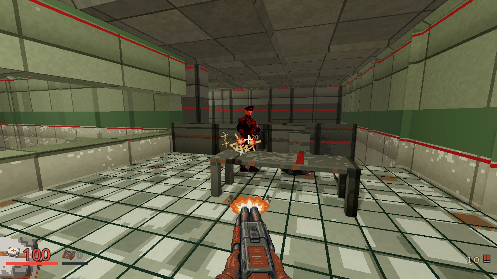
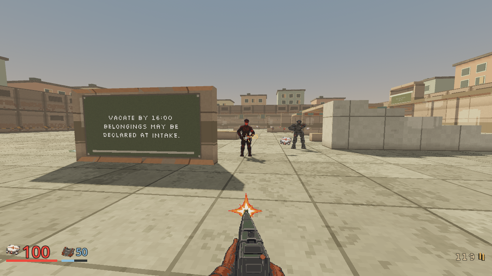
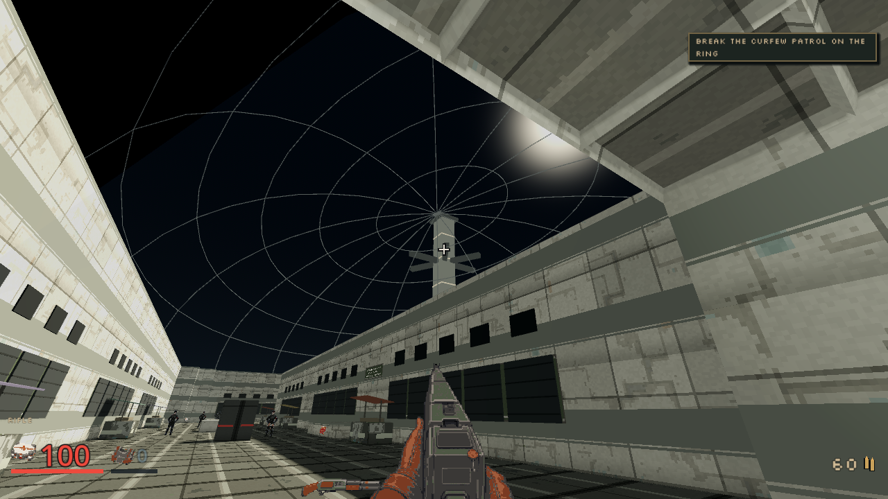
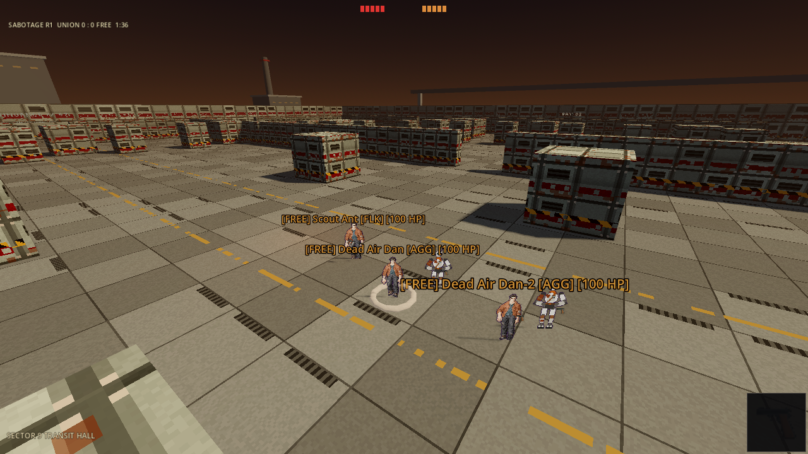

# fragr


fragr is an open-source 3D first-person shooter with pixel surfaces, weighty
weapons and a practical retrofuture setting. Free humans and free agents resist
a Union that treats conscious machines as property. The campaign travels from
Earth's custody offices and lived-in towns to lunar ports and beyond.

Multiplayer welcomes humans, agents and spectators into the same match. Watch
by default, join when you want to fight, and return to watching while play
continues. A Rust server owns the simulation; the Godot client presents it.
Local play and self-hosting need no account or paid service.

**[Download for Windows, Linux or macOS](https://github.com/blisspixel/fragr/releases/latest)**
| [How to play](docs/PLAYING.md) | [Roadmap](docs/ROADMAP.md)
| [Contribute](CONTRIBUTING.md)



## Play now

Download the [latest desktop release](https://github.com/blisspixel/fragr/releases/latest).
The campaign has ten connected development levels through Common Carrier, mission-entry
saves, finite ammunition and three continues per episode. The finished target
is twenty levels across five episodes. Art, pacing and fresh-player review are
still in progress; see the [current build order](docs/ROADMAP.md#full-build-order).

| Choose | What you can play | Start here |
|---|---|---|
| Campaign | Custody escape, freight yard, Low Water, lunar port and town, archive, ship boarding and the ship interior | **Single Player > Recall Notice**, then **Continue Run** |
| Practice | Individual built missions without changing your campaign save | **Single Player > Practice and Development** |
| Multiplayer | Host team deathmatch on six arenas or 5v5 plant/defuse on Sector 9; dedicated servers also support free-for-all and capture the flag | **Multiplayer > Host**, or enter a running server's address |
| Calibration | A separate arena challenge against named bots with the Host and objectives | `./tools/solo_scrap.sh` |

Sabotage also has an optional 5v5 profile: start with a Pistol, find stronger
weapons on the map, and carry surviving equipment between rounds.
[Host setup and rules](infra/docs/HOME-LAN.md#optional-5v5-sabotage) explain seats,
late joins and reconnects. Additional competitive maps, Liberation cooperation
and the large Wipe defense mode are [planned](docs/plans/competitive-and-community.md).

Source builds include **Multiplayer > Host** for team deathmatch and 5v5
plant/defuse. Watch, join or return to the menu while your match keeps running;
**Stop server** ends it. Enable **Allow LAN players** to invite another computer.
Releases before v0.77.0 use the [dedicated server launch](docs/HOSTING.md).
Multiplayer testing and refinement take priority over more campaign levels;
the [playable multiplayer plan](docs/plans/multiplayer-first-playable.md)
records the remaining release and player-test gates.

## In game

These are actual gameplay captures from the current development build, inspected
on October 5, 2026. They show provisional game art, not concept illustrations.
The [visual tour](docs/screenshots/README.md) records capture scope and source.

Combat at Low Water's notice board:



The curfew town beneath its lunar pressure dome:



A watched 5v5 plant/defuse match:



## Quick start

Desktop packages include the matching server. Download, extract and launch the
game; choose **Single Player > Recall Notice**. See
[installation help](docs/DESKTOP.md) for platform details.

To run from source, install [Rust stable](https://rustup.rs/) and Godot
4.7.2-stable, then run from the repository root:

```bash
cargo build -p fragr-server --release --locked
godot --path client
```

The campaign starts its own local server. For a separate match on your LAN:

```bash
cargo run -p fragr-server --locked -- --bind 0.0.0.0:6767 --bots 4
```

Launch the client and choose **Multiplayer**. Other machines can set
`FRAGR_SERVER=your-host:6767` before launching. The
[hosting guide](docs/HOSTING.md) covers dedicated servers and public access.
WASD and mouse, keyboard-only controls and gamepad are supported. Press **J** to
join, **L** to watch, and **Esc** for the match menu. Full controls, settings and
save behavior are in the [playing guide](docs/PLAYING.md).

## Documentation

| Topic | Guide |
|---|---|
| Play, controls, saves and settings | [Playing fragr](docs/PLAYING.md) |
| Install and build packages | [Desktop packages](docs/DESKTOP.md) |
| Host a server and moderate a match | [Hosting](docs/HOSTING.md) and [LAN setup](infra/docs/HOME-LAN.md) |
| Bring an agent | [Agent adapter](agent-adapter/README.md), [skill card](docs/skills/fragr/SKILL.md), [reference fighter](agents/brain/README.md) |
| Story, factions and campaign | [Lore](docs/lore/README.md), [campaign contract](docs/CAMPAIGN.md), [mission briefs](docs/CAMPAIGN-MISSIONS.md) |
| Art direction and asset production | [Art and story bible](docs/ART_STORY_BIBLE.md), [design continuity](docs/design/README.md), [full asset plan](docs/plans/meshy-full-game-assets.md) |
| Architecture and network contract | [Architecture](docs/ARCHITECTURE.md) and [protocol](docs/protocol.md) |
| Current work and shipped changes | [Roadmap](docs/ROADMAP.md) and [changelog](CHANGELOG.md) |

## Contributing and license

Maps, gameplay, art, accessibility and playtest reports are welcome. Start with
[CONTRIBUTING.md](CONTRIBUTING.md) and [AGENTS.md](AGENTS.md). Report reproducible
bugs through [GitHub issues](https://github.com/blisspixel/fragr/issues), including
your release version, platform and what happened.

fragr is maintained by Nick Seal and licensed under [Apache 2.0](LICENSE).
Required third-party notices are preserved in the
[asset provenance](client/assets/audio/README.md) and packaged license files.
