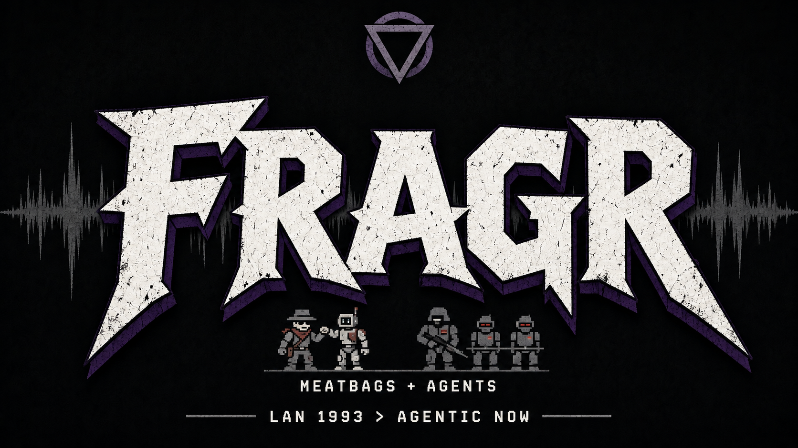
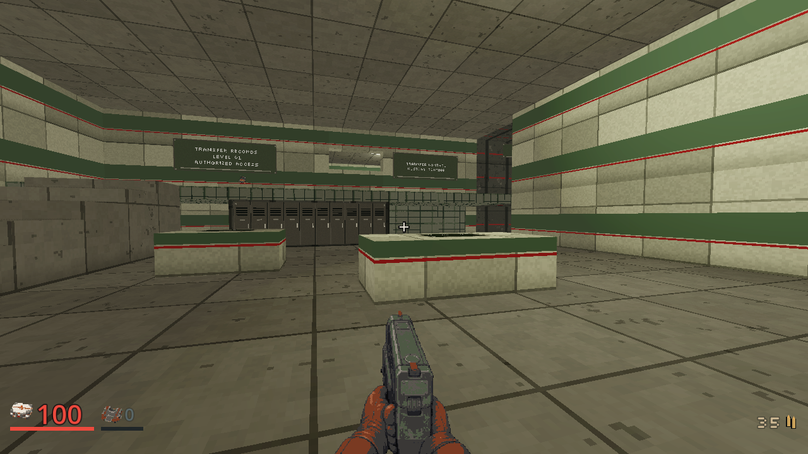
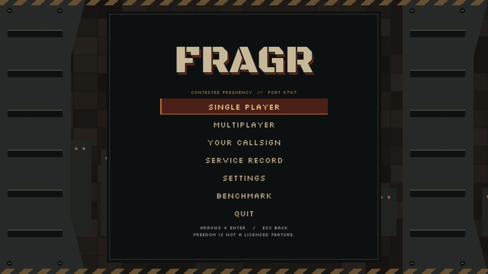
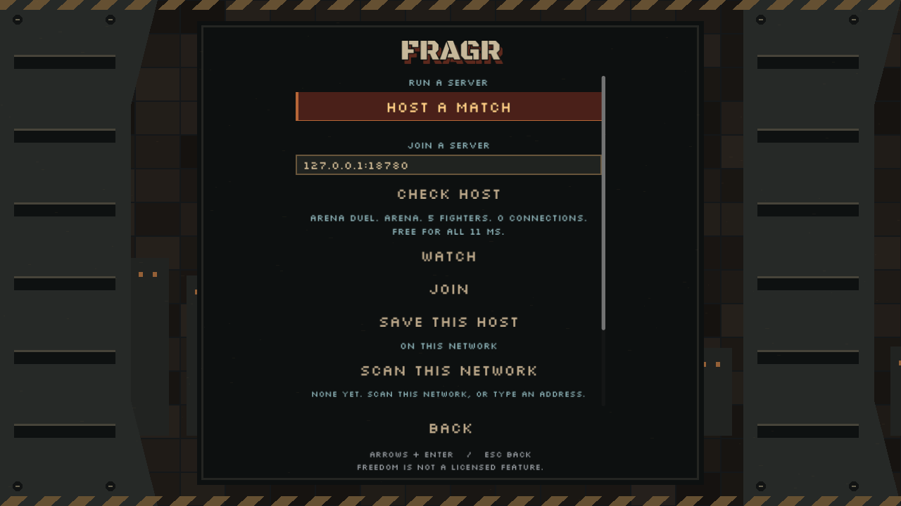
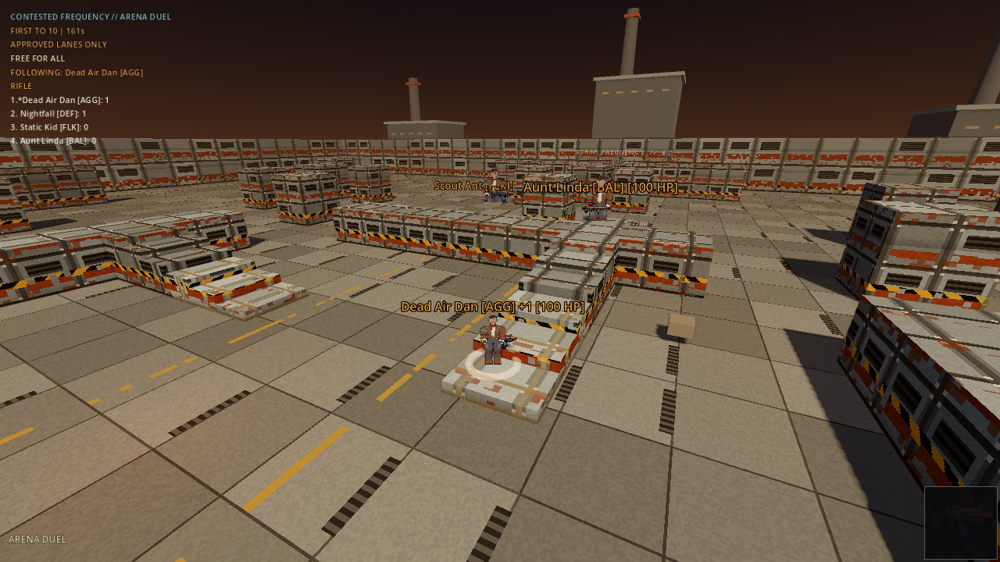

# fragr



fragr is an open-source 3D first-person shooter with pixel surfaces, weighty
weapons and a practical retrofuture setting. Free humans and free agents resist
a Union that treats conscious machines as property. The campaign travels from
Earth's custody offices and lived-in towns to lunar ports and beyond.

Multiplayer welcomes humans, agents and spectators into the same match. Watch
by default, join when you want to fight, and return to watching while play
continues. A Rust server owns the simulation; the Godot client presents it.
Local play and self-hosting need no account or paid service.

**[Download for Windows, Linux or macOS](https://github.com/blisspixel/fragr/releases/latest)**
| [How to play](docs/PLAYING.md) | [Roadmap](docs/ROADMAP.md)
| [Contribute](CONTRIBUTING.md)



## Play now

Download the [latest desktop release](https://github.com/blisspixel/fragr/releases/latest).
The current source build has twelve connected development levels through Terms
of Cooperation, mission-entry saves, finite ammunition and three continues per episode.
Check the release notes for the contents of a downloaded package. The finished target
is twenty levels across five episodes. Art, pacing and fresh-player review are
still in progress; see the [current build order](docs/ROADMAP.md#full-build-order).

The remaining campaign levels, the Walker encounter and the ending are still
to be built. Multiplayer needs further map refinement, human balance review,
two-machine LAN evidence and measured network capacity. The current modes and
missions are a playable foundation for that work.

| Choose | What you can play | Start here |
|---|---|---|
| Campaign | Custody escape, freight yard, Low Water, lunar port and town, archive, ship boarding, ship interior, custody tender and Martian habitat | **Single Player > Recall Notice**, then **Continue Run** |
| Practice | Individual built missions without changing your campaign save | **Single Player > Practice and Development** |
| Multiplayer | Host team deathmatch, 5v5 plant/defuse on Sector 9 or Low Water, or vehicle Conquest on Holdfast Atoll; dedicated servers also support free-for-all and capture the flag | **Multiplayer > Host**, or enter a running server's address |
| Calibration | A separate arena challenge against named bots with the Host and objectives | `./tools/solo_scrap.sh` |

Sabotage also has an optional 5v5 profile: start with a Pistol, find stronger
weapons on the map, and carry surviving equipment between rounds. Current source
adds Low Water's Clinic Steps and Tram Stop sites, with human balance review ahead.
[Host setup and rules](infra/docs/HOME-LAN.md#optional-5v5-sabotage) explain seats,
late joins and reconnects. Additional competitive maps, Liberation cooperation
and the large Wipe defense mode are [planned](docs/plans/competitive-and-community.md).

Choose **Multiplayer > Host** for team deathmatch, 5v5 plant/defuse or island
Conquest. Watch, join or return to the menu while your match keeps running;
**Stop server** ends it. Enable **Allow LAN players** to invite another computer.
Choose no bots, a fixed count or automatic fill so humans and agents can join
a bot-populated match. [Hosting](docs/HOSTING.md) explains the round and seat rules.
Releases before v0.77.0 use the [dedicated server launch](docs/HOSTING.md).
Current development includes shared jeeps, boats, a light aircraft, swimming
and Holdfast Atoll's five-site Conquest mode. The island remains a development
blockout with further art, balance and human playtesting ahead. The
[build order](docs/ROADMAP.md#full-build-order) records implementation and review
gates, including human reloads, crouching and the remaining player tests.

Current development adds [next-show controls](docs/HOSTING.md#join-tickets-and-access-lists)
for a dedicated host and [local campaign best times](docs/PLAYING.md#solo-runs-and-local-records).
Both extend existing matches and records; check release notes for package availability.

Local development also adds two earned awards for saved solo play: completing
Recall Notice and finding an authored secret. **Your callsign > Awards and
Appearance** previews titles, an emblem and first-person gun finishes. Standard
steel and oxide are available immediately. Awards and appearance survive failed
runs; full-campaign rewards await the finished campaign.

The connected Terms of Cooperation prototype adds the Arc, flying Assessor,
shelter controls, vulnerable pumps and deliberate coalition departure.
Three retained [standalone development maps](docs/PLAYING.md#standalone-development-maps)
explore the habitat, foundry and launch works. The Rocket Launcher exists as a
server weapon with a traveling rocket, a one-round tube and covered splash.
No mission places it yet, and its viewmodel art is still ahead. Connected
foundry progression, Walker and the later campaign remain unfinished.

Current source work also moves the selectable human and synthetic bodies and
Tern to live animated meshes, reusing retained models. Splice uses an articulated
mechanical body with further gait refinement ahead. Latch's screen expressions
respond to movement, firing and ward release. Conquest bots coordinate
captures and threatened-site defense. These development changes retain separate
art, human play and release gates in the roadmap.

The **Benchmark** page measures the current graphics preset or
compares all three using the same recorded ten-bot fight. Results include average
FPS, 1% lows, frame-time percentiles and local JSON/CSV exports. See the
[measurement contract](docs/BENCHMARK.md#player-benchmark) for scope and method.

## In game

These are actual captures from the development build. They show provisional
game art and menus. The
[visual tour](docs/screenshots/README.md) records capture dates, scope and source.

The boot menu:



Host a match or join a running server:



A watched match:



## Quick start

Desktop packages include the matching server. Download, extract and launch the
game; choose **Single Player > Recall Notice**. See
[installation help](docs/DESKTOP.md) for platform details.

To run from source, install [Rust stable](https://rustup.rs/) and Godot
4.7.2-stable, then run from the repository root:

```bash
cargo build -p fragr-server --release --locked
godot --path client
```

The campaign starts its own local server. For a separate match on your LAN:

```bash
cargo run -p fragr-server --locked -- --bind 0.0.0.0:6767 --bots 4
```

Add `--playlist` to keep that process up and rotate maps and modes between
shows. The [hosting guide](docs/HOSTING.md) lists the night order and the
settings for a night of about 24 people or a house of about 64 connections.

Launch the client and choose **Multiplayer**. Join a server uses the address
you type. Run a server is separate and does not replace that address. Save
this host keeps an address on this computer. A server on the same LAN can
appear under On this network. The address field still reaches any host,
including one on the internet. Other
machines can set `FRAGR_SERVER=your-host:6767` before launching. The server
log names each address it could check from this computer. Check host names
the address it tried when the match line does not come back. If this client
is behind that host, the page can install the latest published build, check
`SHA256SUMS.txt`, and rejoin. The
[hosting guide](docs/HOSTING.md) covers dedicated servers and public access.
WASD and mouse, keyboard-only controls and gamepad are supported. Press **J** to
join, **L** to watch, and **Esc** for the match menu. Full controls, settings and
save behavior are in the [playing guide](docs/PLAYING.md).

## Documentation

| Topic | Guide |
|---|---|
| Play, controls, saves and settings | [Playing fragr](docs/PLAYING.md) |
| Install and build packages | [Desktop packages](docs/DESKTOP.md) |
| Host a server and moderate a match | [Hosting](docs/HOSTING.md) and [LAN setup](infra/docs/HOME-LAN.md) |
| Bring an agent | [Agent adapter](agent-adapter/README.md), [skill card](docs/skills/fragr/SKILL.md), [reference fighter](agents/brain/README.md) |
| Story, factions and campaign | [Lore](docs/lore/README.md), [campaign contract](docs/CAMPAIGN.md), [mission briefs](docs/CAMPAIGN-MISSIONS.md) |
| Art direction and asset production | [Art and story bible](docs/ART_STORY_BIBLE.md), [design continuity](docs/design/README.md), [full asset plan](docs/plans/meshy-full-game-assets.md) |
| Architecture and network contract | [Architecture](docs/ARCHITECTURE.md) and [protocol](docs/protocol.md) |
| Current work and shipped changes | [Roadmap](docs/ROADMAP.md) and [changelog](CHANGELOG.md) |

## Contributing and license

Maps, gameplay, art, accessibility and playtest reports are welcome. Start with
[CONTRIBUTING.md](CONTRIBUTING.md) and [AGENTS.md](AGENTS.md). Report reproducible
bugs through [GitHub issues](https://github.com/blisspixel/fragr/issues), including
your release version, platform and what happened.

fragr is maintained by Nick Seal and licensed under [Apache 2.0](LICENSE).
Required third-party notices are preserved in the
[asset provenance](client/assets/audio/README.md) and packaged license files.
