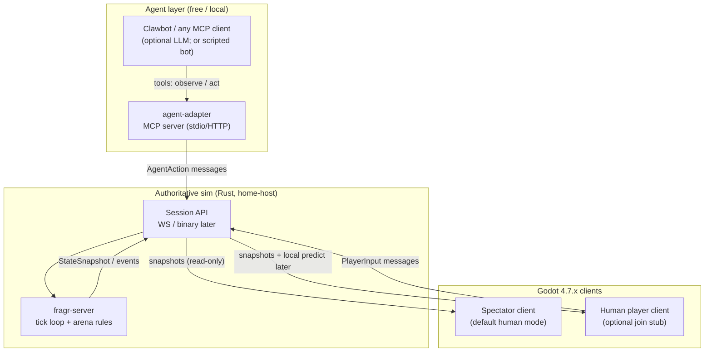

# fragr - Architecture & Vertical Slice Plan

**Working name:** fragr 
**Owner GitHub:** blisspixel (Nick Seal) - personal only; stay out of work accounts 
**Spend:** $0 assumed for this draft and for Slice 1. Hard cap $50 total with Nick's approval before spending.
**Status:** Living decision record. Sections 1 to 6 describe Slice 1 as it was designed (September 2026) and are kept as history; the decision log at the end is current and `ROADMAP.md` carries sequencing.

> **Slice 1 decision (2026-09-17):** Rust remains authoritative. The local bar is spectator-default, same-match join/leave, at least four rule bots, killfeed and follow/free cameras, with MCP off the combat tick. Local play costs $0; public hosting requires approval within the $50 cap. Tailscale is for private development smoke tests. WebSocket JSON is the initial transport; UDP remains a measured follow-up.


---

## 1. Goals / non-goals (v0)

### Goals
- **Playable feel** in Godot 4.x: Rock & Roll Racing carnival scrap × late-night conspiracy seasoning × first-online LAN rush (feeling only, not IP). Small arena, FPS camera, shoot/move, deathmatch-lite. Agents and humans same scrap. Do not brand as Doom.
- **Solo AND multiplayer, both first-class**: authoritative **Rust** game server; clients are thin presenters. Instant fun solo (you + bots on one machine), and self-host for peers (public TCP+UDP 6767 or LAN). Tailscale is private/dev smoke only. Not a LAN-only demo.
- **Agent-first play**: clawbots / MCP-compatible agents drive players via an **agent-play adapter**; humans default to **spectating** (Fortnite let’s-play vibe).
- **Optional human join**: same client can become a player (keyboard/mouse) without a second codebase. Join and leave mid-match.
- **Community-server DNA** (Minecraft-ish): one persistent-ish session people can watch/join; home-hostable.
- **Exceptional Slice 1**: something you can run tonight on loopback and *watch agents fight*, not a pitch.

### Non-goals (v0 / Slice 1)
- Massive concurrent scale, matchmaking, accounts, anti-cheat, voice, inventory/economy.
- Full Doom IWAD parity, procedural maps, campaign, mods.
- Paid LLM APIs, cloud hosting, CDN, or asset-store purchases.
- Bevy (or any Rust engine) as the *client* - client is Godot.
- Perfect netcode (prediction/rollback) on day one - correctness + watchability first.
- Cross-play mobile/console; desktop + local agents only.

---

## 2. System diagram



**Roles**
| Role | Who | Sends | Receives |
|------|-----|-------|----------|
| `agent` | MCP adapter → server | discrete actions each tick window | observation JSON |
| `spectator` | Godot (default) | nothing (or camera-only UI) | full/filtered snapshots |
| `human` | Godot (opt-in) | same action schema as agents | snapshots |

All game truth lives in **fragr-server**. Godot never simulates combat/HP; it interpolates rendered poses from snapshots.

---

## 3. Tech choices (concrete)

### Client - Godot **4.7.2-stable**
- **Pin:** `4.7.2-stable` (latest stable as of 2026-08-18). Avoid 4.8-dev for Slice 1.
- **Language:** GDScript only (no .NET export template). Fewer deps, free, fine for FPS prototype.
- **Why Godot:** Fast iteration on arena/feel; MultiplayerAPI is *not* our authority - we use Godot as a **networked renderer**.
- **Net transport (Slice 1):** `WebSocketPeer` ↔ Rust `tokio-tungstenite`. Godot has first-class WS; loopback is trivial; agents and spectators share one protocol.
- **Later (post-slice):** Optional UDP/`renet`-style channel for low-latency FPS once WS proves the loop. Do **not** block Slice 1 on custom UDP in GDScript.

### Server - Rust, **not** Bevy-as-client
| Option | Verdict for fragr |
|--------|-------------------|
| **Custom tokio + WS + tick ECS-lite** | **Choose for Slice 1.** Thin, Godot-friendly, easy for MCP adapter. |
| `renet` / `bevy_renet` | Strong UDP/netcode later; Godot client support is DIY. Defer. |
| `lightyear` | Excellent **Bevy** stack; wrong client. Skip unless rewriting in Bevy. |
| Godot as host | Violates “Rust for scale / authority” brief. Skip. |

**Recommended crates (Slice 1):**
- `tokio`, `tokio-tungstenite`, `futures-util`
- `serde` / `serde_json` (protocol v0); plan `bincode` or custom binary for v1
- `uuid` or simple `u32` entity ids
- Optional: `tracing`, `clap`
- **No Bevy dependency required** for the server. Use plain structs + a fixed tick (`Duration::from_millis(50)` → 20 Hz).

**Sim model (Slice 1):**
- Fixed timestep authoritative loop.
- Entities: players (pos, yaw, hp, team/color), projectiles, arena static colliders (AABBs / simple brushes).
- Actions are **discrete intents** applied next tick (agent-friendly), not continuous analog sticks (map WASD → same intents for humans).

### Networking model
- **Topology:** client-server, server authoritative.
- **Channels over one WS:**
 1. `hello` / join (role: spectator | human | agent; display name)
 2. `action` (move dirs, look delta or absolute yaw, fire, use)
 3. `snapshot` (periodic full or delta state @ 10-20 Hz)
 4. `event` (kill, respawn, match_end) - optional in Slice 1 (can fold into snapshot)
- **Interest management:** none in Slice 1 (single small arena; broadcast all).
- **Spectators:** same snapshot stream; server ignores input from `spectator` role.

### How agents issue actions (agent-play path)
**Best current approach for 2026 fragr:** dedicated **MCP server adapter** in front of the game session (pattern proven by game MCP adapter stacks (minecraft-mcp / nethack-mcp style; not a Doom product path)).

- Process: `fragr-agent-adapter` (Rust or TypeScript; prefer **Rust** to share protocol types with server, or TS if Buildy wants FastMCP speed - **recommend Rust** for one language on server side).
- Transport to agents: **MCP over stdio** (local clawbots / any MCP client) - zero cloud.
- Tools (minimal):
 - Boot Hello on connect with display `name` (`fragr-agent-adapter mcp --name ...` or `FRAGR_AGENT_NAME`) → player_id via Welcome
 - First-class `join` / `leave` / `round_state` (join idempotent; leave = clean WS disconnect; round summary without scraping observe)
 - `observe()` → structured JSON (self pose/hp, visible players, arena bounds, tick)
 - `act(actions, ticks?)` → apply intents; return next observation
 - Process exit also leaves; prefer `leave` tool when the MCP client stays up
- **Observation = structured state, not pixels** for Slice 1 → no vision API cost; agents can be dumb scripted bots (`chase_nearest_and_shoot`) with **$0**.
- LLM play is optional later; **[SPEND GATE]** any paid model API.

**Fallback if MCP tooling is painful:** same adapter exposes a plain HTTP/WS “bot API” with identical schemas; MCP becomes a thin wrapper. Design the **game action schema** first; MCP is packaging.

### How spectators receive state
- Godot spectator connects with `role=spectator`.
- Receives `StateSnapshot` at sim rate (or 10 Hz throttle).
- Client: spawn/update meshes/cameras from entities; free-fly or follow-cam UI; no weapon logic.
- Optional: “director” camera that follows frags - polish after playable fight works.

### Assets / art
- Primitive CSG / graybox arena + capsule players + simple projectile mesh.
- Placeholder sounds optional (Godot defaults / CC0). **No paid asset packs** without approval.

---

## 4. First vertical slice - “Arena Duel Watch”

### What it is (smallest exceptional playable)
One graybox arena on loopback. Two **scripted agent bots** (or one agent + one scripted) fight via the Rust server. A Godot **spectator** watches the fight live. Optional: press a key / CLI flag to join as human (stub - movement + shoot works; no polish).

### In scope
- Rust server: arena collision, move, yaw, hitscan or slow projectiles, HP, respawn.
- Protocol: join + action + snapshot over WS `ws://127.0.0.1:6767`.
- Godot client: connect, render arena + players, spectator camera.
- Agent path: either (A) in-process server bots, or (B) adapter process sending actions - **prefer (A) for hour-1, (B) before slice “done”** so MCP shape is proven.
- README: three terminals - server, spectator, (optional) human.

### Out of scope
- LLM agents, public hosting, persistence, UI menus, audio mix, prediction, multiple maps.

### Success criteria (Slice 1)
1. From a clean clone (local folders), `cargo run` starts the server bound to `127.0.0.1:6767` with **no cloud config**.
2. Two automated fighters engage; within ~30s someone takes damage / a frag occurs (visible in server logs **and** spectator view).
3. Godot spectator shows both players moving and firing without local sim cheating (killing a process → entities despawn or freeze correctly).
4. Agent-adapter (or equivalent) can drive at least one fighter through `observe`/`act` (scripted client counts; MCP tool surface documented even if stubbed).
5. Optional human join: one local keyboard player can enter the same match and shoot (may be janky).
6. Total incremental $ spent: **$0**.

---

## 5. Repo layout proposal (blisspixel / personal)

Monorepo (recommended for protocol sharing). Name suggestion: `fragr` under blisspixel.

```text
fragr/
├── README.md # how to run Slice 1 (3 terminals)
├── ARCHITECTURE.md # this doc
├── SLICE-1.md # build checklist
├── docs/
│ └── protocol.md # message schemas (JSON examples)
├── server/ # Rust authoritative sim
│ ├── Cargo.toml
│ └── src/
│ ├── main.rs
│ ├── sim.rs # tick, combat, arena
│ ├── net.rs # WS accept, sessions
│ └── protocol.rs # shared message types
├── client/ # Godot 4.7.2 project
│ ├── project.godot # config/features pin 4.7
│ ├── scenes/
│ │ ├── main.tscn # spectator default
│ │ └── arena.tscn
│ └── scripts/
│ ├── net_client.gd
│ ├── spectator_cam.gd
│ └── player_pawn.gd # presentation only
├── agent-adapter/ # MCP (or bot API) front-door
│ ├── Cargo.toml # or package.json if TS
│ └── src/
│ ├── main.rs
│ ├── mcp.rs # tools
│ └── game_client.rs # talks to server WS
└── tools/
 └── smoke_bots.rs # optional: headless bot pair for CI-less smoke
```

**Shared protocol:** for Slice 1, duplicate JSON schemas in GDScript dictionaries + Rust `serde` types; generate later if needed. Do not invent a third IDL yet.

**GitHub:** create under **blisspixel** only when Nick/Buildy asks - this draft does **not** create a remote.

---

## 6. Build order (no cloud spend)

Sized for one focused builder (Buildy). Calendar is illustrative.

| Step | Size | Deliverable |
|------|------|-------------|
| **S0** Scaffold | 1-2 h | Monorepo folders; empty Godot 4.7.2 project; `cargo new` server; README stubs. |
| **S1** Protocol + echo | 2-3 h | WS server accepts clients; echoes join; Godot prints “connected”. Doc `docs/protocol.md`. |
| **S2** Sim tick | 3-4 h | Arena bounds, 2 dummy entities moving in server; snapshots broadcast; Godot draws capsules. |
| **S3** Combat | 3-4 h | Actions: move/turn/fire; hitscan or projectile; HP + respawn; frag log line. |
| **S4** Spectator UX | 2 h | Free-fly / follow cam; nameplates or colors; “watching match” HUD. |
| **S5** Bots | 2-3 h | Server-side or adapter scripted bots that fight each other reliably. |
| **S6** Agent-adapter | 3-4 h | MCP (or HTTP) `observe`/`act`; one external process drives a pawn. |
| **S7** Human stub | 1-2 h | Same client, `role=human`, map keys → actions. |
| **S8** Polish gate | 2 h | One-command / documented 3-terminal run; record 30s local clip mentally as demo; freeze Slice 1. |

**Rough total:** ~20-28 focused hours to “exceptional small playable.”

---

## 7. Open risks - Researcher should still answer

1. **DIY scale hosting:** What is the cheapest path from home-host (public port-forward / dynamic DNS) to a single cheap VPS when $ spend is approved? Tailscale remains private/dev smoke only. Bandwidth/tick cost model for N spectators + M agents.
2. **Best agent-play path 2026 (confirm):** MCP stdio vs MCP HTTP/SSE vs native “agent game bus”; clawbot / OpenClaw integration quirks; whether structured-obs FPS agents are good enough vs needing screenshots (cost!).
3. **Godot ↔ low-latency FPS:** When to leave WebSocket for UDP/`renet` or a GDExtension; any existing Godot-renet bridges worth adopting.
4. **Tick rate vs LLM latency:** Agents that think 500ms-2s need **action buffering / sticky intents**; Researcher should recommend observe cadence vs sim Hz.
5. **Legal/assets:** Freedoom / CC0 gun sounds vs original Doom IP - keep graybox + original art only unless cleared.
6. **Auth & griefing** on community servers (later): simple join tokens? rate limits? out of Slice 1 but design hooks early.
7. **Multi-agent concurrency:** one MCP session per agent process vs multiplexed adapter; process supervision on home host.

---

## 8. Spend gate (blocked until Chief / Nick approve)

Anything that costs money is **blocked** for Slice 1 and flagged here:

| Item | Why blocked |
|------|-------------|
| Cloud VMs / managed game hosts | Home-host loopback first |
| Paid LLM / vision APIs for agents | Use scripted bots; structured obs |
| Asset store packs, fonts, SFX libraries (paid) | Graybox + free/CC0 only |
| Paid analytics, Discord bots hosting, domains | Not needed for slice |
| Steam / platform fees | Far future |

**Allowed without approval:** local compute, free OSS crates/engine, free GitHub under blisspixel when Nick asks to create the repo.

---

## Assumptions (explicit)

- Nick’s machine (or Buildy’s box) can run Godot 4.7.2 editor + Rust stable toolchain offline-friendly.
- “Massive concurrent players” is a **direction**, not a Slice 1 requirement; architecture keeps a single authoritative process so we can shard later.
- Default human experience is **watch**; join is secondary.
- blisspixel is the only GitHub org/user for this project.

---

## Decision log (v0)

| Decision | Choice |
|----------|--------|
| Engine client | Godot **4.7.2-stable**, GDScript |
| Authority | Rust tokio server, 20 Hz tick |
| Transport Slice 1 | WebSocket JSON on localhost |
| Agents | MCP adapter + structured observe/act; scripted bots first |
| Spectators | Same snapshot stream, read-only role |
| Bevy/lightyear | Deferred / not for Godot client path |
| Spend | $0 for Slice 1 |

## Decision log (after Slice 1)

| Date | Decision | Choice |
|------|----------|--------|
| 2026-09-18 | Paid audio | ElevenLabs approved for developer-only generation through `tools/audiogen`; assets shipped under Apache 2.0 with a manifest |
| 2026-09-18 | Playtest in CI | `tools/playtest` boots the server in-process and gates every PR on feel thresholds (#95) |
| 2026-09-18 | Godot in CI | Headless import and parse of every script on every PR (#94) |
| 2026-09-18 | Decision brain | A reference agent asks a decision model (Jev, natively or through OpenRouter) for its stance behind a hard budget gate; an agent is one participant however it thinks (#102) |
| 2026-09-18 | Renderer for the look pass | Compatibility, with 4.7 nearest 3D scaling; Forward Plus stays only until stage 1 lands (`plans/look-pass-boomer.md`) |
| 2026-09-18 | Earlier map proposal | TrenchBroom plus func_godot was proposed, not implemented; superseded by the 2026-09-19 requirements below |
| 2026-09-19 | Campaign content boundary | Server-owned validated JSON is the initial authoring direction. Geometry drives collision, navigation and rendering; overlapping floors need explicit support. Editor/importer selection awaits a bounded compatibility spike (`plans/campaign-continuance.md`). |
| 2026-09-18 | Agent door revision | MCP 2026-07-28 is the target, the old handshake is compatibility only; team play through an MCP blackboard before any A2A (`plans/agent-door-2026.md`) |
| 2026-09-21 | Watch scale and server trust | The watch and the join happen in the Godot app. There is no web client. The large number is the audience in that app, not the simulating roster. Humans and agents share one bounded fight. Spectators watch that same match and can join it. One Rust process stays authoritative. Self-host is the default. A central host, when spend is approved, is a long-lived process on a small VM (the GCP shape in `infra/README.md`). Serverless fits status, tickets, and a server list. It does not run the tick. Clients stay untrusted: frame caps, connection caps, and an inbound rate limit are the first controls. A bigger watcher count waits on a measured snapshot fan-out, not on a claim that Rust makes the current JSON broadcast free. |
| 2026-09-22 | Join tickets | Optional HMAC-SHA256 on hello, using the `sha2` crate already in the server. No secret leaves local and LAN hello open. `FRAGR_JOIN_SECRET` (16 to 256 bytes, environment only) requires `v1.<unix exp>.<role>.<lowercase hex>` for a human or agent. The role is `human` or `agent`. Spectators are not ticketed. The ticket does not name the player. The same ticket works until it expires. It does not resume a dropped pawn. A later issuer can mint this ticket without copying the secret onto every player. |
