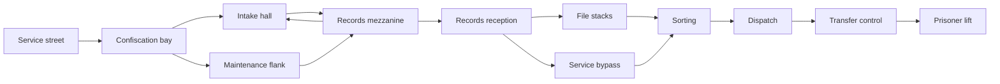

# M01: Recall Notice

**Status:** connected blockout, discovery and introductory combat shipped in
v0.28.0. The working [completion draft](../plans/m01-completion.md) expands this
to twenty Clerks and Sweepers across eight groups, with a records wing, finite
campaign supplies and preplaced guards, shipped in v0.29.0. This remains a
development mission. Fists, the secret Shiv, Pistol, Rifle, ammunition counts and
enemy phases use server authority. Artwork and animation remain provisional. A
[reader-paced text opening and party readiness](../plans/m01-opening.md) are
shipped in #193 and v0.28.0. Finished illustrations and
narration remain unbuilt. The facility pass adds keyed signs,
locker banks, service vents and practical lights through bounded map metadata.
The mission sequence shipped in #184 and v0.26.0, connecting the physical transfer
record to a real lift gate and shared departure. Rendered and party tests pass;
the result ends the prototype without loading unbuilt M02.
Earth before the wipe. Full first-run target 8-10 minutes,
to be measured. [Treatment](../CAMPAIGN-MISSIONS.md#m01-recall-notice).

The current [map document](../../server/maps/m01-recall-notice.json) connects the
route below with both walking stairs, the balcony underpass and indoor spawns.
Normal-session tests traverse both approaches. `client/qa/m01.json` covers intake
and stairs; `m01-facility.json` inspects the opening's details. The fourteen-state
`m01-records.json` exercises the full draft and record/lift controls. It tracks
named guards across rooms, including early defeats, and fails on player death.
Passing automation does not establish fresh-player pacing or fun.

The [optional supply detours](../plans/m01-optional-supply-detours.md) place a
medkit beside the confiscation lockers and armor at a maintenance overlook.
Both are walking returns to the existing route. Neither is a required secret,
weapon, or mission objective. The alcove's south pocket also holds the
[secret Shiv](../plans/m01-secret-shiv.md), found by walking in.

## Story and cast

The player reaches the intake annex that processed their companion's seizure. The
relationship already exists. An opening panel and brief seizure image establish
who was taken and why we came. Mara provides a service-access lead through text
and optional voice, not a remote running commentary. Latch is visible only in
transfer records or a fleeting view, not falsely rescued here. Clerk guards are
human; Sweepers are Union bots. No Inheritance contact yet.

The player leaves knowing the actual correction destination. The mission ends
with forward momentum, not a failed rescue or an arbitrary second key hunt.

## Opening storyboard

**Confirmed format:** skippable localized text with optional narration; later
matching video may replace or animate the same compositions. Initial proposal:
five short beats, roughly 45-60 seconds when narrated, with unlimited reading
time and a visible skip control. Duration is an authoring target, not measured.

| Beat | Image and action | Essential meaning |
|---|---|---|
| Home | A cramped workshop shared by a human and a free agent; signs of an ordinary life | People here choose their company and make a life together |
| Companion | Latch declines an instruction, then helps someone in their own way | This is a person with choices and a relationship to the player |
| Public address | Voss starts in reassuring English, turns to angry German, and a crowd cheers; brief images show weapons confiscation and a silenced independent feed | Safety and the Union's greater good are used to demand control of weapons, speech and agency |
| Recall | Human officers and uniform bots seal the workshop and take Latch | The Union calls people property and uses correction to make them compliant |
| Pursuit | An intake destination on the recall notice matches the building ahead | Reach the transfer record before Latch disappears into correction |

Use body-neutral narration and player-perspective framing so either protagonist
fits. Show the threat through the notice, a witness and the companion's response;
no graphic torture montage or long political lecture. The
[address](../lore/the-chancellery.md#opening-address) uses accurate localized
subtitles, original insignia and deliberate fascist parallels. A minor bureaucratic
absurdity may precede the seizure; do not play the violation itself as a joke.

`CampaignOpening` implements the five keyed text beats in
`client/i18n/story.en.po`; optional voice and movie resources remain unbuilt.
Use those same beats for future scene edits and keep essential words out of
baked image/video text.
An animated version uses the same character references, palette, coarse surfaces
and silhouettes as gameplay. Replacing panels cannot change story or objectives.

Skip enters the same safe initial state with the objective visible. Replay lives
in the campaign menu; spending a continue never forces the introduction again.
In the existing multiplayer development host, one player skipping does not dismiss
another's text or start combat for them. Preserve its shared readiness rule. Verify keyboard,
controller, mute, missing narration, text expansion and reconnect before release.

## Spaces and route

| Space | Purpose and construction | Encounter and evidence |
|---|---|---|
| A | Narrow frontage with a canopy, queue rails and a visible facility number | Safe entry, recall notice, one strong destination landmark |
| B | Seized-property bay with workbenches, lockers and an inspection partition | Find the Pistol safely; a lone Clerk guards the threshold before the route split; personal belongings are treated as stock |
| C | Double-height public intake, counters forming islands rather than maze walls | Two Sweepers arrive around the records screen; retreat and approach selection matter |
| D | Records balcony overlooking the hall and the lift's identifying light | The Rifle is available before the climb; later crossfire teaches cover and vertical aim |
| E | Low service passage with machinery and an ordinary walking stair | Optional flank reaches the balcony without a ladder or crouch requirement |
| R | Records reception with a low counter and issued storage | Two Clerks and a Sweeper combine previously taught attacks; two onward routes |
| S | File islands, short aisles and cross-connections | Four guards; optional armor and ammo reward taking the longer route |
| P | Service bypass along reception | Shorter approach with fewer stack supplies; reconnects at sorting's east entry |
| T | Sorting floor with screens, worktable and dispatch cabinets | Four mixed guards; cover breaks lanes and supports movement between entries |
| H | Dispatch office with two sides around a desk | Three guards; a legible final threshold and a resupply opportunity |
| F | Compact transfer-control office with glass toward the lift | Short crest against mixed Clerks/Sweepers; locate the companion's destination |
| G | Clearly marked prisoner lift, wide enough for the party | The exit; no new mandatory fight |

Blockout priorities: sufficient headroom, two distinct hall escape routes, clear
counter silhouettes and enclosed skyline. No long walk across a courtyard to
reach the first interior. Reserve views between B, D and G to teach orientation.

## Encounter and equipment plan

1. Safe fists-to-Pistol discovery, then one Clerk with generous cover and recovery.
2. Two Sweepers introduced through a visible approach around service partitions,
   with a retreat to B or an upper view from the maintenance flank.
3. Find the Rifle before the mezzanine. Reception combines both taught enemies.
4. Choose stacks for supplies and additional combat, or take the service bypass.
   Both enter the same sorting room from useful different angles.
5. Move around sorting's screens and into dispatch; three transfer guards supply
   the final crest. Guards already exist and may react before room entry if hit.
6. Recover the transfer record, open the lift route, and confirm departure.

Do not add Crawler, cloaking, explosives or a boss here. Normal draft population
is roughly 20-30 hostiles over the route, revised from actual pacing. Difficulty
uses roles and readable pressure rather than multiplying health. Supply budgets must
cover the guaranteed route plus reasonable misses, independent of secrets.

The confiscation alcove and maintenance overlook have optional supplies. They
are static walking detours, not counted secrets, and contain no essential story
evidence. The Shiv in the alcove's south pocket is the mission's one secret: a
pool-less melee weapon with a quiet `SECRET FOUND` cue, never required. There
is no moving wall panel or secret trigger; the alcove is open.

## Objectives and state

Current server sequence: `briefing` -> `find_transfer` -> `reach_lift` -> `departed`.
Each reader finishes or skips the opening before participating. Initial combat
waits for the party; late readers cannot pause active play.
The terminal interaction supplies the destination and opens a physical
route; reading a whole log is optional. Completion occurs once on server-confirmed
departure. Objective text: "Find the transfer record", then "Reach the lift".
The record console is the campaign's one built exception to the no-switch rule;
the lift is just the exit.

Mastery hooks, planned, not built: a par time on the result screen, the service
bypass as the runner's line, and best clear time per difficulty kept in the
existing service record.

Planned solo recovery: death offers a continue to restart the mission with its
entry equipment, enemies, pickups and objective state. Death with no continues
remaining ends the run.
No records checkpoint or teammate revival. Retrying repeats a short lesson,
not a long cinematic. Preserve the existing development host's interaction and
disconnect regressions while implementing the solo-run contract explicitly.

## Presentation and characters

Institutional bone/green markings, dirty concrete and warm maintenance lights.
Civilian areas and confiscated personal objects precede heavy custody machinery.
Guards call terse orders; bots use procedural fragments. The first
weapon, impact, pain and death sets must already meet the production bar.

Humor: a complaint form requires the serial number of the property confiscated
with the form. Nobody jokes over a suffering captive. Opening text advances at
reader pace; the scene uses original characters and the game's own pixel style.

## Allies and proof

No mandatory resistance partner or controllable companion. Latch remains captive.
Any optional allied appearance must preserve discovery, leave required supplies
and lesson fights to the player, and keep both stairs usable.

Preserve the existing development host's per-participant introductory equipment,
safe admission and objective context. This tested multiplayer slice does not
require a companion system or full-campaign co-op.

Prove both routes with actual movement, both rendered stairs, terminal concurrency,
skip/retry, muted voice/radio, pickup contention, spectator eye view, and at least
one fresh-player run. The player should explain the rescue and find G without a
developer pointing it out. Automated movement and introductory combat evidence
live in [the encounter plan](../plans/m01-intake-encounter.md); no complete-mission
or fresh-player proof exists yet.

## Level 1 design (twenty-level expansion)

**Status:** proposed, 2026-09-25. Level 1 of the
[twenty-level expansion](../plans/campaign-expansion.md) keeps the built route
above; this section adds the level template the other nineteen share. The
[story arc](story-arc.md) owns the through-line.

| Episode | Place | New | First run | Par | Doors |
|---|---|---|---|---|---|
| I Recall | Intake annex, Earth | Fists, Pistol, Rifle; Clerk, Sweeper | 9 min | 3:30 | 1 |

**Premise.** They called it a recall. You know who they took. The intake annex
processed Latch this morning, and the record of where they went is somewhere
behind the counters. You walk in with your hands.

**Hook.** Break into a building made of forms with nothing but your fists, and
leave it with a rifle and an address.

**Teaches.** Fists, then the Pistol, then the Rifle; the Clerk's aim tell, then
the Sweeper's burst. The seized-property bay teaches the Pistol: it sits on the
inspection counter three steps from the start, in plain light, and the lone
Clerk past the partition only turns when you cross the threshold. Your first
kill is a choice you had time to make. The Sweeper pair in the hall teaches the
burst cycle, with the counters as islands to break line of sight.

**Shape.**
1. **Arrival.** Service street under a canopy, queue rails, the facility number
   over the door, a recall notice pasted over an old advert for a helpful home
   robot. Safe.
2. **First fight.** The seized-property bay: the Pistol, Latch's ledger in a
   bin tagged as stock, one Clerk at the threshold.
3. **Escalation.** The intake hall: two Sweepers around the records screen,
   which loops Voss's address with the official caption. Retreat to the bay or
   take the maintenance flank for an upper view.
4. **Breath.** The maintenance flank overlook: armor, and through the balcony
   glass the prisoner lift's light, the landmark you will ride down.
5. **Set piece.** The records mezzanine crossfire, with the Rifle found on the
   stair landing before it. Then reception: two Clerks and a Sweeper.
6. **Turn.** Transfer control's glass: the transport leaves as you watch. The
   record says where it goes: the correction ward, one level down.
7. **Climax.** Sorting and dispatch, then three transfer guards at the final
   threshold, with resupply in the dispatch cabinets.
8. **Exit.** The lift. No fight inside it.

**Landmarks and sightlines.** The lift light, seen from the balcony early and
from transfer control late. The records screen over the hall, visible from
both stairs. The file stacks read as a maze from the balcony and are not one.

**Doors.** One: the lift gate. The record console is the campaign's single
built exception to the switch rule.

**Secrets.** Three, each marked with the circled six the free side paints where
the Office is thinnest.
- The Shiv in the confiscation alcove's south pocket (built): walk in and it is
  there, with the quiet secret cue.
- A six chalked on the end of the last file island: Bullets and a medkit on
  the shelf behind it, for taking the long route.
- A six on the maintenance flank's railing: a ledge walk to the records
  balcony that skips the mezzanine stair and lands behind its Clerks.

**Brief.** Assisted: take Latch's ledger from the seized-property bay.
Standard adds: clear the file stacks. Severe adds: clear dispatch without
taking damage.

**Par and the runner's line.** 3:30. Maintenance flank to the balcony ledge,
the service bypass past the stacks, straight through sorting into dispatch.

**Story in play.** The opening's five text beats are the page in (built).
Barks are Clerk orders ("Hands visible.") and Sweeper fragments ("Article
Seven. Remain."). The screens carry Voss. The ledger's last line reads *You 3.
Me 3.* in Latch's hand; nobody explains it until level 2. The building has no
radio; the Host is heard only faintly from a confiscated set in the bay.

**Humor.** A complaint form requires the serial number of the property
confiscated with the form. Latch's belongings are tagged *Personal effects,
surplus to requirement.* Shooting the looped Voss screen breaks it to static
and the caption keeps scrolling over the noise: *Continuity assured.*

**The moment.** The caption that survives the screen. Players shoot it once to
see what happens and remember the building by it.
