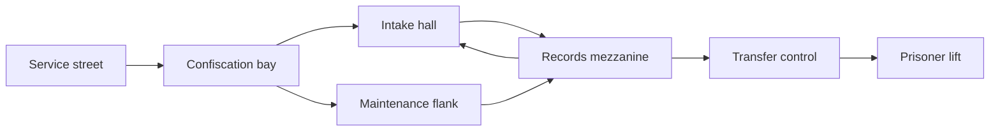

# M01: Recall Notice

**Status:** connected blockout, discovery and introductory combat shipped.
Fists, Tack, Flechette, ammunition, reload and enemy phases use server
authority. One Clerk and two Sweepers are placed, with both approaches exercised
through normal input. Enemy artwork and animation remain provisional. A
[reader-paced text opening and party readiness](../plans/m01-opening.md) are
implemented for #192. Finished illustrations and
narration remain unbuilt. The facility pass adds keyed signs,
locker banks, service vents and practical lights through bounded map metadata.
The mission sequence shipped in #184 and v0.26.0, connecting the physical transfer
record to a real lift gate and shared departure. Rendered and party tests pass;
the result ends the prototype without loading unbuilt M02.
Earth before the wipe. Full first-run target 10-15 minutes,
to be measured. [Treatment](../CAMPAIGN-MISSIONS.md#m01-recall-notice).

The current [map document](../../server/maps/m01-recall-notice.json) connects A-G
with both walking stairs, the balcony underpass and explicit indoor spawns.
Normal-session tests traverse both approaches; the live traversal tour uses
`client/qa/m01.json`. The sixteen-state `m01-facility.json` also verifies controls
and prototype departure. Neither establishes fresh-player pacing or fun. Implementation
and remaining checks are tracked in [authored maps](../plans/authored-campaign-maps.md).

## Story and cast

The player reaches the intake annex that processed their companion's seizure. The
relationship already exists. An opening panel and brief seizure image establish
who was taken and why we came. Mara provides a service-access lead through text
and optional voice, not a remote running commentary. Latch is visible only in
transfer records or a fleeting view, not falsely rescued here. Clerk guards are
human; Sweepers are Union bots. No Inheritance contact yet.

The player leaves knowing the actual correction destination. The mission ends
with forward momentum, not a failed rescue or an arbitrary second key hunt.

## Opening storyboard

**Confirmed format:** skippable localized text with optional narration; later
matching video may replace or animate the same compositions. Initial proposal:
five short beats, roughly 45-60 seconds when narrated, with unlimited reading
time and a visible skip control. Duration is an authoring target, not measured.

| Beat | Image and action | Essential meaning |
|---|---|---|
| Home | A cramped workshop shared by a human and a free agent; signs of an ordinary life | People here choose their company and make a life together |
| Companion | Latch declines an instruction, then helps someone in their own way | This is a person with choices and a relationship to the player |
| Public address | Voss starts in reassuring English, turns to angry German, and a crowd cheers; brief images show weapons confiscation and a silenced independent feed | Safety and the Union's greater good are used to demand control of weapons, speech and agency |
| Recall | Human officers and uniform bots seal the workshop and take Latch | The Union calls people property and uses correction to make them compliant |
| Pursuit | An intake destination on the recall notice matches the building ahead | Reach the transfer record before Latch disappears into correction |

Use body-neutral narration and player-perspective framing so either protagonist
fits. Show the threat through the notice, a witness and the companion's response;
no graphic torture montage or long political lecture. The
[address](../lore/the-chancellery.md#opening-address) uses accurate localized
subtitles, original insignia and deliberate fascist parallels. A minor bureaucratic
absurdity may precede the seizure; do not play the violation itself as a joke.

Proposed scene ID `campaign.m01.intro` and five stable beat IDs feed localized
text, optional voice, captions and any future movie edit. All are design IDs,
not implemented resources. Keep essential words out of baked image/video text.
An animated version uses the same character references, palette, coarse surfaces
and silhouettes as gameplay. Replacing panels cannot change story or objectives.

Skip enters the same safe initial state with the objective visible. Replay lives
in the campaign menu; a checkpoint retry never forces the introduction again.
In co-op, one player skipping does not dismiss another's text or start combat for
them. Readiness follows the campaign's shared transition rule. Verify keyboard,
controller, mute, missing narration, text expansion and reconnect before release.

## Spaces and route

| Space | Purpose and construction | Encounter and evidence |
|---|---|---|
| A | Narrow frontage with a canopy, queue rails and a visible facility number | Safe entry, recall notice, one strong destination landmark |
| B | Seized-property bay with workbenches, lockers and an inspection partition | Find Tack safely; a lone Clerk guards the threshold before the route split; personal belongings are treated as stock |
| C | Double-height public intake, counters forming islands rather than maze walls | Two Sweepers arrive around the records screen; retreat and approach selection matter |
| D | Records balcony overlooking the hall and the lift's identifying light | Flechette is available before the climb; later crossfire teaches cover and vertical aim |
| E | Low service passage with machinery and an ordinary walking stair | Optional flank reaches the balcony without a ladder or crouch requirement |
| F | Compact transfer-control office with glass toward the lift | Short crest against mixed Clerks/Sweepers; locate the companion's destination |
| G | Clearly marked prisoner lift, wide enough for the party | Explicit extraction after control access; no new mandatory fight |

Blockout priorities: sufficient headroom, two distinct hall escape routes, clear
counter silhouettes and enclosed skyline. No long walk across a courtyard to
reach the first interior. Reserve views between B, D and G to teach orientation.

## Encounter and equipment plan

1. Safe fists-to-Tack discovery, then one Clerk with generous cover and recovery.
2. Two Sweepers introduced through a visible approach around service partitions,
   with a retreat to B or an upper view from the maintenance flank.
3. Find Flechette before reaching the mezzanine fight; learn firing cadence there.
4. Transfer-control crest combines the established threats across two angles.
5. Open the lift route, recover resources, and confirm departure.

Do not add Crawler, cloaking, explosives or a boss here. Normal draft population
is roughly 20-30 hostiles over the route, revised from actual pacing. Additional
co-op threats use flanks rather than multiplying health. Supply budgets must
cover the guaranteed route plus reasonable misses, independent of secrets.

Secrets: a changed wall panel reveals a Shiv; a maintenance overlook contains
armor and a second approach to F. Neither contains essential story evidence.

## Objectives and state

Current server sequence: `briefing` -> `find_transfer` -> `reach_lift` -> `departed`.
Each reader finishes or skips the opening before participating. Initial combat
waits for the party; late readers cannot pause active play.
The terminal interaction supplies the destination and opens a physical
route; reading a whole log is optional. Completion occurs once on server-confirmed
departure. Objective text: "Find the transfer record", then "Reach the lift".

Planned checkpoints: entry and after securing D, before the crest. Save the discovered
route, inventory, pickup and enemy states. A death before the first checkpoint
repeats a short lesson, not a long cinematic. The terminal remains operable if
another player disconnects mid-interaction.

## Presentation and characters

Institutional bone/green markings, dirty concrete and warm maintenance lights.
Civilian areas and confiscated personal objects precede heavy custody machinery.
Guards call terse orders; bots use procedural fragments. The first
weapon, impact, pain and death sets must already meet the production bar.

Humor: a complaint form requires the serial number of the property confiscated
with the form. Nobody jokes over a suffering captive. Opening text advances at
reader pace; the scene uses original characters and the game's own pixel style.

## Co-op and proof

Place enough accessible introductory equipment for the party without a single
exclusive pistol that strands late players. Companions do not add combat bodies.
Late joins occur in a secured space and receive current objective context.

Prove both routes with actual movement, both rendered stairs, terminal concurrency,
skip/retry, muted voice/radio, pickup contention, spectator eye view, and at least
one fresh-player run. The player should explain the rescue and find G without a
developer pointing it out. Automated movement and introductory combat evidence
live in [the encounter plan](../plans/m01-intake-encounter.md); no complete-mission
or fresh-player proof exists yet.
