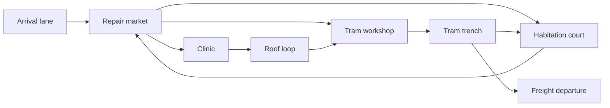

# M03: No Forwarding Address

**Status:** proposed, unbuilt. Earth before the wipe. Target 10-14 minutes.
[Treatment](../CAMPAIGN-MISSIONS.md#m03-no-forwarding-address).

## People and dramatic purpose

Low Water is home to the player, Latch, clinician Edda Vale and technician Splice.
Mara is assembling transport but neighboring communities delay commitment.
Union forces arrive before the promised aid. We save many, but the delay costs
people independently of optional rescues. Latch presses to include captive
agents held at the workshop. The records obtained earlier establish the lunar
depot as the next actionable link in the custody system.

Give Edda and Splice a short ordinary interaction before danger escalates. Their
survival should matter because the player met them, not because a UI calls them
an upgrade. Mara admits the coordination failure instead of blaming every victim.

## Spatial plan

| Zone | Landmark and life | Encounter purpose |
|---|---|---|
| Market | Shared repair benches, awnings, human and agent charging/rest spaces | Initial welcome, then exposed but flankable defense |
| Clinic | Recognizable lit cross-symbol and covered entrance | Optional Edda rescue with nearby shelter, not a distant escort |
| Workshop | Tram chassis, cranes and a high maintenance walk | Optional Splice/captive release; first Heavy Sweeper |
| Court | Homes overlooking a common yard | Civilian route and an enclosed alternative to exposed street |
| Roof loop | Water tanks, access stairs and sight across the market | Early scout/flank; later changed landmark in the wipe and epilogue |
| Trench | Functional rail cut with foot crossings and maintenance recesses | Turret lane with cover and a bypass, not an empty ditch |
| Departure | Loading platform and physically visible transport | Final clearance, survivor regroup and deliberate departure |

Preserve the street and roof silhouette for the post-wipe return. Mark mundane
objects that can carry memory later: Edda's lamp, Splice's patched tram, a shared
meal table. Nothing requires a radio explanation.

## Combat, equipment and secrets

Carry weapons. No new mandatory gun; this mission combines Flechette/Scatter
roles and teaches Heavy and Turret counters. Guaranteed cover and flank access
make a Rail unnecessary. Draft encounter beats: market intrusion, one branch
rescue, trench crossfire, second branch if chosen, withdrawal through changed hub.
Avoid an invisible global timer that makes exploration the wrong decision.

Secrets offer armor on the roof, reserve ammo behind the tram service bay, and
a supply shortcut back to the market. Supplies remain enough for required fights
if both optional branches are skipped. The threat mix pressures different
approaches, not just a larger HP pool in the same doorway.

## Rescue and authoritative state

Required: open departure route and board. Optional flags: `medic_evacuated`,
`technician_evacuated`, with released versus evacuated actors kept distinct.
Both are achievable. Departure shows who is aboard and who remains reachable.
A player confirmation commits the mission outcome; no incidental trigger
quietly decides that someone was abandoned.

A continue restarts arrival, with entry equipment and prior-mission survivors.
Rescues attempted in this mission reset with its routes and pickups; completed
earlier outcomes remain intact. No duplicate pickup or rescue credit loop.

## Presentation and continuity

Short scene after safety confirms losses from the aid delay and the next lead.
No cheerful score screen celebrates the dead. Humor belongs in neighbors arguing
over forms, transport paint, or whose charging cable is whose before the attack.
M10 and the conditional epilogue revisit these actual places and reflect saved people.

## Evidence required

Run all four Edda/Splice outcome combinations, including both rescued; mission
retry; departure cancellation; ally loss; return to an unfinished branch; and
full first-person path inspection with human and agent control.
A fresh player must identify home as more than a battlefield and understand why
the coalition's failure is delayed help, not proof that every free person is cruel.
