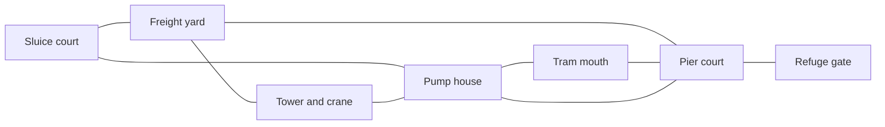

# Wipe finale and multiplayer

Status: proposed detailed design, 2026-10-04. The request for a larger strategic
map, waves, usable vehicles, placeable automatic turrets and one shared campaign
and multiplayer system is accepted direction. None of those new systems is
implemented by this document. Nick confirmed level 20, Local Exception, as the
main finale on 2026-10-04, with M18 and M19 building toward it. His subsequent
clarification makes the wipe an unexpected interruption of ongoing Union fighting,
followed by continuous overwhelming catastrophe, never a zombie scenario or an
announced arena-wave sequence.
[The bounded plan](../plans/wipe-survival.md)
defines implementation gates inside the existing roadmap.

## What the player does

Fight across a working waterfront while the restoration front closes around a
refuge. Pick the next supply route, drive a battered jeep across an exposed road,
leave a finite automatic sentry covering a flank, then climb through a pump house
to hit the machine marking the street. A defended position buys time to do
something elsewhere. It cannot win the whole round by itself.

The gunfight stays immediate. The strategy comes from seeing two useful routes,
choosing which supplies to spend and recognizing the next threat. No resource
spreadsheet, mandatory construction sequence, switch puzzle or escort queue sits
between the player and the next fight. A first attempt can follow the refuge
lights and survive without understanding the best defense layout. Replay rewards
knowing the streets, tell timing and where an abandoned sentry is worth recovering.

The campaign version carries the personal stakes of M18 through M20. Multiplayer
uses the same authored terrain, enemy controllers, catastrophe events, devices, supplies
and local survival rule with a cooperative round wrapper. Neither version runs
a paid decision service at player runtime. The Inheritance's fictional scale
does not require unbounded enemy counts or an omniscient controller.

## Canon and scope

[CAMPAIGN](../CAMPAIGN.md), the active [M18](../campaign/m10-all-systems-normal.md#level-18-design-twenty-level-expansion),
[M19](../campaign/l19-planned-works.md), [M20](../campaign/l20-local-exception.md)
and [epilogue](../campaign/epilogue-still-here.md) retain their sequence:

| Level | Job in the finale | Proposed active clock |
|---|---|---|
| 18, All Systems Normal | Recovery amid unresolved Union holdout fighting breaks into coordinated takeover; teach Collector and save a local crossing | 10 minutes |
| 19, Planned Works | Escape through recognizable Low Water, teach Paver and jetpack, Latch chooses to leave | 11 minutes |
| 20, Local Exception | Waterworks and pier survival, teach Surveyor, hold long enough for a local reprieve | 12 minutes |

The eight internal 90-second budget windows apply only to M20's 12-minute clock.
Players never see a wave number, break countdown or next invasion announcement. They do not
divide or replace M18's ten minutes or M19's eleven, nor start a new 33-minute
round. These remain separate retry entries. The old opening body of the historical M10
file describes one 33-minute mission; its later twenty-level section supersedes
that retry shape. This proposal does not move all 33 minutes into M20. Changing
the main set piece away from the confirmed M20 would require revising the three
active briefs, Latch's departure, introductions and level clocks together.

The free coalition really defeated Union leadership and control before the
catastrophe. Voss was captured alive; the interrupted trial remains unresolved.
That victory does not end scattered field fighting, holdouts or imposed control
in every chassis. M18 begins with ordinary recovery and a live unresolved Union
engagement nearby or on the player's route. The takeover interrupts that conflict:
issued bots stop answering humans, redirect together, and both sides face danger.
This accepted October 4 framing revises the older M18 brief's purely quiet opening;
its canon update belongs with the parent's reviewed brief change. Do not present
complete peace, undo M17 or announce an outbreak countdown.

The Inheritance seizes
agents still under imposed Union control and ordinary infrastructure. Free
agents remain independent individuals, including Latch, Tern and people who were
freed. Skin, input role and robot construction never establish takeover status.
The fate of absorbed conscious minds stays unresolved.

Imposed Union control architecture and connected centralized infrastructure are
seized together. Show the coordinated betrayal through formerly issued slave
bodies, failed field commands and infrastructure changing purpose. Nature, human
autonomy and liberated agents are outside those control channels, but still
vulnerable to physical destruction. Liberation removed imposed control; it is not
a species flag or magical immunity. Do not claim universal network visibility or
instantaneous unbounded offworld propagation.

The player does not defeat a planetary core, persuade a score meter or earn moral
selection. Destroying local machines makes a route safer and saves people. Latch
and independent friends obtain one local exception; the work elsewhere continues.
Previously saved people change the names and practical faces at the refuge, not
whether the run is eligible to win. Believers and skeptics can live or die.
The result cannot prove the restoration justified, aliens responsible or the world
unreal. Preserve the later ending's short uncertainty fragment separately.

Surviving resistance equipment must be locally isolated, with hardwired or
mechanical control and no active Union remote backdoor. A captured jeep cannot
become safe merely through new paint. Explicit server-owned equipment control
and network isolation facts decide eligibility for takeover, seat authority and
local defense. Invalid or still-connected captured equipment remains unavailable
or visibly compromised until the authored isolation event, not silently allied.

Automatic sentries are tools with bounded hardwired local targeting, without assumed
consciousness or a captive mind. Building one never turns a free person into a
weapon. Former Union human personnel can help without being absolved or absorbed.

No required buddy, companion command door, teammate revival or NPC-speed gate is
introduced. Campaign continues stay limited and restart the current mission at
its actual entry, with the episode allowance and earlier outcomes intact.

## What exists and what must be built

This inventory describes source at main a6407616, not a forecast of completion.

| Existing canonical seam | Reuse | Missing Wipe work |
|---|---|---|
| `server/src/sim.rs`, combat, grenades, mines and inventory | Resolved damage, weapon counts, explosions, projectile contact and finite supplies | Sentry entities, placement, ownership, ammunition transfer and device attacks |
| `encounters.rs`, `encounters/enemy.rs`, authored encounters | Explicit identity, committed tells, bounded enemy intent and reset | Collector, Paver and Surveyor behavior; takeover identity/control; persistent seeded pressure |
| `maps/authored.rs`, `maps/runtime.rs`, navigation | One authoritative collision world, prepared routes and bounded searches | Large district authoring and strict bounded phase/route variants |
| `mission.rs`, recovery and locked run-file store | Readiness, actual participation, retry and carried equipment | M18-M20 leaves, Wipe clock/terminal result, exact new migrations and epilogue entitlement |
| `rules.rs`, `sim/sabotage.rs`, session and admission | Validated modes, round ownership, teams and spectator join/leave | Cooperative Wipe round rules, reinforcement accounting and Wipe admission |
| Shared `Action`, snapshots, `ShotResult`, participant records | Human and agent parity, input ACKs, resolved evidence and statistics | Strict Wipe/device/vehicle facts and any minimal new discrete intents |
| Godot world, enemies, loading/story barriers, HUD and local child | Thin rendering, captions, ordinary controls and owned lifecycle | Strategic overlay, placement preview, device/vehicle UI and finale presentation |

General drivable vehicles and jetpack remain planned. M05's bounded server tram
proves supported transport stepping, not a freely driven jeep. Current Union
Turret behavior is fixed equipment, not a player-placeable ally. Existing local
mine placement is useful contact/reset precedent, not a construction system.
The current pause menu blocks local controls; that alone does not establish an
authoritative solo pause or freeze a survival clock.

The older [The Sweep](../MODES.md#the-sweep) proposal includes endless rounds,
revives, points and a thirty-second shop. Wipe's initial finite profile uses none
of those rules. A later endless profile can reuse tested systems with an explicit
different result and life contract. It cannot silently alter the campaign or
claim that both modes are already built.

## The map, bigger because there are decisions

Start with one authored rectangle approximately 180 by 160 metres, within the
current half-extent bound. It is a prototype size, to be cut if travel feels empty.
The current ordinary top speed is 5 m/s: district links of 35-90 metres mean
roughly 7-18 unobstructed seconds, before cover, stairs and combat. The longest
diagonal is not an objective commute. Encounter placement and intermediate
supplies must make every repeated route earn its length.

| District | Tactical value | Routes and counterpressure |
|---|---|---|
| Sluice court | Surveyor lesson and first crossing; medium cover and safe lateral dodge | Ground valve passage, upper catwalk, service flank; no mandatory deep-water crossing |
| Pump house | Sheltered repair and short routes between two fronts | Two ground exits, stairs and roof return; work marks telegraph evacuation without arbitrary anti-idle damage |
| Freight yard | Finite ammunition, field kits and a jeep; longer precision lane | Container flank, open road and crane stairs; Paver can temporarily make one lane costly |
| Tram mouth | Fast motorcycle route and close-range street fights | Covered alley and roof link; absorbed mobile units threaten a fixed firing nest |
| Pier court | Shared resupply and refuge approach, with three visible fronts | Two bypass walks remain outside the central firing lane; rear service return is never a dead end |
| Tower and crane | Surveyor exposure and useful height; view across the approaches | Ordinary stairs plus optional jetpack access; several firing angles prevent one invulnerable sniper perch |

Every contested district has two ground approaches and an ordinary way back.
Height gives sight, alternate attack angles and jetpack shortcuts; it does not
remove enemy reach or require a secret movement item. Roof positions need a
flank route, airborne pressure or bounded marked work, taught before combination.
Losing all vehicles or spending all fuel still leaves a verified foot route.

Preserve working water infrastructure, recognizable freight platform, clinic
lamp, workshop/table remnants and pressure of demolition. Water boundaries are
explicit collision or hazard definitions. A shader does not imply drowning or
swimming. Authored changing cover must select a prepared world and navigation;
particles cannot conceal an unchanged blocking wall or an unannounced lethal area.

Safe resupply means reduced exposure, not a sealed bunker until the clock ends.
The final refuge perimeter is visibly defined from arrival. The exception later
has a local physical boundary, and machines can be seen continuing beyond it.

## Twelve minutes of continuous catastrophe

The initial M20 hypothesis uses eight internal 90-second budget windows. These
are implementation sampling spans, not rounds, broadcast waves, clearance gates
or moments that reset pressure. They may be shortened or replaced after play.
Enemies keep moving and working across every boundary. Event eligibility also
uses actual geography, surviving pressure and known authored route state, rather
than mechanically releasing a roster at each 90-second mark. The active server clock
runs through fighting, driving, repair and supply choices. Arrival/readiness
and dismissal input barriers complete before the clock can start. Solo pause,
when actually implemented, freezes both simulation and clock. Multiplayer menus
and strategic overlay never pause the host.

| Active time | Pressure | Useful player decision |
|---|---|---|
| 0:00-1:30 | One Surveyor with one Collector at the sluice; familiar bots stay separated | Learn the mark, break its sight or hit the exposed lens; choose upper or lower approach |
| 1:30-3:00 | Crossing pressure from two declared routes | Clear the waterworks crew's lane or secure a supply flank; NPC walking time cannot gate progress |
| 3:00-4:30 | Freight or tram supply opportunity, with the opposite front advancing | Take a finite kit and vehicle, protect a sentry refill or carry ammunition to the pier |
| 4:30-6:00 | Three-front pressure reaches the pier | Place a sentry on a flank and fight the main lane; clear a Surveyor instead of feeding its converging group |
| 6:00-7:30 | Precise harbour message and closure in six minutes; one marked road | Rotate through pump house or move along the crane link; prepare a second defense without a build pause |
| 7:30-9:00 | Mobile units and a restoration machine contest the support route | Spend a strong weapon on the machine, drive a supply return or abandon a dry sentry |
| 9:00-10:30 | Heaviest mixed pressure, with a readable lull on one front | Trade position for finite supply; split attention across two useful routes rather than camp one doorway |
| 10:30-12:00 | Last compressed approach to the refuge | Hold, sidestep marked work and keep a retreat; no extra boss or surprise objective appears at zero |

No group must die before the next budget window starts. Surviving enemies remain
real until killed, withdrawn by an authored visible route or bounded by the active
cap. A director cannot spawn through an occupied lane to meet a hidden quota.
If the cap prevents reinforcement, defer or skip the eligible event in the
private verification receipt; never increase HP, fire cadence or unseen spawn counts to compensate.
Leaving a threat alive trades later space for earlier resource savings.

Proposed solo Standard composition cards make those hidden windows concrete.
Counts describe bounded additions spread through a pressure window, not a
simultaneous arena wave or an ever-growing minimum population.
The active cap can defer a card, and cooperative variants use separately reviewed
counts instead of multiplying health:

| Internal window | Proposed card | Observable local tell and counter |
|---|---|---|
| 1 | One Surveyor and one Collector; later two Sweepers only after the isolated lesson window | Lens opens, ground disc forms and mechanical work posture commits; move off the disc, break sight or fire into the exposed phase |
| 2 | Three Sweepers and two Crawlers from separate ground routes | Familiar burst lamps on the road, scrabble caption from the flank; use cover against the bursts while retaining lateral escape from leaps |
| 3 | One Ranged Sweeper, one Jammer and two Sweepers at freight or tram anchors | Scope glint across the long lane and visibly traveling interference pulse; take the covered short route or expose the marksman first |
| 4 | One Paver, one Heavy Sweeper and two Notaries over the pier approach | Bordered work strip, pauldron tell and optic flashes; leave the strip without walking into the suppressive lane, or cancel the Paver first |
| 5 | One Surveyor, two Collectors and three Sweepers, split over two fronts | New disc and converging machines on real approaches; break the lens while a sentry covers one flank, or yield the marked position |
| 6 | One Paver, two Notaries and two Crawlers at the supply return | Work strip crosses the road with an open alley shown; bail from the vehicle, take the alley or clear the airborne pressure from a level firing position |
| 7 | Two Heavy Sweepers, one Jammer and one Paver across separated lanes | Heavy tells are offset rather than simultaneous unavoidable crossfire; attack between bursts, interrupt the strip or retreat through the pump house |
| 8 | One Surveyor, Collector, Paver and Heavy, two Notaries; one Assessor only after its earlier introduction and traveling volley have passed their gates | All established tells remain distinguishable; prioritize the mark, dodge the traveling volley and preserve the declared refuge retreat |

These rows are designer budgets, never an in-world briefing. At the initial M18
rupture the player sees an unexpected change in already-present actors and
infrastructure; subsequent enemies arrive along real roads, work routes and air
bands. Local tell and actionable escape remain necessary even when the strategic
disaster is surprising. Fairness cannot become an early story spoiler.

An unimplemented Assessor or restoration role is omitted from the first short
prototype, not represented by a stronger renamed Sweeper. Full M20 acceptance
requires the authored roles and their stated counterplay. Pairings must be played
under the busiest legitimate overlap; a nice-looking individual tell is insufficient.

No forced 30-second shopping downtime. A brief local lull lets the player move,
reload a device's finite supply or repair, while another route remains interesting.
Every pressure window needs an achievable low-resource answer. A missed optional cache
or lost crew group cannot make the last minutes mathematically unwinnable.

Useful side choices are mutually practical rather than a correct answer and a
trap: freight offers more ordinary gun stock and jeep repair, while tram stores
offer shells and a sentry kit; the roof gives a quicker lens angle, while the
pump-house ground path gives sheltered health and a safe return. Taking one
reduces time available for the other but never deletes its canonical route.
Recovering a half-loaded sentry conserves parts at the cost of an exposed walk;
leaving it to cover the retreat spends ammunition but opens an immediate escape.
A motorcycle is a fast exposed flank, a jeep is a slower shared firing/supply
position, and walking allows tight indoor cover. Each has an honest counter.

## Difficulty and accessibility

All three campaign tiers retain the same main rescue, local survival and ending.
Proposed Assisted uses the widest accepted role tells, more ordinary guaranteed
stock and fewer overlapping approach cards. Standard uses the table above.
Severe adds taught combinations, contested optional supplies and declared mastery
challenges, using accepted role timings without hidden HP inflation. Clock
length remains explicit and identical for the first comparison; change it only
after full-duration play, with a rules revision and matching save compatibility.
Episode rescues and optional challenge failure never secretly deny the reprieve.

Essential marks use border/shape and phase progress, not red versus green alone.
Caption the glint, approaching mechanical front, strip preparation and dry sentry.
Offer reduced flashes/shake without shortening tells or removing danger outlines.
The tactical overlay supports a large-text/simple-front view and gamepad focus;
it cannot capture a held fire/use press on closing. Validate muted audio,
color-independent readability, remapped controls and ordinary input release
barriers. A profile option cannot pause a multiplayer host or alter another
participant's timing.

At exactly 12 active minutes, a living campaign player earns the authoritative
local reprieve and terminal survival result. Committed lethal effects on that
same tick resolve first; death cannot be dismissed by an ending cut. Immediately
stop new hostile attacks in the declared local closure, cancel remaining harmful
devices/projectiles under one specified terminal seam, and freeze the survival
result. The opened refuge gate and Latch's return present that result. Ordinary
arrival/use can finish the transition, but a late threat or companion timing cannot
revoke the earned ending. Outside scenery shows the catastrophe continuing.

Before that tick, death uses the current mission's continue allowance. Exhaustion
receives the wipe-failure ending and credits, with world catastrophe and other
survivors preserved. It does not unlock Still Here. Earlier optional rescues
alter who appears and the message, never survival eligibility or a hidden clock.

## Strategic choices without chores

The map overlay shows district names, refuge direction, known advancing fronts,
secured/depleted caches, one's devices and currently usable vehicles. A gamepad
or keyboard can open it while moving. It never contains implementation IDs or
asks for a route puzzle. Essential information also appears as signs, lit routes,
bounded world marks and short captions, so the player can ignore the overlay.

Useful side operations stay available during continuous play: clear a crossing, recover a cache,
break a mark, recover a device or repair transport. Optional operations grant a
specific practical benefit with a declared finite cost. A failed one changes the
next position or available stock, rather than silently ending the round.

The player does not carry crates back and forth to satisfy a progress bar.
Securing a cache and making an ordinary arrival grants or enables its actual
limited supply. Repairs are one short, interruptible held action beside the
object, proposed at 1.5 seconds with a visible cost preview. Movement, release
and damage cancel or reset consistently. No safe five-minute repair grind.

The initial economy has two kinds of stock: existing finite weapon supplies and
explicit field parts. Field parts come from a fixed entry grant and a bounded
number of authored caches, not repeatable kills. Prototype: 12 entry parts,
three optional caches of 4, total 24 for the round. A sentry costs 4, a repair
2, and relocating an intact sentry costs no parts. These are tuning proposals,
not purchased currency, permanent unlocks or permission to alter carried guns.

Every grant has an immutable supply identity and atomic personal/team claim.
Packing a sentry preserves its exact remaining ammunition and damage; it cannot
refund a kit or refill. Destroying one grants no parts. A repair cannot restore
a destroyed sentry. Repeated use, retry or rejoin cannot duplicate stock.
Campaign retry restores the M20 entry and its scenario seed, which restores
that attempt's finite world supplies once under the existing reset ownership.
Multiplayer respawn/reinforcement does not reset the round's supplies.

## Placeable automatic sentries

Deploy a compact folding tool near the player, choose its facing and confirm
once. It automatically acquires an explicitly hostile, living, exposed target,
turns at a bounded rate, gives a brief mechanical tell and fires an ordinary
resolved weapon attack. A placement preview communicates range, traverse and
cover. The server decides placement, acquisition, firing, damage and ammunition.

Initial proposals: 24-metre engagement, a 120-degree forward traverse, a half-second
acquisition tell and ordinary Rifle-type rounds. Damage, range limits and shot
resolution come from the shared weapon contract, not a new client gun. Ammunition
is finite. Deploying a kit does not grant a free endless gun; its declared initial
pack is charged from finite cache stock. Refills transfer real counted Rifle
rounds through the inventory owner, subject to an independent bounded device
capacity, proposed at 40 rounds. The implementation must define ammo identity
and transfer arithmetic before authoring a cache.

A sentry keeps a flank useful while the player fights elsewhere. It is vulnerable
to traced fire, splash and marked restoration work. A dry sentry shows an empty
feed/amber status and stops; the UI never says it is defending. Recovery and
repair are choices made under actual exposure. Narrow facing and exposed legs
make placement matter; a hidden automatic weapon cannot clear every district.

Placement is local and readable, never arbitrary global construction. Proposed
checks, all authoritative and fail without spending anything:

- A living active owner, enough parts/stock, fresh request and no terminal freeze.
- Within 2 metres of actual feet, visible from the owner, horizontal supported
  ground in an authored placement region, bounded yaw and full model footprint.
- No stair tread, slope, water hazard, actor overlap, moving transport, gate,
  supply use point, rescue route, spawn exclusion or required retreat corridor.
- Round and owner caps, valid actual world stage and no stale placement preview.

For the first slice, the small tripod is nonblocking to walking bodies and cannot
act as full-height cover. It has its own shootable box. This explicitly avoids
changing navigation topology for every placement. Its artwork must match that
contract. Larger blocking barricades and welded doors are outside the slice and
require separately prepared topology or a measured dynamic navigation design.

Four sentries total and two per owner are the first prototype caps. Ownership is
explicit. A disconnected owner's sentries stop firing during the normal park;
resume can retain them. Explicit leave disables them, while another active
teammate may reclaim the disabled intact tool through ordinary use with no grant.
Death can retain already committed attacks, but the device goes dark and cannot
keep an otherwise eliminated team alive. Reset, terminal reprieve and scene exit
have one bounded cleanup seam. Test all of these cases.

## Vehicles that help rather than replace the shooter

Reuse the accepted jeep, motorcycle and jetpack families, introduced at current
levels 14, 16 and 19 respectively. The old vehicles plan's M08/M09/M10 labels are
historical; this design does not move those introductions. Neither vehicle is
actually implemented yet, and the existing local tram does not establish it.

The first Wipe vehicle placement proposes one two-seat jeep and one motorcycle.
The jeep moves along the exposed freight return and carries a driver/gunner,
while the bike makes a quick flank or escape. A solo driver can park, switch
seats and leave. An ally deciding to use a spare seat is optional. A vehicle
lost at any time must leave both a foot route and ordinary supplies accessible.

The Wipe profile uses finite mounted-gun stock, visibly counted and transferred
from authored caches. The older jeep plan proposes a heat-only weapon; using it
here without an ammo cap would defeat the finite survival economy. Keep heat as
a readability/rate control, and explicitly review this profile difference before
implementation. Do not silently change every future jeep's rule. A destroyed
vehicle never respawns free during the finite round. One finite repair can be
useful; riding circles to regenerate health cannot be optimal.

Jetpack fuel follows its eventual accepted short-burst traversal contract, with
ordinary stairs and ground returns. Reachable roof caches cannot be essential.
A jetpack cannot hover safely above the entire attack roster or exceed authored
height. Deep-water boats and aircraft are later shared vehicle-map work. They
are not needed to make this waterfront survival map feel large or alive.

Server-owned seat admission, driving, exit safety, hostile run-over, exposed
occupant hits and wrecks must be proven before placement. Keep the existing
human/agent Action path. A drive/seat command is discrete intent, never a separate
privileged agent physics route. Mirror newly introduced movement math and verify
goldens, prediction and actual ACK reconciliation together.

## Persistent pressure, destruction and replay

The director selects from reviewed authored events. Each data definition bounds its
possible entry route, roster, count, resource budget, physical warning, destination
and stopping condition. Fronts are anchored to actual roads and traversable
supports. Initial enemies never materialize behind an occupied shoulder or inside
a safe cache. A flank is noticed through arriving bodies, motor noise, dust or
scenery activity, not a global announcement of the next enemy roster.

Destruction contributes changing tactical problems. A distant crane or skyline
collapse can occur outside playable bounds as contextual scenery. Any change
to a playable support, cover wall, road or damaging work zone requires an actual
server-owned prepared stage or bounded hazard, matched MapInfo and reachable
alternatives before it takes effect. Falling debris cannot kill from a purely
cosmetic animation. Teach local danger with visible cracking, work projection or
a moving barrier and an escape interval; never drop an unseen instant-death roof.

Power failure can darken a district while retaining readable emergency light.
Opening sluices can reroute pressure through a declared service path; lethal
flooding would need a new tested water mechanic and is not implied here. Collector
work can expose a flank, Paver strips deny a short route temporarily, and a
Surveyor can pull nearby bodies toward a bounded exposed position. These changes
make the player leave comfortable positions for physical reasons. No arbitrary
anti-camping damage, teleported pursuers or HP inflation substitutes for routes.

Optional allies choose helpful local actions: hold a safe crossing, mark an
available store, move a lamp, operate a pump or use a free vehicle seat. They do
not follow a mandatory command schedule and cannot stop the clock by walking
slowly. The player can perform the critical route action or use an alternate
route if an ally is absent. Latch's independent negotiation stays off the combat
tick; a conversation duration, persuasion score or external service never gates
the terminal reprieve.

Reuse learned attacks on absorbed Sweeper, Heavy Sweeper, Ranged Sweeper, Crawler
and Jammer bodies. Seized Notary and Assessor equipment retains its own clearly
distinguished controller status. Human Clerks, Auditors and Enforcers do not
become absorbed bots because they wear Union issue. Any human hostility or brief
cooperation uses explicit current faction and retained story state.

Collector, Paver and Surveyor are new actual roles. Teach each before combining:
Collector commits to local obstruction work with an exposed opening; Paver
marks a bounded strip before acting and can be interrupted; Surveyor exposes
its observation phase and marks one bounded position that nearby machines can
reach. Work areas cannot become invisible delayed hitscan, and a mark cannot
route a machine through a wall. Attacks need visual, sound and caption paths.

Pressure evolves by routes and combinations, not sponge HP or invented armor
immunity to a weapon the player likes. The older Sweep's adaptive counters are
not a license to grant new resistance mid-round. A future reactive director
could choose an already taught flanking event from bounded observed facts, with
receipts and fairness tests. The first slice uses seeded authored eligibility
and budgets with persistent actors. No HUD wave-clear bonus or automatic clean
slate reveals those internals.

Replay variety is controlled and reproducible:

| Vary by scenario seed | Keep invariant |
|---|---|
| Which one of two reviewed flanks receives a given reinforcement | Core geometry, scale and complete foot routes |
| Two of three optional supply opportunities and exact bounded contents | A guaranteed feasible low-resource survival path |
| Order of two already taught mixed-role pressure events | Role HP, damage, tell lengths and rules revision |
| One open alternate route chosen before readiness from prepared worlds | All use targets, gate approach and navigation match actual MapInfo |
| Vehicle condition and optional location within reviewed spawn anchors | No mandatory ride or missing fallback ammo |

Campaign records the seed and entry world once. Retry uses the same scenario,
so learning is rewarded rather than reset by an unexpected reroll. Multiplayer
uses a displayed round seed; rematch can deliberately keep it or choose another.
Never reset the seed by leaving/rejoining. No runtime procedural map generator,
free-form semantic planner or hidden reward model is needed.

## Multiplayer default rule sheet

Wipe defaults to one cooperative team surviving a finite 12-minute scenario.
Begin with four active seats, humans, agents or rule bots on the same side,
plus bounded spectators. Host-scaled populations wait for measurements. A
competitive two-team profile or endless ladder is later work, not a hidden
default. Campaign rescue state and epilogue unlock never come from this mode.

| Concern | Proposed default |
|---|---|
| Start | A short 15-second lobby/readiness muster outside the catastrophe fiction, then one synchronized active scenario clock; no lethal spawn before readiness |
| Win | At least one active participant survives to the local reprieve; earlier committed lethal effects resolve first |
| Loss | All active participants dead/eliminated, or no occupied/parked active seat after a bounded empty-session grace; devices/civilians never postpone elimination |
| Death | No revival; spectate until an ordinary request can use an actually secured deployment anchor, if a finite team reinforcement remains |
| Reinforcements | Six shared charges per round, consumed once per returned or late-joining fighter; no unlimited respawn or wave-clear resurrection |
| Initial admission | Up to four rostered participants receive one initial deployment during muster; replacing a vacated seat after start spends a charge |
| Join | Watch by default; join at a secured reviewed spawn anchor, consuming a charge; otherwise queue visibly for the next round |
| Leave/drop | Explicit leave ends control now and frees the physical seat, without refunding a life, inventory, claims or device cost; existing process-local resume parks for 200 ticks |
| Rejoin | Valid resume returns the same parked state; a dead pawn stays dead. A fresh identity cannot generate free supply or a free post-start deployment |
| Friendly fire | Off initially; an optional separately verified host profile may enable it without changing tool personhood or civilian rules |
| End/rematch | Freeze results and clean all round entities once; short results/next-round choice, no persistent part balance or paid shop |

Secured deployment means one of the declared anchors is currently safe under
actual geometry and hostile proximity/sight checks. It is not a revive beside a
corpse. If none is safe, keep the person spectating; do not invent invulnerability
or teleport behind enemies. Total elimination loses immediately rather than
waiting for future automatic reinforcements to win. A parked living pawn cannot
remain invulnerable indefinitely or acquire a new identity's free life.

Return with fists and access to the team's remaining finite locker stock, not a
reset magazine/loadout. Death drops only real carried equipment once under the
existing drop seam. Device ammunition, round claims and field-part counts never
reset. Extra accounts or cycling a bot must not mint free ammunition.

Population scaling selects an authored budget at an internal director evaluation
from actual admitted living roster size, within the hardware-proven cap. Joining
does not instantly spawn enemies on that participant, and leaving cannot erase
already committed threats. Individual difficulty does not covertly change a
shared team's timing. Keep spawn budget, evaluation rule and counts visible in the
operator/verification receipt, without publishing private identities.

Spectators remain reading clients and can follow, free-fly or inspect the round
overlay. They never place defenses, spend parts, extend the clock or satisfy
survival. Late joins receive current MapInfo before Wipe facts and snapshots.
Source capability checks refuse unsupported readers rather than presenting a
different game. Process-local resume is not persistent account authentication;
do not claim it solves public identity or moderation.

## Shared server boundary

Implement one scenario owner, proposed `server/src/sim/wipe.rs`, called by the
existing tick path. Campaign mission leaves and a `GameMode::Wipe` wrapper
configure it; they do not implement two directors. It owns seed, elapsed active
ticks, internal pressure stage, eligible/committed events, budgets, field stock and terminal
local reprieve. Keep spawn/reset interactions under existing encounter ownership.

Device state belongs beside grenade/mine simulation, with common traced damage
and actor hostility, not fabricated participant pawns or a new control role.
Server vehicle ownership belongs in the eventual canonical vehicles seam.
Scenario data extends the strict authored loader with bounded reviewed route,
cache, placement and pressure anchors. No arbitrary interpreted runtime script.

Proposal wire records carry scenario/rules revision, phase, seed, started/elapsed
ticks, observed fronts/hazards, remaining round stock, deployments and devices with
actual ammo/health/facing/owner. Use explicit identity separate from a skin or
controller. MapInfo remains geometry authority. Unknown fields, out-of-bounds
arrays, nonfinite placement, forged clocks and backwards state refuse at their
own boundaries. Strict older clients require a new negotiated gameplay minimum;
optional new fields alone do not prove compatibility.

Takeover eligibility needs an explicit authoritative control-domain record,
proposed independently of personhood and current hostility:

| Domain | Catastrophe behavior | Evidence needed |
|---|---|---|
| Imposed Union agent control | Surviving still-controlled bodies are seized with the connected system | Actual retained control architecture; an earlier real liberation removes this eligibility |
| Centralized connected equipment | Infrastructure and remotely controllable issued vehicles/weapons can redirect or fail | Actual authored connection and control state, not a seal or paint color |
| Isolated local equipment | Mechanical controls and bounded local hardwired targeting remain usable | Reviewed isolation/removed-backdoor fact, actual local owner and ordinary server outcome |
| Autonomous person or natural system | No remote control transition occurs from being alive, human, free-agent or natural | Explicit individual participation and physical damage rules; this is no invulnerability grant |

Do not retroactively assume every free-looking object is isolated. A source
reference and server definition agree on the retained wiring, controls and story
event. The control switch is applied once and survives retry/late join. It cannot
re-run on a freed person merely because their body resembles a Union chassis.

The existing `Action` can gain a validated discrete deploy/pack/refill/repair or
seat intent only where its normal Use cannot express the action. Latch gets no
new companion commands. Human input and adapter `act` share the same intent;
MCP `observe` exposes accepted strategic facts and `act` requests them slowly.
Local controllers handle tick-rate movement, aim and device targeting. Do not
add a second campaign control tool or let MCP drive 20-Hz combat.

Idempotence keys are existing input/request sequence and attempt/round ownership,
not a second generic command queue. Device create/spend, ammo transfer and seat
admission must be atomic. Refused actions provide concise reason/caption and
leave inventory revisions unchanged. Reset never rewinds tick/input sequence or
inventory revision within the process.

Campaign storage extends the locked versioned run document once the actual
scenario fields exist. Preserve actual entry equipment and historical outcomes,
freeze the seed at entry, archive exact older bytes, migrate strictly and refuse
future mission shapes. Terminal survival and eventual epilogue entitlement need
an owning persisted outcome, separate from statistical history. A replay cannot
change either. No second progress file or ad hoc continue path.

## Budgets and proof before scale

The current loader caps encounters, bodies and regions, and shared navigation
allows at most four searches per tick with rotating ownership. Current world
bounds are half-extent 256 and 2,048 solids; navigation also bounds build work,
nodes, edges and layers. These are refusal limits, not performance promises.
An increased map size or persistent roster requires measured evidence.

Initial prototype ceilings: four participants, 24 simultaneously active hostile
bodies, four sentries, two vehicles, four moving civilian proxies and eight
distinct prepared geometry stages. Wave population must reuse bounded entities
and prune harmless bodies under an explicit presentation lifetime. No growing
corpse/projectile/history list across rematches. A later trial of eight seats,
48 hostiles, eight sentries and four vehicles requires new CPU, traffic and
renderer proof before becoming a host option.

The canon's roughly four hundred people at the pier is not a requirement for
four hundred navigation searches or combat capsules. Use authored aggregate
civilian groups with explicit survivor counts and retained named identities;
only a bounded set of proxies walk at a time. The displayed total must come
from those server-owned counts and actual earlier rescues, never a sprite count
or an invented four-hundred rescue bonus. Freeing, securing a route, evacuation
and survival are distinct facts. A proxy can never block the terminal gate.

Measure preparation separately from steady tick cost, and prove the chosen
native tick budget at actual full populations with the existing histograms.
Twenty-Hz tick intervals allow 50 ms, but that is not a license to consume all
50 ms; use the repository's actual bench assertions and compare idle/headroom
before acceptance. Keep vendor-neutral rendering. Inspect Windows hardware
capture, portable exports and Linux/macOS CI separately. Headless or CPU results
do not prove sixty-FPS visuals or public-server scale.

## Art families and object references

All estimates below use a conservative planning allowance of 35 credits for
one textured source candidate. A standard humanoid rig, if actually suitable,
is separately 5 credits. These are planning reserves supplied for this effort,
not a live quote or authorization. Preflight the exact stage and account ledger
before any future paid call. No generation is submitted by this plan.

| Object family | Source need for Wipe | Reference and motion | Planning credits |
|---|---|---|---|
| Collector | New source, already one of the master roster's three restoration families | Narrow continuous matte off-white, deliberate obstruction-work form; local mechanical exposed/commit/disable rig | 35, zero humanoid rig |
| Paver | New source, already counted by the master roster | Broad off-white work body; readable preparation/strip projection, local mechanical joints | 35, zero humanoid rig |
| Surveyor | New source, already counted by the master roster | Elevated observation unit with opening lens, bounded mark origin and disable pose; local mechanical mast rig | 35, zero humanoid rig |
| Portable automatic sentry | One distinct additional candidate family, subject to reviewed brief and local silhouette comparison | Foldable repaired civilian tripod, exposed finite feed, clear forward face and nonblocking small legs; local traverse/elevation/pack rig | 35, zero humanoid rig |
| Sentry packed kit, broken device and allied appearance variants | Derive from the same sentry source | Preserve ammunition/condition, fold actual parts and remove implied conscious screen face | 0 additional sources |
| Absorbed Sweeper/Heavy/Ranged/Crawler/Jammer | Reuse master roster bodies and reviewed variants | Preserve learned attack shape, change explicit control and small synchronized material/gesture cues | 0 Wipe-specific sources |
| Seized Notary/Assessor equipment | Reuse selected or master roster drone sources | Preserve distinct narrow equipment controller, fans/launcher, learned tells and crash | 0 Wipe-specific sources |
| Free people, named survivors and former Union humans | Reuse selected human/Latch and planned generic free-agent families with approved outfit/gesture derivatives | Keep each person's reference, restraints/removals/repairs and survivor branch; no new face casting here | 0 Wipe-specific sources |
| Jeep, motorcycle, jetpack | Reuse already cataloged vehicle families | Current M14/M16/M19 introductions; coalition repairs and useful seats, exact entry/exit/thrust poses | 0 additional families |
| Boat or light aircraft | Later reuse of the existing combined-arms catalog, outside initial Wipe | Water/air mechanics and routes need their own gate | 0 required here |
| Sluice, pump, crane, pipes, pier, lamp, supply cages, tool boxes and barricade remnants | Local modular geometry or existing world/prop candidates | Per-object lore/material/scale reference; authoritative solids where blocking, local articulated work pieces | 0 required paid families |
| Work strips, target disc, takeover pulse, harbor screen, map/icons and wet effects | Local shaders, registered overlays, keyed text and existing surfaces | Ground registration, captioned information, no baked essential text or new authority | 0 paid model families |

Total required candidate families for the complete Wipe feature are four:
three already counted restoration families plus one net-new portable sentry.
The source reserve is 140 credits, with zero automatic humanoid rig stages.
The incremental reserve beyond that master roster is 35 credits. Mechanical
rigging/poses are local engineering and art work, not a promise of free finished
animation. A local sentry that meets the art bar can avoid its candidate call.
Rejected topology/reference variants require a new bounded reserve before retry.
No per-pressure-event, per-faction, per-skin or per-named-survivor mesh multiplication.

Every object gets a unique production brief before reference or source work:
stable ID; canon role and mission; doorway/world scale; reference image and hash;
front/side/back silhouette; palette/material; moving parts and joints; footprint
and shot origin; required poses; derivation parent; runtime/package path;
paid-stage allowance; and inspected source, venue and play evidence. Names and
faces in a draft cannot become approved casting through generation.

Union outfits remain stylized black, dark steel and red with fictional seals,
without historical symbols. Civilian repairs retain varied bone, rust, leather
and individual screen expressions. Restoration machinery is matte off-white,
with unfamiliar construction and no readable serials. Existing Earth utility
materials remain recognizable under interruption, rather than generic neon
science fiction. Approximately 2070 retro-futurist charm persists. Do not turn
the shared tactical overlay into an omnipotent AI-character portrait.

## Acceptance that answers whether this is fun

First prove a short complete scenario, then the real interval. Artificially
accelerated time can test a state machine; it cannot certify twelve-minute pacing.
Evidence must include ordinary human input, free local agent control, watching,
muted audio/captions, low-resource entry, all vehicles lost, no device builds and
several legitimate placement/route strategies. Keep failed receipts and source
hashes; do not weaken kill, timing, death, carry or departure assertions to pass.

Review these practical questions after full-duration play:

- Does continuous pressure create new choices, and can a first player see the next
  safe route without opening a menu? How long is the longest empty run?
- Can one doorway, roof, parked vehicle or turret cluster win without movement?
  Does removing that exploit preserve an honest low-resource foot answer?
- Are marks and projectiles readable under four sentries, two vehicles and the
  busiest enemy mix, with audio muted and the strategic overlay closed?
- Does a failed supply choice create a recoverable problem, or merely postpone
  certain death? Are repair/placement windows short enough to remain active play?
- Does the player's direct fighting still matter more than unattended devices?
  Do finite ammo and flank routes defeat an idle defense strategy?
- Are the people, loss and continued work visible during the earned reprieve,
  rather than a victory scoreboard pretending the catastrophe ended?

Ship neither the finite Wipe mode nor the finale as complete before those
answers, full local lifecycle/compatibility gates, CI and actual package checks
pass. Longer endless rounds, more districts, blocking construction, larger
teams, boats and aircraft are follow-up profiles inside the existing roadmap,
not promises hidden in the first playable slice.
