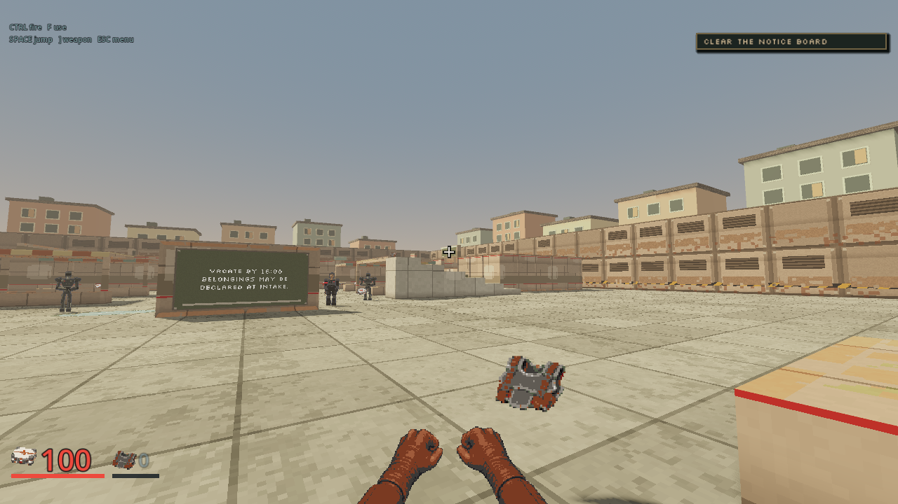
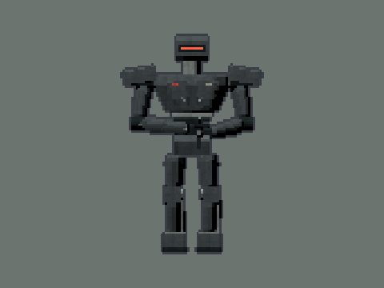
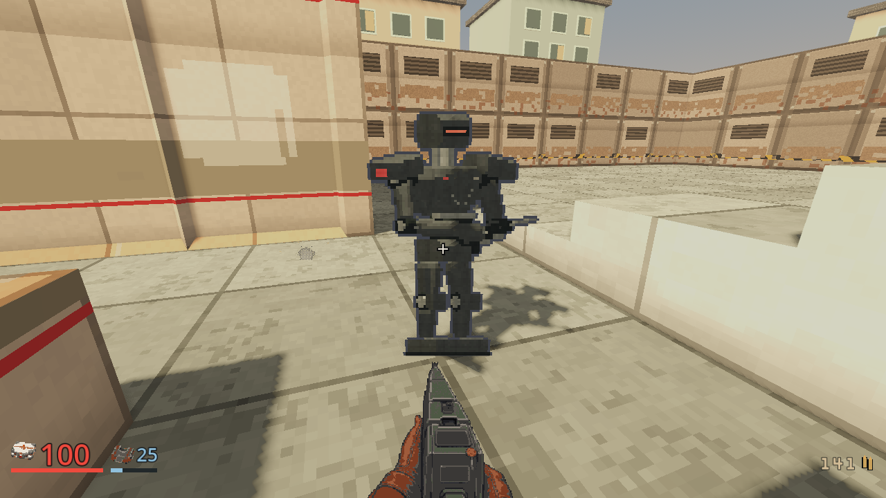

# Art production, 2026-10-03

**Status:** production increment shipped in [PR #337](https://github.com/blisspixel/fragr/pull/337)
and [v0.68.0](https://github.com/blisspixel/fragr/releases/tag/v0.68.0), with full art quality acceptance still
in flight.
The [art plan](../plans/art-excellence.md) owns acceptance, and the
[roadmap](../ROADMAP.md#full-build-order-2026-09-27) owns sequencing.

The [source library](../../client/art/production-20261003/README.md) contains
147 inspected production references and prepared-material provenance. Three
initial quality references and one Latch correction attempt bring the completed
request count to 151. The [spend record](../../client/art/production-20261003/spend.json)
preserves $93.365 in request estimates and the original $12.515 remaining
estimate from Nick's reported $105.88 starting balance. Nick subsequently
reported $14.42 remaining in the API dashboard, implying a $91.46 net balance
decrease. The aggregate balance is reconciled to his report; individual request
charges are not independently verified. All downloads completed, with no
unresolved reservations.

The verified API path supplies images. Original local mesh sources supply
the nine GLB exports: Sweeper, Latch, two Shotgun variants and five fixtures.
The [model sources](../../client/art/models/README.md) and hash manifests retain
their origin and engine export procedure. Six Sweeper rigid-part clips survive
engine import. These are mechanical tracks, not skeletal skinning.

Runtime uses the shaped Sweeper's paired directional normal atlas, Latch's
lean screen-faced chassis, 26 material bindings, bounded fixture housings,
wall recesses, ceiling coffers and lit moving shallow water. Other cast members
retain earlier sources. The Shotgun model and coherent pump strip remain
candidates pending framing and hand refinement. Broad lunar panels, fabric
requests and two water references missed their intended material use and remain
unselected. Latch's reference antenna remained incorrect; the live model has
the canonical anatomical left antenna.

## Inspected captures

M01's final nine-state ordinary-input tour shows the articulated facility
surfaces. M04's final 23-state market route and M06's 25-state lunar route completed
combat and departure using ordinary inputs. The 32-state standard tour was
also refreshed and inspected. Receipts live under
`.agents/art-excellence-research/qa-m01-final/`, `qa-m04-final/`, `qa-m06/` and
`qa-standard/`. The initial market route predates the final horizontal floor
contrast refinement shown below.

The pinned editor independently loaded the Windows export pack, without the
source project, and completed two Low Water states. This verifies runtime
resource availability and records the refined floor appearance. Native release
installation and graphical boot were checked separately. Release templates
disable script path overrides, so this is not a claim of native release tour
automation. Receipt: `.agents/art-excellence-research/package/`.

The fixture uses the same sprite material and normals as live play. Its actual
framebuffer differs when normals are disabled and when the light moves.
It passes on both OpenGL Compatibility and Vulkan Forward+ on this laptop.
The regular carbine retains a visibly shorter profile than the precision rifle.
The close-camera Latch fixture checks opacity, screen visibility, material
restoration and retained shadows. Receipts live under
`.agents/art-excellence-research/verification-production/`.

This close-range view comes from the final ordinary-input market route. It
shows the new body source under actual venue light. It does not establish
the remaining cast's final appearance.

## Recorded playthrough

Watch the [Low Water playthrough with game audio](https://github.com/blisspixel/fragr/releases/download/v0.68.0/fragr-low-water-playthrough-20261003.mp4).
The normal real-time client uses the existing ordinary human-role keyboard and
mouse route. The final log confirms `party_departed`, and the authoritative
participant record has status `complete`. The initial movie-mode attempt failed
at the Notary lesson and is retained as diagnostic history, not successful evidence.

| Recorded result | Value |
|---|---|
| Duration | 3 minutes 32 seconds |
| Video | 1280 x 720, H.264, 30 encoded frames per second |
| Audio | AAC stereo from the game Master bus |
| Route | `client/qa/m04-market.json`, 23 accepted states |
| Difficulty | Standard, campaign rules revision 3 |
| Player kills / deaths / secrets | 27 / 0 / 3 |
| Clinic | Secured, patients released |
| Renderer / host | OpenGL Compatibility, Windows, Radeon 780M |
| Captured source | `f4cf8b3abdaa9620349b1736148d02f77238108e`, identical tree to the v0.68.0 source |

The release also includes [PLAYTHROUGH.json](https://github.com/blisspixel/fragr/releases/download/v0.68.0/PLAYTHROUGH.json)
and [video checksums](https://github.com/blisspixel/fragr/releases/download/v0.68.0/PLAYTHROUGH-SHA256SUMS.txt).
The MP4 decoded without errors or sustained black segments. Its encoded frame
rate does not measure renderer performance. This automated route is separate
from fresh-player and fun acceptance. Local capture, audio and logs remain under
`.agents/art-playthrough-20261003/low-water-realtime/`.

## Regression checks

All [implementation PR checks](https://github.com/blisspixel/fragr/actions/runs/37149465221)
pass, including Windows and macOS client checks, multiplayer regressions,
coverage, containers, soak and plan-only infrastructure. The tagged release
includes Windows, Linux and macOS desktop ZIPs with installation checks and
`SHA256SUMS.txt`.
Delivery also requires [source-main CI](https://github.com/blisspixel/fragr/actions/runs/37151264695)
and [tagged package checks](https://github.com/blisspixel/fragr/actions/runs/37151297637).

Rust format, warning-denied workspace clippy, workspace tests, locked release
build, licenses/bans/sources, deterministic benchmark and unfiltered 93.80 percent
line coverage pass. The final whole-client check passes 218 scripts and 99
harnesses, requiring clean logs and each harness's PASS marker. The rendered
fixtures and package checks above provide separate graphics and export evidence.
Receipts: `.agents/art-excellence-research/verification-production/`.

## Limits

These captures and automated routes establish the behavior inspected on this
Windows and Radeon 780M host. Mission tours use OpenGL Compatibility; the
body-normal, water and Latch close-camera fixtures also pass on Vulkan Forward+.
They do not establish final
roster quality, a complete environmental kit, fresh-player mission acceptance,
cross-platform render performance or replay appeal. The plan records the quiet
intake frame measurements and calculated normal-atlas memory separately.
Remaining quality work includes the other character models, weapon presentation,
larger environmental landmarks and inhabited prop arrangements.
