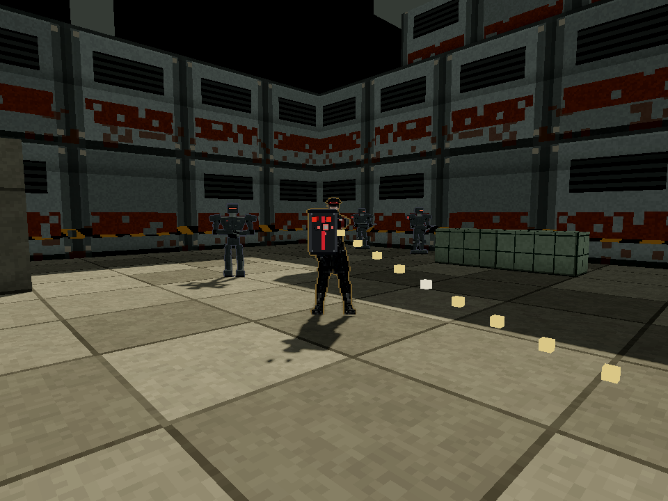

# Auditor source and registered hardware

2026-10-04, bounded source checkpoint. No new external generation calls or charges.
Main `a8611d04` plus the shared prepared-cast dependency `a48fd5b4` supplies
the existing skin, gait and pose seam. Full combined CI and release selection
remain separate gates.

The reviewed officer replaces the procedural body with a long black coat,
peaked red-band cap, angular face and compact back spool. The independent
held shield, glove emitter and cable use actual solved joints. The channel
wrist remains 1.35 m above the feet; shield sockets remain within 3.5 cm of
the live lamp registrations. Combat, damage, repair timing and map geometry
are unchanged. The prepared GLB retains the 24-joint skin and walking clip,
with embedded uncompressed 1K materials and nearest sampling.

Columns are idle, mid-stride walk, resolved-fire pose, repair channel and final
corpse. Rows are front, profile and back. This is an atlas inspection,
not a live combat recording.

| Gate | Evidence |
| --- | --- |
| Physical source | `test_auditor_source: PASS`, clean exit 0: skin, gait/root, grip/recoil/recovery, melee, first hit, raised wrist, lowered channel pistol, lamp sockets, cable outlet/coupling and corpse |
| Complete bake | `auditor_bake: PASS`, clean exit 0, all 55 poses in eight directions, 440 paired cells |
| Atlas | `test_auditor: PASS`, clean exit 0: source/PNG hashes, portable layout, all unclipped cells, matching normal alpha, shaped normals, exact feet, readable cap band, frontal plate and channel-only emitter at beam height |
| Moving-light diagnostic | `qa_auditor_lighting: PASS`, clean exit 0, 2,642 changed pixels with luminance difference above 0.035 when the point light moves |
| Actual source-role view | Separate four-state Standard proof, clean exit 0, original first Sweeper/no-death gate and 37 real repair ticks, live normal atlas bound, actual same-world channel frame; original full range clear remains open |

Both current human sources wear peaked caps. The obsolete comparison with a
shorter Clerk helmet becomes equal supported body height and at least eight
visible red-band pixels near the cap crown. Original feet, bounds, plate,
emitter and corpse assertions remain. The paired normal atlas uses the shared
normal shader. The two-line live normal-texture hook belongs to the parent
integration; it was copied temporarily for the combined world evidence and
is excluded from this source commit.

This isolated diagnostic uses the runtime shader, matching paired atlases and
a six-metre camera. It establishes surface response and silhouette readability,
not room-wide lighting or performance on other hardware. Renderer: pinned
4.7.2, Windows OpenGL 3.3 Compatibility, integrated Radeon 780M. Albedo SHA256
`ae7ee3bf8fa1f1bf4a8d398dc74b23e36224cb86bb710436e12f8625cc96ef9a`;
normal SHA256
`930038f90e46b8e1236c783ad13d18a0334f6aab8ec73e8f553a3729f6e826ef`.

The playing-distance officer is a real server actor. The player is alive at
30 HP; this still is after the channel ends, so it proves the held shield,
cap/coat and live lamps rather than the raised-hand channel pose. The camera
peek uses ordinary walking, not actor repositioning. The native SHA256 is
`a54543c362f3c89e2e2d9636d22dd1d5cda2dc320646c0ba52d239939c6bcd3f`.

Private diagnostics stay under `.agents/auditor-source-diagnostics-20261004`.
The original Standard Flechette trial failed on participant death during its
first fight. A discovered Scatter/held-cover trial passed the first named
Sweeper kill with no death, recorded 38 real channel ticks, then failed during
the unattended original 3.2-second watch. Explicit Assisted was refused before
play because this range has no mission. The subsequent ordinary peek/short
watch retained 40 real channel ticks and reached the shown live frame, then
failed the unchanged remaining-guard clear on participant death. A malformed
diagnostic waypoint was rejected before play and corrected; that rejected
launch is not acceptance evidence. All failures remain retained. No full range,
M08 completion, settled runtime corpse or whole-cast acceptance is claimed.

The final separate four-state source-role proof exits 0 with clean logs and
`qa_auditor_source: PASS`. It uses the original range map, normal supplies and
human input, Standard rules, the original first-Sweeper combat and no-death
gate, and a short covered watch. The player finishes alive at 75 HP, with
zero deaths. Two actual Scatter attacks defeat the first Sweeper at tick 385;
the shot-group recorder retains four resolved groups, including pellet groups
that hit the pillar. No inventory or outcome is granted.

The diagnostic observer shares the existing actual world. Its camera preserves
the live eye's bearing and tests finite 6, 5 and 4 m positions against the
authoritative solids. An earlier six-metre pillar refusal correctly failed
the observer gate and remains retained. This final frame used a clear 6 m
position `[7.1553, 1.55, 9.0128]`. The receipt records tick 386, the officer's
actual channel from ticks 386 to 430, live seated/channel cell 0, two remaining
repairs and 14 actual beam meshes. The actual disabled target is dead and
noncollidable. The beam continues beyond the image toward that target; this
frame does not show the whole link or a settled runtime corpse. No actor or
rule is altered. This source-role proof does not replace the original full
range clear or establish M08 completion.

Source `auditor_rig.gd` is normalized to LF. Git removed one trailing CR byte
after the first local bake, so the parent performed another actual renderer
bake on the committed source rather than editing a hash alone. Both PNG hashes
above are unchanged. The refreshed receipt now hashes the wrapper as
`e18536cb7feab5fbce7ee1b40546b52c8860b5541f96b1e6b2edd400e261c108`.
The parent owns that receipt and shared normal hook. The focused source and
refreshed atlas harnesses pass again with clean exit 0. Focused import and owned
script parse checks are clean; the parent owns the fresh full client checker
and integration CI.

Reproduce the bounded view by launching the existing native server with
`--bots 0 --map-file server/maps/test/custody-range.json` on an owned port,
setting `FRAGR_SERVER`, `FRAGR_QA_DIR` and an isolated `FRAGR_RUN_DIR`, then
running pinned Godot with `--path client --rendering-method gl_compatibility
--rendering-driver opengl3 --script res://scripts/qa_auditor_source.gd` and
`FRAGR_QA_MANIFEST=res://qa/auditor-source-role.json`. Keep the shared two-line
Auditor normal hook integrated. The diagnostic lighting script is
`res://scripts/qa_auditor_lighting.gd`, with its own isolated output directory.
