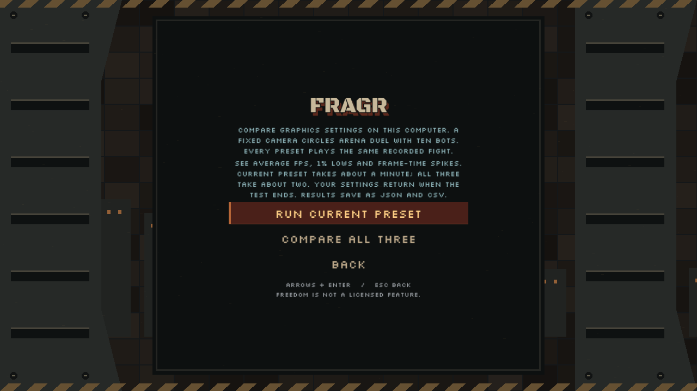
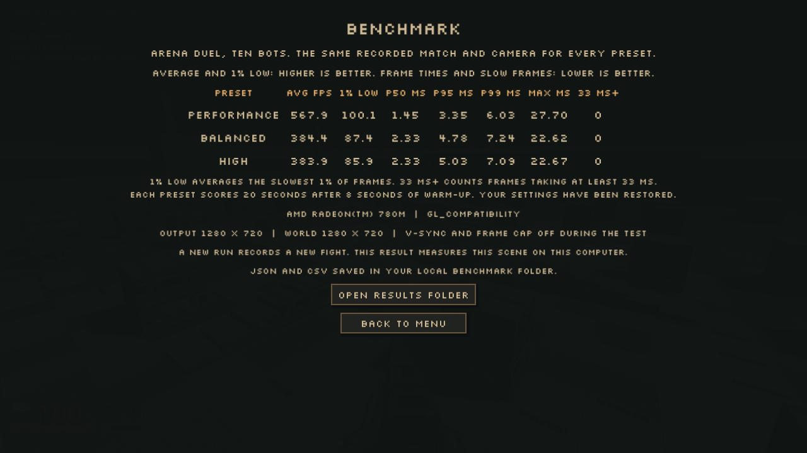

# In-game graphics comparison

The local implementation completed the ordinary menu route on October 7,
2026 (result timestamp `2026-10-07T07:24:37` UTC). The current-preset button
and all-three comparison share the existing owned local-host flow. This is
local evidence awaiting integration, not a broad hardware guarantee.

The comparison recorded 561 authoritative snapshots, ticks 26 through 586,
then stopped its native host. Performance, Balanced and High each consumed
those same snapshots with the same camera path. Eight seconds of warm-up
preceded twenty scored seconds for each preset. The retained recording hash
was `87bc301a5fa4f6fcef2863da98d690f5cdc63364e1903e6a565a7dfae3656400`.
The 2,202,611-byte recording remained in memory and was not exported.

## Measured scene

Windows, AMD Radeon 780M, compatibility renderer, `opengl3`, OpenGL
`3.3.0 Core Profile Context 26.5.2.260505`, Godot 4.7.2-stable. Output and
world resolution were both 1280 x 720. Vertical sync and the frame cap were
disabled during measurement. This is one ten-bot Arena Duel replay with
no other renderer or heavy CPU work running during the scored windows.

| Preset | Average FPS | 1% low FPS | p50 ms | p95 ms | p99 ms | Maximum ms | Frames >=33 ms |
|---|---:|---:|---:|---:|---:|---:|---:|
| Performance | 567.9 | 100.1 | 1.45 | 3.35 | 6.03 | 27.70 | 0 |
| Balanced | 384.4 | 87.4 | 2.33 | 4.78 | 7.24 | 22.62 | 0 |
| High | 383.9 | 85.9 | 2.33 | 5.03 | 7.09 | 22.67 | 0 |

The 1% low is the reciprocal of the mean duration of the slowest
`ceil(frame_count * 0.01)` frames. Percentiles use inclusive linear
interpolation. `RenderingServer.frame_post_draw` and the monotonic clock
measure whole rendered-frame cadence, not GPU execution time or monitor
refresh. These results do not establish 64-player client performance,
network latency, representative campaign performance, battery performance,
or performance on another computer or renderer. A new comparison records a
new fight; only the presets within one comparison share the same recording.

## Verification

`test_benchmark.gd` and `test_benchmark_comparison.gd` pass. The focused tests
cover invalid intervals, quantiles, exact slow-frame thresholds, the 101-frame
1% rounding boundary, bounded deep-copy playback, identical replay identity,
settings restoration on completion and scene exit, JSON and escaped CSV
writing, strict boot metadata, both menu actions, console input lock,
settings-change interruption, resizing between presets and retained-state
warmup-card removal. Merged frontend and server-book checks also pass.

The actual `qa_benchmark.gd` run passed: all three presets replayed all 561
snapshots, JSON and CSV were written, the settings file remained byte-for-byte
unchanged, Balanced and the saved 45 FPS cap were restored, and the owned
host was idle before scoring ended. The pointer stayed visible throughout.
The console could not open, each exported row recorded uncapped settings,
and authoritative Active state cleared the warmup card without a replayed
RoundStart notice. The native release used for capture had SHA-256
`d54b07905e1ad5dedc18e37c3a11e7c79545b7438f4d789f4eddbce141414e2e`.

Commands from the repository root, with `GODOT_BIN` pointing to the pinned
local executable:

```powershell
& $env:GODOT_BIN --headless --path client --script res://scripts/test_benchmark.gd
& $env:GODOT_BIN --headless --path client --script res://scripts/test_benchmark_comparison.gd
$env:FRAGR_QA_DIR = "$PWD/.agents/benchmark-comparison-final-20261007"
& $env:GODOT_BIN --path client --rendering-method gl_compatibility --script res://scripts/qa_benchmark.gd
```

Private local JSON, CSV and the harness report live under the isolated
directory named above. The screenshots below come from that completed
menu-to-results run.





Cost: $0. No external service, raw match archive or credentials were used.
