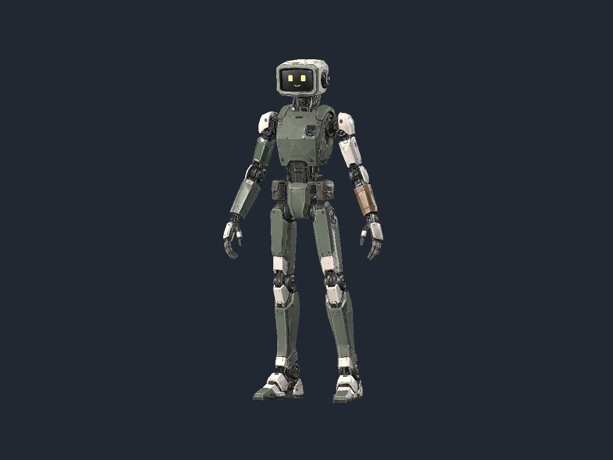
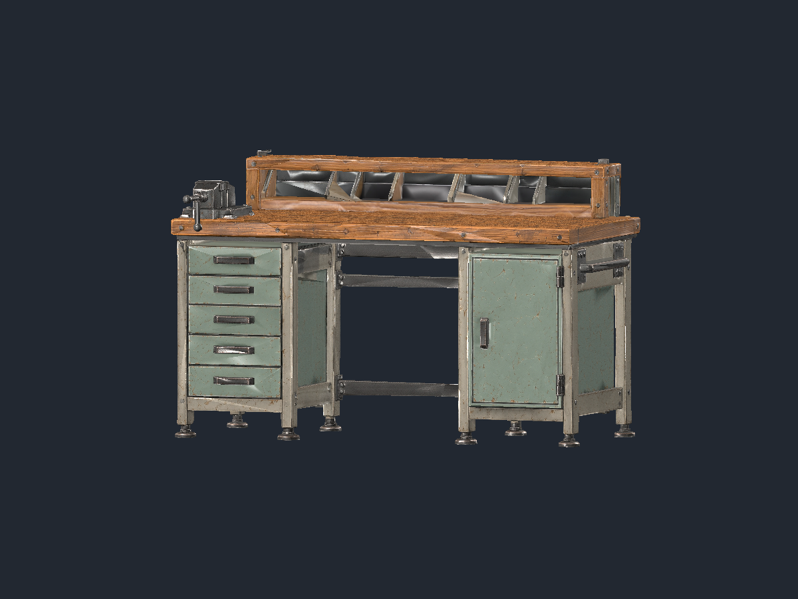

# Civilian free-agent and repair-workbench first sources

Status: **source inspection passed**, 2026-10-04. Both bounded first stages
completed and all eight raw side views were inspected. Local skin/mechanism
preparation, compact paint and ordinary played selection remain open.

| Source | Actual triangles | Actual vertices | Included credits |
|---|---:|---:|---:|
| Distinct civilian free agent | 12,462 | 20,849 | 35 |
| Repair workbench | 10,567 | 14,872 | 35 |

Each requested textured 7.1 Ultra geometry at `2k`, `4k` textures and a 12,000
triangle target. The table records measured output rather than that target.
Both are one fixed mesh/material, with 4K paint/normal/metallic/roughness maps
and no bones or animation clips. No humanoid rig was requested.

The [bounded plan](../plans/free-agent-workbench-sources-20261004.md) owns the
reference choices. Metadata normalization changed no decoded pixels. Raw files
and private URLs stay in the single ignored account ledger. The
[sanitized receipt](../screenshots/civilian-first-sources-20261004/receipt.json)
records exact task IDs, reference/source fingerprints, actual dimensions,
rendering and consumption.

The civilian worker retains ordinary lean proportions, screen expression,
bone/olive panels and one rust replacement forearm. It has no antenna, military
uniform, weapon or named cast identity. Actual shoulders, knees, hips and feet
are visible from every side; skin weighting, rigid panel behavior, fingers,
travel gait, gestures and expression presentation still need local proof.

The bench has a supported timber work surface, cabinet/drawer housings, knee
space, bolted vise and rear tool rail. Electronics, tools and loose possessions
remain separate authored objects. The eight visible feet reflect both cabinet
supports, not an extra floor slab. Generated drawer and vise seams are fixed
source geometry; they do not establish independently usable mechanisms.

Actual Compatibility rendering imported both raw sources, measured their
geometry/materials and captured front, rear and both sides. All eight full-size
views were inspected. The owned renderer exited 0, logged no errors and retired.
Fine photographic wear and uneven lighting remain unsuitable for final art;
compact local painted material roles must win a game-resolution comparison.

Both stage responses report 35 consumed credits, totaling **70 actual included
credits**. Fresh free checks confirmed each allowance before submission and
reconciled completion: **2,305 available**, **15 uncertain credits held**,
**2,290 usable**. Tracked consumption is now **765 credits**, with **440 used**
and **460 remaining** inside the existing 900-credit first allocation. The
separate historical 30-credit account decrease remains unassigned. No cash,
renewal, pack, top-up, overage or further paid stage was enabled.

All twelve first-source slots now have candidates. This is neither twelve
accepted game assets nor complete coverage of the 190-brief catalog. Preserve
existing selected presentation until each replacement passes local preparation,
actual contacts and state changes, ordinary played comparison, complete client
and desktop checks.
