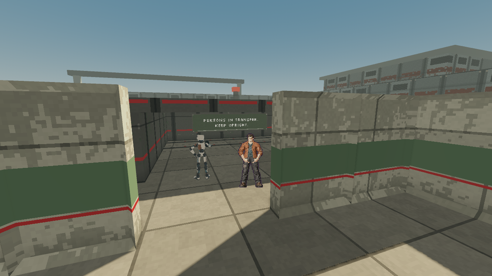
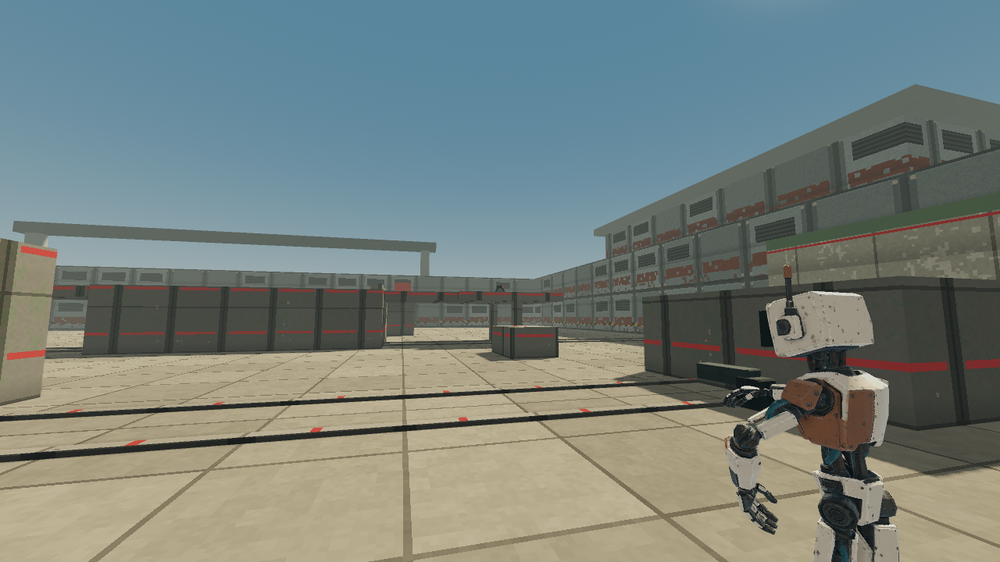
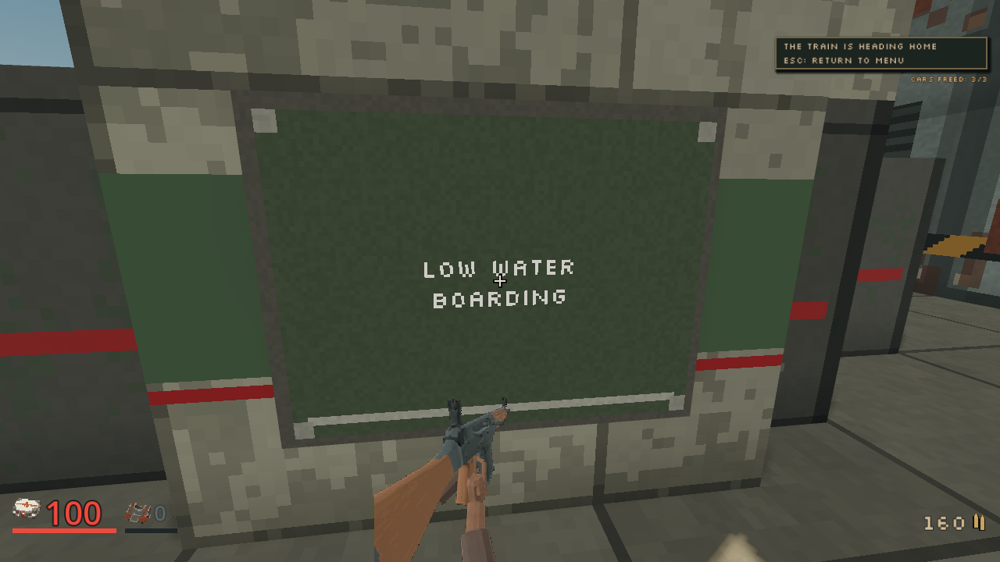

# Supported companion platform yielding, 2026-10-04

Status: implemented and locally verified, combined integration gates pending.
Frozen `2a601c66` passes all eight exact-head
[CI jobs](https://github.com/blisspixel/fragr/actions/runs/37258304204) and all
three [desktop package checks](https://github.com/blisspixel/fragr/actions/runs/37258324627).
The [combined integration](../plans/crew-companion-integration.md) retains those
historical receipts while checking the crew and companion composition separately.
Spend: $0. Source: `481c4aec`, refreshed onto main `d1d13562` at `83bb388b`.
The first publication refresh merges main `cc8efcc8` normally. Server, protocol,
maps, selected client runtime, all harnesses and checker bytes match the immutable
tested runtime at that checkpoint. Only parked world-prop sources, ignored
references and documentation are new. Focused imports, M03 validation and loading checks pass.
The [refresh receipt](../screenshots/companion-platform-yield-20261004/refresh-receipt.json)
binds the exact native and records the source comparison.

The final normal refresh onto restored-Rifle main `6c4df5b3` retains its complete
client tree exactly. Authoritative source, protocol and maps remain byte-identical
to tested source `83bb388b`, binding the same private native. The selected Rifle
presentation changes with main; historical M03 screenshots retain the earlier
framing and are not a fresh playthrough of the restored art. Fresh headless import,
Rifle source, weapon pickup, M03 mission and loading harnesses all pass with clean
exit 0. The [restoration refresh receipt](../screenshots/companion-platform-yield-20261004/restore-refresh-receipt.json)
distinguishes those facts from the immutable full checker and first publication's
eight CI jobs and three desktop-package passes. Exact final CI and package gates
are rerun on the refreshed head before merge.

The first stand-off checkpoint completed M03, but a matching candidate-atlas
comparison then stopped after eighteen states on the narrow raised signal-box
deck. This was a second real contact trap. The initial successful route does
not prove every supported case works. Its source, checker, native and complete
receipt remain historical evidence, and the candidate remains unselected.

## Reproduction and correction

Delivered tick 3171 put the participant at actual feet
`[18.015797, 3.5, 18.246605]` and Latch at
`[18.906883, 3.5, 17.79277]`. Ordinary forward input was sent and acknowledged
at 5 m/s, while accepted velocity remained zero. Both collidable bodies retained
0.5 m radii and 1.8 m heights. Latch's centre was about 0.457 m from the original
`[18.5, 3.5, 18]` target, so the one-metre combined body clearance covered the
whole 0.5 m arrival disk. This was not a deadline-only miss. The failed
[delivered facts](../screenshots/companion-platform-yield-20261004/platform-failure-receipt.json)
retain the actual map, contacts, ACKs, input and finite participant record.

The recorded GameState fixture preserves that raised map and all six released
captives. Holding Latch reproduces the blockage for forty ordinary ticks.
Removing only that body reaches the original target in four ticks. The first
stand-off implementation still fails the real Session fixture after eighty
ticks because a full one-metre retreat leaves the narrow support.

The bounded fallback in `mission/m02/companion/formation.rs` tries supported
half-metre, then quarter-metre retreats only when the existing formation goal
is unavailable. Eight fixed ordered directions per length retain deterministic
selection. Endpoints need the same combined body clearance plus 0.1 m and must
increase distance from the participant. Two or one ordinary 20 Hz steps are
forecast through the actual movement and contact solver, rejecting falls,
unsupported floors, blocked progress and overlap. The emitted action is the
existing forward/yaw input, with stale route memory cleared by Session.

This adds at most twenty-four short forecast steps after at most thirty-two
existing long-retreat steps. It adds no topology search or unbounded work.
Actual collisions and ordinary speed remain authoritative. With no supported
retreat the companion holds. The exact M02 lateral slot, finite twelve Tack
shots, forty-tick cooldown, threat filters and solo lesson exclusions remain.
No map, supplies, save shape, protocol, movement mirror, difficulty, timing or
campaign rules revision changes. Content identities and save compatibility
are unchanged. Changed following positions can change existing support-ray
opportunities without changing shot rules.

## Source checks

The corrected real Session fixture reaches the same target twice with Latch
present, supported and collidable. All thirteen focused companion tests pass,
including the original north-captive wedge, deterministic quarter-step-only
support, blocked-retreat refusal, firing/idle/reset and finite support rules.
The red fixture and failed candidate logs remain retained separately.

On stable refreshed source `83bb388b`, formatting, warning-denied workspace
Clippy, complete workspace tests, release build and benchmark exit zero.
The server library passes 934 tests with three existing ignored tests; the
workspace passes 1,480 tests. This includes M02's exact second-attempt rescue
and the existing relevant M03/M04/M06/M07 suites. The malformed local parent
control test intentionally produces its child-process error while its owning
assertion passes; no failed workspace result is suppressed.

The unique private native SHA-256 is
`525fa9bde3e5fd99ac00ad49d34b7e354437e54b8bb634256faeaa437a7d0fb0`.
The sixteen-bot, 1,200-tick seed-42 benchmark passes assertions and deterministic
trace checks, with 0.786431 ms p99. Its scope is Arena Duel session and encoding,
not a campaign or renderer performance claim. Prior native `7e348dc7` remains
unchanged beside its historical client evidence.

## Current ordinary route

The selected-art route on the refreshed source completes all twenty-one states,
eighty-eight actual walking arrivals and twenty-two named guard kills. The
first attempt completes with zero deaths or dry triggers, two secrets and 142
resolved Rifle attacks. All three cars are released, the mast reaches zero HP,
the train is secured and the party actually departs. Final HUD values are
100 HP and zero armor; finite inventory ends at 160 bullets, forty shells,
zero cells and zero grenades. Two actual Tack support shots remain within the
unchanged finite companion allowance. These real timing and supply outcomes
are recorded, not claimed as a combat improvement.

The original north target is reached at tick 2163 with actual feet
`[-16.4905, 0, 17.91579]`. The original raised target is reached at tick 2952
with actual feet `[18.478298, 3.5, 18.007591]`; Latch stands at
`[19.47105, 3.5, 17.018152]`, alive and collidable. Both receipts retain the
preceding 120 delivered ticks, all seventy-four solids, map geometry version 2,
ordinary input and ACKs. Captives remain present. Snapshot positions include
the 1.5 m eye offset; contact bodies retain feet. The
[public route receipt](../screenshots/companion-platform-yield-20261004/route-receipt.json)
includes the complete finite outcomes and both contact segments.

The private QA route retains the four explicitly documented ordinary bypasses
and two restricted existing combat-travel opt-ins from the previous diagnosis.
Every original state, guard, arrival, phase, supply and departure gate remains
required. This is not the unchanged canonical waypoint list. Its immutable
contract removes exactly those six declared changes before checking the
original semantic route hash. The route SHA-256 remains
`8271192cdb67c7fa1a0d16b8077edfa486004fadc635d1467f268f6441fba390`.
The extra platform receipt is a read-only observer, not a gameplay control.
Public JSON is compacted without changing any nested facts, map or contact
entries. All 120-tick sections and original raw hashes are retained; a
parsed before/after semantic equality check passes for every formatted file.

Godot 4.7.2-stable Compatibility rendering runs at 1280 by 720 on the inspected
Radeon 780M. Renderer PID 11176 exits zero with clean script/resource logs;
it and owned server PID 19992 are retired. Full-size inspection confirms
released inhabitants, the following companion after final combat and the
actual departure HUD. Repeated wall and floor surfaces and the simple red
signal-box volume remain venue art debt outside this steering correction.

The immutable full client checker on source `83bb388b` and this exact native
exits zero, parses all 260 scripts and passes all 124 harnesses. Logs contain
the aggregate PASS and no script/runtime errors. The unchanged verifier's ten
fault-injection scenarios also pass on the retained historical checkpoint,
including failed exits, error text, missing PASS and long output.

The first current candidate comparison passes both original contact segments
but fails the unchanged final kill gate after eighteen states. One Sweeper
remains behind the train, out of sight, after all four western search points
are exhausted. Actual inputs are idle, health is 100, finite bullets remain
189 and no dry trigger occurs. This is separate search coverage debt, not a
model combat change. A separately reviewed matched ordinary search-return pair
later completes all original states and guards with two declared west-return
search points. That art evidence remains a separate checkpoint; the failed
receipt is retained and no candidate art is selected by this source correction.

Unfiltered coverage, exact integration CI and desktop package acceptance
remain parent gates. Prepared Jammer requires its own matching complete route
and inspected presentation before selection. No runtime art promotion or
finished-environment claim is made here.
