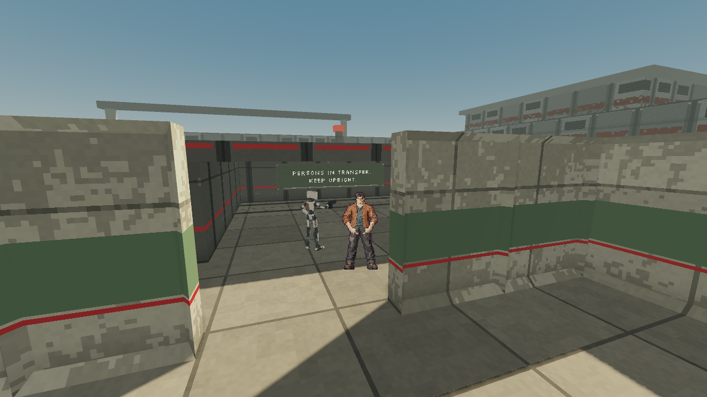
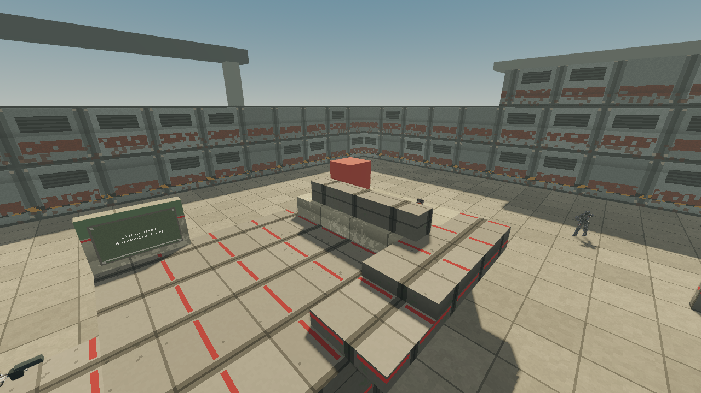
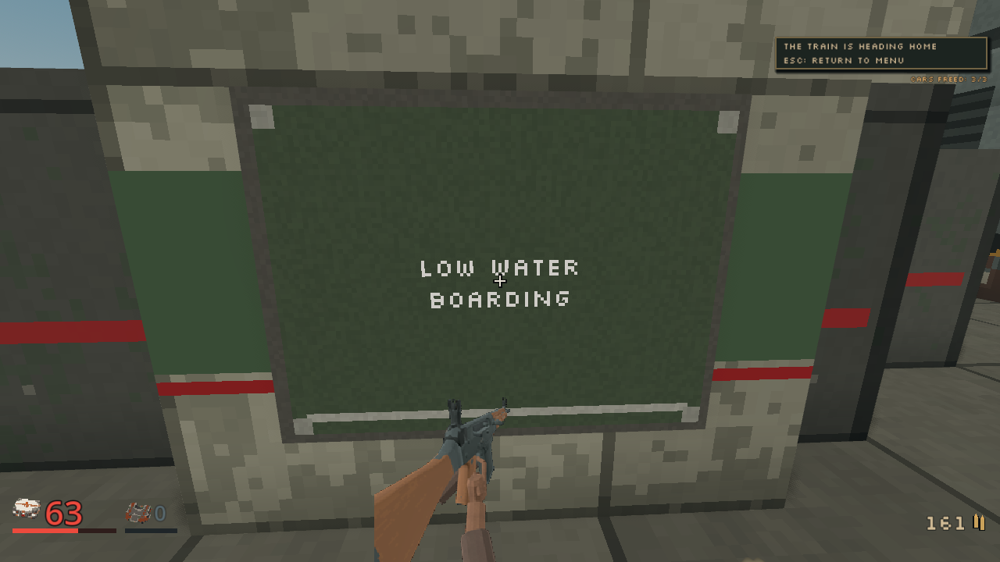

# Companion stand-off, 2026-10-04

Status: implemented and locally verified, integration gates pending. Spend: $0.
Source: `bc6a0376` then `d0bf6be9`, based on main `2399c00d`.

The M03 northbound exit produced an actual collision wedge with two released
roof captives and Latch beside the participant. The previous diagnosis retains
all eight failed partial routes. At tick 2362, the participant held 100 HP and
100 armor, sent normal forward input, and received an applied 5 m/s movement
ACK accepting zero velocity. A stationary-contact mirror retained every
delivered solid and body; removing only Latch opened the original goal in 41
ticks. Fixed-direction stationary probes are not proof that every possible
human sequence is trapped.

## Source and authority

`mission/m02/companion/formation.rs` selects clear supported stand-off positions
for the existing shared M03/M04/M06/M07 companion caller. A companion within
1.6 m can yield one metre through at most eight ordered directions. Each close
candidate forecasts at most four ordinary quarter-metre steps with the actual
static world and nearby contact bodies. Unsupported floors, walls, occupied
endpoints and blocked movement are refused. With no safe retreat, it holds.
There is no teleport or change to collision eligibility.

The existing Session Navigator retains its rotating four-search-per-tick
budget and cached longer routes. No new graph search occurs in formation
selection. M02 keeps its exact authored west-forward slot and 0.65 m tolerance
when supported and clear. Finite twelve-shot support, forty-tick cooldown,
range, threat filters, solo lessons and all enemy attack rules are unchanged.
Idle and firing have no stale formation goal. M05/M08/M09 retain their existing
behavior because they do not enter this shared support-progress caller.

No map bytes, protocol, save shape, movement mirror, campaign rules revision,
supplies, geometry, mission gates or selected art changed. Content identities
remain unchanged; no save migration is introduced. Following positions and
therefore opportunities for existing support rays can change, without changing
the underlying combat rules.

## Verification and retained failure

The real GameState negative control reproduces the recorded old close-follow
wedge for forty ticks. Two deterministic real Session runs then reach the
unchanged `[-16.5, 0, 18]` goal within one hundred ticks, retaining both released
roof captives, ordinary walking, support height and participant health.
Raised-deck, corner, no-retreat, distant-slot, held formation and
idle/no-live-leader/briefing/release tests pass. Existing support-fire tests now
also assert no stale movement goal while firing.

The first full workspace attempt failed the M02 retry. It had replaced the
existing lateral offset with a normalized radius and looser hold. Actual facts
showed a second-attempt death after nineteen guards, then a third-attempt
departure. The original twenty-four-guard and second-attempt assertions were
retained. Restoring the exact M02 slot corrected this regression. The first
failed logs remain separately retained under `.agents/checks-first-failed`.

The stable corrected source passes all thirty-nine focused M02 tests,
including ordinary human/agent full departure, Severe departure and the
twenty-four-guard second attempt. Formatting, warning-denied workspace Clippy
and the complete workspace tests exit zero. The server library passes 917
tests with three existing ignored tests; the complete workspace passes 1,463
tests. Relevant M03/M04/M06/M07 suites are included.

The owned release native SHA-256 is
`7e348dc7ec1ece5604fc0f76f35ae82d28d500b7900e64e0f76a6d7283b71c63`.
Its sixteen-bot, 1,200-tick seed-42 benchmark passes assertions, reports a
0.655 ms p99 and no over-budget ticks, and retains a deterministic trace.
That benchmark measures the existing Arena Duel session and encoding scope;
it is not a separate campaign or hardware renderer benchmark.

## Full ordinary M03 route

The first rendered run on the corrected source completes all twenty-one states
and all eighty-eight actual walking arrivals. Every original named guard is
confirmed dead, twenty-two in total. The delivered record shows a completed
first attempt with zero deaths and dry triggers, two secrets and 136 resolved
participant Rifle attacks. All three cars are released, the mast reaches zero
HP, the train is secured and the party actually departs. The final HUD shows
63 HP and zero armor. Finite inventory ends at 161 bullets, forty shells, zero
cells and zero grenades. Supply claims and ordinary ammo changes are retained
per state in the [public receipt](../screenshots/companion-stand-off-20261004/route-receipt.json).

The north exit reaches the original `[-16.5, 0, 18]` goal at delivered tick
2165, with actual feet `[-16.490284, 0, 17.91375]`, 100 HP and eighty armor.
The receipt retains 120 delivered ticks, real ACK movement, sent inputs,
MapInfo geometry version 2 and all seventy-four solids. Both roof captives
remain at `[-16.5, 0, 7]` and `[-16.5, 0, 9]` with their half-metre collision
bodies. Latch remains alive, following and collidable. No body removal or
teleport was used in the rendered route. Snapshot participant and companion
`y` values include their 1.5 m eye offset; contact bodies record actual feet.

The QA route contains four explicitly retained ordinary bypass points and two
restricted existing combat-travel opt-ins. The bypasses are the platform
`[-17, 0, -34.5]`, siding exit `[-14.5, 0, -11.5]` and east roof-bay points
`[-11.5, 0, 5.5]` and `[-11.5, 0, 8]`. Existing combat-travel is enabled only
on the exposed roof-ground flank and siding-guard segments. Every original
goal, encounter, phase, supply and departure gate remains required. This is
not an unchanged waypoint list. The immutable QA contract in the separate
travel diagnosis checks the original route after removing exactly those
declared changes. Its route SHA-256 is
`8271192cdb67c7fa1a0d16b8077edfa486004fadc635d1467f268f6441fba390`.

The private client uses current selected art, the shared shadow repair and a
read-only delivered-contact observer with isolated records. No prepared
Jammer candidate is selected. Godot 4.7.2-stable runs Compatibility rendering
at 1280 by 720 on the inspected Radeon 780M. Renderer PID 25160 exits zero;
it and owned server PID 9428 are retired. Client and server logs are clean of
script errors and resource leaks. Their hashes and all source hashes are
retained in the receipt; raw diagnostics remain under
`.agents/route/stand-off-1` in the owned worktree.

Full-size inspection confirms the released roof-car inhabitants, the fallen
mast and the actual departure HUD. The mast-fight camera's authored upward
composition is not a useful companion showcase; it is not substituted for
the numeric north-exit proof. The venue's existing repeated construction
surfaces and selected civilian art are outside this steering change.

## Remaining gates

Full integration CI, unfiltered coverage and desktop package acceptance remain
root-owned gates. No publication or runtime art promotion is claimed here.
