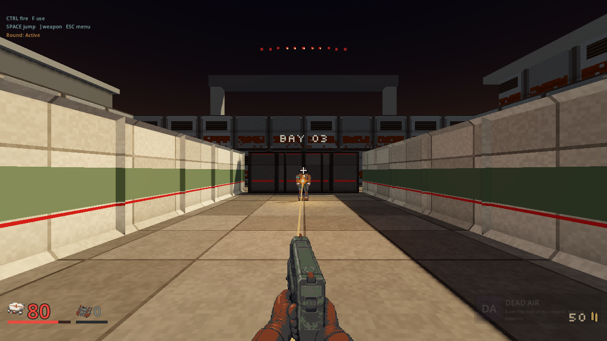
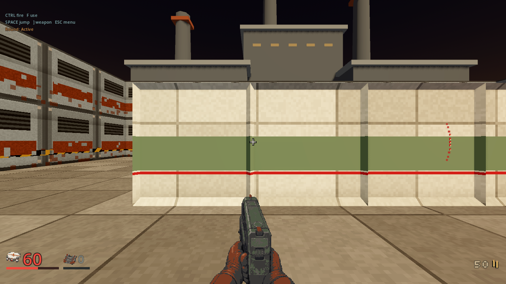
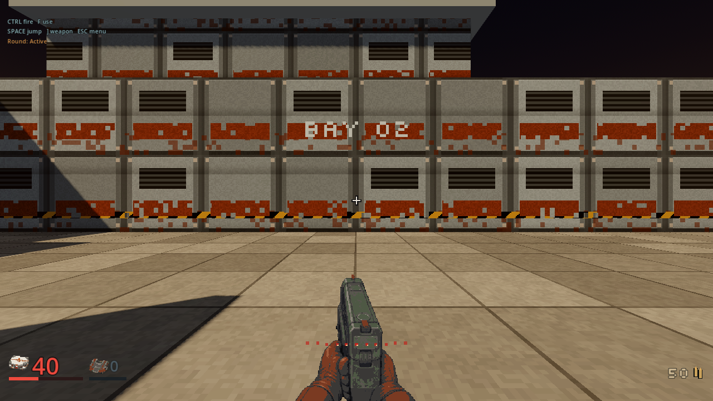
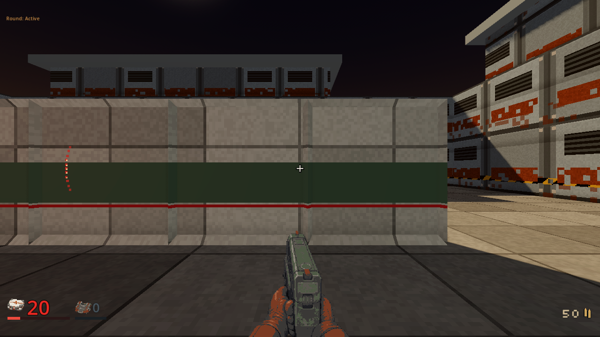
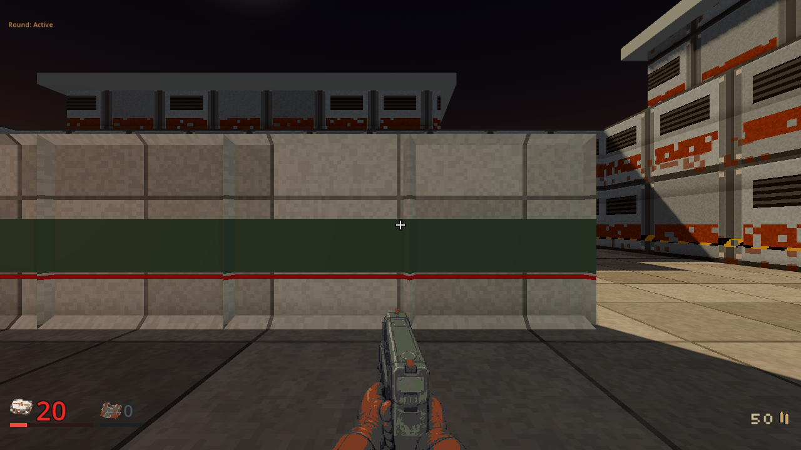

# Incoming combat feedback, 2026-10-04

The first bounded directional-feedback slice is implemented and inspected in
a diagnostic range. It adds short spatial pass-by accents and fading pixel
damage bearings using committed server rays. The wider
[directional audio plan](../plans/directional-combat-audio.md) remains in flight.

## Source and boundaries

The presenter checkpoint is `d4e4fa01`, based on main `a8611d04`.
The inspected combined client uses the GameManager hooks from `083671bb`;
its exact source SHA256 is
`c5b5f65c0109bace7804606ae86770621264ea718448b16a24df05873d3b2267`.
The unchanged combined native's SHA256 is
`9ff670164cd9544f7346dbda9076e12a94332ecea7f8f6d66631231c82805c90`.
This was a local source combination, not a release or main-branch acceptance.

Damage comes from a positive committed `ShotResult` for the local human target,
including armor damage and a final hit before death. Zero damage, someone
else's hit, a missing trace and an HP change alone cannot produce a bearing.
The resolved source survives a moved or dead shooter. The overlay remembers
that direction and reprojects it as the view turns; it does not track a pawn.

Pass-by points remain inside the finite resolved segment and 2 m radius, away
from the muzzle and before the stopped endpoint. A closest-point connector
blocked by validated authoritative solids suppresses the cue. Scatter shares
one cue per shooter; crossfire uses at most two cues per eligible snapshot,
a three-tick global cadence, four voices and 32 visibility tests per snapshot.
Voice ownership and bearings clear on map, role and connection resets. The
combined manager also suppresses feedback behind the loading card and story,
briefing and results presentations.

## Actual resolved-shot proof

`qa_incoming_combat_feedback.gd` used two ordinary human clients in a private,
strictly loaded test range. One supplied Tack fired through the ordinary action
channel while the local camera turned to each bearing. No HP, actor position or
shot result was changed in the client. The diagnostic geometry is not a
campaign map or an environment-art acceptance.

| View | Server tick | HP before/after | New bearing | New pass-by cue |
|---|---:|---|---:|---:|
| Front | 148 | 100 / 80 | 1 | 0 |
| Right | 177 | 80 / 60 | 1 | 0 |
| Back | 205 | 60 / 40 | 1 | 0 |
| Left | 233 | 40 / 20 | 1 | 0 |
| Near miss | 258 | 20 / 20 | 0 | 1 |

The near miss had `hit=false`, `damage=0` and a resolved range trace. Its spatial
cue started at `[-5.843285, 1.361684, 1.341349]`, the closest point on that trace.
The final actual manager connection-reset seam cleared the counters and tick,
hid the indicator and stopped every spatial voice. The manifest records
`standalone_attachment=false` for all five samples.

The corrected route exited 0 with its own PASS marker and clean error/leak
logs. Automation isolated settings and records, never captured the desktop
pointer, and cleaned up only its owned server. Initial frames obscured by the
loading card were retained as diagnostics and excluded from acceptance; the
corrected route waits for ordinary card dismissal before firing.

## Inspected rendering

Godot 4.7.2-stable, Windows, OpenGL compatibility, AMD Radeon 780M, 1280 x 720.
The arcs are correctly placed, leave the crosshair clear, and fit the pixel HUD.
The cleared view has no retained indicator. These frames establish this view
and hardware path, not other platforms or renderer performance.

## Automated checks and remaining gates

The focused harness passed closest approach, radius/endpoints, cardinal and
diagonal bearings under yaw and pitch, actual target/zero-damage ownership,
dead-shooter and final-death facts, malformed boundaries, real pellet arrays,
cadence/pooling, walls/raised slabs, bounded cover work, fade and teardown.
It also checks mono 48 kHz lossless one-shots, bounded non-silent energy, peak
and DC limits, tapered silent endpoints and distinct source data. Re-running
the offline bake reproduced all three committed WAVs byte for byte.

The full headless sweep parsed 235 scripts and ran 109 harnesses. It initially
passed 104 harnesses and failed the five M04 through M08 local-launch checks
because its reused historical native was older than the checked source. Each
of those five then exited 0, produced its own PASS and passed the same uppercase
error scan with the verified current-main native
`a54543c362f3c89e2e2d9636d22dd1d5cda2dc320646c0ba52d239939c6bcd3f`
beside a private copy of the pinned engine. No historical binary was overwritten.
The later QA script also passed its own parse check and actual rendered route.
Combined CI and final source integration remain open gates.

No new paid calls or runtime dependencies were introduced. Candidate accents
still need headphone and speaker listening acceptance. Directional impact
thuds, broader occlusion/low-pass, venue reverb, vacuum treatment and HRTF
evaluation remain open. Unit tests and screenshots do not prove those goals.
