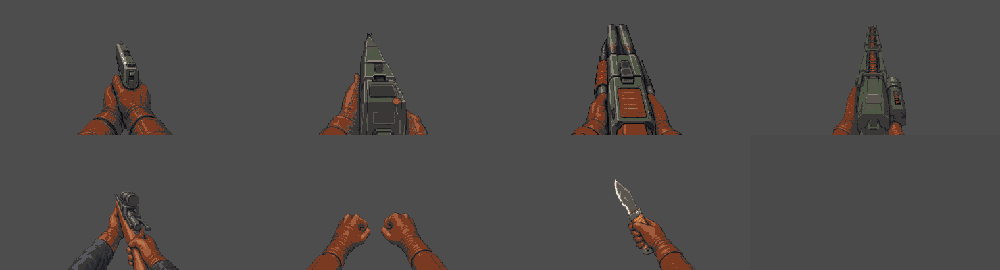
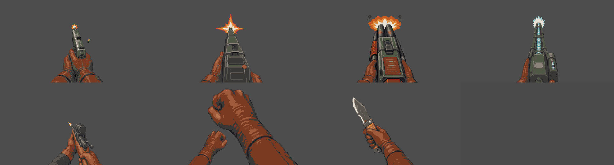
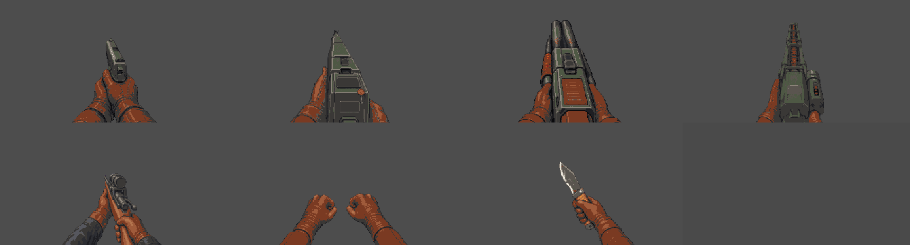
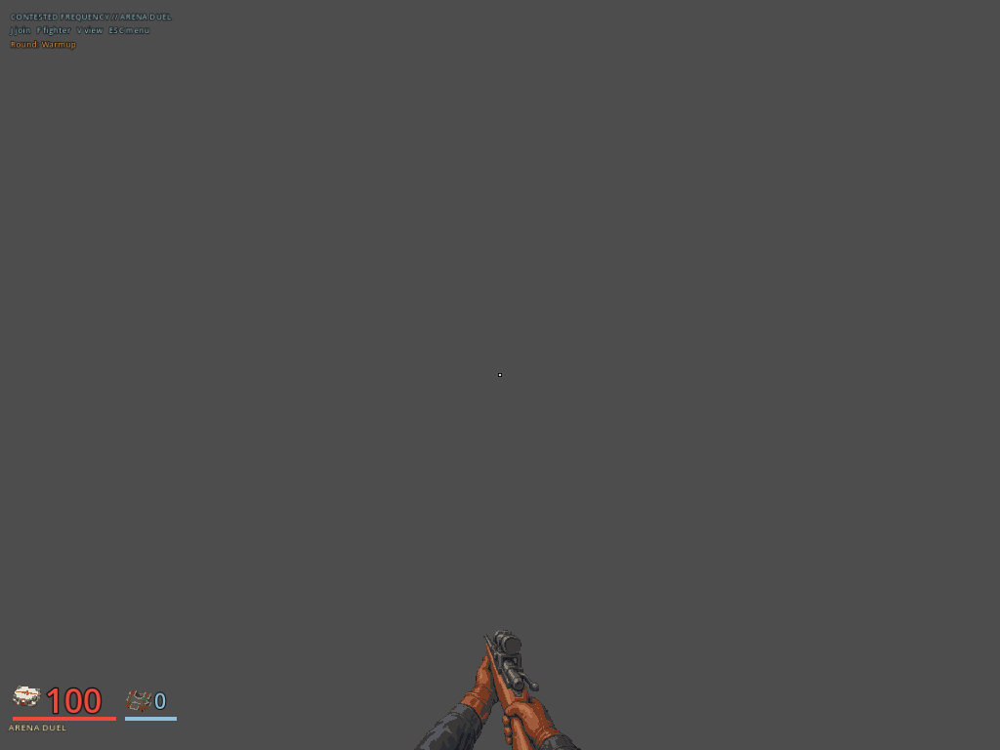

# Weapon hand and provisional identity composition

Date: 2026-10-05. Status: locally checked, public integration gates open.

The local successor normally composes Sniper `3e7b0e4e`, Shiv `f04650cd` and
Tern berth `a6f28d35` on the actual accepted main `0b03dc2c`. The same Tern
identity correction is added to the ship presenter at `278a8858`. No server,
map, QA route, capability, save shape, weapon timing or ammunition changes.
The only shared test conflict retains both Shiv actual-scale assertions and
Sniper's complete aspect/motion/fire checks. All earlier unsupported-gun,
scope, Fists, throws, bob and known-gun behavior assertions remain intact.

The old M10 conditional fails exactly the new Tern body assertions with
unknown history and recorded arrivals. The corrected actual figures use the
canonical synthetic texture for Tern and Splice, retaining human textures
for Edda and both berth crew. Existing eligibility, feet, unknown transit,
retirement and mission validation remain passing. These are provisional
body fallbacks, not finished named models or historical rescue evidence.

Cold import and seven focused harnesses pass, numeric zero and error-clean:
M09, M10, Sniper source, complete viewmodel, ranged/scope tell, weapon pickup
and resolved shot effects. One private launcher mistyped the pickup harness
name and stopped after five passes; that launcher failure is retained and
the actual registered `test_weapon_pickup` is then run successfully.

Frozen source `988ef19045f1f1c75dc93a5b3d6f4bfeb27af5c3` then passes the complete
client checker: 271 parsed scripts, all 129 harnesses, numeric exit zero,
clean errors and `Godot checks: PASS`. Its native Rust tree, maps and QA files
equal accepted main. The reused private optimized server SHA256 is
`0832b465cc7fa5db7b68a3e423dea51ca789be0aff407d81254bdc7e7f4a21a7`.
No Rust build, paid request, public branch or hardware renderer is started
by this composition pass. Private logs and exact source binding are in
`.agents/hand-integration-*`; the full client log SHA256 is
`c5e6ae4301bbcce01f6c0729f14bfd5d0c9b098c00bdb76d2731c80692df8018`.

The parent's documentation-only roadmap update is composed after the checker
exits. Checked runtime bytes remain identical. The original continuity audit
keeps its tables and hashes below a dated follow-up, distinguishing current
Pistol/home main status from these local successor corrections.

The earlier selected source receipts remain independently useful:
[Sniper ordinary discovery and combat](sniper-hand-continuity-20261005.md),
[Shiv actual HUD comparison](../plans/shiv-hand-scale-20261005.md), and
[both Tern presenters](../plans/tern-body-identity-20261005.md).
Combined hardware HUD inspection passes on documentation head `d5098c1c`,
with runtime bytes exactly matching checked `988ef190`. The actual standalone
HUD produces 63 frames: seven weapons, rest/use/bob and three aspect ratios.
Renderer 30964 exits zero with clean errors and is retired. No server or pointer
capture is used. The leather/cuff family and shared resting scale read coherently;
Fists retain their deliberate 2.1 punch extension. This fixture does not measure
gameplay, performance or human feel.

The [five-image receipt](../screenshots/hand-identity-integration-20261005/receipt.json)
binds byte-identical copies to the private 63-frame hash manifest and exact
fixture. The comparison sheets contain unscaled 480 by 260 crops from actual
1280 by 720 frames, with Pistol, Rifle, Shotgun and Railgun above Sniper, Fists
and Shiv. The other two images are literal full frames. The earlier private
Fists sample was near the start instead of peak; a first sheet conversion
reported RGB/RGBA errors despite exit zero. Both failures remain retained and
are not PASS. The corrected v2 samples the separate Fists timer and its sheet
conversion exits zero with clean errors.

Fresh main `0b03dc2c` passes all eight CI jobs in run `37343037510` before
this successor is published. Exact final-head CI, all three exported
desktop/install checks and main promotion remain open. Broader hand poses,
named casting, ship art and fresh-player pacing are not closed by this check.

## Integration follow-up, October 5

[PR #370](https://github.com/blisspixel/fragr/pull/370) is merged to main
`f1e36315`, retaining the exact reviewed tree
`bcdd0915650d609c04d271dc5ce61549e8e0586e` of frozen `038c71e8`.
All eight reviewed-source CI jobs pass in run `37347346822`; all three
desktop package/install checks pass in run `37347345243`. Fresh main CI is
run `37350606366`. The feature branch is deleted. This follow-up records
integration without relabeling the original snapshots or their limited
renderer evidence as a new mission playthrough or finished named cast.

Fresh main `f1e36315` subsequently passes all eight jobs in
[run 37350606366](https://github.com/blisspixel/fragr/actions/runs/37350606366).
[v0.76.0](https://github.com/blisspixel/fragr/releases/tag/v0.76.0) is published
from that exact main, containing this hand/HOME increment. Later relaxed
Latch poses and Tern's new source model are not selected by that release.
