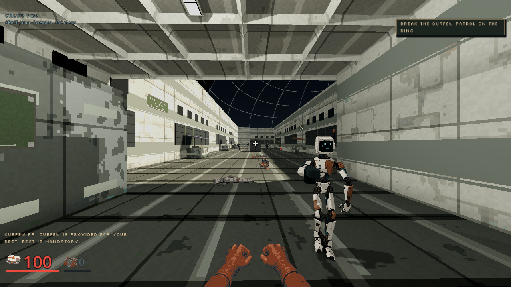
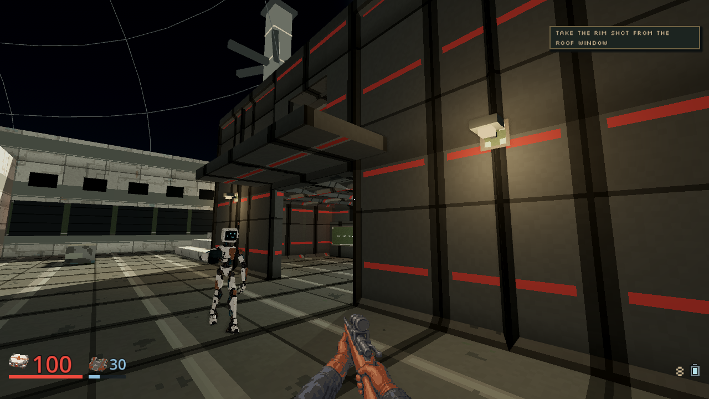
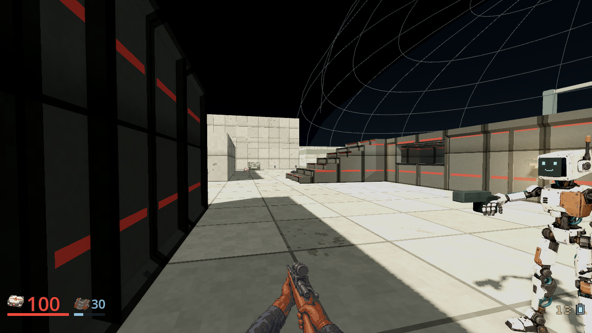
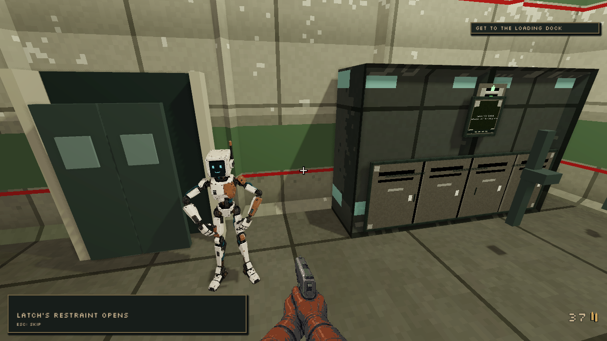
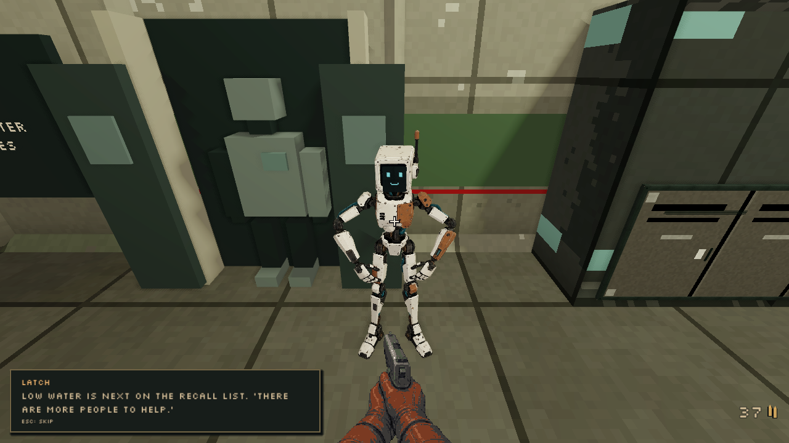
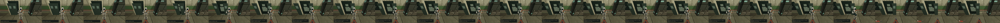

# Latch calm-pose local candidate

Status: implemented source-pose correction, October 5, 2026. Same-camera fixture review, complete local client checks, the ordinary M07 prefix and corrected visible M02 release witness pass. Corrected prerequisite `4b3a1120` passes all eight public CI jobs and all three desktop package gates. Final composed CI and Release workflows own desktop multiplayer promotion. First rejected boundary, incomplete launcher receipt and full-check manifest failure remain retained. This follows the released hand and named-body integration batch.

Base is main `0b03dc2c0a6b6da20262a02d26f9c7579e098e11`. The [plan](../plans/latch-calm-pose-20261005.md) precedes code. The independent private read-only audit reproduces the actual pawn/view transform chain and records 22 actual weighted source samples. Its inspected M07 image and current tracked GLB, view, pawn and old source are byte-identical to image client `94a270f2e406944ced574df2cfe6f0fee12eec16`.

## Bounded candidate and measured preservation

The selected 1.799972 m chassis, material maps, UVs, skin weights, walking clip and attachments remain unchanged. Only the free-left and unarmed-right hand endpoints and elbow poles are calmer. Targets follow actual shoulder displacement during sampled walking; the existing solver keeps fixed segment lengths. Armed and firing right-hand targets/poles remain exactly original, as do all positive release poses and hand turns.

Independent headless measurement gives idle elbow outboard spread 7.30/7.69 cm, compared with original 20.03/21.11 cm. Upper-arm angles from down change from 57/58 degrees to 38/42 degrees. Eight actual following samples give free-left 30.71 to 50.13 degrees and outboard spread 6.36 to 8.34 cm, compared with original approximately 58 to 76 degrees. This is measurement, not visual approval.

An independent old/new 22-sample comparison passes exact selected GLB/view/pawn identities, weighted floor and height at every sample, all sampled release joints, armed right joints and measured grip/offset controls. Armed idle and firing sampled Tack-grip proximity to 837 real dominant hand triangles remains 1.80/3.01 mm, with displaced controls 376/369 mm. Sampled proximity does not prove finger closure or an exact palm contact surface.

The existing owning source harness now checks actual imported arm lengths, torso-side free elbows, an actual old raised-elbow negative control, unchanged head/legs/feet over eight walk phases, original armed/firing right-chain transforms and all weighted release vertices. All existing source skin/clip, Tack registration, resolved flash, expression, actor lighting and near-clip PBR assertions remain.

## Local CPU receipts

Godot 4.7.2 headless import, touched-script parsing and `test_latch_source`, `test_latch_near_clip`, `test_m02_mission` exit 0 with clean logs and each own PASS. Private `.agents/cpu/` retains the import, parse, harness and full-chain measurement logs. The independent comparison is `independent-compare.log`. `git diff --check` passes. No server or GPU process ran for these receipts.

## Open acceptance

The first fixture produced 36 source-pose images and its own PASS with clean logs. Actual full-size zero-to-0.01 views show a visible elbow jump, rejected despite exact positive gesture comparisons. Its console launcher and actual renderer both retired, but the wrapper captured a null exit code for the launcher, so that lifecycle receipt remains incomplete and is not claimed as a clean numeric child exit.

The corrected candidate gives `pose_release`, including zero, an explicit ward context that preserves every original weighted release vertex. Ordinary `advance` switches back to relaxed live-following context. Actual zero/0.01/0.5/1 weighted-surface comparisons and bidirectional context switching pass the owning harness, alongside near-camera and M02 tests.

## Corrected controlled rendering

The source implementation is frozen at `fad2cae00500c77d16061f9be22df964a5122753`. One direct actual renderer process produced 36 images, 18 old/new pose pairs, then retired with numeric exit 0, clean logs and its own PASS in 3.49 seconds. The wrapper held that exact process and a 60-second wall cap. No console launcher, server, desktop pointer or gameplay was involved. Earlier failed launcher and transition evidence is not relabeled as passing.

Both versions use the same selected source, feet, 1280 by 720 viewport, 75-degree perspective, 3.35 m and 6.71 m cameras, ambient 0.35 plus one warm directional light 1.4, and exact pose parameters. The retained original pose adapter removes only its global class declaration and accepts an ignored final context flag; its original implementation and exact original file remain retained. The independent check verifies all 36 PNG hashes/resolutions and all 18 camera/parameter pairs. All eight ward pairs, including zero and 0.01 at both distances, have pixel-identical old/new PNGs.

Actual full and player-distance inspection finds a calmer free arm with the same lean adult chassis; the retained armed wrist and gesture remain recognizable. This is a source fixture, not a played M07 frame, proof of closed fingers, motion perception, frame rate or final character-art acceptance. Current main remains unchanged.

- [Previous armed idle](../screenshots/latch-calm-pose-20261005/full_idle_armed_old.png) and [candidate armed idle](../screenshots/latch-calm-pose-20261005/full_idle_armed_new.png).
- [Candidate following phase](../screenshots/latch-calm-pose-20261005/full_following_three_quarters_new.png).
- [Preserved ward zero](../screenshots/latch-calm-pose-20261005/full_release_zero_new.png) and [preserved ward 0.01](../screenshots/latch-calm-pose-20261005/full_release_001_new.png).

Private `.agents/pose-fixture/second/receipt.json` binds the frozen head, source/table/camera and per-image hashes. Numeric exit, logs and independent pixel-equality proof are retained beside it. These published frames are exact copies of those images; none was retouched or presented as gameplay.

## Required derived-library regeneration

The first unchanged full checker exits 1: all 271 scripts parse and 128 harnesses pass, but the existing model-assets harness rejects stale Latch source/view fingerprints. This failure remains in `.agents/cpu/full-client-first.log` and its failed receipt. The validator and its assertions are unchanged.

The dependent library `latch.glb` was genuinely regenerated through the existing model bake `_export` seam, then reimported. Its complete binary chunk is byte-identical to the archived previous output. Every accessor, mesh, UV, normal, material/image, weight, skin binding and animation remains identical, independently checked again on both actual imported mesh arrays and bindings. Four arm node rotations change to the relaxed unarmed pose; two empty generated simulator node names also change. The selected live `latch_stylized.glb` retains exact SHA `8b1ec57399ec51a70617a42c9777a04347170d5ddf78dc54b67649b3f6992951`. This is an openly declared derived-library dependency, not a new selected chassis.

Only the generated Latch entry and the two changed source hashes are refreshed in the existing manifest. The dependent studio image uses the original 1200 by 900 viewport, orthographic 2.2 m camera, original position/aim, ambient and two lights through the existing capture seam. Owned renderer 19560 retires with actual numeric exit 0, clean logs and its own PASS, without a server. Actual preview inspection shows the same adult chassis with lowered free arms. No unrelated library export is regenerated.

Private `.agents/library-before/` preserves old GLB/preview/manifest, real export and preview logs, independent binary/import proof and output hashes. Unchanged `test_model_assets`, `test_latch_source` and `test_latch_near_clip` each pass cleanly with numeric exit 0 after import.

## Complete local checker after actual regeneration

The unchanged complete checker on frozen runtime/assets `c6fc21caf66fcf7f28daa0e1e447acdbfce6239b` exits 0, with clean logs, all 271 script parses and all 129 harnesses passing. The matching owned immutable native helper is SHA `0832b465cc7fa5db7b68a3e423dea51ca789be0aff407d81254bdc7e7f4a21a7`; Rust, maps, Cargo manifests/lock, adapter and agent source remain identical to the base. No native rebuild or protected helper replacement occurs.

The exact private log is `.agents/cpu/full-client-repeat.log`; `full-client-repeat-receipt.json` independently binds numeric exit, aggregate counts, clean logs, frozen source/derived output hashes, selected chassis identity and native hash. The first complete check and its failed receipt remain unchanged. The generated GLB is SHA `7ead44f5acd175ad48ff11f520e4a0dd11a2882f64f6443d12238567c2aab6fc`; canonical preview is SHA `c2c302013ddbeda19abae1b1feaf4e5d725cb3897b76c07e801f4a162cb46a37`.

Only evidence/plan text follows this runtime freeze. Composed ordinary M07 following, final visual review, exact-head public CI, packages and release acceptance belong to the integration owner. A source fixture or complete headless suite does not claim whole-campaign motion quality or performance.

## Ordinary M07 following, October 5

The integration owner normally composes the frozen pose correction with the
released hand/HOME tree, producing client `bca3608c7b5065959d58d89ad72a6a8e381d9d75`.
Its runtime/native source matches accepted main `f1e36315` except for the
bounded Latch presenter correction. The owned immutable native helper remains
SHA `0832b465cc7fa5db7b68a3e423dea51ca789be0aff407d81254bdc7e7f4a21a7`.
No map, QA state, authority, supply, difficulty rule or selected chassis is changed.

The first 20 states of canonical `client/qa/m07_declared_goods.json` run with
seed 42 and Assisted difficulty, using ordinary discovery, walking and combat.
Every retained prefix state matches its original canonical state, and actual
walking arrivals pass. Renderer 34768 exits 0 with clean logs; it and owned
server 8152 retire. This is a bounded prefix, not full M07 completion or
departure, a fresh-player pacing study, closed-finger proof or performance claim.

Full-size arrival, lamp-line and cut-combat inspection shows the same adult
bone/cyan-screen chassis, calmer free arm while following, and retained armed
right-hand presentation. The three images below are literal unmodified copies
of that run, at its actual 1280 by 720 resolution. The
[public receipt](../screenshots/latch-calm-pose-20261005/m07-played-receipt.json)
binds each PNG, exact played client, selected/derived source hashes, native,
canonical/prefix/captured manifests, difficulty, seed, visible companion facts
and original log/retirement receipt. Earlier rejected fixtures and manifest
failure remain history. Public exact-head CI/package review is still required;
v0.76.0 contains the preceding hand/HOME tree, not this pose correction or a
selected Tern model.

## Visible M02 release-pawn correction, October 5

Review of frozen `15184ef2` identifies a release path missing from the earlier ward-only comparison: the ward tableau is hidden while the actual server companion is presented with phase `releasing`. PlayerPawn forwards that phase through its ordinary process call. Its unconditional live-context reset incorrectly selects the new calmer zero pose during release. The reviewed M07 prefix and ward fixtures above remain prior-checkpoint evidence, not proof of this boundary.

Plan checkpoint `f90beb0e` precedes the correction. A new owning test instantiates the real player scene, accepts a valid companion snapshot, then invokes its actual process path. Against unchanged `15184ef2`, both stationary and walking complete weighted release surfaces fail the retained previous-pose comparison, and a later return to release inherits the wrong context. The numeric exit 1 and all three failures remain in private `.agents/release-boundary/pawn-first-failure.log`.

The narrow correction requests original zero-release context when `advance` receives actual phase `releasing`. Following still uses the calmer free arm; firing preserves its original armed right chain. The regression now passes complete stationary/walking release skin equality, live visibility and hidden weapon presenters, adult height and feet, unchanged source scale/materials, subsequent following/firing chains and return-to-release context. Existing direct zero/positive ward gesture, weighted gait, palm, flash and PBR checks remain. Source, near-clip and M02 owning harnesses each exit 0 with clean logs and their own PASS.

The dependent Latch library is genuinely regenerated again through the existing `_export` seam, then imported and independently compared with the archived `15184ef2` output. The complete output is byte-identical, SHA `7ead44f5acd175ad48ff11f520e4a0dd11a2882f64f6443d12238567c2aab6fc`, including all binary geometry/maps/weights/clips and JSON pose declarations. All six imported mesh arrays, transforms and skin bindings also remain identical. The constructed default pose is unchanged, so its existing studio image remains exact. The selected live chassis retains SHA `8b1ec57399ec51a70617a42c9777a04347170d5ddf78dc54b67649b3f6992951`. Only the actual changed view-source fingerprint is refreshed in the unweakened manifest. Export, import, independent comparison and the unchanged model-assets harness pass with numeric exit 0 and clean logs.

Private `.agents/release-boundary/` binds the first failing test, corrected focused logs, archived output/manifest and actual export verification. At source freeze, fresh complete client checks, the ordinary M02 release witness and final public exact-head gates remain pending. No server, renderer, paid request or runtime chassis replacement is used by these CPU receipts. Subsequent results follow below.

## Ordinary M02 release witness and complete checker

The unchanged complete checker on frozen `e800480056a1663fd0c78150792fd4fe08442825` passes all 271 script parses and 129 harnesses, numeric exit 0 and clean logs. Private `.agents/release-boundary/full-client.log` is SHA `74bc307f8e196baab95bf23ffb3d936084ded2387a35f8400ae159282110d0e7`; its independent receipt binds exact source, manifest, generated library, unchanged selected chassis and owned immutable native SHA `0832b465cc7fa5db7b68a3e423dea51ca789be0aff407d81254bdc7e7f4a21a7`. Native source and canonical QA remain identical to the reviewed base. The previous full-check manifest failure and the new actual-pawn failing regression remain retained.

The integration owner runs unchanged `client/qa/m02-shot-occlusion.json` against that exact frozen client, seed 42 and Assisted difficulty. All 13 states and ordinary walking arrivals pass, including original ward combat, real restraint interaction and a diagnostic observer view of the live releasing pawn. The observer records 22 releasing samples: actual pawn visible, ward tableau hidden, original zero-release context retained and weapon hidden. Later samples show actual movement and weapon visibility in the calmer following context. This preserves the existing 240-tick phase and baseline zero pose; it introduces no positive gesture or mission rule. Renderer 3908 exits 0 with clean logs and its own PASS; it and owned server 19296 are retired.

Full-size release and pre-transition inspection shows the same adult bone/cyan-screen chassis in its preserved release posture. The final main state captures following after Latch moves outside that fixed observer view, so the pre-transition image and observed strip are retained explicitly. The two full frames and 24-tile strip below are literal unmodified copies of the actual run. The [public receipt](../screenshots/latch-calm-pose-20261005/m02-releasing-played-receipt.json) binds all image hashes/resolutions, client/native, canonical and captured manifests, actual phase samples, clean logs and owned retirement. The earlier copier's private state-name/schema mismatch is retained as a failed metadata check; its corrected literal-copy verifier passes without changing source, gameplay or images.

This is a bounded release witness, not full M02 completion, a new release animation, closed-finger proof or performance claim. Reviewed M07 images above remain bound to their previous `bca3608c` checkpoint. Corrected prerequisite `4b3a1120` passes [all eight CI jobs](https://github.com/blisspixel/fragr/actions/runs/37363183563) and [all three desktop packages](https://github.com/blisspixel/fragr/actions/runs/37363182674); final composed workflow gates own promotion. v0.76.0 contains the prior hand/HOME batch, not this pose follow-up or a selected Tern model. Tern finish work remains saved and paused.
