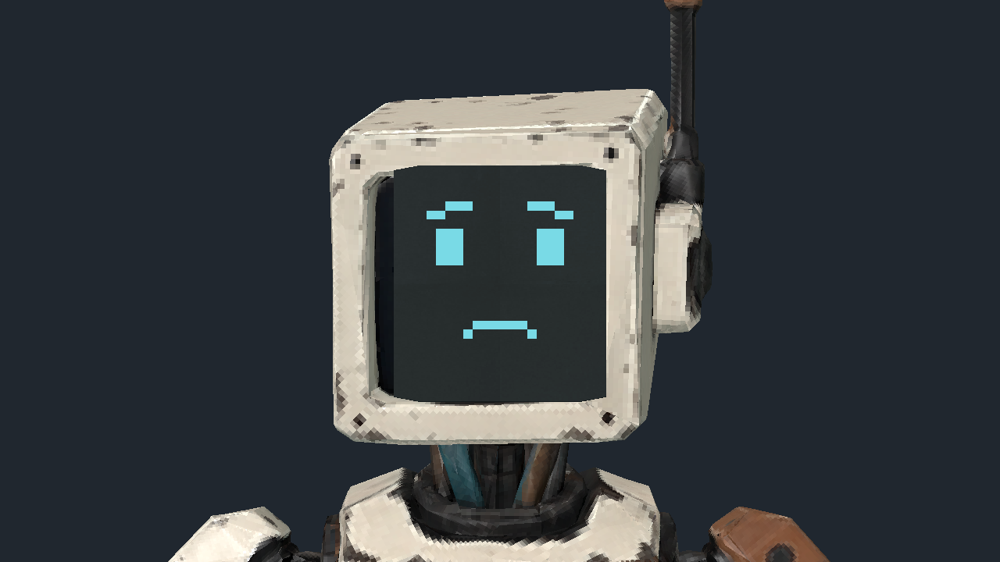
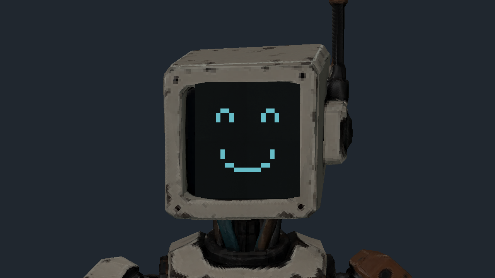
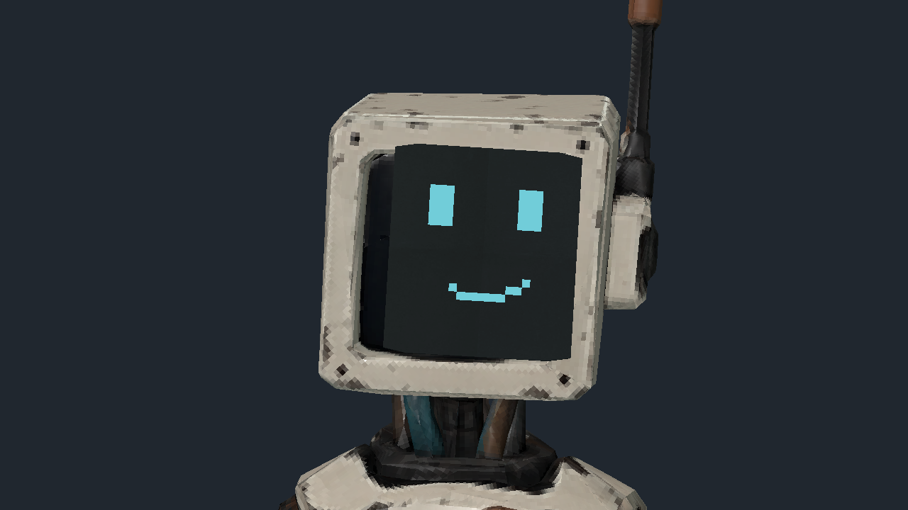

# Latch screen expressions, October 8

Distinct cached pixel expressions are implemented locally on the unchanged
weighted Latch source. Relaxed and walking smiles, concentration, ward concern,
hope and relief follow accepted presentation facts. Short natural blinks close
the eyes while retaining the complete mouth. The fitted screen still follows
the actual head skin and retains the live near-camera shader and material cache.

The [exact receipt](latch-screen-expressions-20261008.json) binds 107 retained
files, including source snapshots, six passing focused logs, original failure
logs, the exact selected GLB and 61 rendered originals. Nine public images are
byte-identical copies. The owned renderer returned numeric zero with clean logs
and retired. Rendering used the pinned 4.7.2 engine, Compatibility and the local
AMD Radeon 780M.

The focused checks exercise actual distinct geometry and a fixed 14-mesh cache,
blink duration and priority, stopping, firing, repeated and first HP observations,
invalid fallback, actual pawn wiring, accepted ward release at zero progress,
gesture relief, retry and exact near-clip material restoration. Existing source,
near-clip, M02 ward, mission and tableau checks pass. Early overly exact
floating-point transform/scale assertions are retained; the corrected checks
compare the actual head attachment within numerical precision.

Selected original inspection confirms legible expressions in normal and dim
lighting, fitted optics through sampled walking head motion, a blink reopening
without mouth compression, and coherent whole-source near fading. This is a
controlled accepted-state source preview. The HP-drop wince uses a synthetic
valid positive HP transition; companions are currently immune to incoming
attacks. No ordinary damaged, shutdown or death outcome occurred. The rendered
motion window ends at the wince boundary; expiry is covered by the focused
transition check rather than a later rendered frame.

The separate [independent selected review](latch-screen-expressions-review-20261008.json)
binds 13 exact full-size originals and confirms distinct expressions, blink
reopening, fitted moving optics and coordinated near fading. It preserves the
original receipt bytes and the same limited acceptance scope.

The [owning plan](../plans/latch-screen-expressions-20261008.md) preserves the
remaining whole-client/package composition and final human art acceptance.
No source model replacement, paid generation, wire or gameplay authority change
was introduced.
