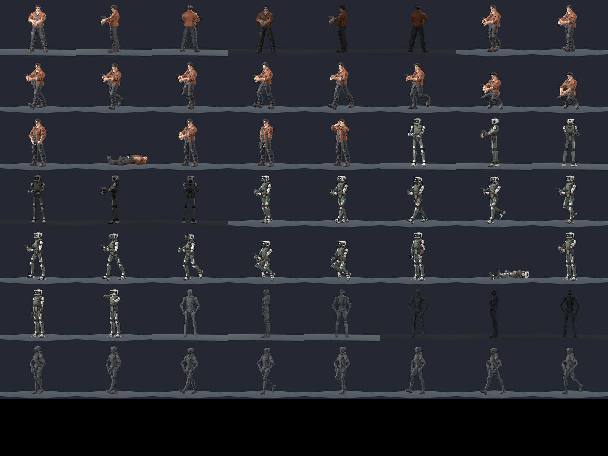

# Live character fixture validation, October 8

Implemented locally with zero paid requests. The
[owning plan](../plans/live-character-presenters-20261008.md) records the live
character scope and the carried-profile correction before implementation. The
[machine receipt](live-character-fixtures-20261008.json) binds the exact commands,
current scripts, three packaged sources, support curves, renderer images and
retained failures. Tern's separate
[offline preparation receipt](tern-source-preparation-20261008.md) establishes its
source preservation. Ordinary-input campaign and multiplayer acceptance have
separate owners; these fixtures do not establish those outcomes.

The focused headless test uses the actual weighted meshes at seven off-grid
phases per action, with the original 0.01 m floor tolerance. It checks idle,
walking, crouch, crouched walking and fall, actual vertex motion, fixed arm segment
lengths and the posed wrist. Additional actual PlayerPawn checks cover accepted
driver crouch, upright gunner, zero seated stride, hidden seated firearm, extreme
pitch, camera-facing and end-on carried planes. Source identities, valid weights,
instance-local tint, source-preserving Tern walk alias, actor layers and invalid
body ids also pass. No source vertices are rewritten by the pose.

| Body | Weighted vertices | Idle height (m) | Largest sampled floor error (m) | Largest sampled walk vertex motion (m) |
|---|---:|---:|---:|---:|
| Human | 18,919 | 1.799973 | 0.001995 | 0.696470 |
| Synthetic | 20,849 | 1.799973 | 0.000650 | 0.631892 |
| Tern | 19,106 | 1.799973 | 0.000400 | 0.631852 |

These are geometry measurements across the recorded samples, not frame-rate or
exhaustive continuous-motion measurements. Values in the table round upward for
errors and motion; the machine receipt retains the exact readings.

The actual Compatibility/OpenGL and Forward+/Vulkan renderer runs each exit 0
with clean logs and retire their owned process. Both use the recorded AMD Radeon
780M. Each manifest contains 74 full-size 1024x768 stills and three eight-phase
walking strips, plus a separate overview. Source and QA hashes match the current
files. The two runs use explicit rendering-method and rendering-driver flags;
they establish this adapter's exercised paths, with no other-vendor, other-platform
or hardware performance claim.

Full-size inspection covers all 24 Compatibility walk originals, all 18
neutral/dim angle controls and the crouch, driver/gunner, fall/restore, wrist and
pitch views. Selected full-size Forward+ originals and its overview are also
inspected. No blocking missing limbs, detached geometry, explosive gait
deformation or floor penetration is observed in those fixtures. The existing
stride remains pronounced and the hands remain open. The sampled motion strips
retain the actual deformed surfaces:

- [Human walk](../screenshots/live-character-fixtures-20261008/human_walk_strip.png)
- [Synthetic walk](../screenshots/live-character-fixtures-20261008/synthetic_walk_strip.png)
- [Tern walk](../screenshots/live-character-fixtures-20261008/tern_walk_strip.png)
- [Forward+ overview](../screenshots/live-character-fixtures-20261008/vulkan_overview.png)

The first controlled run exposed a visible carried-weapon defect even though its
parent-direction assertion passed: fixed-Y Sprite3D billboarding left the gun
horizontal at accepted +/-85-degree aim. The correction disables that billboard
only for the live carried profile, keeps its actual +X gun axis aligned with
accepted yaw/pitch, and rotates its double-sided plane toward the camera around
that axis. End-on and missing-camera cases retain a stable orthonormal basis.
The existing pistol and sniper profiles are reflected so their painted muzzle
points along that positive gun axis. The pistol's measured painted grip is
positioned at the actual posed wrist.

The renderer regression measures the rasterized profile's principal axis against
an empty scene, rather than relying on a parent transform. Restoring fixed-Y in
the same actual pawn/profile fixture reproduces the failure. The original run
and its visibly incorrect originals remain retained.

| Actual visible profile test | Accepted pitch | Rotation from zero-pitch image |
|---|---:|---:|
| Restored fixed-Y negative control | +/-85 degrees | Less than 0.05 degrees |
| Corrected human and synthetic, both renderers | +/-85 degrees | Approximately 85 degrees |

The required tolerance is five degrees and is unchanged between both renderers.
The [negative control](../screenshots/live-character-fixtures-20261008/human_pitch_fixed_y_control_up.png),
[corrected up](../screenshots/live-character-fixtures-20261008/human_pitch_actual_up.png)
and [corrected down](../screenshots/live-character-fixtures-20261008/human_pitch_actual_down.png)
show the difference. Actual body geometry may normally occlude the raised weapon
from a front view; the isolated profile measurement proves rotation without
removing that occlusion from gameplay.

An independent actual-pawn shot-effects regression also reproduces the old
HP0 carried-root visibility suppression for both human and synthetic bodies.
The corrected root lets a resolved dead-shooter muzzle present while hiding the
carried gun independently. The permanent regression checks ordinary flash expiry
and retires the actual scene resources. The isolated old visibility block fails;
the corrected harness passes. Its exact source and log hashes are in the receipt.
An independent follow-up also exercises first-person camera changes during a
dead-shooter flash. The final camera-switch path refreshes attachment visibility
after restoring weapon art, keeping the resolved flash visible and the gun
hidden. The attempted incorrect ordering and final passing regression are
retained. Both renderer fixtures are recaptured against this final source; all
77 image hashes and the overview per backend exactly match the preceding final
run, preserving the full-size visual inspection while binding the new code.

First-person hiding compares every image byte for all 786,432 pixels against an
actual empty-scene control, separately for human and synthetic, with muzzle
feedback requested. Both renderer runs match exactly. The complete live mesh,
legacy body, carried gun, muzzle and associated light remain invisible. The
[empty control](../screenshots/live-character-fixtures-20261008/human_empty_control.png)
and [first-person frame](../screenshots/live-character-fixtures-20261008/human_first_person_hidden.png)
are retained publicly.

The [human](../screenshots/live-character-fixtures-20261008/human_carried_anchor.png)
and [synthetic](../screenshots/live-character-fixtures-20261008/synthetic_carried_anchor.png)
closeups expose the remaining open-palm presentation. Wrist alignment does not
prove individual finger closure or exact support-hand grip. The
[driver](../screenshots/live-character-fixtures-20261008/human_driver.png) obeys
the authoritative crouch with basic forward hands; wheel, seat and pedal contact
are unproven. Tern's original neutral-grey optics and brown panels on both
shoulders remain unchanged, visible in the
[dim control](../screenshots/live-character-fixtures-20261008/tern_dim_idle_0.png).
Warm optics and a single anatomical-left accent remain final-art refinements.

The initial renderer's numeric zero and programmatic PASS were insufficient to
catch the visible pitch defect. The receipt retains that run, the restored
fixed-Y witnesses and the correction. A later QA-only correction refreshes the
paused pawn's attachment after each camera change, matching ordinary per-frame
presentation; both final renderer runs bind that corrected fixture. Full-client,
standard-tour, owned M09/M10, export/package and human acceptance are separate
gates, with no promotion from these controlled states.
