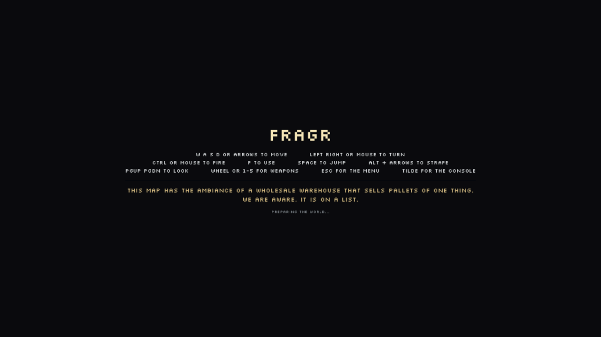

# Loading-first evidence

2026-10-04. Runtime source `32b04f63`, with documentation-only closeout after
it. Integration: [PR #350](https://github.com/blisspixel/fragr/pull/350).
Spend: $0. No server rules, paid assets or protocol revision changed.

The first main-scene frame is now covered before presentation setup and
network readiness. Authoritative geometry alone cannot release it. Matching
snapshot presentation and a completed draw release waiting; an opaque
campaign story can take over. Error and stale-generation checks preserve
cover. Device keys held through dismissal require release, while a newly
pressed grenade or mine works without waiting for another action tick.

The screenshot is from a real owned local M08 server/client run, not a mockup.
The Radeon 780M Compatibility renderer and actual saved-run harness exit 0
with clean logs and PASS. It checks historical exact-byte archive, M07-M08
carry, story input release, stop/resume, finite mine consumption and retained
entry count. This is not a whole mission route or performance benchmark.

A separate controlled presenter lifecycle capture checks first frame,
geometry-without-snapshot, stale map, error and final reveal. Four inspected
1920x1280 frames and clean PASS establish those rendering boundaries, not
public networking capacity. The committed harness checks matching readiness,
stale callbacks, observable failure, held/released devices and deferred
deletion without pointer capture.

Two earlier local full-suite failures are retained privately: the new input
block initially left fresh mine presses disarmed, and rapid test teardown
could retain the active radio decoder. Released-input rearming and bounded
mixer teardown in the harness fix them; final focused and real local checks
are clean. Those failed runs are not reported as full-suite passes.

[Full client CI](https://github.com/blisspixel/fragr/actions/runs/37217355040)
passes on the final runtime source. [Desktop package checks](https://github.com/blisspixel/fragr/actions/runs/37217352822)
pass on Windows, Linux and macOS. Documentation-only closeout preserves every
package/runtime input; reviewed-head implementation CI and fresh main CI
still gate integration. No baseline assertion was weakened.

The reported office-wall pop-in has not been reproduced. The intermittent
Kitchen blank-material issue also remains open. Loading cover is not proof
of either defect being fixed, nor proof that shader hitches are eliminated.
The garage, Crawler source, M09 and new multiplayer formats remain separate
development work with their own acceptance gates.
