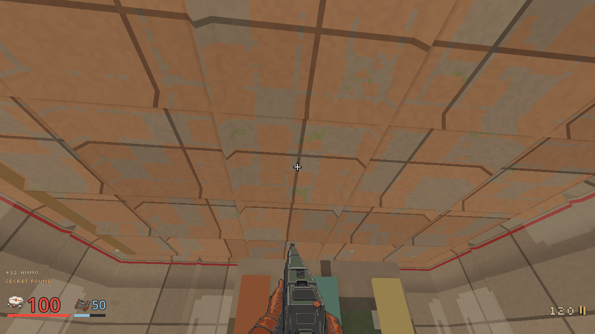
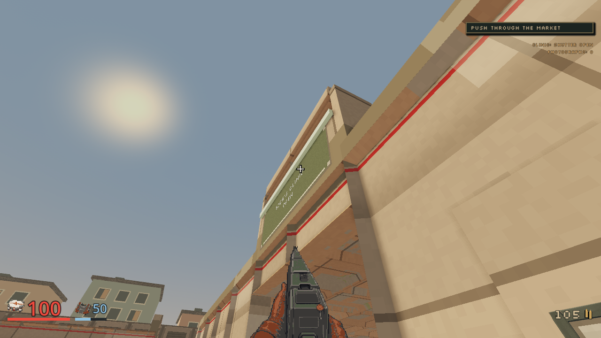
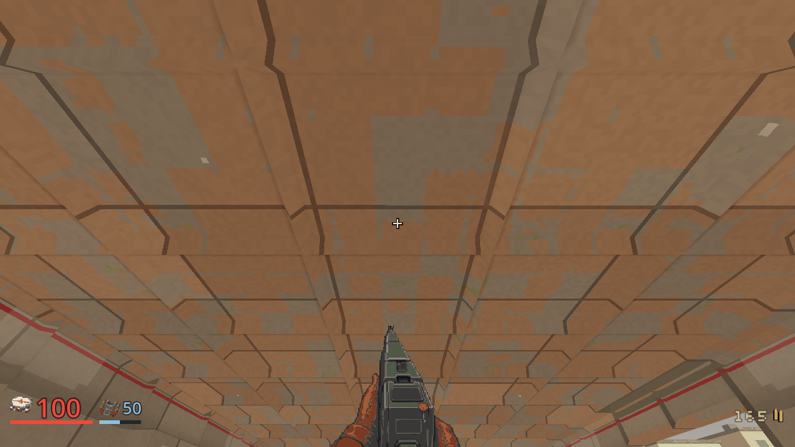
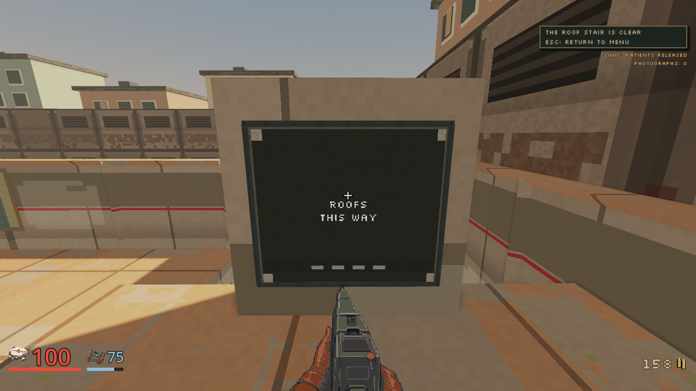

# M04 building enclosure, 2026-10-03

Status: tested locally. The complete 29-state rendered route passed with clean logs and actual roof departure. This receipt covers the authoritative room shells and supported capture route; CI and release status belong to the roof change's own records.

## Captured source and conditions

The run used the historical M04 detail client at `06ef82b`, whose runtime detail source is unchanged from `76cda9306a8a8f5068a5353f3faaefedfe013d91`. The new Clerk presentation revision has separate acceptance evidence. These frames establish enclosure with the previously reviewed civilian details.

The supplied M04 map contains the eight roof and shutter-pocket solids. Workshop and clinic ceiling undersides are at 4 m. The clinic's enclosed shutter pocket has a 6.2 m underside, retaining the lifted shutter's 5.9 m clearance. The habitation court remains open air. No visual-only blocking shell was added by the capture route.

| Input | SHA256 |
| --- | --- |
| Supplied roof map | `beabd499c10897ac389c70fd38f79fd870fc85fba3eef17161ab9c639857e1df` |
| Matching native server | `b627a4b9fcab0979abbaf9681089f1f112453798a21691afe02cf011c4fa2190` |
| Private derived tour | `3e53cb52841a6de97d6a55b86c4362ff6e97ad62fa47f6c7f6def5eb129d3f76` |

The matching server ran assisted difficulty, seed 42 and zero rule bots on owned loopback port 16855. Godot 4.7.2-stable rendered 1280 by 720 using Compatibility on an AMD Radeon 780M. Run storage, settings and participant records were isolated. Automation released the desktop pointer. The renderer exited 0 with no script, runtime or shutdown error lines; the owned server was cleaned up afterward. Departure was confirmed at `2026-10-04T02:17:10Z`, evening 2026-10-03 in the local timezone.

Private receipts, source, logs, full manifest and contact sheet are retained under `.agents/level4-roof-capture-variant6-20261003/`. Earlier attempts remain in their original directories and `.agents/level4-roof-capture-history-20261003.md`.

The combined enclosure and selected stylized Clerk client subsequently passes
all 224 scripts and 103 headless harnesses, exit 0 with its own PASS marker and
no script, runtime or shutdown errors. Its log is retained at
`.agents/art-playthrough-20261003/union-roof-combined-full-client.log`, SHA256
`1004a3de611840f7883009ff8cef2b58ac745a39c1d2417f2383eb2010d43f85`.
All 25 focused M04 Rust checks, historical-save integration checks, formatting
and workspace warning-denied Clippy pass. These combined source checks do not
replace the separately identified rendered capture or the final integration CI.

## Actual route outcomes

| Check | Observed result |
| --- | --- |
| Rendered states | 29, every world frame nonblank |
| Original combat probes | All six passed, all 28 required named defenders confirmed dead |
| Participant | Zero deaths, zero HP lost, 70 armor lost, zero dry triggers |
| Resolved participant kills | 28 |
| Secrets | Two claimed: paint-locker shells and awning armor |
| Notaries | Seven registered crashes, zero completed photographs |
| Clinic | Secured, shutter opened, both patients released |
| Ordered objectives | All six combat objectives followed by actual `party_departed` |
| Court fight | 100 HP to 100 HP, 100 armor to 75 armor, Rifle selected with 158 bullets retained afterward |
| Roof return | Every ordinary walking waypoint arrived; no jump or position grant |

Patient final feet were `[-18, 0, 2]` and `[-18.999994, 0, 2]`. The second patient's position records the grounded queue behind the first. Release is proven; distinct completed evacuation positions are not claimed. The shared-meal secret was inspected, while its full-health medkit remained unclaimed.

## Supported ordinary-input corrections

The derived tour retains the committed 26-state detail route and adds three camera checks from already reached feet: workshop ceiling, clinic shutter housing and clinic ceiling. All original guard names, encounter ordering, phase requirements, finite equipment, combat and walking deadlines, and departure checks remain.

Clinic exit uses uninterrupted ordinary walking through the original waypoints before the unchanged six-guard market probe. Interleaved combat steering had previously caught the doorway corner. The original source manifest remains unchanged for this private transit setting.

The court preparation still visits every original finite armor, ammunition and shell pad. It returns through the western lane and south opening, then enters at `[-3.75, 0, 18.75]`. This supported arrival is inside the actual court activation region and outside the health pack's 1.75 m claim radius. The previous entry anchor `[-6.25, 0, 20]` lay only 0.25 m from the pack and consumed its 100-HP grant for an early 15-HP recovery in the failed run. All eight defenders have ordinary Rifle lanes from the revised entry. Shared movement/contact forecasts also checked the authored posts and a retained companion position.

A first conditional search point `[-7, 0, 20.5]` reaches the unchanged finite health pad's open western edge when the existing controller loses hostile sight. This clean run lost no HP and needed no health pickup. The preceding south-entry run preserved the pack throughout combat and recovered 40 HP during ordinary post-fight review, rather than during the fight.

The old roof-return goal `[8, 3, 31]` placed its 0.3 m walking arrival disk across the crossing's unsupported southern edge. The supported return is `[8, 3, 31.75]`, `[13.5, 3.5, 31]`, `[17, 3, 31.75]`, followed by every remaining original roof goal. The explicit middle point traverses the existing half-metre tread. Moving both goals to z31.75 alone was rejected because it intersected the adjacent taller stair band.

The corrected return passed 30 offline movement cases using exact retained feet, a 0.29 m arrival ring and zero to two additional held input ticks. The original route failed 14 cases. Actual stranded feet `[7.999996, 1.2, 30.99295]` could recover through the ordinary ground stairs, but could not step directly onto the 3 m crossing. The final rendered route then proved all corrected waypoints and the real departure without changing collision or granting movement.

## Prior failures retained

| Attempt | Outcome |
| --- | --- |
| Original roof tour | Clinic exit stalled while combat steering interleaved with movement. Static movement alone could clear the corner, so dynamic contact was not established as the cause. |
| Ordinary-transit variant | Earlier street probe left the western Notary alive, four of five guards confirmed. Full route failed. |
| Snapshot variant | All 29 gameplay states completed, but private diagnostic finalization read a retired scene root. Strict log acceptance failed. |
| Cached-snapshot variant | Diagnostic queried a movement probe during the initial spectator connection. Startup failed; diagnostics were then removed from acceptance runs. |
| Standard repeat | Court Clerk killed the participant after six of eight defenders died. The server confirmed death and intake reset despite a stale `alive` field in the probe error. Two historical sky-texture shutdown errors also occurred. |
| South-entry variant | All six combat probes and 28 defenders passed, then the original roof-return edge dropped the player onto the printer at 1.2 m. No departure claim. |
| Supported-return variant | All 29 states, original combat and mission gates, actual departure and clean renderer shutdown passed. |

## Inspected frames

The workshop and clinic images show continuous ceiling undersides with closed wall joins. The shutter image shows the closed exterior housing above the lifted doorway. The departure frame records the cleared roof control after the authoritative use action. Patient routes and the open-air court were preserved.

This is accurate-aim authored-route evidence. Fresh-player timing, campaign fun acceptance and other venues retain their separate gates.
