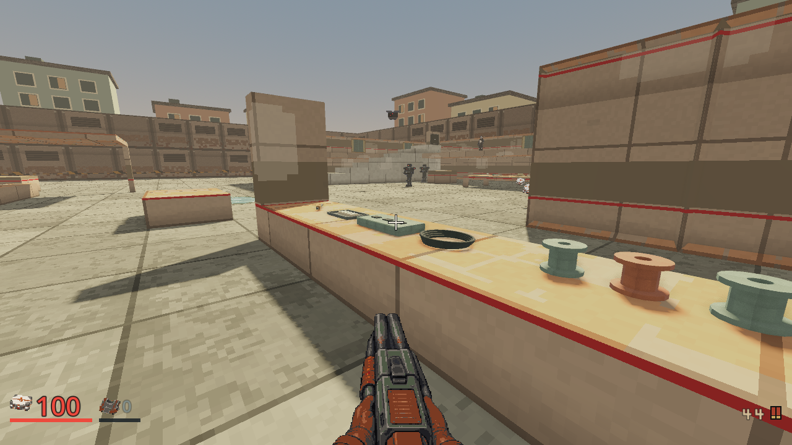
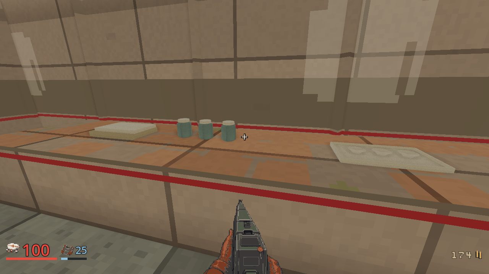
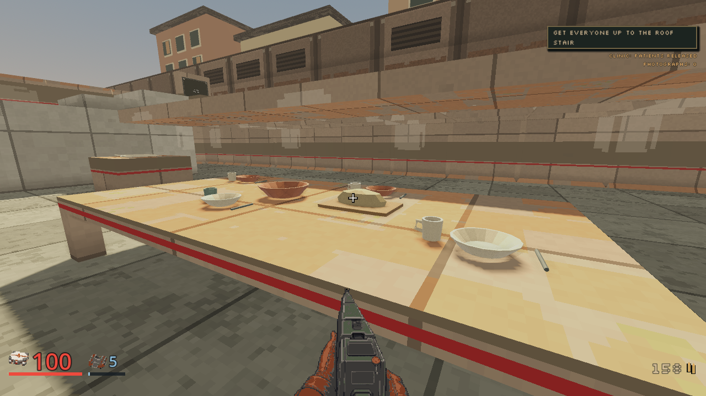
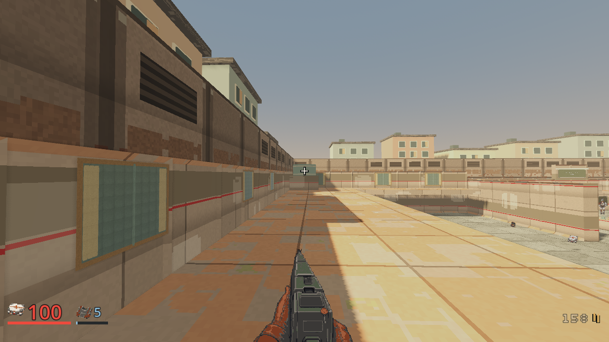

# Low Water inhabited-world presentation

Local implementation evidence, 2026-10-03. The
[bounded plan](../plans/m04-inhabited-world-polish.md) remains in flight until
the rendered log gate and integration pass.

The M04-specific source gives existing furniture recognizable activities:
shared charging cables, shaped hollow spools and contact repair tools; clean
care trays, ceramic jars and folded linen; individual cups, bowls, utensils and
bread at the shared meal table. Two clinic beds have maintained linen. Nine
sealed court windows have warm wood frames and cloth accents. All details use
angular geometry, restrained color and nearest-filtered finish variation.
Nothing imports photographs, adds blocking furniture, changes actor feet or
creates a new interaction. The source merges to one mesh with eight finish
surfaces and follows the existing venue light layer.









## Verification and limits

The headless source harness checks the actual authored M04 solids, every merged
vertex's furniture footprint, the maximum 8 mm wall relief, material submission
bound, venue lighting layer, absence of collision and restraint on unrelated
custom M04 maps. The existing town harness also passes its patient feet, gait,
teardown and both-clinic-world contact detours. Import and touched script parse
checks are clean.

The real Compatibility run on an AMD Radeon 780M completed the original 23-state
ordinary-input route and three added art views, at 1280 by 720. All six combat
probes passed, confirming 28 named defenders; the participant had zero deaths,
the clinic was secured and opened, patients were released, and the final server
fact was `party_departed`. The participant record counts two claimed secrets;
the visit to the full-health meal-table medkit does not prove a third claim.
All 26 captures were nonblank and the four selected frames were inspected.

The first run's shutdown printed two 349,524-byte Compatibility texture leaks.
Therefore this is completed route evidence, **not a clean rendered PASS**.
The identical signature predates this source in multiple older tours and was
previously diagnosed as pending sky radiance retirement in the
[M06 client plan](../plans/m06-client-prototype.md). Diagnostic logs and the
full receipt are under ignored `.agents/level4-capture-20261003/`. Focused
renderer isolation and a clean full repeat remain required. Headless results
do not substitute for that gate. Full CI and main integration remain open.

The captures also expose larger architecture work. The clinic at x[-35,-22],
z[-8,14] and workshop at x[22,34], z[-32,-18] have perimeter slabs without
ceilings. The outdoor court is intentional, but its homes are thin boundary
walls and exposed balcony decks, with separate residential backdrop buildings
beyond the playable bounds. These sealed window motifs improve domestic cues
without claiming finished homes. Authoritative enclosure, roof collision and
navigation need their own change. No paid service was used by this pass.

The derived art route keeps `client/qa/m04-market.json` as its source and adds
three inspection stops through `client/qa/m04_lived_detail_tour.gd`. Run it with
the existing local server on the authored M04 map, assisted difficulty, seed 42
and zero rule bots, isolated run/settings output and a real framebuffer:

```sh
godot --path client --rendering-driver opengl3 --windowed --resolution 1280x720 --script res://qa/m04_lived_detail_tour.gd
```

Set `FRAGR_SERVER` and `FRAGR_QA_DIR` to the owned server and ignored evidence
directory. The original touring controls, finite inventory and resolved combat
checks remain unchanged. Accurate automated aim is authoring evidence, not
fresh-player pacing, difficulty acceptance or a finished-art claim.
