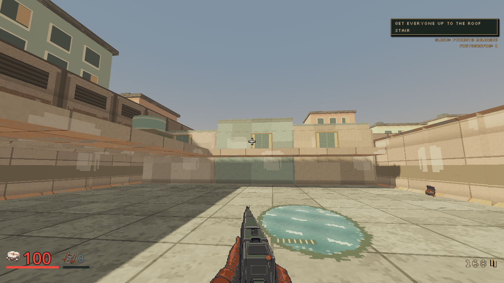
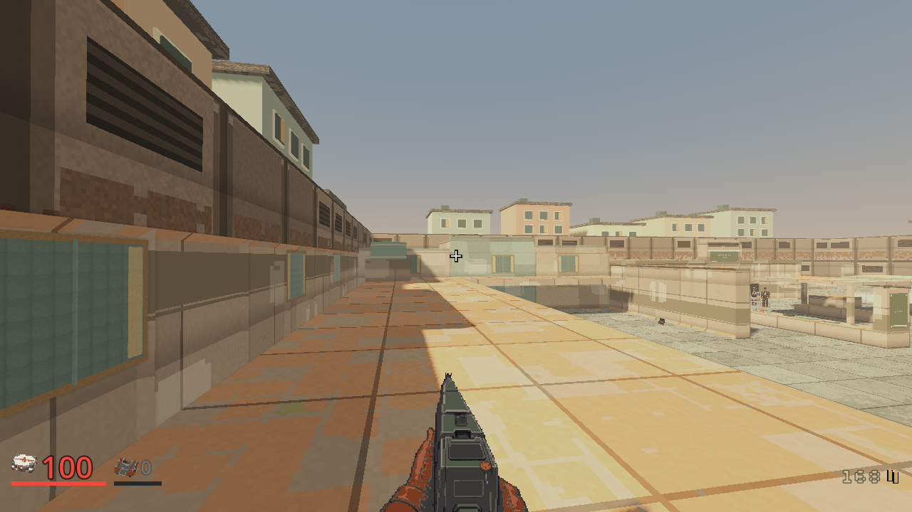
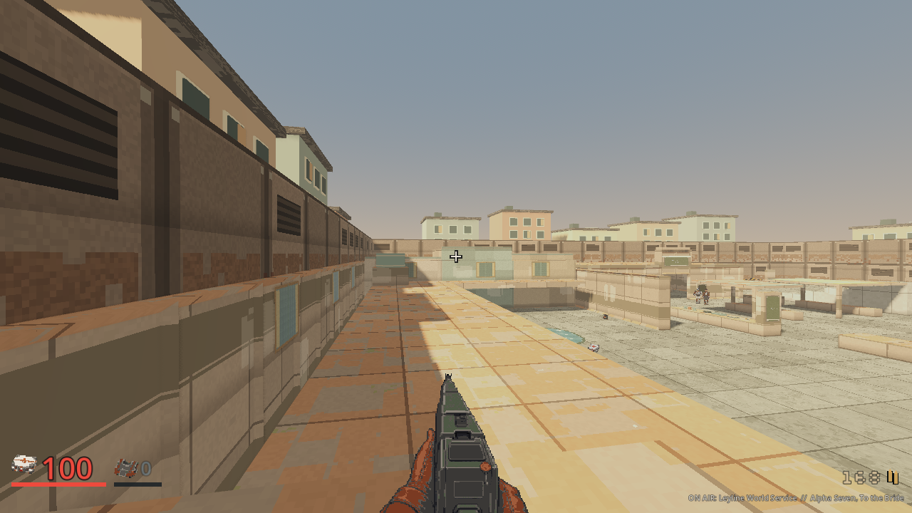

# Low Water west residential frontage, 2026-10-04

Base: main `a8611d04`. Implementation: `098ea633`.
Local render, focused checks and complete server/client checks pass. Integration
and full CI remain tracked by the [plan](../plans/m04-residential-facades.md).
No paid calls or additional asset credits were used.

## What changed in actual play

Three adjoining sealed home bodies now stand behind the west court wall, aligned
with the retained personal windows at z21, z27 and z35. Different depths and
5.5 m, 6.2 m and 5.15 m roof heights replace a single wall silhouette. Each has
a registered 0.22 m roof edge. The north roof stays below the communal tank's
visible top. These six solids block authoritative movement and shots.

Broad sand, sage and warm plaster faces, shallow maintained window surrounds,
rain-run paint, roof-edge finishes and roof repair patches reuse existing Low
Water textures. Local facade materials disable institutional markings and
emissive trim. Global shaders, venue materials, lighting and issued gear are
unchanged. The bounded helper adds one world-layer mesh with nine material
surfaces, 270 vertices and 90 triangles. Wall relief stays within eight
millimetres; roof/body finishes stay within one millimetre of real solids.

The ground view reads as three maintained homes rather than another uniform
wall. The balcony and exit views retain the tank, crossing and open court. This
is a bounded west frontage improvement. The east/north court, wider perimeter,
generic distant backdrop and civilian character production remain unfinished.
Closed homes have no doors, usable interiors, invented residents or new gates.

The [historical wall reference](../screenshots/m04-residential-20261004/historical-wall-before.png)
is byte-preserved from the October 3 inhabited-detail capture. It predates the
civilian material correction and latest Clerk. Its camera also differs. It
documents the earlier wall-only shape, not a controlled pixel comparison or a
claim that all palette differences came from this facade change.

## Complete played route

The retained capture is `.agents/facade-tour-1` in the implementation worktree.
It uses ordinary input, the standard tour lifecycle, the current main Clerk and
the exact facade map. Pinned Godot 4.7.2, Compatibility/OpenGL, AMD Radeon 780M,
1280x720, seed 42, assisted difficulty and zero rule bots were used. This is
inspected renderer evidence, not a hardware performance benchmark.

The accepted 29-state enclosure/detail route is retained as the basis, with
three additional camera inspections at already-reached shared-table, balcony
and departure feet. The clinic-exit uninterrupted walking and court south-entry
finite-health approach retain their earlier documented corrections. The current
supported roof-return route is unchanged. All original guard requirements,
deadlines, supplies, encounters and actual departure assertions remain.

- All 32 states, six combat probes and 28 named guards pass.
- All 134 ordinary walking arrivals pass. No teleport or equipment grant.
- Participant record: 28 kills, zero deaths, 100 HP lost, 150 armor lost,
  zero dry triggers and two secrets. This was a pressured clear, not a no-damage
  proof. Final observed ammunition is 168 bullets and 50 shells.
- Seven Notary crashes and one photograph. Severe no-photo acceptance is open.
- Clinic secured/open, patients released, all six ordered objectives and actual
  `party_departed` are confirmed. Final patient feet are `[-18,0,2]` and
  `[-18.999994,0,2]`; both releases do not prove both separate evacuations.
- Capture completed at `2026-10-04T10:29:33Z`. Renderer exit zero, clean script
  and runtime error gates, every frame nonblank, owned server cleaned up.
  The raw TCP readiness probe produces an expected incomplete-handshake warning.

| Retained artifact | SHA-256 |
|---|---|
| M04 source map | `3a44041640f5fbb9fb79b9e0eec077c21a84a72f1899c800e9ca0bae257c662b` |
| Private matching release server | `c1bea6e06c3a4cd88fd62853500796245e768a71a8ce6f07aeb0bca426351ddf` |
| Derived 32-state route | `afb41fcf6c9de3fe84bf2d8f905b085826764376e4ef0d147eb5dc2b4fdf19a9` |
| Capture manifest | `5da1514e210375f59d45e3ecad55bccf8908d491da52802d5cadc3f52652ecf7` |
| Facade helper | `259e9af0e709bf373f2315cde3ed1254489e0e3a7911173ff4df084e4537acd2` |

## Physical routes and roof access

Both prepared clinic worlds pass 27 focused unit tests and two real local-child
M03/M04 carry checks. New bodies stop ordinary movement and vertical shot rays.
Court Notary patrol sightlines match the prior geometry from ground, balcony and
exit-deck origins. Finite supplies, tank approach, departure navigation and the
existing roof arrival-tolerance regression remain covered.

The roofs are truthful optional side platforms. A normal west-balcony jump
cannot cross the retained five-metre wall. After reaching the four-metre exit
deck, the existing north wall can be jumped onto. Ordinary movement along it
and a turn reach the new north roof at 5.15 m. Return passes through
`[-19.75,5,37.6]`, `[-18.8,3,37.6]`, `[-18.8,3,34.25]` and
`[-12,3,34.25]`, around the real tank. This authoritative integration test uses
the actual landed body for roof access. The regular played clear uses the
original stair route; it does not claim a live roof-jump capture.

Two initial return test proposals failed: z38.6 was beyond the north balcony's
support, and z34.5 was inside the tank's body-clearance margin. Their logs remain
under `.agents/native-focused-final.log` and `.agents/native-focused-return.log`.
The corrected z34.25 route passes without geometry, jump or collision changes.
The live 32-state tour passed on its first attempt.

The existing client harness inspects every final facade vertex, quiet local
material settings, world layers, exact registered bodies and refusal to guess
facades on altered/custom layouts. Focused client checks, server Clippy and
formatting pass. Complete server checks pass 873 unit tests with three existing
ignored, 18 binary tests and 26 integration tests. The local-parent negative
test intentionally emits its rejected-control error; every test still passes.
The complete client checker passes 233 scripts, 108 harnesses and all 342
expected labels, with exit zero and no script/runtime/failure diagnostics.
Its stable log SHA-256 is
`b80f6f2138c950634b4de71242ac153e31b86c2105dd0139039f0f47f4b53261`.

The separate Windows fake-checker sweep took about eight minutes for its first
scenario, which passed. Its owned shell tree was then deliberately canceled;
the retained partial log is not full self-test evidence. The normal Linux CI
verifier self-test remains required before integration. All owned rendering,
server and client-check processes are cleaned up.

The authored content hash changes. Existing M04 entry, in-progress and pending
M05 saves bound to the previous M04 bytes remain incompatible under the strict
store. Later saves bind their own level's unchanged hash. This pass introduces
no save migration, rules revision, wire capability or relaxed validator.
