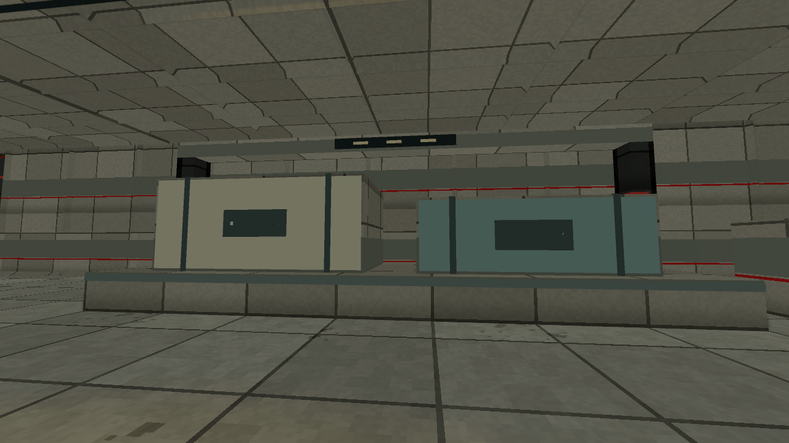
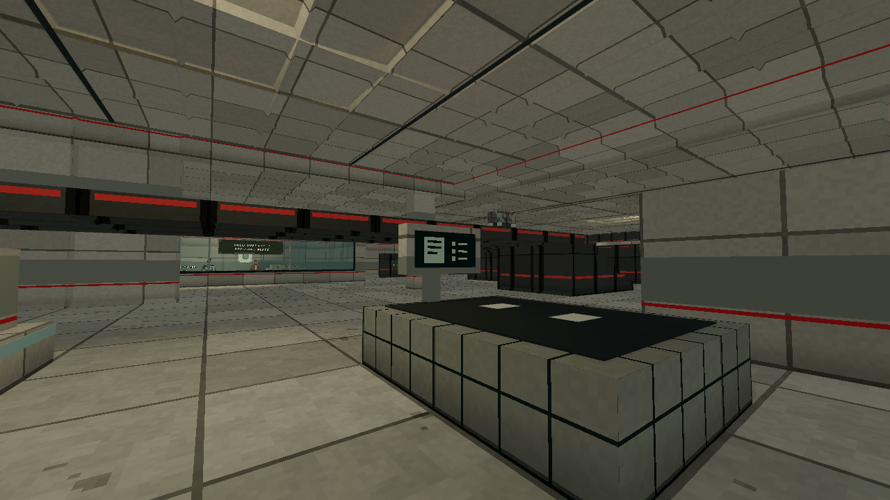
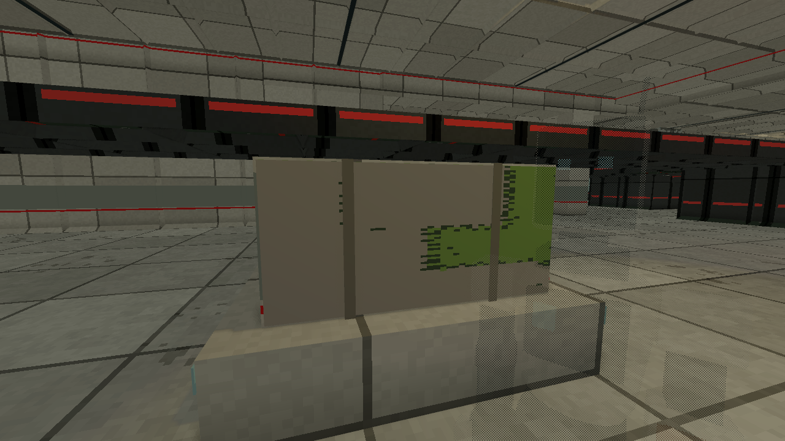
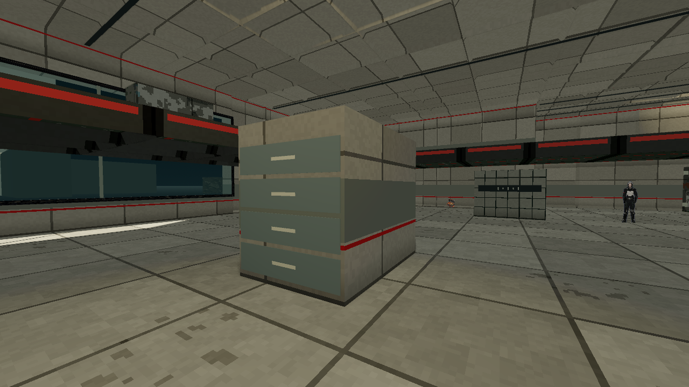
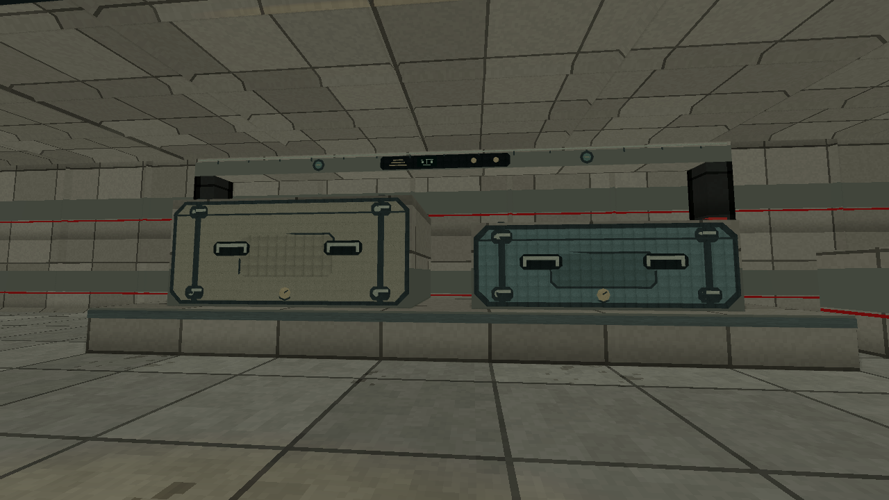
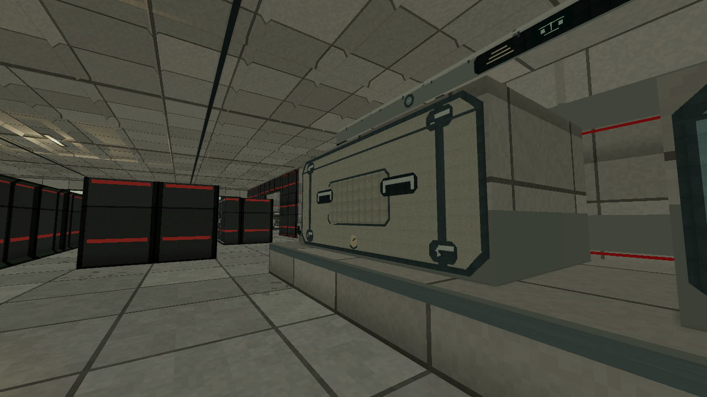
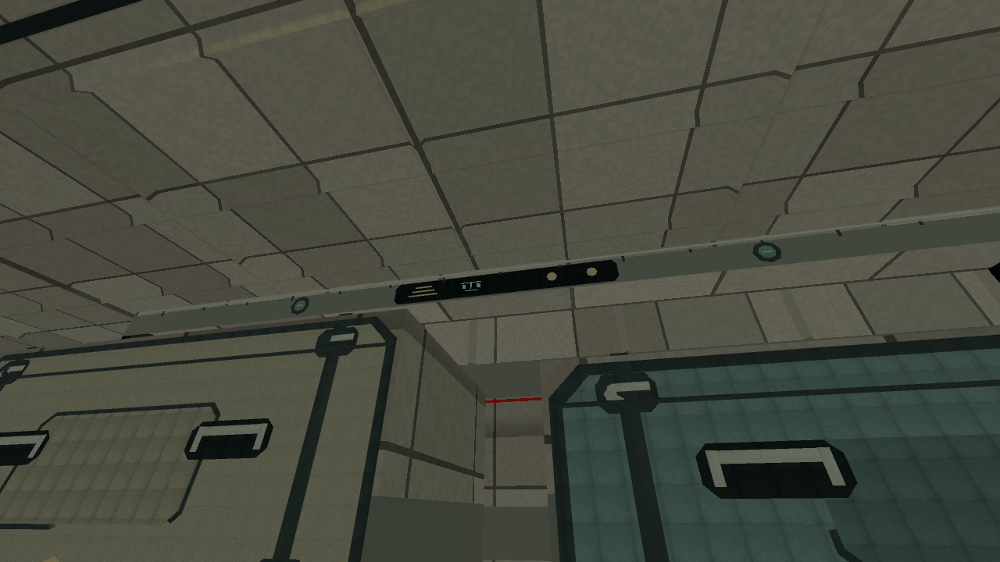
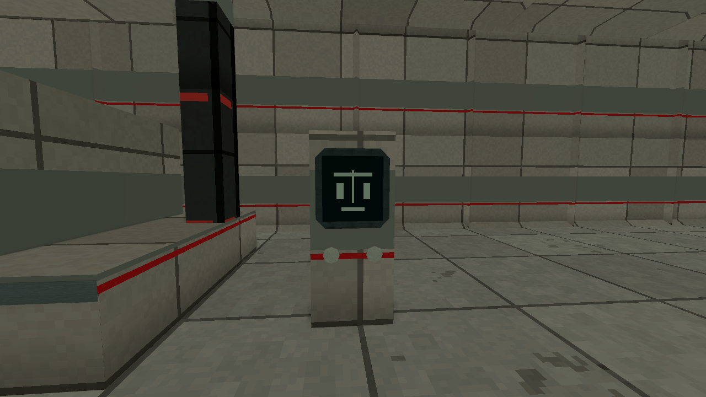

# Working freight and customs evidence

Recorded 2026-10-03. [Bounded plan](../plans/m06-port-activity-architecture.md).
**Status:** local map, presenter, full client checks and played route implemented;
full CI and integration pending. **Spend:** $0, no generation calls.

Fourteen new authoritative solids bring Port of Entry to 106 bodies. A loaded
weighing platform, two different pressure shipments and a measuring gantry give
the empty southern freight apron a working purpose. Two existing customs desks
receive physical inward-facing declaration terminals. A luggage inspection bed
and records cabinet occupy opposite customs edges, leaving central walking and
gallery routes clear. These are static assemblies, with no new interaction,
conveyor simulation, pressure mechanic, supply or progression condition.

The M06-only presenter finishes ten exact machine/work hosts with shallow rails,
clamps, seals, drawers, an existing personal textile and four original 64x32
pixel displays, including the refined beam readout. Full rotated mesh bounds stay within their actual solid
plus 25 mm. Bone, muted teal and weathered steel give the equipment variety.
Black/red issued fittings retain their existing limited role. The enclosing
pressure-shell palette, accepted roof workmanship and shared lighting remain.

## Local verification

`cargo fmt --all -- --check`, server all-targets clippy with denied warnings and
21 focused M06 Rust tests pass. Strict bundled map loading and prepared navigation
still accept every original enemy, supply and mission placement. The unchanged
25-state walking/approach/search proof, 58.25-metre authored Rail sightline,
Turret peek/cover/rear rays and closed pressure hull remain valid.

New movement checks prove that players cannot pass through the loaded platform
and can walk the inspection aisles, including each added rendered-route segment.
Navigation reaches each new work-area approach from mission entry. Resolved-ray
geometry proves that the shipments, desk displays, luggage and sorter really
block shots, while the visible gap above the shipment stays clear.

Godot 4.7.2-stable `test_m06_port_activity.gd` exits 0 with its own PASS marker
and a clean error log. It checks exact venue/host guards, ten assemblies, bounded
mesh count, rotated trim bounds, nearest-filtered world materials, three pixel
screens, retained civilian textile and cleanup.

The complete `tools/godot_check.sh` exits 0 with `Godot checks: PASS`, all
226 script parses and 104 harnesses passing. Its 331 expected labels include
import; none is missing, and no error/failure diagnostics remain. Native local
campaign harnesses use a worktree junction to the private release target, so
their embedded server includes these map solids. The root release executable is
untouched. The log and `full-client-receipt.json` are retained in the same private
diagnostic directory.
The full checker log SHA-256 is
`1d4f0693705b5688d5639825ad9a480865f488b965b640b60f38776ea0780b03`.

## Ordinary-input rendered route

An immutable private release server runs the new authored map on owned loopback
port 16856, zero bots, seed 42 and standard difficulty. The client uses the human
role, isolated settings, records and run storage, with automated pointer release.
Its private 31-state variant preserves all 25 original states, fields and ordering.
Six extra ordinary walking states inspect the work areas and return to the exact
original freight/customs route anchors. No guard, phase or departure gate is
weakened. Source and variant SHA-256 receipts record this preservation.

The client exits 0 with no script/runtime errors, no blank world captures and its
`qa_tour: 31 states under` completion marker. Seven combat reports confirm all
21 named required/optional guards, and all 157 recorded walking goals arrive.
The actual Rail kill spans **52.5141 metres**
from resolved origin to impact, separate from its authored initial spacing.
Turret blocked Windup at tick 3153 changes to early Recovery at 3154; no registered
same-Turret shot occurs through the original deadline 3177, verified at 3178.
All six Arrivals,
the optional prisoner route marker and fresh Use reach `party_departed`.
The completed participant record has zero deaths, 25 HP lost and 100 armor lost.
One secret supply is claimed and all three original secret locations are visited.

Diagnostics and immutable-server receipts live under
`.agents/m06-port-activity-20261003/`. The capture manifest SHA-256 is
`e0bbfbd92aba0e57822183b0557551feaa920b95a0a735d638bcddb63fa6f216`;
the route SHA-256 is
`adf4c54fc34551b6305a606f1a74f03df2c4e5f4d09ee081b275242d074b5183`.
The Godot compatibility renderer ran on AMD Radeon 780M. Owned renderer and
server processes have closed. This is inspected local rendering, not a hardware
performance comparison or supported-platform proof.

## Inspected work-area views

These four initial structure/work-area frames precede the later freight craft
refinement recorded separately below.

The two shipment heights, restrained color differences, holding clamps and
gantry form one broad freight landmark. Actual player approach sees the full
assembly without blocking the long Rail lesson or the first cargo flanks.

Walking around the queue island exposes the inward-facing terminal and the
accepted inspection mat/forms. This closes the previous occluded desk-view
evidence gap. The screen uses a simple paper/list icon, without essential text.

The west-side case carries the existing repaired textile and straps. Its entire
bed/case body is physical cover. Personal belongings give the checkpoint a
civilian activity alongside its control equipment.

Four restrained drawer fronts and handles identify a records cabinet from its
clear southern aisle. It has the same truthful cover as its visible host body.
Supported galleries, enclosing walls and ceiling remain visible in the room.

## Later bounded freight craft views

The first shipment faces were too plain at playing distance. Their refined
finish adds nested chamfered lid borders and recessed panel outlines, a distinct
lid split seam, four recessed carry grips, eight locking cam housings/levers and
two pressure gauges. The existing beam gains a calibration rail, two mounted
measuring heads and a small mass/control readout with physical selector knobs.
The scale console has a clipped-corner bezel and two selectors. Existing offline
enamel/metal grain preserves broad pixel finishes. No new paid asset is used.

All 106 authoritative bodies and map bytes remain exactly unchanged. Panel
bevels describe the lid surface, not a replacement collision hull. Hardware
stays within its real host plus 25 mm and adds no unsupported hanging obstacle.
The map SHA-256 remains
`a36172af57d72e8c42b9a93abb3e132bf02da3f35550df72c0beff39690ea662`.
Focused activity, original presentation, workmanship and mission harnesses each
exit 0 with their own PASS marker and no errors. The activity harness additionally
checks both real chamfered meshes, four grips, eight locks and two measuring
heads, including full rotated bounds for the octagonal dial geometry. A close
inspection caught hidden gauge pointers; their depth is corrected and a
regression requires each entire pointer to sit visibly ahead of its dial face.
The full client checker is repeated for the final finish: 226 scripts and 104
harnesses pass, all 331 expected labels are present and no errors remain.
`craft-full-client-receipt.json` binds that result to the final presenter source.

A separate later ten-state art-view subset uses ordinary dock entry, the actual
freight fight and five physical playing-distance/near inspection states. It
exits 0 with its `qa_tour: 10 states under` marker, all 27 recorded walking goals
arriving and no blank/error captures. Its manifest SHA-256 is
`a0df70d4993336597c77b8cdb3f62d4a21b15553be4d5df9b3f0c16db7705dce`;
the route SHA-256 is
`4d192d933cb0f145c9e11811f97b3da734d16e3bf7e40c9a9a39ceaa706c0d01`.
`craft-final-art-receipt.json` binds these refreshed corrected-gauge views to the unchanged map and retains the
earlier complete 31-state structural route receipt separately. This subset does
not claim a second complete campaign run. Owned rendering/server processes are
closed, and the GPU slot is released.

The same hero approach now reads the clipped lid edges, grips, cam locks, gauges
and calibration/control treatment rather than two large blank colored fronts.

The ordinary front aisle exposes the chamfered perimeter, recessed panel seam,
carry-grip openings and latch housings on the actual shipment body.

The upward view shows both mounted measuring heads, the calibration rail and
the small mass/control panel. The host beam still owns all physical cover.

The clipped-corner bezel frames the existing balance icon and two selectors.
These are static authored controls, with no new Use prompt or weighing puzzle.

## Limits and remaining gates

This bounded pass improves room composition and working purpose. Broad repeated
institutional shell panels, additional authored activity and further sculpted
prop refinement remain wider art work. Static terminals and machinery do not
establish staffed processing, conveyor motion, Tern's tug/wave or mission pacing.
Fresh-player feedback, difficulty acceptance and subjective final-art acceptance
remain open. Full CI, main integration and publication belong to the parent.
