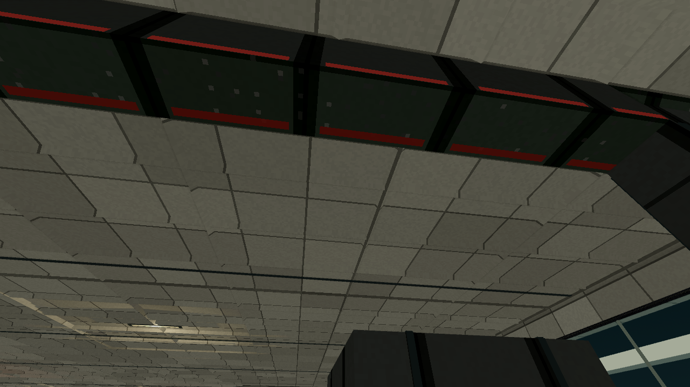
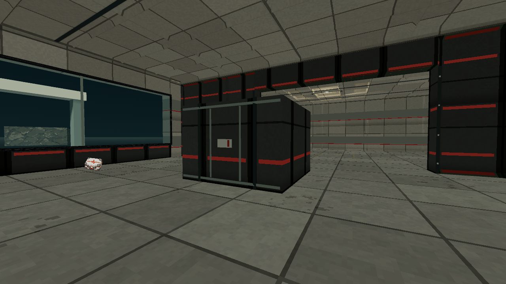
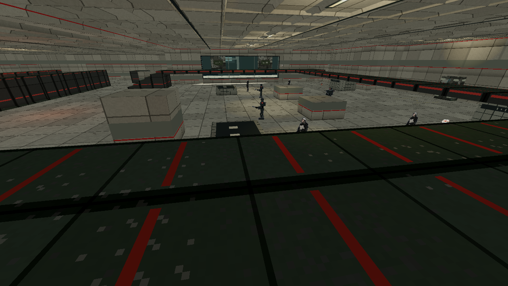

# Port of Entry workmanship evidence

Recorded 2026-10-03. [Bounded plan](../plans/m06-world-workmanship.md).
**Status:** implemented, local structural checks and inspected route complete;
full CI and integration pending.
**Spend:** $0, no generation calls.

The local M06 presenter adds surface-mounted locking straps, cargo edge rails and
seals to four actual freight bodies, pressure-door seals and fasteners around the
already-open arrival bulkhead, shallow roof ribs and eight recessed task lights.
Customs desks and transit booths receive dark inspection mats, declaration forms
and fictional serial scores. Painted transfer lanes remain flush floor detail.
The angular forms use the existing charcoal, bone, weathered steel and restrained
red palette under actual world lighting. No photographic textures are introduced.

The actual authored port selects 150 surface meshes and eight small practicals.
All hosted mesh bounds remain inside the authoritative solid plus at most 25 mm
of shallow trim. Unhosted pieces are six-millimetre floor paint. The lights sit
above supported actor headroom, affect world layer 2 and use the existing practical
quality group. No collision objects, map bytes, rules, supplies, encounters or
mission facts change. Pressure fittings imply no unimplemented vacuum mechanic.

## Local checks

Godot 4.7.2-stable headless checks each exit 0 with a clean error log and their
own PASS marker:

- `test_m06_workmanship.gd`: real host bounds, exact venue and pressure-roof
  footprint guards, finite node/light budgets, nearest lit materials and cleanup.
- `test_m06_mission.gd`: strict mission geometry, retained outcomes, retry,
  departure and presenter lifecycle.
- `test_m06_presentation.gd`: original surface receipts, lunar shell and glass,
  static exterior landmarks and preserved server-owned Turret yaw.
- `test_qa_turret.gd`: deciding blocked Windup, early Recovery and absence of a
  same-Turret shot through the original deadline, including rejected observations.

Logs live under `.agents/m06-world-workmanship-20261003/`. Initial diagnostics
caught nested-array narrowing and exact float-edge comparisons; the final checks
pass with fitting depth kept inside the same 25 mm allowance.

## Actual rendered route

The client ran against the existing release server on an isolated loopback port,
with zero rule bots, seed 42, standard difficulty and isolated settings, records
and run storage. It used ordinary human-role controls. All original 25 states
from `client/qa/m06_port_of_entry.json` are retained with identical fields and
ordering. Three extra camera-only views inspect already-reached arrival, freight
and customs positions. No movement, grants, guard requirements or encounter gates
are removed. The private variant receipt binds SHA-256
`c890053134790d7e5a61acfd2e0a0a2e047ac781e1abb2722974353d5dfdc50d`.

The actual client exits 0 with clean logs and its `qa_tour: 28 states under`
completion marker. Seven combat reports pass for all 21 named required/optional
guards. The Rail kill's resolved origin-to-impact distance is **52.3401 metres**,
separate from the authored initial 58.25-metre spacing. The Turret observer records
blocked Windup at tick 3117, early Recovery at 3118 and no same-Turret shot through
its original deadline 3138, verified at 3139. The optional prisoner route remains
marked, all six Arrivals complete and fresh Use reaches `party_departed`. The
completed participant record has zero deaths and zero HP lost, with 75 armor lost.
One secret supply is claimed; the three secret locations are visited.

Receipt directory: `.agents/m06-world-workmanship-20261003/`.
The capture manifest SHA-256 is
`cd667c78337ee4a2f966cb0143c62c3a2bf08f943dabf4861faa421db084de8b`.
`verified-completion.json` records the actual marker, clean log, 28 states and
departure. The initial private wrapper falsely expected a `qa_tour: PASS` string
and rejected the completed client; that diagnostic is retained. The corrected
read-only verification accepts the script's actual marker and manifest. No
rerender or alteration of gameplay evidence follows from that checker correction.
Owned native and renderer processes are closed.

## Inspected views and limits

The arrival and freight roof planes enclose the interior. Shallow roof ribs and
recessed task lights describe the ceiling without hanging false obstacles in it.

Gray locking straps, raised edge rails and the small security seal are visible
on the actual cargo body at fighting distance. The underlying black/red issued
cargo shell predates this increment; broad lunar walls retain their existing
pressure-shell palette. Character outfits and shared material direction belong
to the wider production pass.

The customs gallery shows a complete enclosing ceiling and walls, pressure-glass
views and the existing real inspection bodies. Desk work mats are visible from
above. The extra ground-floor desk view is partly blocked by a queue island, so
it does not prove close acceptance of the forms or serial marks. The family
window and contained recycling tray are inspected on the route, preserving their
inhabited room and safe glass.

The inspected M06 interiors have no missing-roof defect. Their largest visual
gap remains broad empty deck and repeated institutional panels. The west service
apron beyond z26 is outside its roofed family/service branch; this route does not
establish its complete enclosure. More machinery, domestic facade volumes and
meaningful activity need authored geometry where they would block shots or feet.

## Remaining gates

Full client checks, full CI, main integration and desktop publication belong to the parent
increment. Fresh-player feedback, difficulty acceptance, subjective art quality
and broader hardware performance remain separate from this presentation pass.
