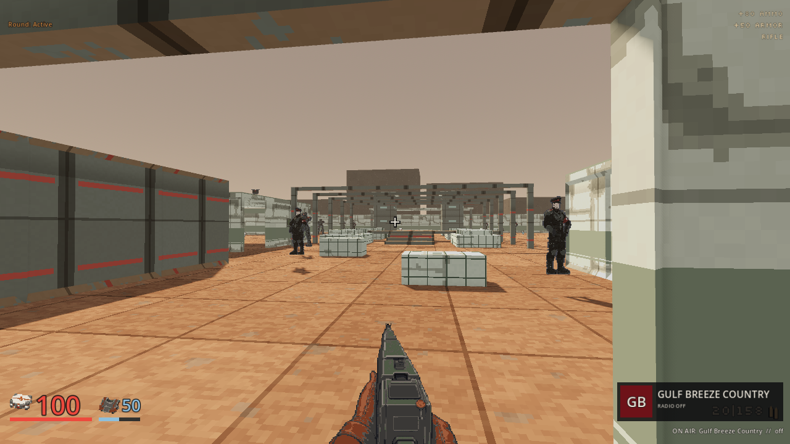
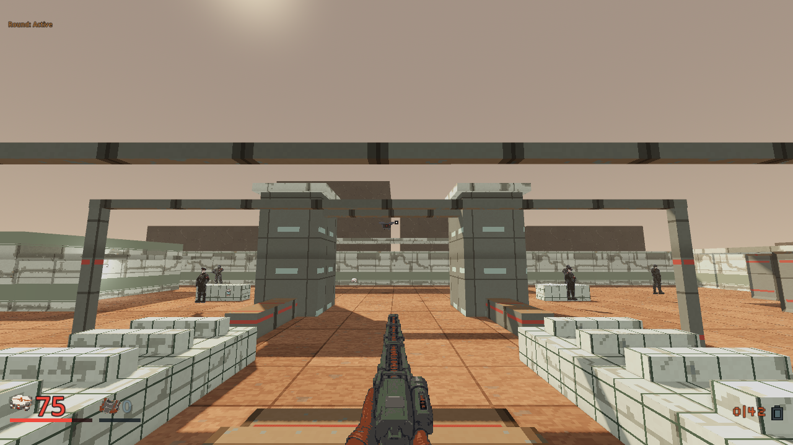

# Terms of Cooperation development evidence

Local verification, 2026-10-08. The [bounded plan](../plans/m12-habitat-development-20261008.md)
develops a standalone infantry map from the accepted level 12 brief. It does
not unlock or complete a campaign mission. The [machine-readable receipt](../screenshots/m12-habitat-development-20261008.json)
records source, executable and image hashes, route gates and retained counts.

## Implemented slice

The strict [source map](../../server/maps/test/m12_habitat_development.json)
contains 104 collision solids, 18 finite supplies and four encounter groups
with 15 established enemies. Arrival, market cross-passages, a maintenance
bay, two greenhouse flanks, a supported bridge, the utility bypass, pumping
court and empty depot approach share the existing server geometry. All
playable props have authoritative collision. The
[GDScript helper](../../tools/bake_m12_habitat.gd) reproduces identical bytes
on a repeat run. No new dependencies, paid asset calls or cash charges were
introduced.

The map is named `Terms of Cooperation (development)`. It uses the existing
file launch path:

```text
cargo run -p fragr-server --release --locked -- --bots 0 --map-file server/maps/test/m12_habitat_development.json
```

Join the local server from the normal client. The connected campaign still
ends at the eleven existing mission prototypes. This map has no mission ID,
readiness operation, save promotion or departure fact. Its retained record
correctly remains active practice and has no mission elapsed time.

## Native checks

All seven [focused integration tests](../../server/tests/habitat_development.rs)
pass. They prove 90 directional routes, covering both directions between
arrival and every landmark, stock and grounded enemy approach; actual walking
through both flanks, bridge and utility loop; physical weapon claims; visible pump landmarks;
and refusal of a crushed bridge, sealed gallery, duplicate identity and
unsupported actor. Unpopulated movement checks isolate geometry and ordinary
integration from combat.

The separate fought clear uses the real `GameSession::tick_messages` path,
including living enemy controllers and their bounded navigation. A finite
human magazine kit clears all 15 guards with normal resolved shots in
1,441 simulation ticks. Eight enemy attacks resolve. This precise test
controller loses no HP or armor and records no deaths. It uses ordinary
movement, weapon selection and reload input, with no teleport or inventory
grant. The last participant leaving restores the encounter stocks; a fresh
participant starts at the authored entry without rewinding the process tick.

## Rendered route

The [ten-state route](../../client/qa/m12-habitat-development.json) passes on
Godot 4.7.2, Compatibility/OpenGL, AMD Radeon 780M, at 1280 by 720. Every
ordinary walking waypoint arrives, all four required combat groups are
confirmed, and all ten captures contain a rendered world. All ten stills
were inspected at their original size. This is a renderer inspection, not
a frame-rate benchmark or cross-vendor claim.

The retained authoritative practice record at tick 2,115 contains 15 kills,
49 attacks, 70 cumulative HP lost, 50 armor lost, zero deaths and zero dry
triggers. The route uses finite ammunition, actual human magazines and
ordinary health and armor stocks. It ends with 100 HP and 50 armor. These
counts describe the rendered run separately from the precise native driver.

The first rendered attempt stopped after six states because a direct QA
waypoint crossed a cultivation bed. The successful retry follows the clear
north cross-passage before returning to the west flank. The failure is
retained under `.agents/parallel-build-20261008/m12-tour`; the passing route,
logs and complete manifest are under the sibling `m12-tour-retry` directory.
No geometry or walking assertion was weakened.





The inspected [utility bypass](../screenshots/m12_utility_bypass_20261008.png)
and [cleared pumping court](../screenshots/m12_pumping_court_20261008.png)
retain their separate captures in the receipt.

## Acceptance limits

The cultivation beds and open frames are blockout geometry. Crop art,
pressure glazing and sealed-habitat acceptance remain unfinished. The
existing Heavy, Rail and Notary retain their actual identities; the Arc,
Assessor, canisters and falling-drone set piece are unbuilt. Shelter rescue,
damageable pumps, arriving aid and coalition commitment need their own
authoritative mission implementation. There is no new aid-arrival claim
from the empty depot geometry.

Automated aiming and inspected stills do not prove fresh-player story
understanding, human fun, difficulty balance, par time or the target mission
duration. Those gates and connected campaign integration remain open.
