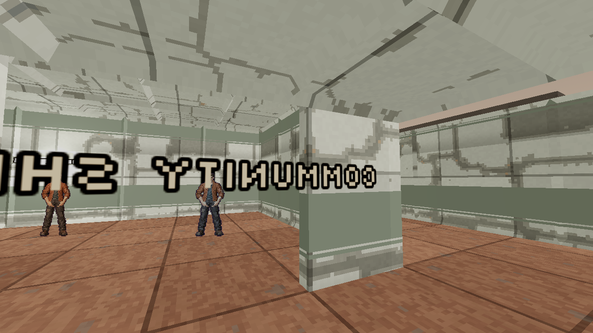
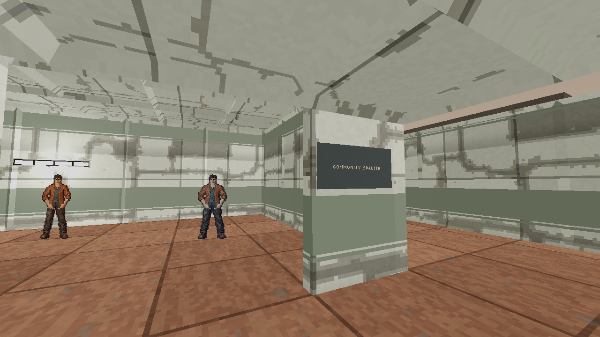
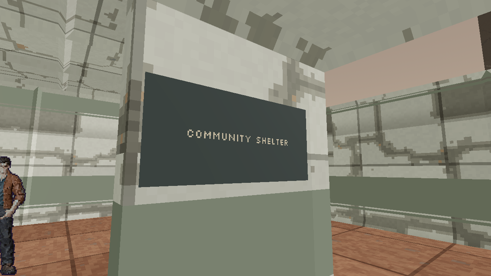
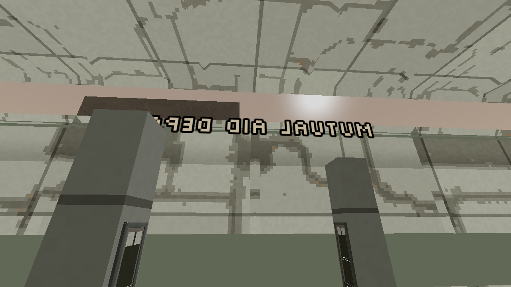
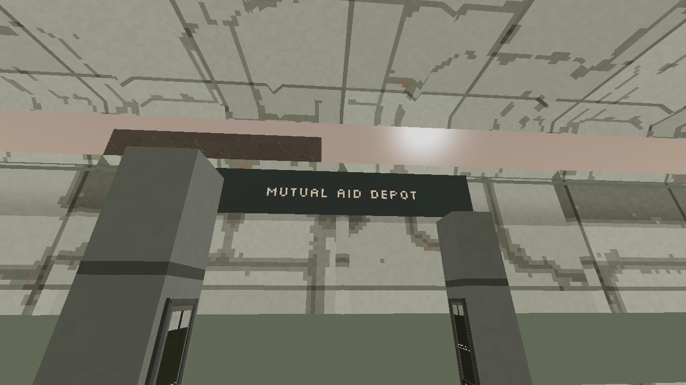

# M12 sign facing, October 8, 2026

Status: implemented locally. The shelter and mutual-aid signs now use fitted,
one-sided keyed text on bounded plates facing their occupied approaches. The
shelter plate fits the existing enamel doorway jamb and keeps the opening clear.
The aid plate faces south from the existing north boundary. No collision, map,
native state or gameplay behavior changed.

The complete existing M12 presentation harness passes with numeric exit zero
and clean logs. A separate owned renderer passes twelve paired old/new frames,
actual host-wall corner checks and clean retirement. It uses the current native
spectator MapInfo, actual cover and production presenters. Three cameras reproduce
the retained ordinary capture poses; three additional supported views inspect the
doorway, jamb and aid plaque. The registered door cover mesh alone is hidden to
replay the retained open doorway, without changing authoritative state.

The old presenter bytes and actual mirrored ordinary images remain retained.
The side-by-side old presenter removes only its global class declaration to avoid
a class collision; that derived file is explicitly separate from the original.
The [receipt](m12-sign-facing-20261008.json) binds all twelve original frames,
loaded source, control bytes, native geometry, focused logs and six public image
copies, with 45 independently rehashed file bindings.

Selected full-size originals show readable forward copy and a clear doorway.
The bridge comparison establishes removal of the distant mirrored copy only.
The exact ordinary button-facing shelter and aid poses do not show a complete
plaque, so readability belongs to the separate supported detail views. An
[independent four-frame review](m12-sign-facing-review-20261008.json) retains its
own exact bindings and the same bounded conclusion.

This is controlled presentation evidence, separate from the existing seventeen
state gameplay/save proof. Whole-client composition, exported-package checks and
final human art acceptance remain separate.
