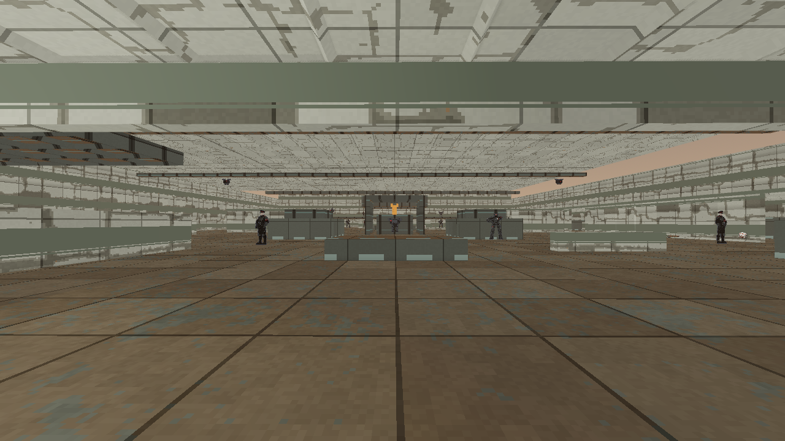
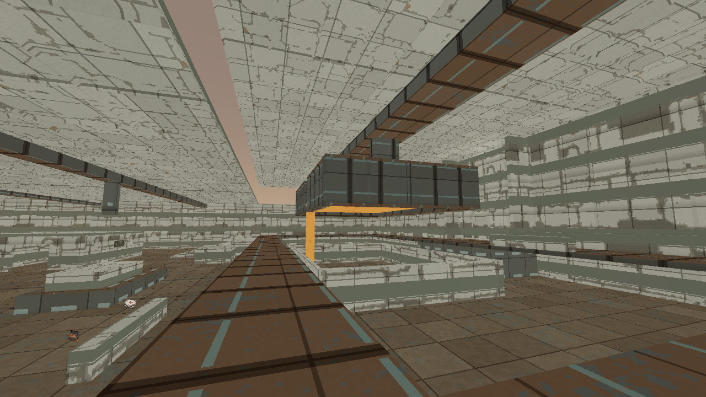

# The Weight of Permission development evidence

Local verification, 2026-10-08. The [owning plan](../plans/m12-m14-foundry-slice-20261008.md)
develops the missing foundry between the existing habitat and launch practice
maps. The [machine-readable receipt](../screenshots/m13-foundry-development-20261008.json)
binds authored bytes, native checks, actual renderer captures and selected images.
These are three standalone development slices. Their connected missions,
transitions and campaign-save promotion remain unbuilt.

## Implemented foundry

The strict [source](../../server/maps/test/m13_foundry_development.json), map
1013, is named `The Weight of Permission (development)`. Its 121 authoritative
solids contain a service entrance, protected process machinery, machine-hall
flanks, worker-quarter frames, freight office and cart loop, a maintenance ring
beside the water-feed housing, two twelve-tread stairs and connected upper ladle
galleries. A static freight-lift landing is the final development destination.
The five groups place 22 existing guards, including two shootable Notaries and
the established Heavy Sweeper and Enforcer. Nineteen finite stocks use ordinary
discovery equipment. No existing enemy or gun is renamed as an unbuilt role.

The [deterministic helper](../../tools/author_foundry_development.gd) reproduces
identical bytes. The exact-name foundry venue reuses offline textures, pale
shielding, dark frames and neutral working light. Three protected process solids
use a steady warm material. They have ordinary collision and imply no heat
damage or timed hazard. No dependency, paid call or cash charge was added.

```text
cargo run -p fragr-server --release --locked -- --bots 0 --map-file server/maps/test/m13_foundry_development.json
```

Join that server through the ordinary client. There is no mission document,
MissionID, readiness operation, campaign unlock or departure fact. The retained
record remains active practice after reaching the landing.

## Native and movement checks

All four [focused integration tests](../../server/tests/foundry_development.rs)
pass. They prove 118 routes, covering arrival and return for every stock,
landmark and grounded enemy approach. Ordinary authoritative walking takes the
floor, maintenance ring, both supported stairs and the gallery loop in 2,080
ticks without a jump or body reset. Malformed fixtures reject missing stairs,
unsupported stock and an unknown Assessor role.

The fought clear uses actual `GameSession::tick_messages`, including enemy
decisions and shared navigation. Finite human magazines and ordinary reload
input clear all 22 guards with 44 resolved participant shots in 2,550 ticks.
Eighteen enemy attacks resolve. This seeded controller loses 25 HP and 50 armor
cumulatively and records no death. It receives no body, health or inventory
grant. The optional ring Cells remain unused. Pre-final movement stays below the
gallery activation at z=27; useful staging Cells are claimed while all five
gallery guards retain their dormant poses and positions. An explicit advance
then fights them. Last-participant departure restores all 19 stocks, and a fresh
participant starts at entry without rewinding the process clock.

The [direct route harness](../../client/scripts/test_foundry_route.gd) passes all
77 walking waypoints from the [QA manifest](../../client/qa/m13-foundry-development.json)
through the shared movement mirror, including both stairs and pre-final
activation exclusion. It isolates static geometry and does not run enemy intent.
Focused sky and Mars venue checks pass, as does focused native Clippy with
warnings denied. The final native and client logs are retained under
`.agents/foundry-development-20261008/`.

## Actual rendered route

The first live attempt completes all 18 states, 77 ordinary walks and five
required combat gates on Godot 4.7.2, Compatibility/OpenGL, AMD Radeon 780M,
at an asserted actual 1280 by 720. All 18 world originals were inspected at full
size. The retained human record at tick 4,924 contains 22 kills, 45 participant
attacks, one gallery armor secret, zero cumulative HP or armor lost, zero deaths
and zero dry triggers. It ends with 100 HP and 100 armor. These rendered counts
remain separate from the seeded native driver's damage and shot totals.

The captured server SHA-256 is
`339de54d19925bc00a6d114a9fbf4884514ca168608c7bf65ff280d0e3baacc8`.
It predates the parallel Conquest source increment; no Conquest or new character
presenter acceptance is inferred from this run. Both owned processes exited,
the client returned zero, and its log has no error or warning. Raw captures,
manifest, isolated records and logs remain in
`.agents/foundry-development-20261008/tour-first/`.





The inspected [machine flank](../screenshots/m13_machine_hall_20261008.png),
[maintenance ring](../screenshots/m13_maintenance_ring_20261008.png),
[ordinary stair approach](../screenshots/m13_stair_approach_20261008.png) and
[freight overlook](../screenshots/m13_freight_overlook_20261008.png) retain
their actual originals in the receipt. Final states 17 and 18 face nearby walls;
they prove route arrival, not readable lift artwork or an animated departure.

## Three-slice consistency and limits

The accepted order remains civilian habitat, a later operation to take the
foundry, then launch works. The habitat's empty depot does not falsely establish
aid arrival. The foundry's static landing and the launch map's freight arrival
use independent map-local coordinates; no moving transfer is implied. No
material route or adjacency defect was found in the existing M12/M14 sources,
whose authored bytes and prior evidence scopes remain unchanged.

| Development slice | Native fought-clear guards | Actual rendered states | Remaining mission work |
| --- | ---: | ---: | --- |
| [Terms of Cooperation](m12-habitat-development-20261008.md) | 15 | 10 | Arc, Assessor, shelter and aid outcomes, connected mission |
| The Weight of Permission | 22 | 18 | Rocket Launcher, worker choice, relay outcome, actual freight lift and connected mission |
| [Launch Authority](m14-launch-authority-development-20261008.md) | 20 | 16 | Specific-yard mounted acceptance, Walker, launch operation and connected mission |

Machinery, process surfaces, restraint frames, roof seams and service rooms are
provisional blockouts. Their shapes and repeated materials need a final foundry
art pass; roofed work areas do not establish sealed habitation. Static geometry
does not implement rescued workers, a working armored utility feed or a
shootable relay. Precise automated aiming and one inspected renderer run do not
establish fresh-player understanding, human fun, difficulty balance, the accepted
duration, par time, final art, performance or cross-platform acceptance.
