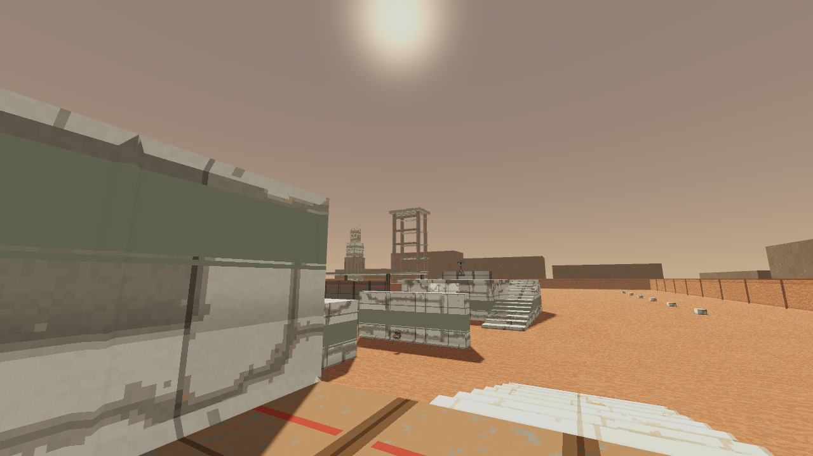
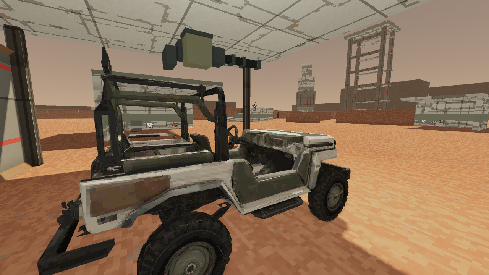

# Launch Authority development evidence

Local verification, 2026-10-08. The [bounded plan](../plans/m14-vehicle-development-20261006.md)
builds a static vehicle development battlefield from the accepted level 14
brief. It does not unlock or complete a campaign mission.
The [machine-readable receipt](../screenshots/m14-launch-authority-development-20261008.json)
binds source, executable, presentation and image hashes to the measured run.

## Implemented slice

The strict [source map](../../server/maps/test/launch_authority_development.json)
contains 119 authoritative collision solids, 20 finite supply placements,
five ordered groups of 20 established enemies, and one explicitly placed
jeep. A freight-lift arrival leads through the depot, covered motor pool,
repair bay, alternating berms, two supplied infantry flanks, lander apron
and gantry defense. Four 3.6-metre perimeter rims visibly bound the closed
yard. The 28-metre service frame is visible from arrival. Every playable
prop uses server collision. Outside ridges and logistics scenery are visual
only and stay beyond the authoritative square.

The [authoring helper](../../tools/author_launch_authority.gd) produces
identical bytes on a repeat run. The explicit Mars launch venue reuses
existing offline materials and the separately inspected jeep asset. No new
dependencies, paid calls or cash charges were introduced.

```text
cargo run -p fragr-server --release --locked -- --bots 0 --map-file server/maps/test/launch_authority_development.json
```

Join the server through the normal client. Its name is
`Launch Authority (development)`. It has no mission ID, readiness operation,
save promotion or departure fact. The historical test map ID 1014 does not
infer vehicles or a Mars venue.

## Native checks

All three [focused native tests](../../server/src/tests/launch_authority.rs)
pass. They check strict fleet authoring, ordered guards, ordinary routes to
both flanks, the depot roof, marksman nest and gantry, plus the arrival gantry
sightline. The pure shared vehicle kernel drives 457.93 metres from the
motor pool around all 13 registered circuit landmarks and back, using
ordinary throttle and turning without pose changes. This proves the
authored circuit against vehicle collision; it is not a human driving trial.

The fought clears use `GameSession::tick_messages`, including actual enemy
decisions and bounded navigation. Each run kills all 20 guards with finite
agent ammunition and normal resolved shots. The driver never occupies a
seat, and every participant shot trace has no mount identity.

| Fleet condition | Kills | Participant shots | Enemy attacks | Simulation ticks |
| --- | ---: | ---: | ---: | ---: |
| Present | 20 | 162 | 2 | 3,308 |
| Absent throughout | 20 | 150 | 2 | 3,208 |
| Initially destroyed | 20 | 162 | 2 | 3,308 |

All three end with 100 HP after ordinary authored stocks. No health, ammo or
position is granted by the controller. The existing abandonment timer can
restore the initially destroyed jeep later in the attempt. That case proves
clearing on foot after destruction, with zero seat use, rather than a wreck
remaining for the whole attempt. The absent case independently proves
clearing with no fleet throughout.

The [client route regression](../../client/scripts/test_launch_authority_route.gd)
passes all 66 straight walking waypoints through the existing movement
mirror, including the parked vehicle hull. It isolates static route
authoring; it does not simulate enemy decisions or establish rendered play.
The three apron stocks and their registered western approach stay outside
the final gantry activation region. The native regression clears the first
four groups, walks the staging route with fire held, verifies useful bullet
claims and correct retention of unneeded full-bag or full-health stock, then
wakes the final five guards through an explicit advance. Both checks reject
a resupply route entering the final trigger.
The focused sky, Mars venue and offline material harnesses also pass.
Unknown map names keep the historical fallback, the habitat keeps its
constructed court markings, and the existing Moon town surfaces retain
their previous warning colors.

## Rendered route

The [16-state human route](../../client/qa/launch_authority_development.json)
completes all 66 ordinary walking waypoints and confirms all five combat
groups on Godot 4.7.2, Compatibility/OpenGL, AMD Radeon 780M, at 1280 by 720.
The retained authoritative record at tick 3,646 contains 20 kills, 76
attacks, zero cumulative HP or armor lost, zero deaths and zero dry
triggers. It uses finite human magazines, real reload input and ordinary
authored health and armor stocks. The final HUD shows 100 HP and 100 armor.
The record correctly remains active practice, with no mission completion or
mission elapsed time.

All 16 world stills were inspected at their original size. They establish
readable blockout arrival, depot, parked jeep, repair shelter, berms and
gantry. This is renderer inspection, not a frame-rate benchmark or a
cross-vendor claim. The upward-looking gantry capture is not used as proof
of the infantry path.

The corrected final route returned exit code zero with no engine errors or
warnings. Its source SHA-256 is
`ebf6e9c1629419aa7b9dc32bfaaa7d365812c33225f42de298f27af0d1628492`;
the native executable is
`8f6d7da7f8889b746024165f42cd361bfdb968001792f81ce7df76aa97f4824d`.
The earlier `tour-final` completed 20 kills without a death, then reported
two remaining OpenGL texture allocations of 349,524 bytes each at shutdown.
That paired signature also appears in older unrelated render logs. This
clean run establishes its own exit result, without claiming that the
intermittent Compatibility sky-retirement issue is fixed globally.

Earlier attempts exposed an unsafe arrival activation, late ammunition,
an automatic early shotgun selection, direct QA segments crossing collision
solids, activation of the last group during an idle screenshot, and an
apron Clerk hidden behind freight after a lateral evade. An unchanged-source
cleanup repeat, `tour-clean-retry`, retained 13 captures before dying on its
resupply approach. That exposed a real placement defect: the three apron
stocks were inside the final activation region. The corrected
map starts its first encounter at the foot of the lift, provides protected
early ammunition, and keeps the shotgun inside the depot. The QA route uses
the actual bunker openings, rounds the east berm and takes a short search
peek around freight. Its apron travel targets only the four apron guards.
The same three pre-final supplies now sit in the western staging lane,
outside the gantry trigger. Ordinary held-fire travel rounds freight through
the southern lane, collects useful stocks and stops outside the final
region. The next combat state explicitly advances with its five required
gantry targets and the already-owned finite Rail.
Collision, enemy damage and inventory rules were retained. Earlier attempts
remain under `.agents/launch-authority-20261008`; the final corrected and
clean route is `tour-resupply-final`. Neither supply quantities nor combat
rules changed in this correction.





The inspected [depot roof view across the bermed field](../screenshots/m14_field_20261008.png),
[western infantry shelter](../screenshots/m14_west_shelter_20261008.png) and
[cleared gantry approach](../screenshots/m14_gantry_20261008.png) retain their
separate originals and hashes in the receipt.

## Acceptance limits

The parked-gunner Notary setup exists in the level. Shared mount mechanics
have a separate native fixture, while actual mounted combat in this specific
yard still needs its own played acceptance. Blockout berms, perimeter rims,
lander and repeated service shells need a final Mars art pass.

The Walker, other-site flares, voiced coalition departure, launch operation,
episode ending and connected campaign integration remain unfinished.
Existing enemies retain their established identities. Automated aiming and
inspected stills do not establish fresh-player balance, human fun, story
understanding, par time or the intended mission duration.
