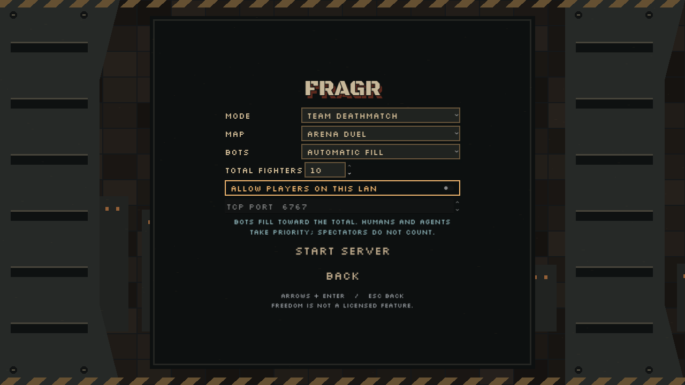
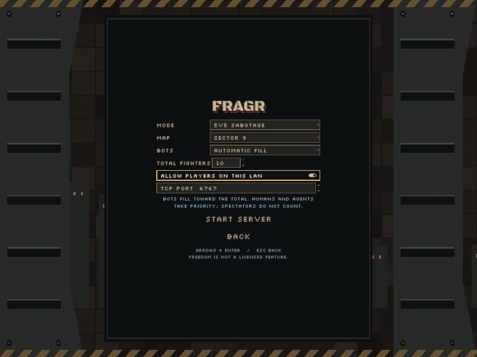
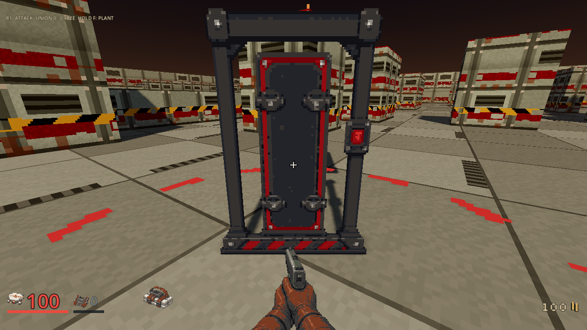
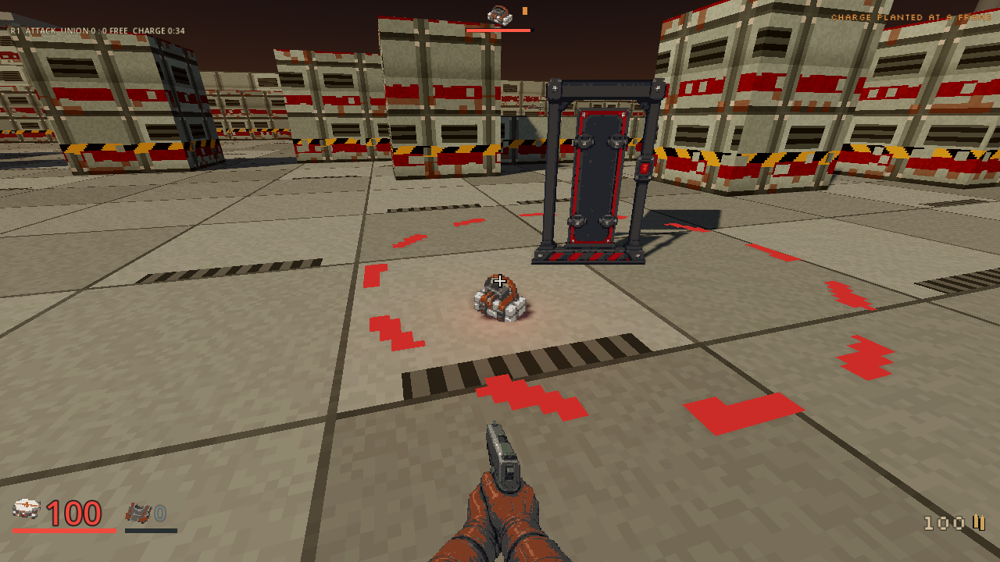
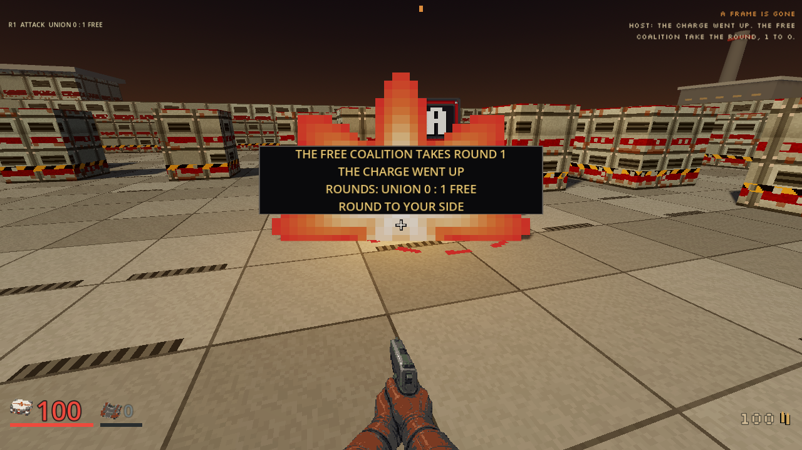
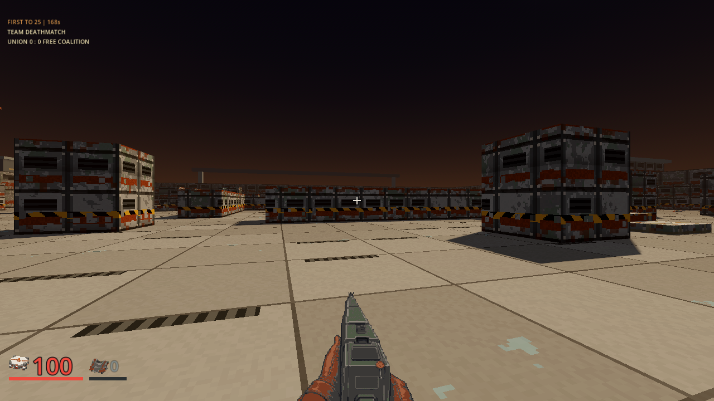
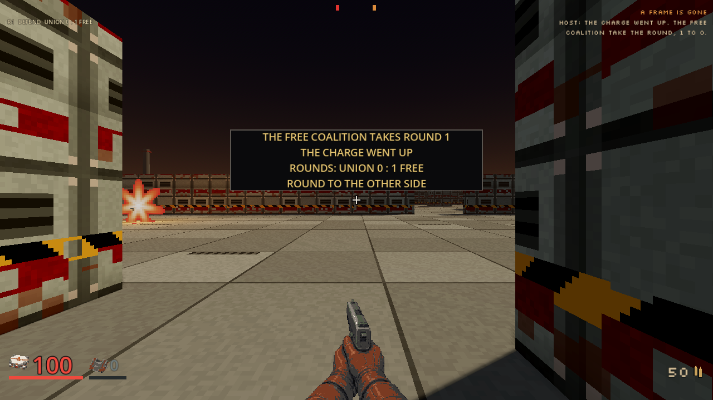

# Desktop multiplayer trial, October 5, 2026

Status: **implemented**; human and two-machine LAN acceptance remain open.
Desktop Host implements Team Deathmatch on six existing
arenas and optional 5v5 Sabotage on Sector 9. These source witnesses support the
[multiplayer-first plan](../plans/multiplayer-first-playable.md). The CI and
Release workflows own final integration, three-platform package and release gates.

The host owns its matching native process. Watch, Join, Leave and return to menu
share that match; Stop server and app exit retire the owned process. Existing
dedicated hosting remains available. No cloud account or paid runtime is needed.

## Actual desktop witnesses

The earlier played witnesses below used source `dbe28271140caa4be75cd78ba4fe37a31852f9f4`,
native source `ae4ad91870d0f3fb5c60bc4aa11eee2da8c94d62` and native SHA-256
`a55e29cc543481af33f74d0f3f82c16d0c2de50a596625525ca5d7bf4a5c47cb`.
They ran through real owned Host readiness, ordinary networking and presentation
on Windows using Godot 4.7.2 Compatibility and Radeon 780M. Automation supplied
ordinary movement, fire and Use. It did not grant equipment or teleport players.
The install-check and package-smoke changes at that checkpoint preserved
ordinary gameplay, native and asset bytes. Later server corrections have
their own source and verification scope.

| Witness | Observed result | Limit |
|---|---|---|
| TDM moving combat | Unchanged canonical moving/fire route and ACK expectations passed with one rule bot | This passing run did not resolve a kill |
| 5v5 Sabotage | Eight-state ordinary route planted a charge and detonated it; authoritative round score became Union 0, Free Coalition 1 | Zero rule bots; this rendered route did not defuse |
| Two independent desktop apps | Distinct human participants received 504 unique matching server ticks, including players and team scores | Both ran on one computer over loopback |

Each successful run exited 0, had clean error logs and its own PASS marker. Both
desktop processes and each owned native child retired; an independent socket
probe confirmed the stopped listener refused connections. These observations
do not establish a physical two-machine LAN session or human enjoyment.

The [curated receipt](../screenshots/multiplayer-host-20261005/receipt.json)
binds original captures, canonical routes, logs and private lifecycle receipts
by SHA-256. Original failures remain retained: an early private Windows
closed-port predicate was invalid, and a later TDM run failed the unchanged
ACK-gap expectation. The quiet passing route did not weaken that expectation.
The server's instrumented mixed-party campaign fixture failed two whole
coverage runs. Precomputing its exact worlds and navigation before live sockets
preserves every timing and gameplay assertion. The corrected native checkpoint
`dff0b39b` passes the full 991-test server suite and unfiltered workspace line
coverage at 93.66 percent. The original failures remain separate from that proof.

A later two-desktop Sabotage attempt exposed a real empty-room defect: the
opening round advanced before either fighter joined, producing 1:1 after the
eventual detonation. The same native checkpoint keeps empty or parked-only
Muster at round one until an attached contestant arrives. Its regression tests
cover delayed humans, agents, spectators, resume and one rule bot. A new rendered
two-desktop correction is verified in the final paired witness below.

The complete combined client checker at `f38ce343` passed 132 of 133 harnesses
but correctly failed on a music decoder still alive at exit. The owning fixture
now requires its five actual playback references to retire after ordinary scene
exit. Its focused real-native run passes with clean logs; final composed whole
client and package gates remain independent from that focused result.

## Final paired source witness

Clean client `fc8b9d6f968c746b6621edf0876c49518e1145a0` uses native source
`cd3a17e53913498c3b271ff36b52c0b1a659309f`, with immutable Windows binary
SHA-256 `8619918a00b94edaacc89f4a16cfdad39989d119d4285c9fdd50b3de2ca59e76`.
The strict local boundary now contains seven settings fields and eleven readiness
fields, including the three bot policies and configured total fighter target.

The real desktop lifecycle harness passes both presets and automatic-fill human
and external-agent arrivals, explicit Leave/refill, preserved unrelated listeners
and owned Stop. All five actual radio playback references retire. The actual
installation harness retains campaign preview and missing-native checks, then
starts both hosted presets and receives real maps/snapshots before owned Stop.
Both Godot processes exit zero with clean logs and their own PASS markers; all
seven observed native children retire. A new test-lambda parse failure is retained
separately from the narrow syntax repair and corrected passing run.

Two independent rendered desktop apps then repeat the unchanged eight-state
Sabotage route. The original secondary startup delay is retained. Both ordinary
human participants see 501 unique matching authoritative ticks, including 21
matching nonzero round-one detonation results: Union 0, Free Coalition 1. Literal
ATTACK and DEFEND views show the same result from different positions. Both apps
and the owned native retire; an independent Windows socket probe returns refusal
10061. Logs, route, shared samples and images are independently rehashed.

These source checks prove same-computer lifecycle and the stated objective route.
They do not prove a physical two-machine LAN match, defuse in this rendered route,
a contested ten-player match or human enjoyment. The earlier TDM moving route
still has no resolved kill; authoritative TDM scoring and plant/defuse have their
separate server and semantic playtest checks.

### Full Linux checker fixture correction

Public source `170933df` passes all three extracted desktop package and install
checks in [run 37381173537](https://github.com/blisspixel/fragr/actions/runs/37381173537).
Its complete Linux client checker in [run 37381173466](https://github.com/blisspixel/fragr/actions/runs/37381173466)
fails the desktop lifecycle fixture. Role change clears the presenter's old map;
Welcome can precede the fresh MapInfo. The fixture asserted the mode too early.
It also queried an already retired PID, which the Unix process API reports as
an error. These failures are retained and do not count as a whole-client pass.

Test-only correction `6473e758` waits for fresh validated map data under the
existing deadline before the unchanged mode assertion. It retains the actual
process owner across Stop or owner deletion, checks retired ownership and closed
pipes, and rebinds the exact captured loopback port to prove listener closure.
All five radio-retirement checks, unrelated-listener protection and live PID
checks remain. Independent source review and a clean parse pass; final composed
CI owns full Linux, Windows and macOS execution. Production client and native
trees are unchanged, preserving the played witnesses' stated runtime scope.

## Literal captures

The Host controls below come from clean source `e82893e3`. All three bot
choices in both presets and the Multiplayer page were captured at three actual
window sizes. All 21 literal frames pass layout checks and independent visual
review. The real renderer exits 0 with clean logs and retires. No native match
was launched for this static witness. The small Sabotage image is an actual
800x600 window; earlier static source bindings remain in the curated receipt.

The final paired source, attacker result:

The same authoritative result on the defending desktop:

## First human trial

Use a build containing Host, then follow [Playing](../PLAYING.md) and
[Hosting](../HOSTING.md). Start TDM with a few bots, Watch, Join, leave and join
again. Try Sector 9 Sabotage next. For another computer, enable LAN hosting and
give the peer the host's actual LAN address and chosen port.

Record the build, mode, map, human/bot counts and whether the second player was
on another machine. Report confusing controls, team readability, weapon starts,
objective clarity, spawn problems, frame hitches and disconnect behavior. A
short description of the moment is sufficient. Human feedback determines which
maps and fights need refinement before broader campaign production resumes.
