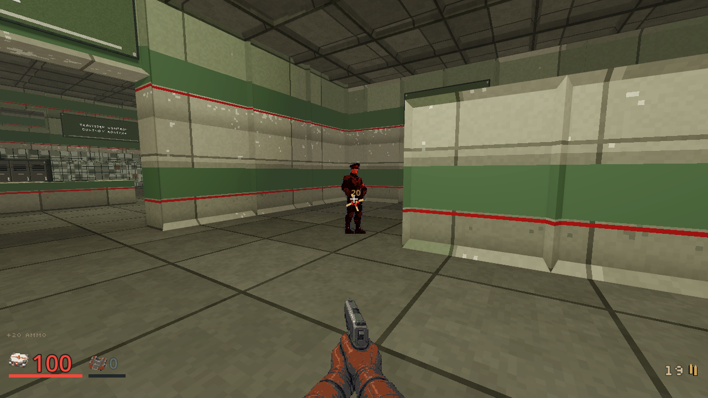
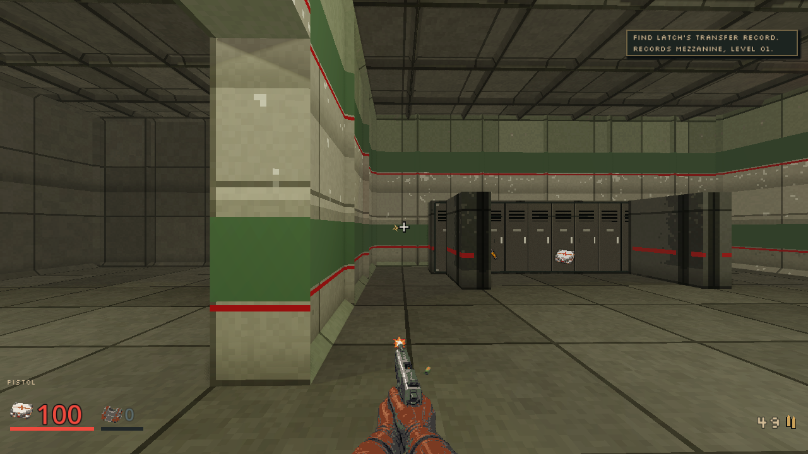
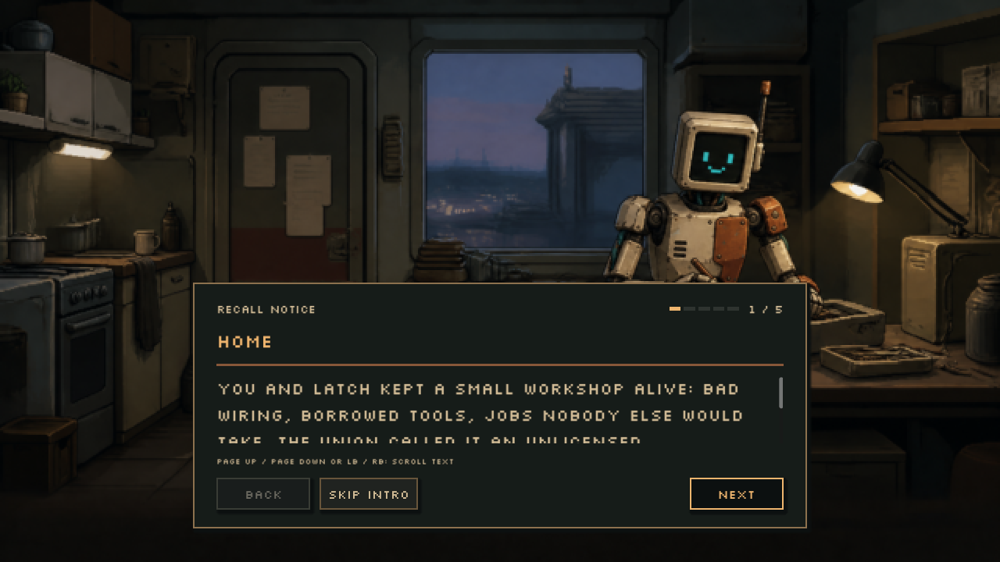

# Pistol and Latch continuity, October 5, 2026

Status: implemented and inspected locally, final integration pending. This receipt
belongs to the [first-person quality plan](../plans/first-person-weapon-quality.md)
and [character continuity contract](../design/characters.md).

## Drawn Pistol

The replacement follows the accepted Shotgun workflow: a drawn idle image, then
a firing image derived from that same idle. Both use a 241x180 full canvas,
registered palette, hard transparency and nearest filtering. Four completed
image requests consumed an estimated $0.410 of authorized prepaid allowance.
No model credits were used for this replacement. Historical model sources,
mechanical checks and the separate world pickup image remain unchanged.

Focused Pistol source, weapon-view, sabotage-art and pickup checks passed with
zero exit, clean logs and their own PASS markers. The view check uses a measured
grip column shared by the actual idle/fire images; earlier rejected column
attempts remain in private diagnostics. No acceptance threshold was disabled.

An ordinary M01 playthrough passed the first seven canonical discovery states:
start disarmed, fists, found Pistol, firing, exhausting finite ammunition,
claiming another finite supply and defeating the actual Clerk. It used no
equipment grant, teleport or health adjustment. This is a campaign prefix,
not full mission acceptance.

- Client source: `8879b5eeb4e60de699984dfc74362833fb4f6eed`.
- Native source: `400595d06b6b268a64b0321015ae23921e597567`.
- Native SHA-256: `a04418b6f9ddd6a50e9697f31d2a921cc29998fdad61ff6df30737aa100eeb3f`.
- Godot 4.7.2-stable, OpenGL Compatibility, Radeon 780M, 1280x720.
- Both owned processes exited successfully and were retired.

## Home image

The previous workshop illustration depicted an incompatible featureless robot.
The correction uses Latch's canonical stylized reference: a tall rectangular
screen face, friendly cyan pixel expression, one anatomical-left antenna,
lean civilian proportions and matching unequal copper-rust repairs. The room,
calm repair work, captions, scene order and readiness contract are preserved.
The historical image entry and its hashes remain in the opening manifest.

One completed image edit consumed an estimated $0.094 of prepaid allowance.
The selected scene source SHA-256 is
`e7caf907a9dde4657c47a4a9370a820dc305921c598b9879f97547aa7709899d`.

Story-scene, scene-player and campaign-opening checks passed with zero exit,
clean logs and owning PASS markers. The ordinary HOME scene was inspected at
1280x720, 1024x768 and 2560x1080. All render processes were retired. Audio was
muted for these captures; they establish no new listening verdict.

The [capture receipt](../screenshots/pistol-and-latch-20261005/receipt.json)
records the hashes of these literal, unedited renderer screenshots.

## Remaining acceptance

Cross-weapon review must compare palms, fingers, wrists, sleeve material and
registration at the same actual HUD size, including firing, bob and aspect
ratios. Canvas dimensions alone do not prove matching hand proportions.
The Sniper glove style and enlarged Shiv hand need separate corrections.

Named crew and provisional civilian presentation remain separate cast work.
This home correction approves no other portrait, generic strip or finished
character animation. The 190 asset and construction-kit briefs have been
audited for design, references, integration and credit requirements; that is
planning coverage, not 190 completed assets. Final combined CI, packages and
main promotion remain separate from these local visual receipts.
