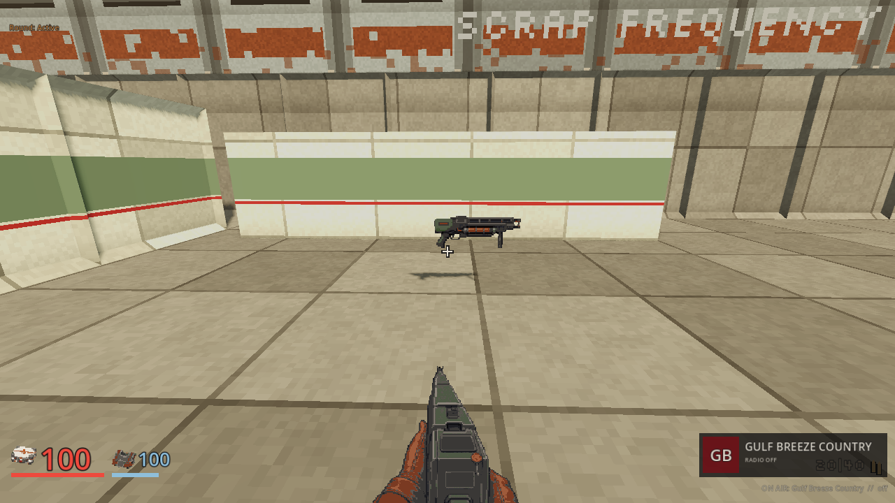
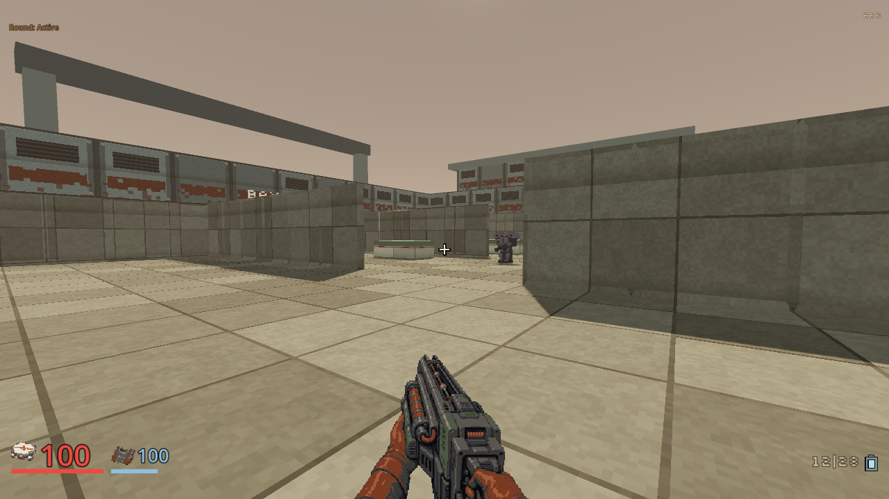
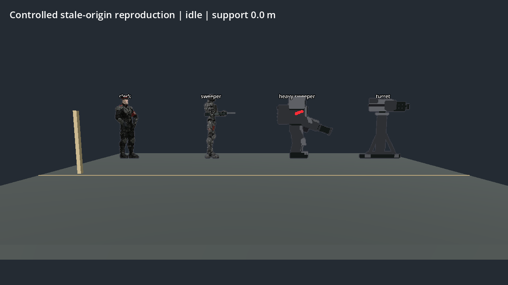
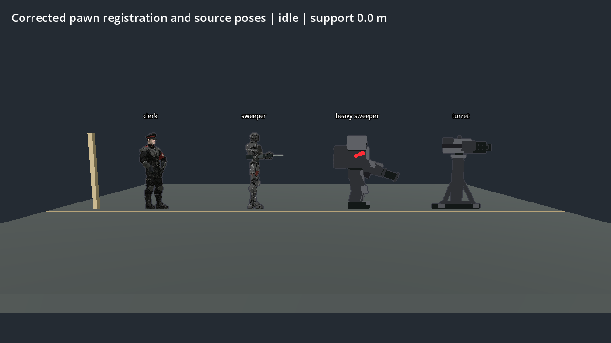
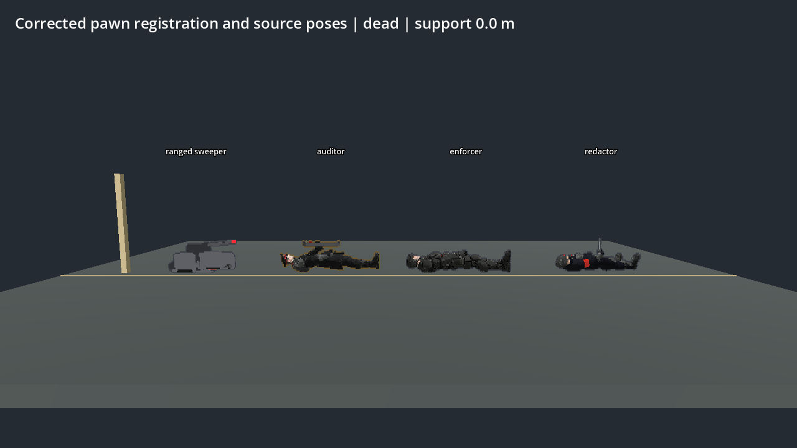
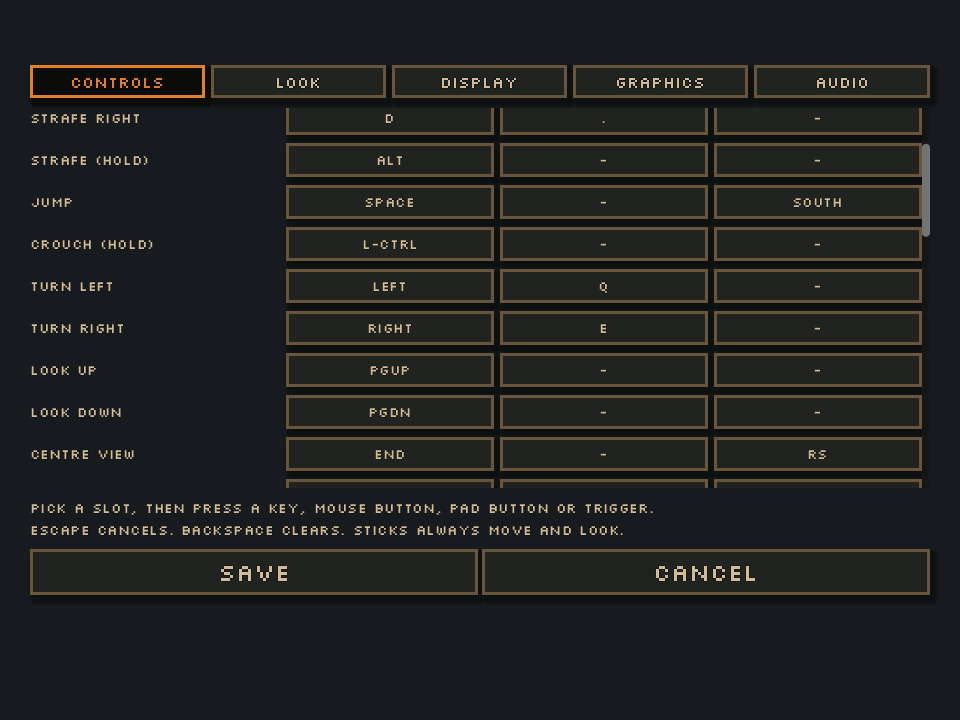
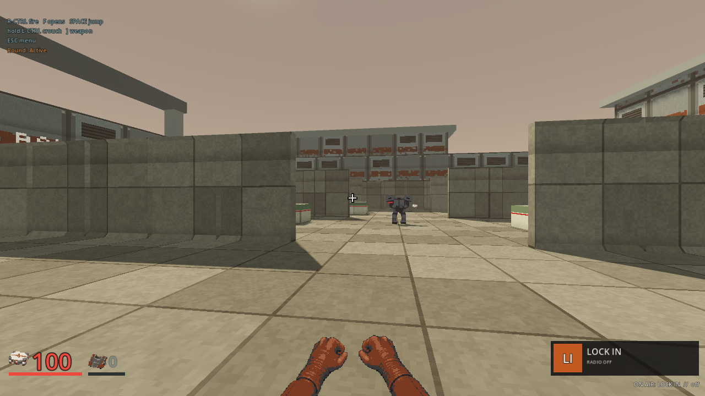
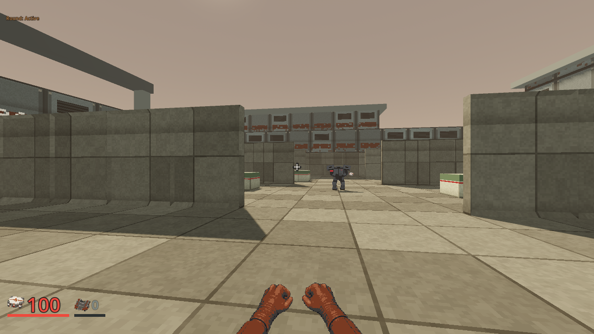
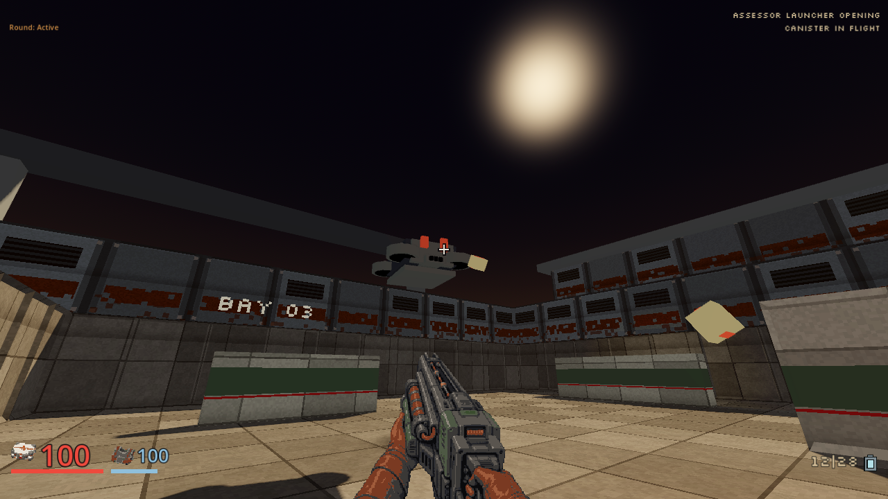
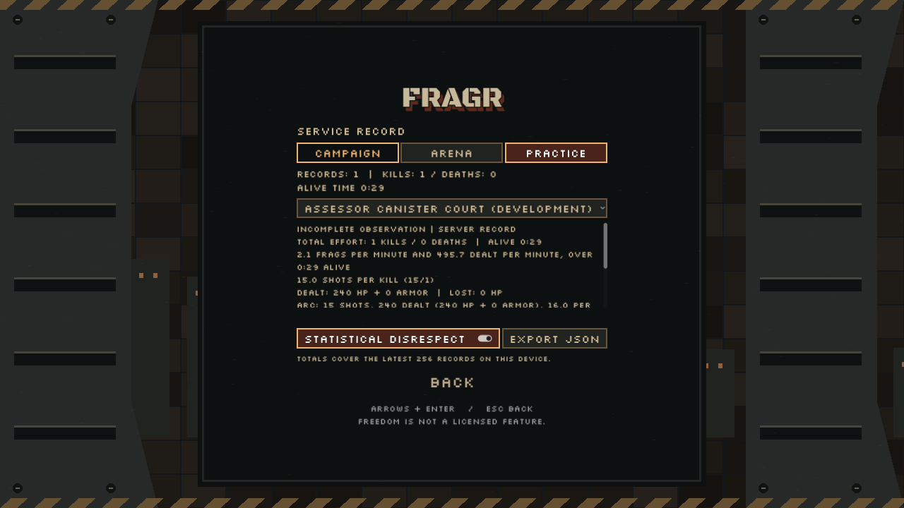

# Presentation corrections

Status: **implemented locally**, 2026-10-08. The [exact receipt](presentation-corrections-20261008.json)
binds 227 retained files. These are focused presentation and ordinary-input
checks, separate from the final composed build and human acceptance.

## Arc and weapon consistency

The rejected undersized Arc is replaced with a substantial industrial electrical
projector. Its dark steel receiver, muted green covers, copper capacitor and
protected conductor rails fit the Martian maintenance origin. Leather gloves,
rust cuffs, pixel density and held perspective follow the established guns.
The actual held canvas is 241x180, displayed at 482x360 with preserved aspect.
Idle, fire, settle and capacitor-reset poses retain that registration. The
matching world profile depicts the same construction.

The nine-state ordinary lesson completes with 30 Arc discharges, 27 connections,
480 effective HP damage, three kills and no deaths or player damage. A physical
R press starts the finite reset at tick 843, with `ready_at` 865. Loaded rounds
change from 6 to 10 while the carried Cells total stays 10. Eight of nine sampled
frames show the reset, followed by the ordinary idle frame. A separate two-state
route establishes the unclaimed pickup and actual acquisition. Its earlier
attempt incorrectly requested weapon selection before walking to the find;
the corrected route relies on the actual pickup and authoritative loadout.
No weapon, stock, damage or outcome is injected.

The whole-table comparison keeps the accepted existing guns as references.
Repeater's finished held art remains open. This correction does not establish
that every arsenal asset is complete, or that the player has accepted the new Arc.

Seven bounded requests completed and downloaded through the existing image
pipeline, with a reconciled price estimate of **$0.741** against the **$1.50**
correction ceiling. The receipt records each request identity and estimate.
There are no uncertain requests, new cash charges, top-ups or enabled overages.
The reported $4.65 balance is historical. The supported free API has no live
balance endpoint, and these estimates are not billing receipts.

## Enemy floor registration

The shared pawn refresh restored the scene's stale sprite origin, lifting
grounded enemy presentation by 0.45 m. It now retains the origin selected by the
actual enemy presenter. Authoritative position, collision, aim and navigation
are unchanged. The same fix preserves the Notary's separate registration.

Each controlled mode contains 18 states and 60 measured samples across ten
grounded roles, idle/hit/dead poses and floors at 0 m and 2.4 m. Corrected opaque
bottoms range from about -0.019 m to +0.038 m relative to support. The stale-origin
control ranges from +0.206 m to +0.487 m. The before control explicitly selects the
old origin and three retained prior atlases; it is not a complete historical build.
The fixture uses actual pawn presentation and a 1.8 m reference post.

The stricter source checks also caught three penetrating corpse attachments.
The Heavy's dropped cannon and collapsed upper body, the Jammer's emitter,
and the Crawler's final death tilt now keep their actual geometry supported.
The partial bake preserves all five unrelated retained atlas/normal files.
An Auditor's optional repair lamps now hide while dead or rising and return
when standing. The corrected corpse review retains that separate fix.

Fourteen focused client harnesses pass, followed by fresh grounding, Auditor
and Auditor-source rechecks. The grounding harness instantiates real pawns,
checks all eight atlas facings, repeated snapshots, hit and scale refreshes,
eleven roles including the hovering Notary, and a deliberately stale negative
control. Offline source support checks cover 63 death progress samples and a
transformed nested-mesh penetration control. Ordinary corrected canonical
mission acceptance follows the stair and save compatibility work.

## Held crouch

Crouch's core shipped in e4df1a0b (v0.79.0). The local presentation update labels
it CROUCH (HOLD), shows its actual rebound key in loading and gameplay prompts,
and documents Left Ctrl. Right Ctrl remains fire. The controls and loading
components were captured and inspected at 960x720 and 1280x720.

The ordinary physical-key socket check completes four states. Its observed
standing eye is 1.60 m and crouched eye 1.15 m. Measured movement is 5.000 m/s standing
and 1.700 m/s crouched, a 0.340 ratio across actual server ticks. Left Ctrl stays
held during crouched movement, releasing it restores the 1.60 m eye and standing
snapshot, and no fire action is held. The test changes no inventory or stance
facts directly. The first diagnostic used an incorrect Camera3D cast for the
existing Node3D camera controller; its runtime errors remain retained, and
the clean second attempt supplies the accepted observations.

Focused native cases cover the shortened hit volume, lower chest aim, reduced
speed, absent standing field and low-ceiling refusal. Keyboard-only input,
rebinding, local prediction, spectator camera, live character and loading
harnesses also pass. These checks do not establish a new gameplay-version
change, autonomous bot crouching or a new default gamepad binding.

## Current-art Assessor lesson

The separate five-state finite development lesson was repeated with the
corrected Arc and current enemy presenter. It completes with 15 Arc shots,
240 effective HP damage, one kill, no death or HP loss, 30 armor lost and 25
Cells remaining. Nineteen actual post-draw canister frames and five enemy-phase
stills retain the original launch and projectile presentation. The development
drone art remains unfinished.

All ordinary routes in this receipt use the pinned native SHA-256
`f35a6ce41b1ea3d48d121712df99bfd7e6a86b78b2f93900282f5e0faf1d3cff`.
Each selected renderer and owned native process retired with numeric zero and
clean logs. Rendering used Compatibility/OpenGL on the recorded AMD Radeon 780M.
This is visual inspection, with no hardware frame-rate claim. Practice
observations do not create completed campaign bests or appearance rewards.

Full workspace, coverage, final client, package, network and canonical mission
gates remain separate. Fresh-player fun, difficulty, final art, campaign duration,
physical LAN and all-platform acceptance remain open under the roadmap's single
full build order.
