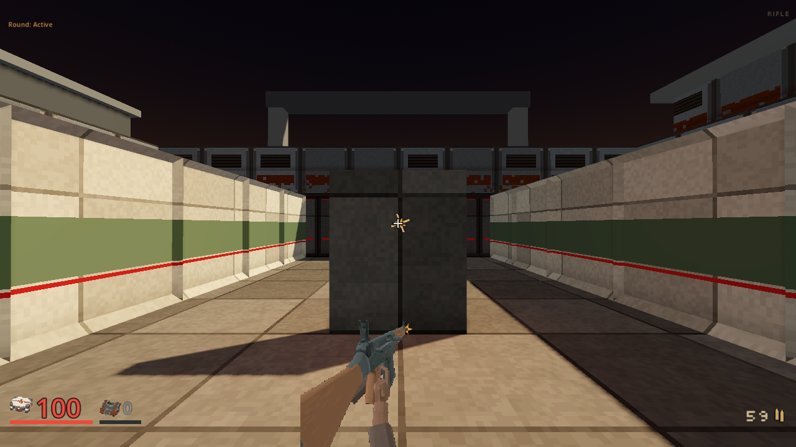
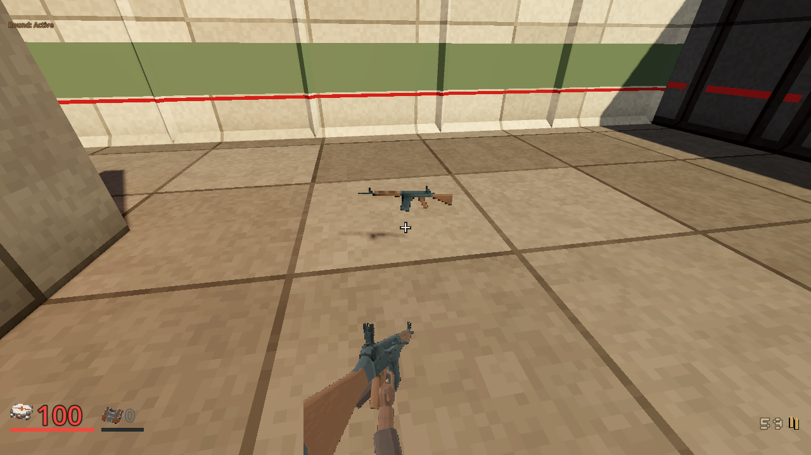

# Civilian Rifle source refinement evidence

Date: 2026-10-04. Status: **in flight**, source retained offline. The prior
source and paired presentation passed technical acceptance and shipped in
PR #356; the player subsequently rejected the framing and style. Earlier Rifle
pictures are restored through the [bounded correction](rifle-art-restore-20261004.md).
The evidence below is retained history, not current visual approval.
This cut spends $0; the shared production receipt owns
the earlier 15-credit source.

## Source and physical mechanism

Reviewed raw SHA-256:
`5d53e8995a825b4e594c9b812759dcb070342bfddc73bd64ba351ea9a0576394`.
Prepared source SHA-256:
`152628e4b61afd772c21b72158218c73821948e809ec1a21b36f1159bb0b462e`.
The preparation receipt binds the exact source and preparation script.

All 6,122 original triangles remain: Body 5,818, Bolt 216 and Trigger 88.
Two separately authored hollow pieces add 384 triangles: BoreLip 192 and
BoreLiner 192. Total gun geometry is 6,506 triangles. Bolt islands 5149 and 6173 include the actual
moving handle; trigger island 5719 moves within fixed guard island 5343.
Furniture, magazine, barrel and muzzle remain fixed within the recoiling gun.
The normalized source is 0.94 m long, faces -Z and embeds 1K maps. The source
import uses uncompressed embedded images and disables generated LOD. Actual
loaded material paths confirm it has no extracted texture dependency.

Charcoal, walnut and restrained sage values replace bright scratch patterns.
Nearest sampling, four-texel clusters, metallic 0.06, roughness 0.96 and normal
scale 0.20 are deliberate offline material choices. Visual quality cannot be
inferred from those numbers.

The offline source presenter moves the bolt and handle 30 mm and pivots the trigger,
returning within 0.14 s, below the existing 0.20 s Rifle cooldown. Forty-one
sampled times prove fixed furniture, muzzle and glove transforms, actual
stroke and independent trigger motion. Invalid and settled times restore
rest without accumulated offsets. There is no magazine or reload mechanic.
Seven coherent poses supply the idle and firing pictures; this does not add
a live three-dimensional weapon or a continuous weapon animation player.

## Contact and retained failures

The contact gate computes distance to the source mesh's actual triangle
surfaces. It tests the authored index fingertip against the trigger and the
support fingertip against the handguard, using their actual radii. This is
more specific than overlap with a whole-weapon bounding box.

The first contact helper produced a typed nested-array runtime error. That
log is retained despite the engine's zero exit code. The corrected helper
then rejected a support glove too far below the curved handguard. Raising
the glove to the actual surface passed without relaxing the radius. Final
`test_rifle_source.gd` completes with a clean log and its own PASS marker.
The source, receipt, embedded-map and mechanical assertions also pass.

Private logs are retained under `.agents/rifle-source-20261004/`, including
`test-refined-contact.log`, `test-refined-contact-fixed.log`,
`test-refined-contact-raised.log` and `test-refined-embedded.log`.
Only this source's untracked default-import sidecars were moved to the
private diagnostic directory after embedded-map validation.

## Inspected source and pixel acceptance

The first seven-pose offline studio completed with a clean PASS. Its held
framing was left-heavy and the support palm read as a hanging paddle, despite
the fingertip contact gate. That rejected frame set remains retained as
`studio-refined-first`. The next source keeps contact and physical dimensions,
turns the palm beneath the horizontal handguard and uses geometry-derived
receiver/sight plane contrast. The second clean studio reveals a wrist/palm
gap and an overly straight held view. Those frames remain retained in
`studio-refined-second`. The source now connects the wrist to the palm, and
actual surface-distance gates plus a separated-wrist negative control pass.
The middle three-quarter third studio was inspected. Its bore looked filled
because an existing surface about 37 mm inside the barrel used the same
green paint as the receiver. All original triangles remain; dark hollow lip
and liner geometry plus restrained paint on the actual inside surface now
make the recess readable. The central triangle probe is clear through 28 mm,
while the same probe hits the outer rim. Both local meshes stay inside the
original barrel envelope. The source test uses the documented
[segment-triangle helper](https://docs.godotengine.org/en/stable/classes/class_geometry3d.html#class-geometry3d-method-segment-intersects-triangle)
in conditioned centimetre coordinates, outside combat resolution.

The third candidate failed the canonical moving/fire bottom-alpha check.
The fourth camera shifts from x=0.180 to x=0.170 m so the real glove sleeve
crosses the fixed lower registration through motion. Original column 112,
alpha, cutoff, bob, recoil, fire and resize gates remain unchanged. Fourth
canonical `test_viewmodel.gd` exits 0 with a clean PASS. Only two private
candidate texture paths were substituted during that check, then exact
original WeaponArt hash was restored. A prior attempted constant dictionary
override was correctly refused by the parser and is retained.

The fourth studio renderer exits 0 with clean logs. Inspection covers held,
side grip, moving mechanism, muzzle and pickup. Generated 241x180 held and
80x19 pickup canvases retain hard alpha and no mipmaps; exact source,
presenter, bake and frame hashes pass, as do actual muzzle-flash pixels.
Private `studio-muzzle-fourth`, `test-fourth-complete-source.log` and
`test-fourth-canonical-registration.log` hold those receipts.

## Actual paired gameplay

`played-pair-1` completes eight nonblank states and nine ordinary walking
arrivals on the diagnostic discovery range. One real owned Rifle shot
resolves on authoritative cover at tick 274, consumes 60 to 59 Bullets and
uses canonical physical release, sequence 859. Nine immutable old/new pairs
freeze only presentation and camera for 13 to 20 ms, ticks 199 through 470.
The server continues normally. These are two presentations of each single
gameplay sample, not independent playthroughs.

Held, resolved fire, close wall and unclaimed pickup pairs were inspected
at full 1280x720. The child renderer's actual numeric exit is 0, timeout is
false and only the owned server was cleaned. Native helper SHA-256:
`844bb2dc58c9c04e0689fbf2771a76f5404ed4c0462e1a474c02ded99a03481d`.
`source-pairing.json` binds native, source, map, route, wrapper and unchanged
WeaponArt; `same-sample-pairs.json` binds each picture and measured camera.

## Historical selection and later rejection

At the original selection, WeaponArt idle, fire and pickup paths referenced exact packaged
copies of the fourth bake. `selection.json` binds source, presenter, baker and
all three pictures; offline candidate receipts remain unchanged history.
Selected `test_rifle_source.gd` and canonical `test_viewmodel.gd` both exit 0
with clean PASS logs. A newly added selected-boundary assertion first used an
incorrect constant name and was refused during parsing; the failure is kept
as `test-selected-source.log`, and the corrected selected check passes as
`test-selected-source-fixed.log`. No production assertion was weakened.

Full combined client checks, public CI and exported packages subsequently passed
as recorded in the source plan. The player still rejected the result, so those
passes do not imply current aesthetic acceptance. First-person art is a HUD picture. The actual
close-wall collision stop does not prove near-plane behavior of a live
three-dimensional gun. This range does not prove campaign completion,
whole-arsenal quality or hardware frame rate. Original art and every rejected
source/frame/check remain retained.
