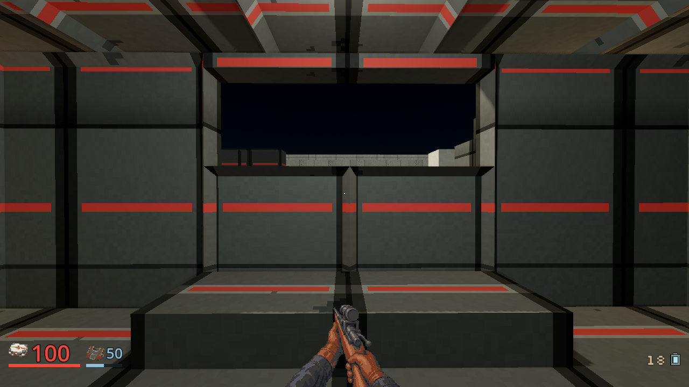
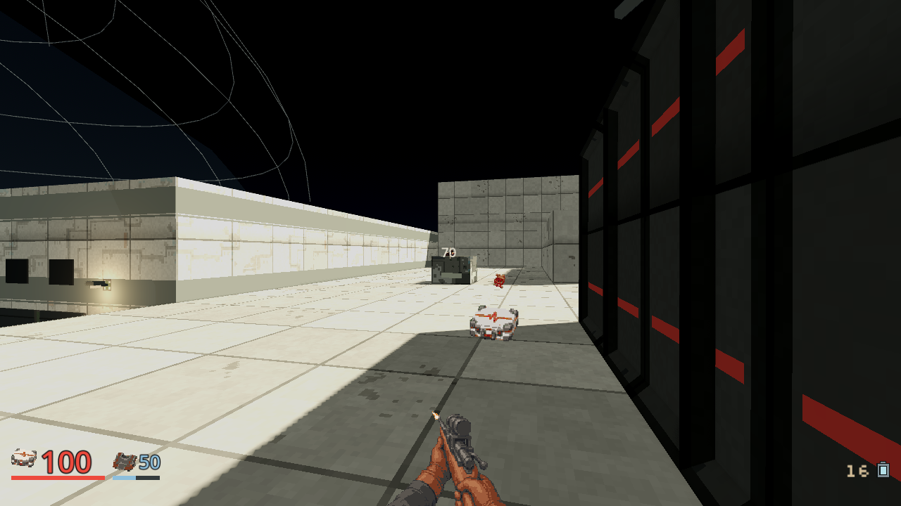
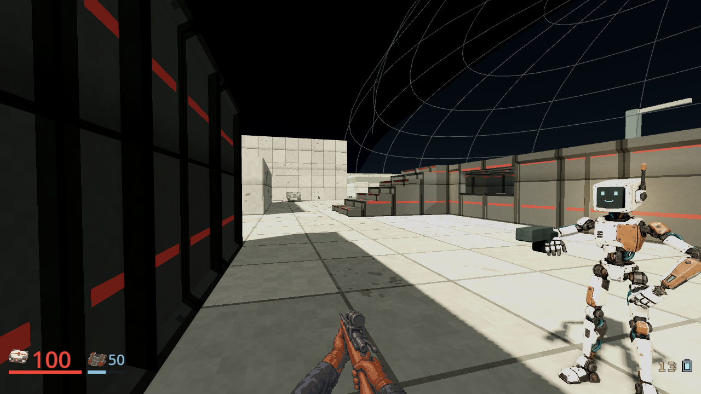

# Sniper hand continuity, October 5, 2026

Status: implemented and inspected locally, integration pending. The
[owning plan](../plans/sniper-hand-continuity-20261005.md) records the bounded
image allowance and retained sources.

The new drawn idle/fire pair replaces the flat tan procedural hands with the
Shotgun's stitched rust-brown leather and dark cuff family. It preserves the
scoped civilian walnut rifle, separate world profile, finite Cells and server
shot timing. Two idle and two fire requests completed for an estimated $0.412
prepaid allowance. No model credits or new cash were used.

Full-height reduction made the gloves too large. Native reduction to 193x144,
then unchanged-pixel registration at (24,36) on the shared 241x180 canvas,
brings visible palms and wrists into the other weapons' HUD scale. The camera
and shared HUD control were not enlarged. The recipe and its hash are retained
with the selected pictures. Canvas size alone is not anatomical acceptance.

Focused actual-source/mechanism, viewmodel, scope/tell, pickup and shot-effect
checks passed with numeric zero, clean logs and their own PASS markers.
Viewmodel checks include the new Sniper at all three existing aspect ratios,
walking, recoil and settled rest. Historical model triangles, UVs, material
maps, source bakes and mechanical queries remain independently checked;
their passage does not establish the new drawing's appearance.

The actual M07 route passed twenty unchanged canonical states: ordinary Rifle
and Shotgun discoveries and street fights, finite Sniper discovery, stair
travel, actual scoped marksman windup/cover cancellation and kill, and two
unscoped Sweeper kills. It used seed 42 and assisted difficulty, without an
equipment grant, teleport or changed guard health. This is a discovery/combat
prefix, not the full mission, fresh-player pacing or difficulty acceptance.

- Client source: `94a270f2e406944ced574df2cfe6f0fee12eec16`.
- Native source: `400595d06b6b268a64b0321015ae23921e597567`.
- Native SHA-256: `a04418b6f9ddd6a50e9697f31d2a921cc29998fdad61ff6df30737aa100eeb3f`.
- Godot 4.7.2-stable, OpenGL Compatibility, Radeon 780M, 1280x720.
- Renderer exited zero with clean logs; both owned processes were retired.

The [capture receipt](../screenshots/sniper-hand-continuity-20261005/receipt.json)
binds these literal unedited frames. The depicted Latch is the same weighted
live model reviewed against the corrected home image, rather than a generic
participant strip. Other named crew remain separate refinement work.

The separately reviewed Shiv correction removes its extra 1.3 resting scale.
Combined hand/character corrections require their own final CI and packages
before main promotion. No full-arsenal quality or finished-cast claim follows
from this one successful weapon prefix.
