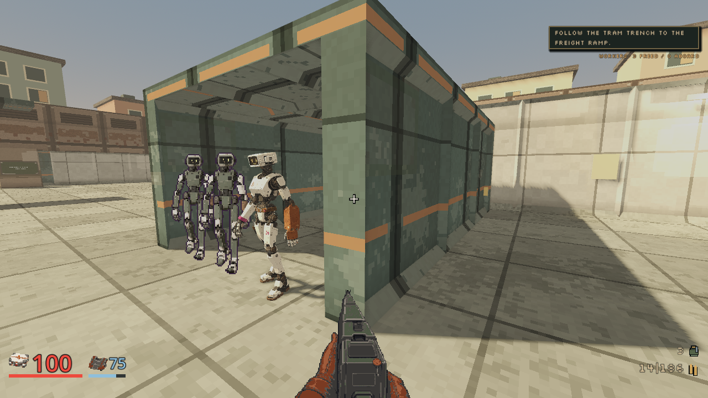
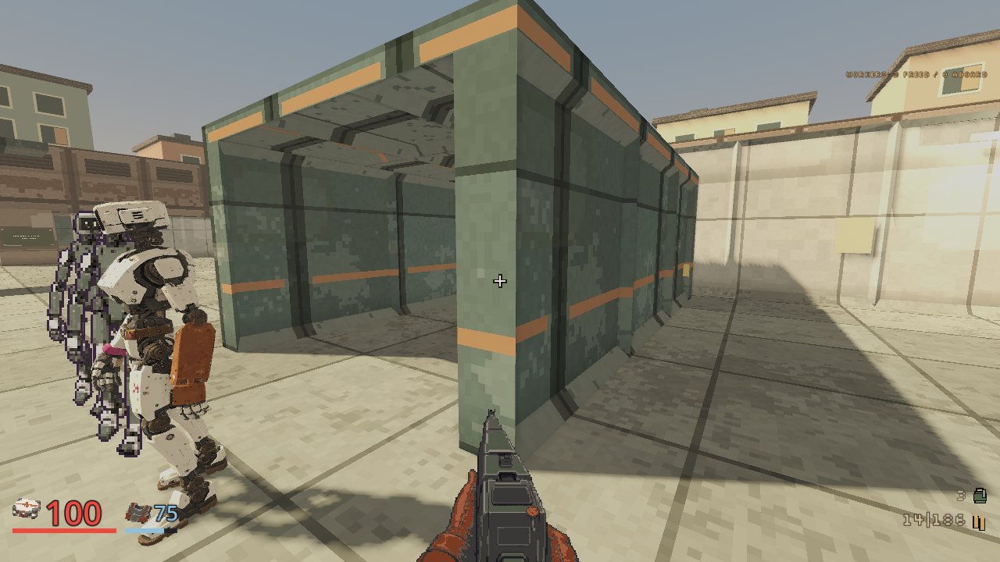
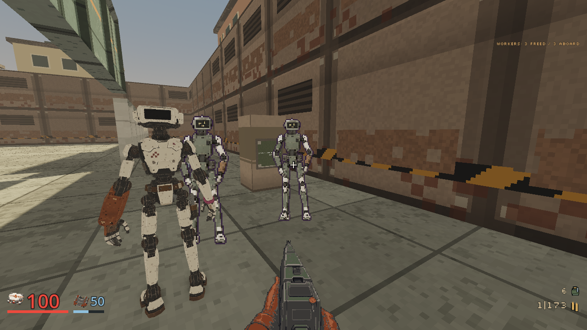
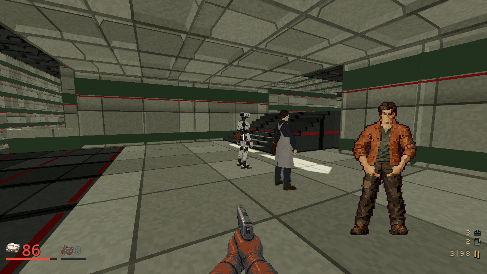
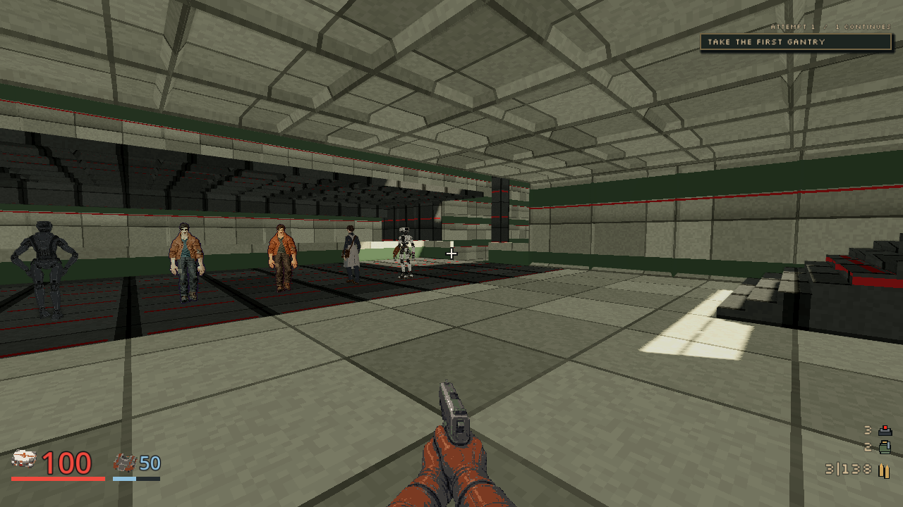
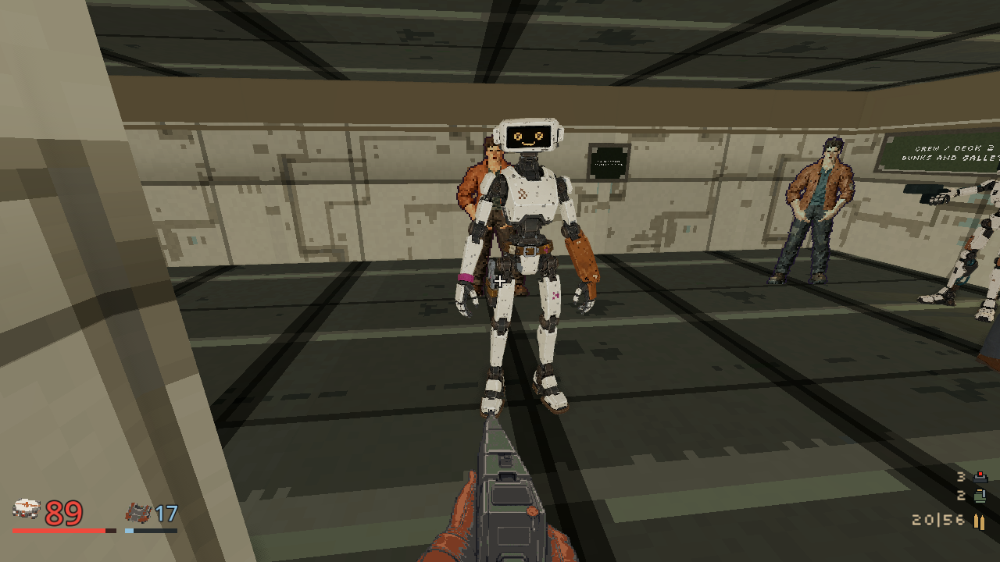
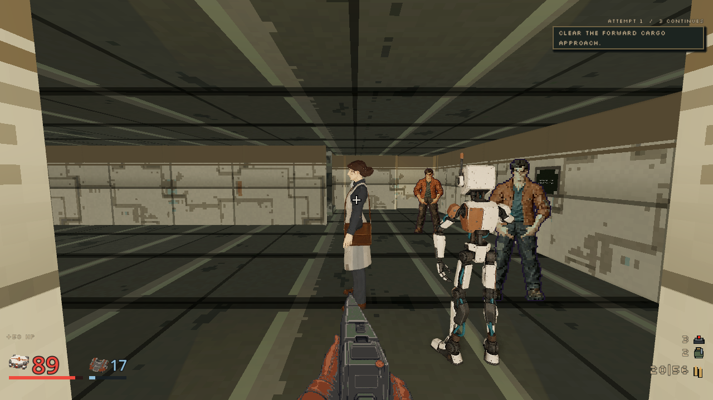

# Splice live integration, October 8, 2026

Status: implemented locally, provisional motion. The retained compact technician
now appears as a live rigid figure through the existing named civilian seam.
The server still owns feet, route, release and carried-roster eligibility.
The selected GLB is unchanged from compact source acceptance, SHA-256
`002749ba040d15703605693563b6e1b1f1ceebe554ebb2a5e2461da2f1f48f98`.

Five owned ordinary-input runs pass 67 states on current native
`3dabae6ba53355fa349b11d253c83fd45ae631b8091f8ce6226ae1b79617c7d4`:

| Run | Accepted scope |
| --- | --- |
| M05, 27 states | Complete authored route, held and walking Splice, actual boarding and departure. |
| M09, 32 states | Complete current-map route, held/released walking Splice, all required guards and shared departure. |
| M10, 4 states | Calm carried passenger, supported front/back views. Full mission traversal belongs to separate composition evidence. |
| M09, 2 states | Historical release without evacuation does not place Splice in the carried roster. |
| M10, 2 states | Unknown historical carry does not invent Splice's presence. |

All five runs return numeric zero with clean logs and exact native/renderer
retirement. There are 6,870 actual rigid-source samples, including 1,994 moving
and 4,876 calm samples. Maximum transformed sole offset is 0.000692 m. All 67
first-person body observations remain hidden. M09/M10 begin from explicitly
labelled historical carry fixtures promoted by the actual native process; they
do not claim newly played earlier missions.

The imported rigid sampler matches its native prepared source across 256
off-grid phases. Actual packed missing-forearm, null-mesh and missing-cap
controls reject after the original accepting defect was retained and corrected.
Each falls back to exactly one existing synthetic strip, with no partial body.
Binding validates the 17 direct surfaces and 28 owned caps once, without a
vertex scan in the live pose loop. Focused earlier mission and install checks
remain distinct from the composed client and exported-package gate.

Selected full-size originals preserve the amber screen, bone shell, unequal
repaired arms and secured right-hip tools. The M05 held still is occluded and
remains state-only evidence. A distant moving frame establishes silhouette and
source presence, not planted gait. The [receipt](splice-live-integration-20261008.json)
retains 1,282 rehashed file bindings, all accepted and failed ordinary attempts,
loaded source, packed-source controls, selected reviews and seven byte-identical
public image copies.

Three failed M09 attempts remain separate: the original route left one Notary
outside line of sight; the first added-vantage run stalled and its saved attempt
recorded one participant death; the draw-recovered run cleared all three final
gantry enemies but its next centreline waypoint crossed existing gallery cover. The accepted
route keeps the two supported Notary search vantages and uses a clear gallery
side arrival, preserving required enemies, finite stocks, deadlines and the
zero-death gate. The original M10 side view also retains its obstructed waypoint
failure. The separate [capture liveness proof](capture-draw-liveness-20261008.md)
validates the capture-only draw remedy; historical ordinary window modes and
the exact suspended await remain unproven.

The liveness receipt's dated current-source references have an explicit
[historical predecessor supplement](capture-draw-liveness-predecessor-20261008.json).
It retains identical source bytes recorded before the later empty-magazine
capture change. Both original receipts remain unchanged; this is path retention,
not another test or a substitution of the newer helper.

The selected walk remains vertically supported while its stance foot slides
about 0.8 m over half the 1.6 m distance cycle. The
[contact-aware follow-up](../plans/splice-contact-gait-20261008.md) retains that
control and a separate ignored numeric candidate. Its improved contact results
have not replaced this selected asset. Exported candidate sampling, joint
silhouettes, turns, stopping transitions, wider lighting, composed package and
final human art acceptance remain open.
