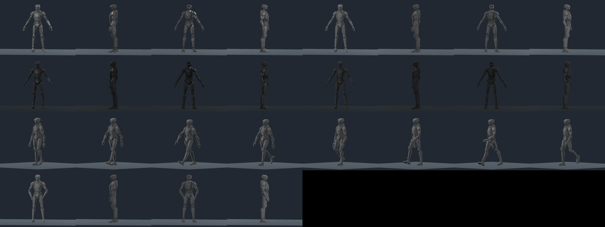

# Tern offline source preparation, October 8

Implemented locally at zero credits, zero new cash and zero network requests.
The [owning plan](../plans/tern-source-reference-20261005.md) was updated before
implementation. This increment prepares an offline named source; the separate
[live-character plan](../plans/live-character-presenters-20261008.md) owns runtime
selection and played acceptance. The [machine receipt](tern-source-preparation-20261008.json)
records exact commands, source/tool hashes, all 32 renderer-frame hashes, retained
logs and failed attempts.

| Source fact | Original walking rig | Prepared candidate |
|---|---|---|
| Relative path | `art/raw/meshy-pilot-20261003/tern-civilian-pilot-v1-rig-1.glb` | `client/art/models/candidates/tern.glb` |
| Bytes | 32,953,524 | 5,796,592 |
| Vertices / triangles / skin joints | 19,106 / 12,456 / 24 | Unchanged |
| Maps | 4K color and normal, 2K packed metal/roughness | Three embedded 1K PNG maps |
| Weighted rest height / minimum Y | 1.79997265 m / -0.000000123 m | Unchanged |

Original SHA-256:
`9c9b3a8af8fee7c5f3d3fe52254871a4a6e022ed5dd56cbfb1f9cb9e9096ef89`.
Candidate SHA-256:
`0f8bfd1c99b1d7c1172eaaa76203d28234a1d3f3db793f6f81bc6b5740fa993f`.
No raw file is modified. The preparer refuses an attempted raw-source overwrite;
that negative control exits 1 and the original hash remains intact.

Independent decoding confirms all 75 non-image buffer views remain byte-identical
and all nine unchanged top-level JSON values retain their original text. Imported
position, normal, tangent, UV, bone, weight and index arrays match exactly. Scene
transforms, bind poses, original walking name, keys and duration remain intact.
Deliberate UV shifts, winding reversal and altered skin weights fail validation.
No faces, geometry or skin influences are added or replaced. Optional software
metadata is removed; legal copyright state is preserved (this original has no
copyright field).

The original color paint is retained through Lanczos compaction, independently
matched pixel for pixel against its resized RGB8 control. The normal map passes
the same control; normal vectors are not separately renormalized. Packed red and
blue channels remain exact. Only green roughness is raised, to an effective
8-bit floor of 224/255; the material uses metallic factor 0.08 and roughness
factor 1.0. There is no added emissive map or identity repaint.
The candidate uses embedded-image import mode 3, matching the packaged cast;
redundant extracted texture sidecars are removed. The retained GLB bytes do not
change. Source validation and the 32 controlled views are refreshed after import.

The offline named pose source retains the original walk and supplies a bounded
calm stance through the existing civilian two-bone helper. Actual calm wrists
reach (-0.24, 0.96, 0.08) m and (0.24, 0.96, 0.08) m within 0.001 m. Actual weighted
feet are registered to the floor at rest, calm and eight non-static walk phases.
Original clip bob and stride are retained; only offline figure floor placement
and the established stationary horizontal-root treatment change presentation.
The validator explicitly rejects a static rest mesh as a walking witness.

Skin deformation is measured rather than inferred from joint positions. Across
37,368 triangle-edge samples per pose, excluding rest lengths below 0.00001 m,
calm has a maximum edge-length ratio of 2.042 and two ratios above 2. The supplied
walk reaches 2.777 with 4 to 16 ratios above 2 per sampled phase. These counts
include edges repeated across adjacent triangles. This is not a claim of zero
skin distortion or proof of hand contact with another object.

The controlled Compatibility renderer exits 0, error-clean, after 32 full-size
1024x768 views on the recorded AMD Radeon 780M adapter. Four original/prepared
rest angles under neutral and dim light, four head controls, eight actual walk
phases and four calm angles retain the complete geometry. The owning process
retires. Full-size inspection of every walk phase and opposite calm/rest views
finds no blocking holes, explosive bends or detached harness. Selected independent
review agrees that the compact matte candidate has no blocking geometry issue.
This is visual source evidence, with no frame-rate or other-platform claim.

The [original front control](../screenshots/tern-source-preparation-20261008/neutral_original_rest_0.png)
and [prepared control](../screenshots/tern-source-preparation-20261008/neutral_prepared_rest_0.png)
use the same camera. [Calm](../screenshots/tern-source-preparation-20261008/neutral_prepared_calm_0.png),
[walk phase 2](../screenshots/tern-source-preparation-20261008/neutral_prepared_walk_2.png)
and [walk phase 6](../screenshots/tern-source-preparation-20261008/neutral_prepared_walk_6.png)
show actual deformed surfaces and floor placement.

The actual model has two small neutral-grey visor lights and brown panels on
both shoulders. Those original features are retained, rather than repainting
them to match the reference's small warm rectangular optics and single left
ember accent. The [neutral head](../screenshots/tern-source-preparation-20261008/neutral_prepared_head.png)
and [dim head](../screenshots/tern-source-preparation-20261008/dim_prepared_head.png)
make the remaining optics refinement explicit. An independent exact head-face
UV audit finds that a broad color/rectangle mask cannot safely isolate the lenses.

Console reach, restraint release, boarding, wave, finger closure, final named-art
review, played M09/M10 and all desktop-package gates remain open. Calm wrists are
beside the thighs; no external contact is claimed. The eight sampled phases do
not establish exhaustive continuous motion. Existing whole-application checks
predate this separate offline increment. No server, runtime script, shared bake,
mission behavior, paid asset stage or package selection is changed by this work.

Early failures remain in the machine receipt: a script name collision, exact JSON
decimal-token drift, an initial temporary source-lifetime issue, a wrapper receipt
parameter error and a renderer overview image-format error. The last renderer
had numeric exit 0 and a PASS marker despite its errors, so its failed logs are
retained separately from the final error-clean controlled rerun.
