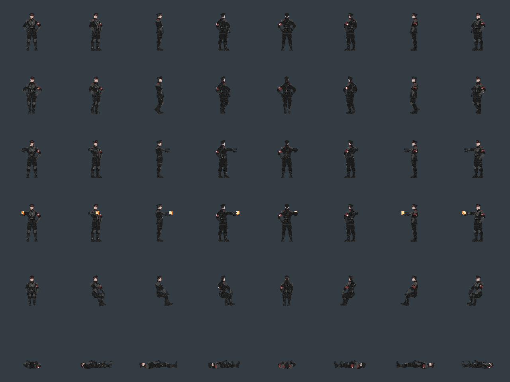
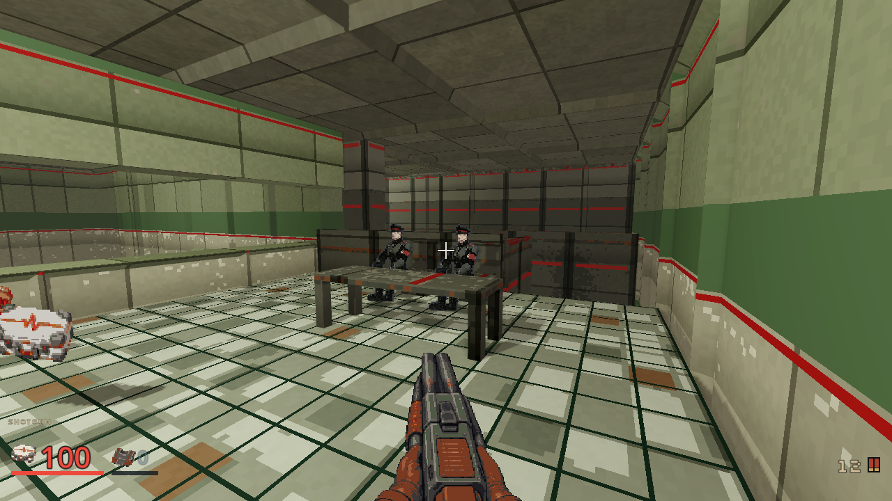
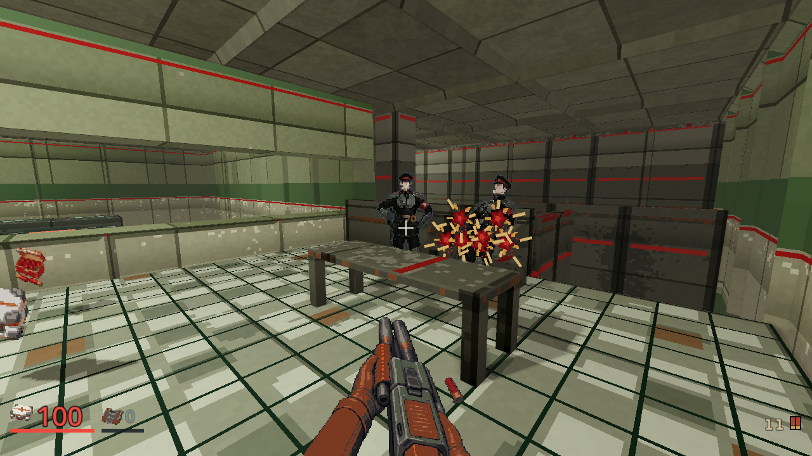

# Stylized Union guard revision

Recorded 2026-10-03. [Bounded plan](../plans/union-field-uniform.md).
**Status:** implemented, with source, rendered and full local client gates passed.
[PR #346](https://github.com/blisspixel/fragr/pull/346) owns CI and main integration.

The human Clerk now has angular painted facial planes, a black high-collar
uniform, dark steel plates, peaked service cap and a clear red arm band with a
fictional registry seal. It replaces the previous photographic human direction.
Black/red identifies the outfit; rooms retain their venue materials.

## Source and spend

One textured model consumed 35 existing credits; the subsequent inspected
humanoid rig consumed 5. The combined explicit ceiling was 40 credits ($0.80
conservative equivalent), with no new cash charge or top-up. The original
15-credit uncertain reservation remains held. The native tool checked balance
before each submission and retained accepted task IDs before polling.

The final free checker reports 2,905 available credits and the unchanged
15-credit uncertain local hold. This revision consumed 40 credits; net tracked
local consumption is 165. A separate 30-credit account decrease has no local
production receipt and is not assigned to this revision.

The raw model has 12,219 triangles and four embedded 4K maps. Preparation keeps
24 bones and walking motion, embeds 1K maps, uses nearest sampling and preserves
legal metadata. The prepared source is 5,587,096 bytes, SHA-256
`166a6eab7a203f1e80fb089fc6dc2d39c37f72e2e77b09a234c9d15c22e4cf14`.
The raw walking source SHA-256 is
`bfbd2374e73d95dbac71ab4ecddc11b9b9cab66c5cf3fdb486ba75368dd3d845`.
The public reference PNG omits optional software metadata and has SHA-256
`ed58d20398cb201e6fdd247f536b142350159eae00a36bb1ae038aa0afa50434`.
A decoded-image comparison proves its pixels identical to the retained original
production input. Required legal notices are preserved in model preparation.

## Pixel presentation and checks

Rows show idle, walk, raised attack, firing, seated and collapse in eight
directions. The existing bake completed all six atlases without empty or clipped
cells. Only the Clerk albedo, paired normals and source receipt change; the
Sweeper, Heavy Sweeper and Turret image bytes remain unchanged.

The source harness passes actual hand grip, gait, unarmed follow-through,
seated knees, first hit reaction and paired alpha. The animation harness passes
distinct role silhouettes and near/far comparisons without relaxed thresholds.
Actual Compatibility rendering on AMD 780M changes 10,594 Clerk pixels when
normal shading is enabled and 14,055 when the light moves. This proves body
lighting, not broad hardware performance.

The full local client checker passes all 224 scripts and 103 harnesses with exit
0, its own PASS verdict and no error diagnostics. It includes the merged M04
and M06 detail helpers. The retained log SHA-256 is
`1004a3de611840f7883009ff8cef2b58ac745a39c1d2417f2383eb2010d43f85`.
Full implementation CI remains required before main integration.

## Played guard room

The same five-state M02 guard-room route completes with ordinary human-role
input, four resolved Shotgun attacks and both required named Clerks confirmed
defeated at ticks 287 and 311. It finishes at 100 HP with no deaths, clean logs
and successful exit. Idle, windup, hit and death phases are observed. The table
partly occludes settled bodies, so this does not prove every live corpse angle.
The current selected Shotgun is used; its separate imported candidate remains
unselected. No combat timing, collision, damage or actor identity changes.

The recording retains real captured frame timing and game audio under
`.agents/art-playthrough-20261003/union-v2-m02-realtime/`. Studio source views and
all preparation/bake/light logs are retained beside it. Broader cast rollout,
fresh-player feedback and final subjective art acceptance remain open.
The 1280 by 720 MP4 lasts 15.264375 seconds, has 5,149,582 bytes and SHA-256
`1555504a86dc335e6294d5fe924bc8b1a8a057c8baab9ca0ce08bf9584a14e00`.
