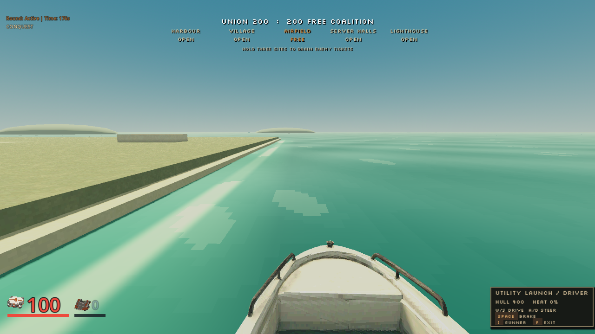
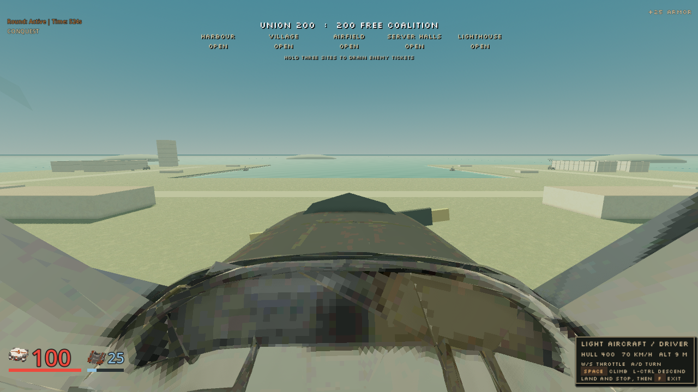
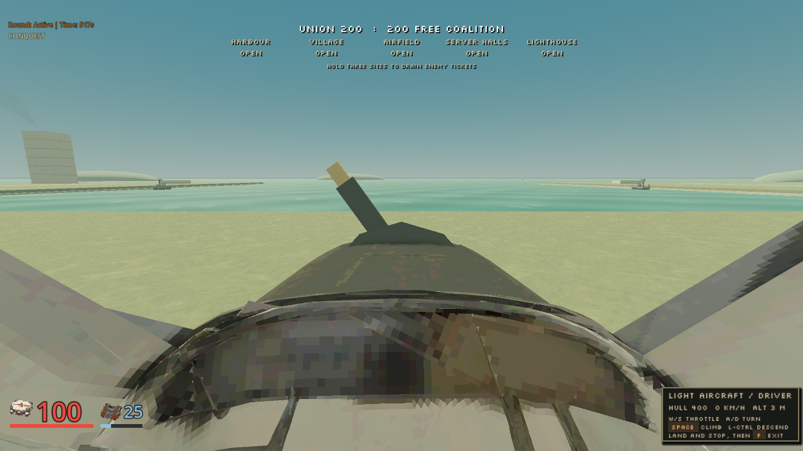

# Vehicle input and presentation evidence

Local rendered routes exercised the server-owned Jeep, utility launch and
light aircraft through ordinary walking, Join, Use and the existing Action
channel. No actor or vehicle pose was injected. The runs used capability 41,
Holdfast Conquest, zero bots, Windows, the compatibility renderer and an AMD
Radeon 780M. They establish functional and inspected presentation behavior,
not graphics performance, Internet driving feel or multiplayer balance.

## Completed routes

| Vehicle | Actual input and outcome | Motion sample |
|---|---|---|
| Jeep | Walk to vehicle, enter, drive, brake, change to gunner, five resolved mounted shots, exit, walk to and capture Airfield | 34.675 m; 81 driver corrections, maximum 0.075 m |
| Utility launch | Walk to dock, enter, steer across water, brake, change to gunner, three resolved mounted shots, exit into swimming | 16.384 m; 57 driver corrections, maximum 0 m |
| Light aircraft | Walk around wing, enter, accelerate and climb, command descent, soft touchdown, brake, taxi and safely exit on foot | 32.653 m takeoff sample, +5.567 m altitude; 65 corrections, maximum 0.000000477 m; 1.9425 m taxi; 400 hull HP after landing |

Correction counters above cover the drive/takeoff sampling window, before
the later captured seat or landing stages. They are not whole-route latency
statistics. The aircraft's final run used native release SHA-256
`d54b07905e1ad5dedc18e37c3a11e7c79545b7438f4d789f4eddbce141414e2e`.
Jeep and launch routes used the preceding capability-41 release. The later
shared contact-world correction has separate deterministic regression
coverage and was present in the final aircraft walk and landing route.

## Capture stalls and bounded fallback

The rendered Jeep drive sample recorded one `ack_lag` fallback. Instrumented
launch and aircraft repeats explain the visible capture-time interruptions:
their synchronous viewport readback and PNG writes blocked the client while
the server continued ticking. In the launch route, image writes took roughly
139-143 ms around the driver captures, process gaps reached 141-148 ms and
snapshot gaps reached 155-164 ms. Its two observed driver fallback events
immediately followed those captures.

The final aircraft run occurred alongside functional verification work, not
in a quiet performance window. Its driver image writes took 165-212 ms,
process gaps 171-216 ms and snapshot gaps 186-255 ms. All four observed driver
fallbacks immediately followed the four driver captures. On the next sampled
frame, an authoritative snapshot was only 1.5-2.4 ms old. No other driver
process gap above 100 ms was recorded. This is evidence of the short replay
bound correctly falling back during a paused client, not evidence of sustained
network delay. Ordinary unsampled human driving and real network delay remain
separate acceptance work.

## Inspected seat and model behavior

The prepared models use matte 512-pixel paint and nearest sampling. The Jeep
has separated wheel pivots, the launch uses the registered water level and
wake group, and the aircraft has an authored balanced rotating propeller and
forward cowl. Runtime engine loops respect the normal Effects settings.

The aircraft's initial lateral seat sat too close to a canopy frame. Five
model-only camera probes were inspected before choosing authoritative feet
`[1.45, 0.80, 0.0]`, mirrored exactly on both sides. The normal crouched eye is
therefore `[1.45, 1.95, 0.0]` above the chassis base. The final native route
confirms a clear forward horizon with both canopy frames retained. No local
camera offset or geometry hiding was used. Cockpit detail and the island's
broader dressing remain provisional art.







## Reproduction and focused checks

Start an isolated native process and retain ownership of that exact child:

```text
fragr-server --map 7 --mode conquest --bots 0 --bind 127.0.0.1:6987 --no-round-events
```

Then, from the repository root, set `GODOT_BIN` to the pinned executable and
select `jeep`, `boat` or `light_aircraft`:

```powershell
$env:FRAGR_SERVER = 'ws://127.0.0.1:6987'
$env:FRAGR_VEHICLE_KIND = 'light_aircraft'
& $env:GODOT_BIN --path client --rendering-method gl_compatibility --script res://scripts/qa_vehicle.gd
```

The harness writes its actual viewport and report under
`.agents/vehicle-live/<kind>/`. It sets `fragr_automated`, isolates settings
and records, and checks that the desktop pointer stays visible. A bounded
offscreen draw keeps this functional route progressing if Windows occludes
the capture window; it is never used for graphics benchmarking. Final launch
and centered-aircraft teardown completed without renderer errors.

`test_vehicle_state`, `test_vehicle_contact_world`, `test_local_prediction`,
`test_actor_contact`, `test_vehicle_golden` and `test_water_golden` pass. The
18 native vehicle fixtures remain within 0.001, maximum 0.00088303. The six
swimming fixtures peak at 0.00000057, including an actual shore step. The new
contact-world regression proves that a pawn stops outside a vehicle hull,
retains the old hull for an already sampled input, adopts a moved hull on a
new step, ignores occupied actors as walking bodies, honors crouched height
and retains buoyant support when character contact clips a swimming step.

These routes and client checks cost $0. Source-model spending is recorded in
the separate asset receipts. Composed full-suite and integration status are
tracked by the build owner.
