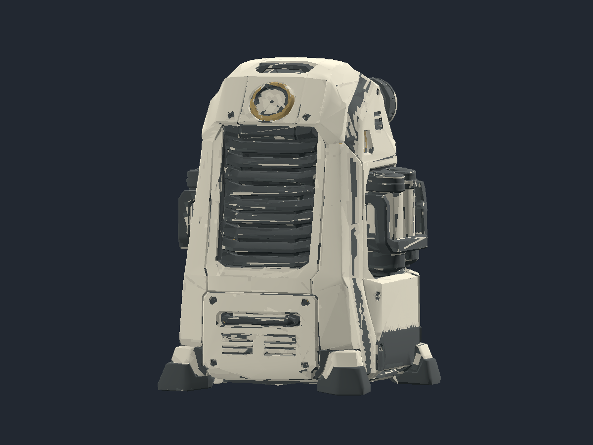
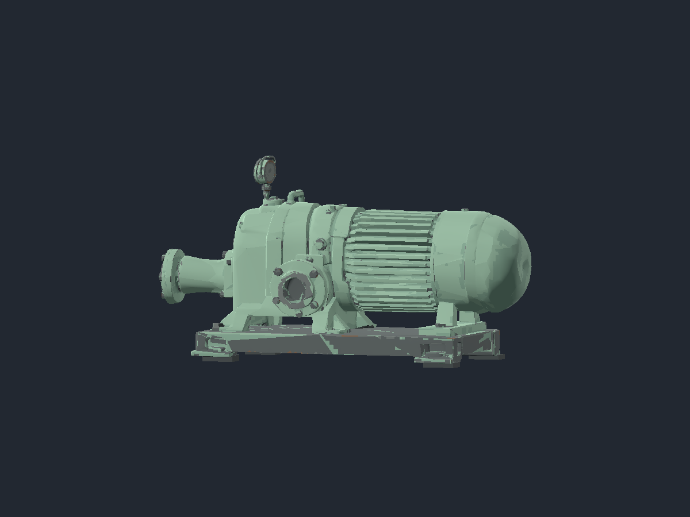
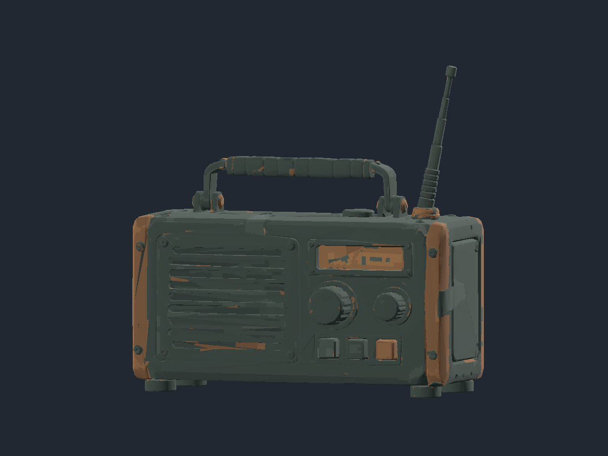

# Compact inhabited-world prop preparation

Status: **source inspection passed**, 2026-10-04. Three compact offline candidates
are prepared and independently verified. Runtime placement and ordinary played
selection remain open. This work adds no paid stage or cash charge.

| Candidate | Source triangles retained | Local triangles | Provisional size |
|---|---:|---:|---|
| Air scrubber | 11,910 | 0 | 1.65 m high, approximately 1.209 m square |
| Water pump | 11,880 | 48 | 1.20 m wide, 0.638 m high, 0.483 m deep |
| Community radio | 11,646 | 0 | 0.38 m wide, 0.371 m high including aerial, 0.179 m deep |

The [source library](../../client/art/world-props/README.md) contains embedded
1K paint and normal maps with verified nearest filtering, without metallic/roughness texture maps. Quiet bone,
sage, charcoal, walnut and brass values replace independent-channel reduction
that produced unwanted pink/green patches. Original source geometry and legal
metadata remain retained; no service rig or automatic revision was requested.

Independent export/reimport compares an orientation-preserving triangle multiset
using actual positions and UVs, quantized at 0.00001 m/UV units. Every source
triangle matches after the stated rotation, scale and bottom-centre pivot.
Shifted UVs and reversed winding fail their negative controls.

The first pump failed the four-quadrant floor-contact check. Blind mounting-pad
positions also failed actual underside intersection and remain rejected.
Measured foot surfaces then located four supported mounting-pad centres. The
retained body is lifted 12 mm, with four separate 100 by 60 mm pads from the
floor to 3 mm inside its actual underside. Reimport verifies all 48 authored
triangles, four floor quadrants, correct height and genuine source contact.
Detached and hovering pad controls fail. No source triangle is flattened,
deleted or replaced to conceal uneven support.

Actual Compatibility rendering imported all three candidates and captured all
twelve sides. All twelve full-size pictures were inspected. Renderer exit was
0, logs were clean, and the owned process retired. Six retained pictures and
their fingerprints are in the [public receipt](../screenshots/world-prop-preparation-20261004/receipt.json).

The public preparation tool reproduces all three exact candidate fingerprints.
Its separate verifier passes the retained geometry, nearest filtering and
mounting controls. The complete local client checker on base main `2399c00d`
passes 258 scripts and 122 harnesses with numeric exit 0 and clean logs. These
offline sources add no runtime selection or native change. Final integration
CI and desktop package checks remain required before main integration.

This proves compact fixed sources and supported provisional pivots. It does not
prove usable machinery, a working dial, navigation, pickup visibility, map
placement, desktop inclusion or a completed environment. Future placement must
retain authoritative cover, route and supply reachability, with matched ordinary
played views at game resolution and the map's real light.
