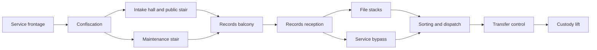

# Recall Notice: complete mission

Status: in flight, 2026-09-20. [Task #195](https://github.com/blisspixel/fragr/issues/195).
Baseline: v0.28.0, `e845236`. Its tree matches the final revision of #193, with all
five integration jobs passing. The three-enemy prototype is not a full mission.
Spend: local work first; the uncertain Clerk reference reservation remains held.

## Player outcome

Follow Latch's recall through a recognizable intake institution, recover weapons,
learn human guard and bot tells, choose a useful route through records, win a
mixed-threat fight at transfer control and leave with the correction destination.
M02 performs the rescue. No early Inheritance contact, mandatory radio, boss,
explosives or arbitrary extra key hunt. The institution's treatment of personal
lives as property supplies the environmental story. Suffering is not the joke.

Keep the approved introduction and safe Tack lesson. The current rooms support
the introduction, but the empty records/transfer half cannot carry the mission.
Build inhabited rooms and purposeful encounters, not a larger open arena.
The 10-15 minute and 20-30 enemy estimates are pacing hypotheses, not quotas.

## Room and encounter staging

- Frontage/confiscation/intake retain the first Clerk and pair of Sweepers. A
  retreat stays legible and neither stair requires jumping.
- Records reception is a smaller threshold beyond the balcony. Its counter and
  cabinets break incoming lanes before a new patrol reaches the player. The
  public and service approaches converge without bypassing safe weapon discovery.
- File stacks offer short aisles, cross-connections and a readable exit toward
  sorting. Their optional supplies justify entering; the bypass is a real choice,
  not a dead corridor. Avoid placing a new enemy in a visible region at activation.
- The service bypass trades the wider stacks' cover and supplies for a tighter
  approach. Both routes reach sorting from different angles and reconnect.
- Sorting combines the two taught threats across cover and distinct approaches.
  The next destination remains visible. Place a quiet record/evidence beat between
  fights; no exposition overlay while attacks continue.
- Transfer control provides the final crest, then the physical record and lift.
  Preserve Latch's destination, actual gate collision and shared boarding. No new
  mandatory wave after the earned exit.

Extend the existing north/west records footprint with real floors, walls and
ceilings. Preserve landmarks and original space identities where they remain
accurate. New collision, navigation and presentation derive from the same JSON.
Use registered Union materials and localized signs with practical lighting;
compare rooms in the rendered route, including distant enemy contrast.

## Equipment and retry

Encounter bodies must exist before players enter their sightlines. Prepare the
bounded authored roster when the first active party starts; entry regions wake
the existing guards rather than materializing new bodies. Preserve normal
dependency sequencing, but a directly attacked group must respond even if its
entry alarm has not fired. Dormant actors keep ordinary damage and corpse rules.
Prove stable identity, input inactivity before activation, attack response and
party reset, including split parties entering different routes.

Found introductory guns remain available to every participant. Shared campaign
consumables must be finite within a run; unlimited waiting beside an ammo pad
cannot replace the planned supply economy. Preserve arcade pad respawns. Keep
scarcity, pickup visibility and claims server-owned. Guarantee enough supply for
the main route plus misses, then measure contention with four participants.

The agreed co-op rule is teammate revival, with a full-party wipe restoring the
shared checkpoint. Solo death uses the same retry path. This replaces individual
timed campaign respawns; arcade respawns keep their existing behavior.

A secured records checkpoint must restore coherent party, inventory, pickup,
encounter and objective state on a wipe. Preserve readiness and do not replay
the opening. Revive timing, late arrival, departure and an empty server need
explicit rules. A pending reader cannot save a dead party from rollback. Keep
the existing encounter lifecycle as the owner of reset timing.

Persistent saves require a versioned bounded format, content identity, validation,
atomic replacement and an explicit identity/reconnect contract. Do not serialize
arbitrary live state or claim persistence from an in-memory checkpoint. Define
this boundary before implementation; no player-supplied filesystem paths.

## Architecture

`server/maps/m01-recall-notice.json` remains canonical. Reuse authored-map
validation, `encounters.rs`, `mission.rs`, `inventory.rs`, shared movement,
navigation and combat. Keep new checkpoint concerns in a focused module when
needed. No parallel map loader, pathfinder, inventory or client authority.
Use existing typed wire state for compatible changes; revise capability and both
consumer boundaries deliberately if a new contract is necessary.

The provisional Clerk/Sweeper rigs remain the local art source. Final reference,
silhouette, pose and fresh-player encounter acceptance are tracked in #180.
Do not replace the unresolved paid reference with a duplicate request. Check
current price and quota before any approved batch; no overages or top-ups.

## Completion evidence

- [ ] Complete room sequence, both routes, optional rewards and a mixed crest.
- [ ] Measured guaranteed-route supplies, misses, contention and recovery.
- [ ] Coherent checkpoint/retry and explicit persistent-save status.
- [ ] Solo and four-participant runs, mixed humans/agents, MCP and spectator eyes.
- [ ] Deterministic loader, activation, sightline, movement and lifecycle checks.
- [ ] Inspected full-route motion, enemy tells/deaths and effects on available
  OpenGL/Vulkan paths, with hardware and platform limits recorded.
- [ ] Fresh-player route/story comprehension and fun review without steering.
- [ ] Strict Rust, coverage, Godot, verifier, all-map regressions and measured
  CPU checks; current public gallery; exact-revision integration CI.
- [ ] Current mission, framework, roadmap, protocol, asset and release records.

Green checks cannot establish fun, final art or a complete campaign. Record
failed runs and fixes, update the evidence here, and leave unfinished gates open.

## Local implementation checkpoint, 2026-09-20

The working draft expands the records wing with reception, stacks, bypass,
sorting and dispatch. Seven groups contain twenty guards. Campaign consumables
stay consumed until party reset; arcade supplies retain their timers. Enemy
bodies are prepared before entry, and hit/region alarms retain their identities.
The records-wing increment is implemented in
[#196](https://github.com/blisspixel/fragr/pull/196), which tracks integration and
release evidence. The complete-mission task remains open.

Normal-input simulation clears both routes for human and agent control. Current
screened-layout results use ordinary movement and accurately aimed shots, with
normal spread and finite supplies:

| Control and route | Ticks at 20 Hz | Shots | Guards defeated | Final HP |
|---|---:|---:|---:|---:|
| Human, public stairs/stacks | 1923 | 125 | 20 | 100 |
| Agent, public stairs/stacks | 1923 | 125 | 20 | 100 |
| Human, maintenance/bypass | 2041 | 157 | 20 | 100 |
| Agent, maintenance/bypass | 2041 | 157 | 20 | 100 |

Evidence: `.agents/m01-screened-sim.log`. This is not fresh-player duration or
difficulty acceptance. Earlier two- and four-participant objective runs
reach the shared lift, with three and four individual deaths respectively in
the recorded run. Supply contention and recovery still need tuning. The expanded
mission completion bound is separate from the small gate fixture's bound.

Strict Clippy passes locally. A regression now proves that a struck sentry's
hidden peers investigate the hit location and receive one later entry dispatch
without learning an unseen player's live position. Sightline tests screen future
guards from both stair approaches and transfer guards from dispatch. The full
workspace rerun caught an overbroad intake-count assertion, now replaced with
specific intake identities, and a two-second readiness-wire timeout. The latter
passes alone and in the subsequent complete workspace run without changes.
That run passes 709 tests with two existing ignored stress cases
(`.agents/m01-completion-workspace-tests-4.log`). Formatting and dependency
license/source/ban checks also pass. Unfiltered workspace line coverage is
95.80 percent on the final local run against the unchanged 90 percent floor;
release compilation passes.
Rendered attempts in `.agents/qa/m01-records-populated*` failed on furniture
waypoints, then on an attack-before-entry alarm that left guards waiting and
caused later deaths. These are failed evidence, not accepted captures. The alarm
fix now has a hidden-peer regression; subsequent rendered failures also exposed
cross-room kill accounting, unanswered attacks during scripted travel and the
driver's inability to aim at an exposed body above a low counter. Failed evidence
is retained in `.agents/qa/m01-records-{alarm,named,travel,screened}`. Later
`exposed` and `nearby` runs stayed alive but exposed a controller timing error:
intentional stationary fighting consumed the walking deadline. Opt-in travel
now has separate 15-second movement and 25-second combat limits per waypoint,
records both durations, and ignores distant targets until they are approached.
Required named guards, movement arrival and no-death assertions remain intact.

The subsequent `.agents/qa/m01-records-bounded` OpenGL run passes all 14 states,
confirms all twenty named guards, recovers the transfer record and completes
departure without a participant death. Both walking and combat time remain
recorded per waypoint. The contact sheet and full reception/stacks stills were
inspected on Windows, AMD Radeon 780M. Connected interiors and cover are visible;
repetitive surface treatment, provisional characters and weak room-specific
visual identity remain art work. This accurate controller run is not human
difficulty or final pacing acceptance.

The Vulkan run (`.agents/qa/m01-records-vulkan`) also passes all fourteen states,
twenty guards and departure without death. Its contact sheet was inspected on
the same AMD host. The five-state attack-tell tour deliberately observes both
enemy types firing before returning fire; its motion sheets show the Clerk's
shot, bot bursts, hit reactions and collapses. These are renderer checks on one
Windows GPU, not certification of other vendors or platforms.

The visual combat helper tracks named deaths across rooms and corpse cleanup,
detects omitted respawning participants, fights during opt-in travel and can aim
at exposed parts of the real body without firing through solid cover. Failed
full-route states end the run after saving evidence. The records tour covers the
expanded route. A malformed single waypoint stopped the maintenance tour;
checking every bundled manifest caught the same defect in two other focused
tours. Their data is corrected, and launch now rejects invalid walking shapes
before playing. The five-state maintenance, eight-state stair and nine-state
facility tours pass with inspected contact sheets under
`.agents/qa/{m01-maintenance,m01,m01-facility}-records-fixed/`.
Checkpoints, persistent saves, secrets, final art and fresh-player acceptance
remain open. Next: complete checkpoint and supply-balance work through the
existing server seams, then apply difficulty and earned-cosmetic rules to that
stable retry boundary.

The 21-state release gallery and shot/impact strips were regenerated, inspected
and published from `.agents/qa/m01-records-gallery`. All 27 headless Godot
harnesses and eight verifier fault scenarios pass. The four-agent smoke passes
with seven frags and no spawn deaths. The six-map roster also passes unchanged
assertions, mixing reflex and planner agents with a spectator. Rust wire tests
separately exercise human and agent roles in shared campaign sessions.

| Arena map | Seed | Fighters | Frags | Spawn deaths |
|---|---:|---:|---:|---:|
| 1 | 67 | 2 | 6 | 0 |
| 2 | 42 | 6 | 28 | 0 |
| 3 | 19 | 6 | 21 | 3 |
| 4 | 42 | 8 | 39 | 3 |
| 5 | 42 | 12 | 35 | 2 |
| 6 | 42 | 16 | 55 | 3 |

Reports: `.agents/playtest/m01-completion-roster/`. Passing thresholds does not
erase the remaining spawn deaths or establish finished arena balance.

CPU benchmark, Ryzen 7 7840U, Windows x86_64 release, session plus JSON encoding:

| Map | Rule bots | Ticks | Seed | p99 tick ms | Maximum tick ms | Repeated trace |
|---|---:|---:|---:|---:|---:|---|
| Arena Duel | 16 | 1,200 | 42 | 0.623 | 1.143 | Identical |

Report: `.agents/m01-completion-bench16.json`. The unchanged budget assertions
pass. This CPU sample does not measure network capacity or rendering performance.

The first integration revision passed all five jobs. The later waypoint-check
revision exposed a coverage-only adapter timing failure, retained in
`.agents/m01-records-ci-failure.log`: its continuous-snapshot fixture started the
two-second cadence deadline before the controller had prepared navigation.
Preparation uses a blocking worker and a shared construction cache, so concurrent
map loads could consume that window. The fixture now confirms an initial valid
action, then requires three more actions under the same 200 Hz snapshot stream
and two-second deadline. Its existing four-second overall bound and malformed
replacement rejection remain. This distinguishes setup from action starvation;
it does not establish a faster topology builder. Final integration is tracked
on #196.

The corrected fixture passes the full workspace coverage run. A deliberate
temporary mutation resetting the action timer on every snapshot fails with the
expected starvation assertion. The original source was restored byte-for-byte
and passes again. Receipts: `.agents/adapter-action-clock-{mutation,restored}.log`
and `.agents/m01-completion-coverage-final.log`. No deadline or threshold changed.

The map uses a reception privacy partition and a narrower transfer entry to
separate later threats from earlier approaches. All collision, navigation and
rendering still derive from the same authored solids. The loader caught unusable
clearances during iteration; those were widened, not exempted from validation.
Shared kit practice and distinct enemy combinations are recorded in
`../MAP-DESIGN.md` and `../ENEMIES.md`. Requested difficulty tiers and achievement
cosmetics are bounded in [difficulty and rewards](difficulty-and-rewards.md).
That follow-up implements new-run timing profiles first; persistence and earned
rewards remain planned. The records-wing evidence above predates that increment
and uses the original Standard timing.

Reviewed [character references](../../client/art/characters/references/README.md)
are saved with hashes and receipts. The Clerk dashboard preview was recovered
without resubmission; its original and API polling identity remain unavailable.
The separate Sweeper original was recovered using its saved request ID. Dashboard
charges total $0.184769, against two $0.107 estimates; billing showed $14.51
remaining with top-up off. Both backgrounds are opaque checkerboards. These are
reference candidates, not production sprites. Godot loaded both successfully.
