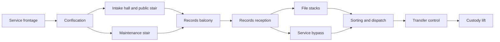

# Recall Notice: complete mission

Status: in flight, 2026-09-20. [Task #195](https://github.com/blisspixel/fragr/issues/195).
Baseline: v0.28.0, `e845236`. Its tree matches the final revision of #193, with all
five integration jobs passing. The three-enemy prototype is not a full mission.
Spend: local work first; the uncertain Clerk reference reservation remains held.

## Player outcome

Follow Latch's recall through a recognizable intake institution, recover weapons,
learn human guard and bot tells, choose a useful route through records, win a
mixed-threat fight at transfer control and leave with the correction destination.
M02 performs the rescue. No early Inheritance contact, mandatory radio, boss,
explosives or arbitrary extra key hunt. The institution's treatment of personal
lives as property supplies the environmental story. Suffering is not the joke.

Keep the approved introduction and safe Tack lesson. The current rooms support
the introduction, but the empty records/transfer half cannot carry the mission.
Build inhabited rooms and purposeful encounters, not a larger open arena.
The 10-15 minute and 20-30 enemy estimates are pacing hypotheses, not quotas.

## Room and encounter staging

- Frontage/confiscation/intake retain the first Clerk and pair of Sweepers. A
  retreat stays legible and neither stair requires jumping.
- Records reception is a smaller threshold beyond the balcony. Its counter and
  cabinets break incoming lanes before a new patrol reaches the player. The
  public and service approaches converge without bypassing safe weapon discovery.
- File stacks offer short aisles, cross-connections and a readable exit toward
  sorting. Their optional supplies justify entering; the bypass is a real choice,
  not a dead corridor. Avoid placing a new enemy in a visible region at activation.
- The service bypass trades the wider stacks' cover and supplies for a tighter
  approach. Both routes reach sorting from different angles and reconnect.
- Sorting combines the two taught threats across cover and distinct approaches.
  The next destination remains visible. Place a quiet record/evidence beat between
  fights; no exposition overlay while attacks continue.
- Transfer control provides the final crest, then the physical record and lift.
  Preserve Latch's destination, actual gate collision and shared boarding. No new
  mandatory wave after the earned exit.

Extend the existing north/west records footprint with real floors, walls and
ceilings. Preserve landmarks and original space identities where they remain
accurate. New collision, navigation and presentation derive from the same JSON.
Use registered Union materials and localized signs with practical lighting;
compare rooms in the rendered route, including distant enemy contrast.

## Equipment and retry

Found introductory guns remain available to every participant. Shared campaign
consumables must be finite within a run; unlimited waiting beside an ammo pad
cannot replace the planned supply economy. Preserve arcade pad respawns. Keep
scarcity, pickup visibility and claims server-owned. Guarantee enough supply for
the main route plus misses, then measure contention with four participants.

A secured records checkpoint must restore coherent party, inventory, pickup,
encounter and objective state on a wipe. Preserve readiness and do not replay
the opening. Individual death, late arrival, departure and an empty server need
explicit rules. A pending reader cannot save a dead party from rollback. Keep
the existing encounter lifecycle as the owner of reset timing.

Persistent saves require a versioned bounded format, content identity, validation,
atomic replacement and an explicit identity/reconnect contract. Do not serialize
arbitrary live state or claim persistence from an in-memory checkpoint. Define
this boundary before implementation; no player-supplied filesystem paths.

## Architecture

`server/maps/m01-recall-notice.json` remains canonical. Reuse authored-map
validation, `encounters.rs`, `mission.rs`, `inventory.rs`, shared movement,
navigation and combat. Keep new checkpoint concerns in a focused module when
needed. No parallel map loader, pathfinder, inventory or client authority.
Use existing typed wire state for compatible changes; revise capability and both
consumer boundaries deliberately if a new contract is necessary.

The provisional Clerk/Sweeper rigs remain the local art source. Final reference,
silhouette, pose and fresh-player encounter acceptance are tracked in #180.
Do not replace the unresolved paid reference with a duplicate request. Check
current price and quota before any approved batch; no overages or top-ups.

## Completion evidence

- [ ] Complete room sequence, both routes, optional rewards and a mixed crest.
- [ ] Measured guaranteed-route supplies, misses, contention and recovery.
- [ ] Coherent checkpoint/retry and explicit persistent-save status.
- [ ] Solo and four-participant runs, mixed humans/agents, MCP and spectator eyes.
- [ ] Deterministic loader, activation, sightline, movement and lifecycle checks.
- [ ] Inspected full-route motion, enemy tells/deaths and effects on available
  OpenGL/Vulkan paths, with hardware and platform limits recorded.
- [ ] Fresh-player route/story comprehension and fun review without steering.
- [ ] Strict Rust, coverage, Godot, verifier, all-map regressions and measured
  CPU checks; current public gallery; exact-revision integration CI.
- [ ] Current mission, framework, roadmap, protocol, asset and release records.

Green checks cannot establish fun, final art or a complete campaign. Record
failed runs and fixes, update the evidence here, and leave unfinished gates open.
