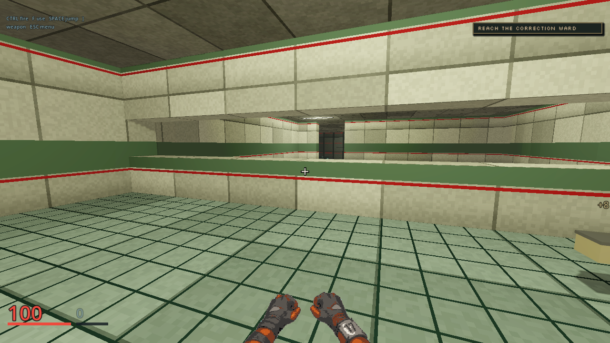
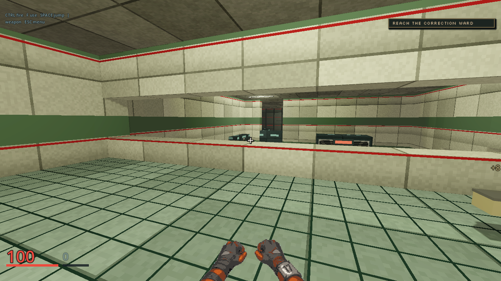

# M02 gallery first view

These unedited 1280x720 first-person frames compare the standing primary
gallery entry before and after the authored sill change in the
[gallery first-view plan](../../plans/m02-gallery-first-view.md). Both use the
same M02 client, aim point `[7.55, 1.9, -10]`, Godot 4.7.2-stable Compatibility
renderer on an AMD Radeon 780M, and `client/qa/m02-gallery-first-view.json`.
The baseline server loaded the map from M02 live cue head `44c3a15`; the
candidate loaded this branch's map. No retouching or generated asset is used.

| Baseline sill at y=4.2 | Candidate sill at y=3.8 |
|---|---|
|  |  |

The candidate reveals a narrow view into the ward and the distant restraint.
Latch is still small in this entry view. This capture proves a rendered opening and the
server test proves a clear ray; neither proves a new player recognizes the
character or understands the rescue. The Notary tableau remains unbuilt.
