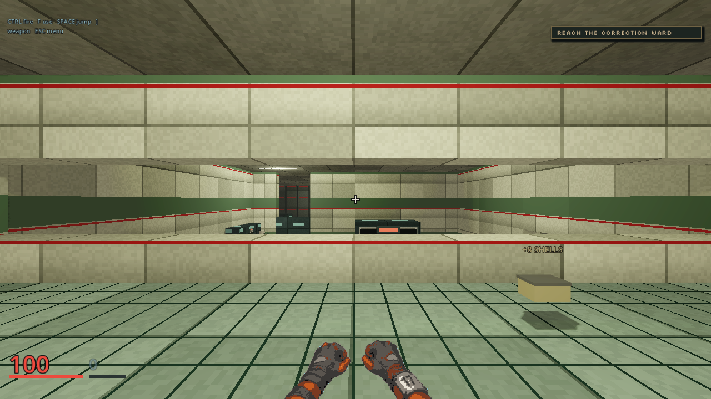
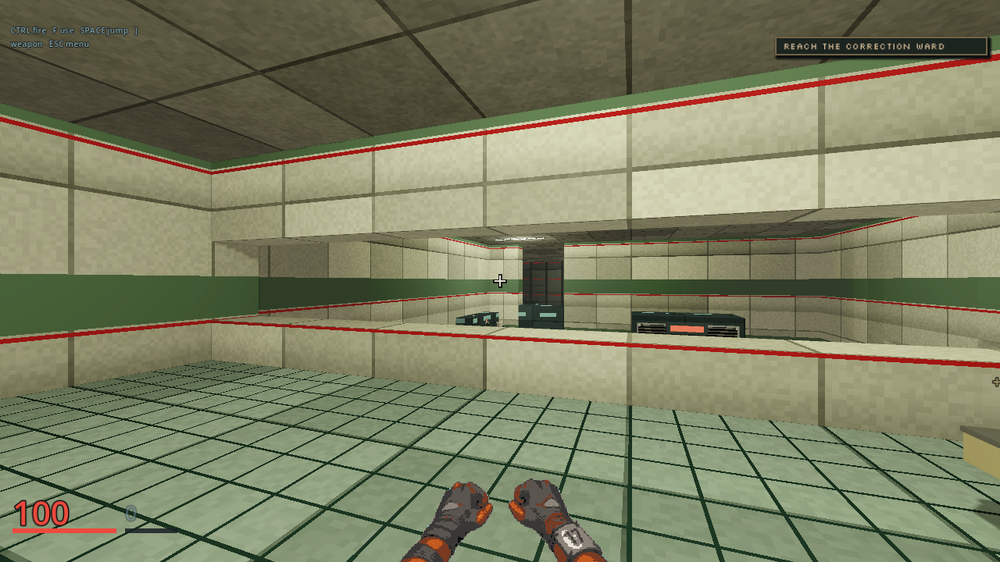

# M02 natural gallery arrival

These are unedited 1280x720 first-person frames from a human participant at
the primary M02 gallery spawn `[0, 3, -31]`. The QA state contains no
`look_at`, walk, aim input or camera takeover. It checks the server snapshot
and rendered camera yaw and pitch together. Both captures used Godot
4.7.2-stable, OpenGL Compatibility and an AMD Radeon 780M, with the same
window geometry and Latch renderer from `5283652`.
Only the primary spawn yaw changes; alternate party spawn facings remain as
they were.

| Straight-ahead yaw 1.5707964 | Restraint-facing yaw 1.2256624 |
|---|---|
|  |  |

The yaw-only change puts the distant restraint within the natural first view.
Latch remains small against ward machinery at this range. These frames and
the server line-of-sight test show composition, not proof that a new player
identifies Latch or understands the objective. The distant Notary tableau is
still unbuilt. The capture source is `client/qa/m02-natural-entry.json`; the
baseline ran the same one-state manifest with the old expected yaw.
