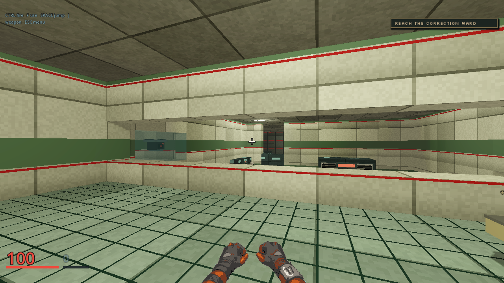
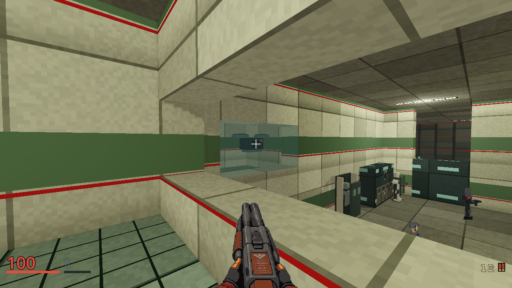
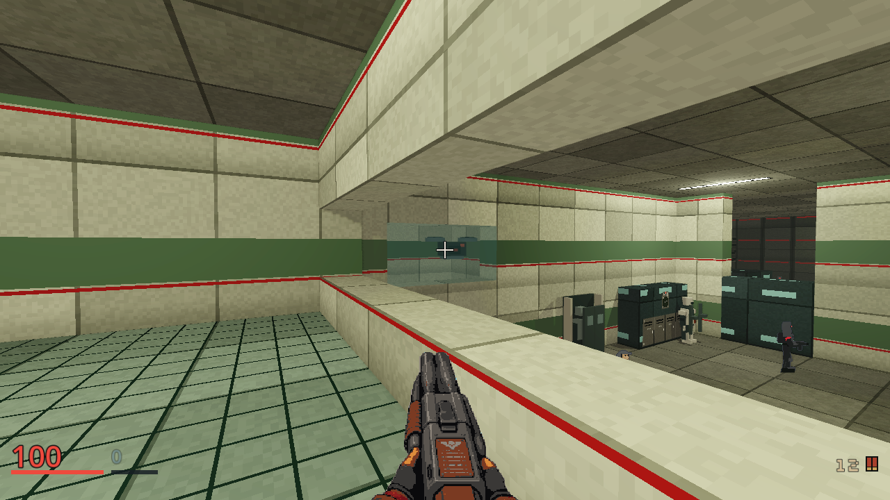
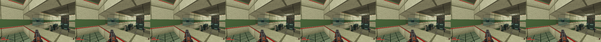
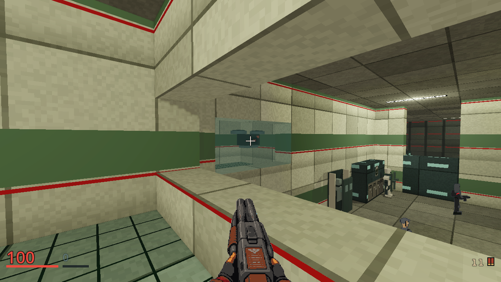

# M02 observation bay draft

These unedited 1280x720 first-person frames came from
`client/qa/m02-notary-tableau.json` on Godot 4.7.2-stable, OpenGL
Compatibility, AMD Radeon 780M. The source map was
`server/maps/m02-persons-unknown.json`, with no added bots. The primary spawn
frame has no walk, `look_at`, aim input or camera takeover. The later frames
use ordinary gallery walking and the first claimed Shotgun.

| Unforced primary spawn | Ordinary closer gallery inspection |
|---|---|
|  |  |

The Notary is a small, peripheral surveillance glimpse. Its twin fans and
optic do not read reliably in these stills, so fresh-player recognition is
open. The visible pane is the same server solid that blocks movement and
ballistics. The `gallery_shotgun_trace_stops_at_the_notary_inspection_pane`
test checks a live resolved pellet against the named pane bounds; the effect
frame alone does not identify which solid was hit. The ordinary closer view
also exposes a ward Sweeper before its intended encounter, a pre-existing
gallery sightline in the parent M02 map that this draft does not widen.
