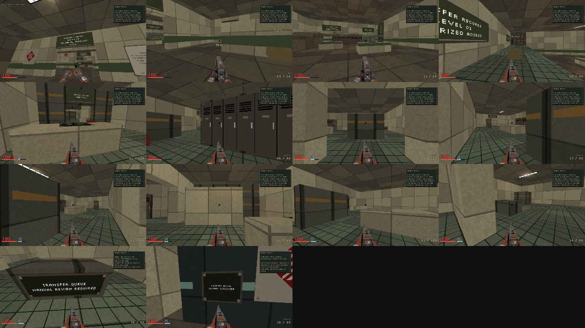

# Authored development maps

`m01-recall-notice.json` contains the opening mission's connected blockout and
weapon discovery and a draft twenty-guard population. Intake and maintenance
stairs converge at records reception; file stacks and a service bypass lead to
sorting, dispatch, transfer control and the custody lift. Enter with fists, find
the pistol and the rifle, collect finite campaign supplies and reload. Clerks and
Sweepers share authoritative attack, hit and death states.
Enemy artwork and animation remain provisional. The physical transfer record
opens the custody lift; the party can then depart together. This ends the current
prototype, not a finished M01 or the rescue. Checkpoints are not built.

`m02-persons-unknown.json` is the Persons Unknown ward graybox, map 1002. The
party enters on an observation gallery whose slot window looks down into the
correction ward. A service stair leads to the antechamber (a Scatter and a
medkit), then the ward door. Reaching the ward, using the correction console,
using the restraint console, and using the loading control each advance one
authored objective. The three consoles raise the restraint bay gate, the
processing floor gate, and the loading gate in turn; the raised shutters stay
visible overhead. The processing floor has a mezzanine on a broad stair and
machinery islands. Arriving on the loading dock departs. The restraint and
loading consoles stand in for Latch's story-controlled release and the Jammer,
neither of which is built. The map has no enemies, maintenance loop, optional
captives or secrets yet. It is a route graybox, not playable M02.

```bash
cargo run -p fragr-server --locked -- --local-mission persons_unknown
```

That development child prints its loopback readiness line and serves the
normal wire; it keeps no run file. `--map-file server/maps/m02-persons-unknown.json
--bots 0` also works for a dedicated development host. Clients need gameplay
capability 9.

For M01, from the repository root:

```bash
cargo run -p fragr-server --locked -- --bind 127.0.0.1:6767 --bots 0 --map-file server/maps/m01-recall-notice.json
```

Add `--campaign-run` for a solo human or agent with three explicit mission-start
continues and a lifetime owner seat. The local Single Player menu uses this mode.
Without it, the command above retains four-seat development party behavior.
Solo death waits for a continue, the fourth death ends the run, and leaving cannot
refill or reclaim it. Spectators can watch either mode. Retry restores original
entry equipment, geometry, guards, supplies and objectives together. Disk saves,
reconnect and cross-mission carry remain unbuilt.

Connect the ordinary client, agent or spectator to the same server. This mode
has no arcade timer, boss or map rotation. `--map-file` rejects arcade
map selection, Episode 0, rule overrides and rule bots. It is opt-in authoring
support, not the campaign menu's finished first mission.

Add `--difficulty assisted`, `--difficulty standard` or `--difficulty severe` to
choose the mission's shared pressure before admission. Omission keeps Standard.
The first profiles adjust Clerk/Sweeper windup and recovery, not health, damage,
supplies or story. Local Single Player offers the same choices. Difficulty is
fixed for that server lifetime; restart for another choice. Use matching client
and server builds with gameplay capability 7 (6 suffices for development parties). Arcade and benchmark runs reject
the option. Final multi-tier encounter and resource balance remains unfinished.

## Document version 1

- `version`: exactly `1`; `map_id`: a stable integer at least `1000`, reserving
  the arcade roster; `name`: nonempty, at most 80 characters, no controls.
- `half_extent`: playable square radius, 2 through 256 metres. Base floor is
  zero. `ground`: a registered surface kit.
- `solids`: at most 2048 records with `id`, `min: [x,y,z]`, `max: [x,y,z]` and
  `surface`. Minimum bounds must precede maximum bounds; bottom cannot be negative.
  These become canonical finite collision volumes, including ceilings.
- `spawns`: 1 through 128 records with `id`, `feet: [x,y,z]` and `yaw` in radians
  from zero inclusive to one full turn exclusive. Positive Z faces `pi/2`.
- `landmarks`: 1 through 128 named `id` and `feet` records for route validation.
  Every spawn and landmark needs support, full standing clearance and a route
  from the first spawn. Names are shared across all records and must be unique
  lowercase ASCII letters, digits or underscores, at most 64 bytes.
- `equipment`: `discovery` or `full_arsenal` (default). Discovery begins with fists
  and requires client gameplay capability 2, independently of geometry capability.
- `supplies`: at most 128 records, allowed only with discovery. Each has unique
  `id`, supported and reachable `feet`, `claim` (`personal` or `contested`) and
  a strict `grant`: `{"kind":"weapon","weapon":"tack"}`,
  `{"kind":"ammo","pool":"darts","amount":30}`, or `health`/`armor` with
  `amount` from 1 through 100. Ammo amounts cannot exceed pool caps in `WEAPONS.md`.
  Fists cannot be a grant. Personal claims are only for weapons; each participant
  can claim each once per development life. Contested supplies have one winner.
  Campaign stock (maps with encounters or a mission) stays consumed until the
  authoritative party reset; arcade practice retains timed pickup respawns.
  An additional copy of an owned gun grants reserve without
  forcing selection. Development respawn resets inventory and personal claims;
  solo retry restores the captured mission-entry inventory and claims instead.
- `encounters`: optional, discovery only. At most 32 groups, 64 enemies and 64
  entry regions in total. Each group has a unique `id`, nonempty `regions` and
  `enemies`, and optional `after` naming an earlier group. Each region is an
  inclusive feet-position box with finite ordered `min`/`max` bounds inside the
  map. Each enemy has a unique `id`, `kind` (`clerk` or `sweeper`), supported and
  reachable `feet`, and bounded `yaw`, just like a spawn. Unknown fields are
  rejected. No scripts or arbitrary behavior expressions. These maps require
  gameplay capability 3. See [actor semantics](../../docs/protocol.md#campaign-actor-identity).
- `mission`: optional, discovery only, requires capability 6 for shared difficulty
  and party readiness, or 7 when the host selects solo run rules. The registered
  `id` is `recall_notice`. `record` and `departure` each contain `panel` (the same
  authored decoration shape) and `approach` feet coordinates. The panel kinds
  must be `terminal` and `lift_control`, hosted on stationary solids. These panels
  are appended to the shared presentation; do not duplicate them in `decorations`.
  `gate` names one `solid` and a finite vertical `lift` from 0.125 through 16 metres.
  `boarding` is an ordered inclusive `min`/`max` box containing the departure
  approach. Both approaches must stand, see and reach their panels in both gate
  states. Record access must remain open; departure must be unreachable until the
  gate opens. Spawns remain accessible with it closed; other landmarks, supplies
  and enemy placements may be reachable after opening. Both immutable worlds and
  their navigation are validated before binding. No navigation is rebuilt on tick.
- `m02`: optional, only on map 1002 with discovery equipment and no `mission`.
  `objectives` is a linear chain of at most eight records, each with a unique
  `id`, `after` naming the previous objective (omitted on the first), and an
  `action`: `{"kind":"arrival","region":{min,max},"feet":[x,y,z]}` or
  `{"kind":"use","panel":{...},"approach":[x,y,z]}` with a `terminal` or
  `lift_control` panel on a stationary solid. The last objective must be a
  `party_departed` arrival. `gates` holds at most three `{id,solid,lift,after}`
  records; each raises one solid by 0.125 to 16 metres once its nonfinal `after`
  objective completes. Every reachable gate world and its navigation are built
  and checked before binding: each objective stands and routes from the first
  spawn in its world, the previous world cannot reach an objective behind a new
  gate, an arrival region cannot span a closed gate, each approach sees its
  panel within reach, and the closed world cannot reach the exit. An M02 map
  is limited to a 128 metre half extent and 128 solids.

The bounded roster is placed when the party first becomes active. Entry regions
wake existing guards, so crossing a threshold cannot materialize an actor in view.
Hitting a dormant guard wakes its group independently of entry dependencies.
M01's Clerk advances around the inspection partition after safe weapon discovery.
The two Sweepers activate after that fight when a participant enters the intake
hall or reaches the upper flank. The records screen and deck conceal their
initial positions. Initial dispatch follows a fixed alarm location for up to
30 seconds; after seeing someone, pursuit remembers their last visible position
for five seconds. Hidden movement never updates that location. These are initial
tuning values. Complete-mission verification continues in
[the active plan](../../docs/plans/m01-completion.md); final character acceptance
remains tracked in [the encounter plan](../../docs/plans/m01-intake-encounter.md).

Surface kits: `concrete`, `enamel`, `service_steel`, `records_tile`, `lift_panel`.
They select existing offline materials, never paths, URLs or shader code. The
wire presentation array preserves exactly the solid order. It affects appearance,
not geometry version or collision. Older presenters may use their default kit.

Optional `decorations` attaches thin cosmetic panels to solid faces. For example:

```json
{"solid":"bay_front_header","face":"north","center":[0,0],"size":[5.6,2.1],"kind":"property_sign"}
```

The authoring `solid` is a stable ID, resolved to a validated wire index. The
shared [wire contract](../../docs/protocol.md#mapinfo) defines six face axes,
registered kinds, finite dimensions, host bounds, 128-panel and eight-light limits.
Decorations alone do not add blocking geometry or interactive terminals. Mission
controls explicitly attach authority to their registered panels. Add a solid for
anything that should stop movement or shots. The client supplies original pixel
panels and keyed English text from `client/i18n/world.en.po`; no text, scripts or
resource paths can be embedded in the map.

Files are limited to 1 MiB before parsing. Unknown fields and unsupported versions
are errors. Geometry and navigation budgets are checked before the server binds.
Errors report the reason or parser location. Placement diagnostics identify the
already-validated public record ID, never dump document contents or source paths.

The source path is never sent to clients. `MapInfo` supplies the validated geometry
and materials. Reloading a map means restarting the host; live content reload and
campaign saves have no implemented contract yet.

## Verification

```bash
cargo test -p fragr-server maps::authored --locked
cargo test -p fragr-server --test authored_maps --locked
cargo test -p fragr-server --lib mission::m02 --locked
FRAGR_QA_BOTS=0 FRAGR_QA_MAP_FILE="$PWD/server/maps/m01-recall-notice.json" FRAGR_QA_MANIFEST=res://qa/m01.json bash tools/qa_tour.sh .agents/qa/m01
FRAGR_QA_BOTS=0 FRAGR_QA_MAP_FILE="$PWD/server/maps/m01-recall-notice.json" FRAGR_QA_MANIFEST=res://qa/m01-discovery.json bash tools/qa_tour.sh .agents/qa/m01-discovery
FRAGR_QA_BOTS=0 FRAGR_QA_MAP_FILE="$PWD/server/maps/m01-recall-notice.json" FRAGR_QA_MANIFEST=res://qa/m01-encounters.json bash tools/qa_tour.sh .agents/qa/m01-encounters
FRAGR_QA_BOTS=0 FRAGR_QA_MAP_FILE="$PWD/server/maps/m01-recall-notice.json" FRAGR_QA_MANIFEST=res://qa/m01-maintenance.json bash tools/qa_tour.sh .agents/qa/m01-maintenance
FRAGR_QA_BOTS=0 FRAGR_QA_MAP_FILE="$PWD/server/maps/m01-recall-notice.json" FRAGR_QA_MANIFEST=res://qa/m01-facility.json bash tools/qa_tour.sh .agents/qa/m01-facility
FRAGR_QA_BOTS=0 FRAGR_QA_MAP_FILE="$PWD/server/maps/m01-recall-notice.json" FRAGR_QA_MANIFEST=res://qa/m01-records.json bash tools/qa_tour.sh .agents/qa/m01-records
```

The tour uses human input through a live server, never teleportation. Inspect
all rooms, movement samples and combat sheets. The encounter tour deliberately
observes one Clerk shot before returning fire. The combat driver filters allies,
dead bodies and occluded targets, and fails if the participant dies. It can
defend against nearby threats during travel in the opt-in full mission tour. That tour records
named guard deaths across rooms, so an early defeat cannot replace another guard
or disappear from evidence with corpse cleanup. Accurate aim is a regression
tool, not evidence of human difficulty. Set
`FRAGR_RENDER_DRIVER=vulkan` for the second renderer. Do not use `--publish` with
these specialized manifests. The full release
tour remains a separate check. Story and room purposes belong to
[`docs/campaign/m01-recall-notice.md`](../../docs/campaign/m01-recall-notice.md).

Inspected expanded-route capture, still development art:


