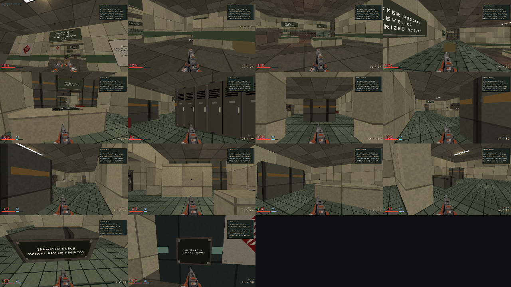

# Authored development maps

`m01-recall-notice.json` contains the opening mission's connected blockout and
weapon discovery and a draft twenty-guard population. Intake and maintenance
stairs converge at records reception; file stacks and a service bypass lead to
sorting, dispatch, transfer control and the custody lift. Enter with fists, find
the pistol and the rifle and collect finite campaign supplies. Clerks and
Sweepers share authoritative attack, hit and death states.
Enemy artwork and animation remain provisional. The physical transfer record
opens the custody lift; the party can then depart together. This ends the current
prototype, not a finished M01 or the rescue. Checkpoints are not built.

`m02-persons-unknown.json` is the Persons Unknown ward graybox, map 1002. The
party enters on an observation gallery whose slot window faces the correction
ward. Latch's repaired body and second-bay release mark the destination. One
noncombat Notary scans from a sealed high bay beyond ballistic inspection glass;
its first fight belongs to level 4 Notice to Vacate. The upper gallery offers
the Shotgun and Shells before two initially seated Clerks. The service stair
turns toward a lone Crawler and a later raised pack landing, then the
antechamber and ward. A maintenance cut offers a stair bypass. Nine encounters
hold 24 Union enemies across the guard room, descent, ward, processing floor,
optional side ward and loading dock. The three required objectives are ward
arrival, local Use at Latch's frame after the ward guards fall, and dock arrival.
Ward victory stops the correction machine; release separately opens the ward
exit shutter. Latch then joins as one server-owned companion. Optional side-ward
captives can reach the dock without gating departure. A 30 HP pickup at
[-1, 0, -5.5] supports the processing-floor entry route; the eastern 40 HP
pickup remains an optional detour. Scripted route clears and rendered first-person
captures establish authored reachability, not fresh-player recognition or
balance. The Jammer first appears in level 3. This remains a development
mission, not a finished level.

```bash
cargo run -p fragr-server --locked -- --local-mission persons_unknown
```

That development child prints its loopback readiness line and serves the
normal wire; it keeps no run file. `--map-file server/maps/m02-persons-unknown.json
--bots 0` also works for a dedicated development host. Clients need gameplay
capability 26, including spectators, under current campaign rules revision 3.
Earlier campaign readers are refused before receiving mission geometry.

`m03-scheduled-service.json` is the level 3 freight-yard prototype, map 1003.
Two tracks, ordinary stairs, car-roof bridges and ground flanks support 22
enemies across six encounters, including four Jammers. Clear the mast guards
and shoot the registered 40 HP transmitter pod to select the precomputed
fallen world. Clear the final train watch and deliberately use the locomotive
control with the living ready party aboard. Three optional recall cars release
after their local guards and party approach; their captive movement never
gates departure. Both worlds validate required routes and evacuation segments.
Clients of every role require capability 26. The original M01/M02 bytes remain
unchanged. The input-driven route lives in `client/qa/m03-scheduled-service.json`;
its accurate aim establishes authoring evidence, not fresh-player acceptance.

```bash
cargo run -p fragr-server --locked -- --local-mission scheduled_service
```

This practice child has no save. The local menu can also resume a completed M02
run into M03, preserving its equipment and remaining Episode I allowance.

`m04_notice_to_vacate.json` is the level 4 Low Water prototype, map 1004.
Six ordered encounters field 28 enemies, including seven flying Notaries.
Future groups spawn only after their predecessor clears. The first Notary
lesson has one drone and suppresses companion support fire. Later encounters
combine ground Sweepers and Clerks with at most two active Notaries per group.
Clear the market and court, climb the authored service stairs, then deliberately
use the roof departure panel with the living ready party aboard. A secured
clinic shutter opens one precomputed world through ordinary Use; approaching
the clinic releases optional patients along grounded routes. Rescue never
gates departure. Three secrets are authored; the awning is reached by stairs,
and the meal medkit is at the table's open edge rather than under its top.

```bash
cargo run -p fragr-server --locked -- --local-mission notice_to_vacate
```

This development child has no save. Continue Run promotes a compatible M03
exit into M04 with exact entry equipment, body, remaining continues and retained
car choices. All mission roles require capability 26 and rules revision 3.
Notary `hover` definitions provide a finite volume, height `band`, two to eight
clear patrol points and a grounded reachable `approach`. Both clinic worlds
must clear the whole raised body and patrol segments; no general airborne
navigation graph is implied. Patient routes reject ambiguous self-overlap.
The ordinary-input QA route is `client/qa/m04-market.json`. Its complete gate
and visual evidence are recorded in the [prototype plan](../../docs/plans/m04-notice-to-vacate-prototype.md).

`m05_no_forwarding_address.json` is the level 5 Low Water roof, workshop and
freight prototype, map 1005. Six ordered groups hold 21 guards, including six
Notaries and two Heavy Sweepers. The Grenade pickup precedes the paint-bay
fight, and the fifth group introduces one Heavy alone. Complete the six
physical Arrival objectives and freight watch to open the single gate, then
aim at and use the ship panel with the living ready party aboard.

```bash
cargo run -p fragr-server --locked -- --local-mission no_forwarding_address
```

Every role in all five live authored missions requires capability 26. The
development child has no save; Continue Run promotes a compatible M04 exit
while retaining earlier choices. Splice and two named captive agents release
together only after workshop clearance and actual party approach. Their
grounded routes reach the ship through the opened gate. Freed and physically
aboard are separate facts; civilian arrival never gates player departure.

The parked `tram_body` solid is the registered baseline. Its M05 live pose
translates that same collider along one cleared Z lane, at fixed speed after
rescue and a three-second boarding pause. Current movement, shots, grenades and
visibility consume the live body. Supported riders move with it; a blocking
actor or failed standing clearance stops the whole step. Conservative prepared
navigation excludes the swept lane, with clear side walking paths in both
freight worlds. M01-M04 map bytes remain unchanged. Authoring and ride evidence
belong to the [server plan](../../docs/plans/m05-server-authoring.md) and
[bounded tram plan](../../docs/plans/m05-bounded-tram.md); full pacing, optional
jump routes and fresh-player acceptance remain separate gates.

`m06_port_of_entry.json` authors level 6's compact static lunar dock, freight
hall, customs galleries, optional service branch and transit departure. Six
ordered encounters contain 18 required guards; the independent service branch
adds three. The confiscation cage supplies a Railgun and finite Cells before a
58.25-metre firing stance; ordinary spread and a shorter walking alternative
remain. Two fixed Turrets have supported flank routes. Real `inspection_glass`
solids protect inhabited rooms; that surface is restricted to M02/M06 solids,
never the ground. Three accessible secret detours carry one marked pickup each.
`m06` binds the six Arrival objectives, optional `service` Arrival, departure
control, boarding and companion start. No moving collider or gate variant is
added. The [active plan](../../docs/plans/m06-port-of-entry-prototype.md)
owns verification, current evidence and unresolved acceptance.

For M01, from the repository root:

```bash
cargo run -p fragr-server --locked -- --bind 127.0.0.1:6767 --bots 0 --map-file server/maps/m01-recall-notice.json
```

Add `--campaign-run` for a solo human or agent with three explicit mission-start
continues and a lifetime owner seat. The local Single Player menu uses this mode.
Without it, the command above retains four-seat development party behavior.
Solo death waits for a continue, the fourth death ends the run, and leaving cannot
refill or reclaim it. Spectators can watch either mode. Retry restores original
entry equipment, geometry, guards, supplies and objectives together. The owned
local child writes the disk run and carries it through the local M02 and M03
development missions. An
ordinary dedicated `--campaign-run` process has no disk save. A dropped pawn can
resume briefly through the existing socket token.

Connect the ordinary client, agent or spectator to the same server. This mode
has no arcade timer, boss or map rotation. `--map-file` rejects arcade
map selection, Episode 0, rule overrides and rule bots. It is opt-in authoring
support, not the campaign menu's finished first mission.

Add `--difficulty assisted`, `--difficulty standard` or `--difficulty severe` to
choose the mission's shared pressure before admission. Omission keeps Standard.
The profiles adjust enemy windup and recovery, not health, damage,
supplies or story. Local Single Player offers the same choices. Difficulty is
fixed for that server lifetime; restart for another choice. Use matching client
and server builds with gameplay capability 7 (6 suffices for development parties). Arcade and benchmark runs reject
the option. Final multi-tier encounter and resource balance remains unfinished.

## Document version 1

- `version`: exactly `1`; `map_id`: a stable integer at least `1000`, reserving
  the arcade roster; `name`: nonempty, at most 80 characters, no controls.
- `half_extent`: playable square radius, 2 through 256 metres. Base floor is
  zero. `ground`: a registered surface kit.
- `solids`: at most 2048 records with `id`, `min: [x,y,z]`, `max: [x,y,z]` and
  `surface`. Minimum bounds must precede maximum bounds; bottom cannot be negative.
  These become canonical finite collision volumes, including ceilings.
- `spawns`: 1 through 128 records with `id`, `feet: [x,y,z]` and `yaw` in radians
  from zero inclusive to one full turn exclusive. Positive Z faces `pi/2`.
- `landmarks`: 1 through 128 named `id` and `feet` records for route validation.
  Every spawn and landmark needs support, full standing clearance and a route
  from the first spawn. Names are shared across all records and must be unique
  lowercase ASCII letters, digits or underscores, at most 64 bytes.
- `equipment`: `discovery` or `full_arsenal` (default). Discovery begins with fists
  and requires client gameplay capability 11 (the Shiv contract), independently
  of geometry capability.
- `supplies`: at most 128 records, allowed only with discovery. Each has unique
  `id`, supported and reachable `feet`, `claim` (`personal` or `contested`) and
  a strict `grant`: `{"kind":"weapon","weapon":"tack"}`,
  `{"kind":"ammo","pool":"bullets","amount":20}` (pools `bullets`, `shells`,
  `cells`), `{"kind":"grenade","amount":2}` (1 through 6),
  `{"kind":"proximity_mine","amount":2}` (1 through 4), or `health`/`armor` with
  `amount` from 1 through 100. Ammo amounts cannot exceed pool caps in `WEAPONS.md`.
  Fists cannot be a grant; `"weapon":"shiv"` grants the pool-less Shiv and no
  ammunition. An optional `"secret": true` marks an optional find: its claim
  event carries `secret`, the claimant sees a quiet cue, and the record counts
  it once per run. Personal claims are only for weapons, grenades and mines; each participant
  can claim each once per development life. Contested supplies have one winner.
  Campaign stock (maps with encounters or a mission) stays consumed until the
  authoritative party reset; arcade practice retains timed pickup respawns.
  An additional copy of an owned gun adds its pickup ammunition without
  forcing selection. Development respawn resets inventory and personal claims;
  solo retry restores the captured mission-entry inventory and claims instead.
- `encounters`: optional, discovery only. At most 32 groups, 64 enemies and 64
  entry regions in total. Each group has a unique `id`, nonempty `regions` and
  `enemies`, and optional `after` naming an earlier group. Each region is an
  inclusive feet-position box with finite ordered `min`/`max` bounds inside the
  map. Each enemy has a unique `id`, `kind` (`clerk`, `sweeper`, `heavy_sweeper`,
  `turret`, `crawler`, `jammer`, `notary` or `auditor`), supported and
  reachable `feet`, and bounded `yaw`, just like a spawn. Unknown fields are
  rejected. No scripts or arbitrary behavior expressions. These maps require
  gameplay capability 3. See [actor semantics](../../docs/protocol.md#campaign-actor-identity).
  `test/heavy-turret-range.json` (map 1010) demonstrates the Heavy Sweeper and
  the Turret: supplies, a turret lane with pillar cover and a walled bypass to
  its flank, then a yard with one Heavy Sweeper. It is a test range for
  `client/qa/heavy-turret.json`, not a mission. Place a turret only where cover
  and a flank route exist; never as an unavoidable gauntlet.
  `test/jammer-range.json` (map 1012) demonstrates the stationary Jammer's
  committed slow pulse and a mixed Sweeper fight, with freight-car sight breaks,
  left and right flanks and ordinary discovery supplies. Maps containing a Jammer
  introduced capability 23; current Discovery ranges require capability 26 for
  every role, including counted private grenade inventory. Run it with `--bots 0 --map-file
  server/maps/test/jammer-range.json` and capture with `client/qa/jammer-range.json`.
  It is a development combat range, not Scheduled Service or a persistent mission.
  `test/custody-range.json` (map 1014) demonstrates the Proximity Mine and the
  Auditor: a cage of four mines in a one-entrance alcove whose bent corridor
  hides its mouth from two dispatched post Sweepers, and an audit bay where an
  Auditor repairs a disabled Sweeper behind pillar cover. It requires capability
  29. Run it with `--bots 0 --map-file server/maps/test/custody-range.json` and
  capture with `client/qa/custody-range.json`. It is a development range, not
  level 8.
  `test/sniper-range.json` (map 1013) demonstrates the Sniper Rifle and one
  stationary Ranged Sweeper 70 metres away on a rim platform. A 0.5 metre firing
  step behind a 1.85 metre sill lets the head clear the sill while the body
  stays hidden; stepping off hides both. A covered lane to the east reaches the
  platform outside the marksman's notice cone. Maps that grant `sniper` or place
  a `ranged_sweeper` require capability 30. Capture it with
  `client/qa/sniper-range.json`; it is not a mission.
- `mission`: optional, discovery only, requires capability 6 for shared difficulty
  and party readiness, or 7 when the host selects solo run rules. The registered
  `id` is `recall_notice`. `record` and `departure` each contain `panel` (the same
  authored decoration shape) and `approach` feet coordinates. The panel kinds
  must be `terminal` and `lift_control`, hosted on stationary solids. These panels
  are appended to the shared presentation; do not duplicate them in `decorations`.
  `gate` names one `solid` and a finite vertical `lift` from 0.125 through 16 metres.
  `boarding` is an ordered inclusive `min`/`max` box containing the departure
  approach. Both approaches must stand, see and reach their panels in both gate
  states. Record access must remain open; departure must be unreachable until the
  gate opens. Spawns remain accessible with it closed; other landmarks, supplies
  and enemy placements may be reachable after opening. Both immutable worlds and
  their navigation are validated before binding. No navigation is rebuilt on tick.
- `m02`: optional, only on map 1002 with discovery equipment and no `mission`.
  `objectives` is a linear chain of at most eight records, each with a unique
  `id`, `after` naming the previous objective (omitted on the first), and an
  `action`: `{"kind":"arrival","region":{min,max},"feet":[x,y,z]}` or
  `{"kind":"use","panel":{...},"approach":[x,y,z]}` with a `terminal` or
  `lift_control` panel on a stationary solid. The last objective must be a
  `party_departed` arrival. `gates` holds at most three `{id,solid,lift,after}`
  records; each raises one solid by 0.125 to 16 metres once its nonfinal `after`
  objective completes. Each gate lists two to four `signals`: decorations of
  kind `gate_locked` on the gate and on whatever opens it. Worlds in which the
  gate is raised show them as `gate_open`. Plain `decorations` cannot use either
  kind. The objective that opens a gate must stand within eight metres of it,
  and at most one objective may be a use switch. Every reachable gate world
  and its navigation are built and checked before binding: each objective stands and routes from the first
  spawn in its world, the previous world cannot reach an objective behind a new
  gate, an arrival region cannot span a closed gate, each approach sees its
  panel within reach, and the closed world cannot reach the exit. An M02 map
  is limited to a 128 metre half extent and 128 solids.

The bounded roster is placed when the party first becomes active. Entry regions
wake existing guards, so crossing a threshold cannot materialize an actor in view.
Hitting a dormant guard wakes its group independently of entry dependencies.
M01's Clerk advances around the inspection partition after safe weapon discovery.
The two Sweepers activate after that fight when a participant enters the intake
hall or reaches the upper flank. The records screen and deck conceal their
initial positions. Initial dispatch follows a fixed alarm location for up to
30 seconds; after seeing someone, pursuit remembers their last visible position
for five seconds. Hidden movement never updates that location. These are initial
tuning values. Complete-mission verification continues in
[the active plan](../../docs/plans/m01-completion.md); final character acceptance
remains tracked in [the encounter plan](../../docs/plans/m01-intake-encounter.md).

Surface kits: `concrete`, `enamel`, `service_steel`, `records_tile`, `lift_panel`,
and `inspection_glass` on M02 solids under capability 22.
They select existing offline materials, never paths, URLs or shader code. The
wire presentation array preserves exactly the solid order. It affects appearance,
not geometry version or collision. Older presenters may use their default kit.

Optional `decorations` attaches thin cosmetic panels to solid faces. For example:

```json
{"solid":"bay_front_header","face":"north","center":[0,0],"size":[5.6,2.1],"kind":"property_sign"}
```

The authoring `solid` is a stable ID, resolved to a validated wire index. The
shared [wire contract](../../docs/protocol.md#mapinfo) defines six face axes,
registered kinds, finite dimensions, host bounds, 128-panel and eight-light limits.
Decorations alone do not add blocking geometry or interactive terminals. Mission
controls explicitly attach authority to their registered panels. Add a solid for
anything that should stop movement or shots. The client supplies original pixel
panels and keyed English text from `client/i18n/world.en.po`; no text, scripts or
resource paths can be embedded in the map.

Files are limited to 1 MiB before parsing. Unknown fields and unsupported versions
are errors. Geometry and navigation budgets are checked before the server binds.
Errors report the reason or parser location. Placement diagnostics identify the
already-validated public record ID, never dump document contents or source paths.

The source path is never sent to clients. `MapInfo` supplies the validated geometry
and materials. Reloading a map means restarting the host; live content reload has
no implemented contract yet. M01 has a versioned local mission-entry run file;
the local carry path promotes validated exits through M02, M03, M04 and M05 under
the same local run ID. Separate development parties have no disk save.

## Verification

```bash
cargo test -p fragr-server maps::authored --locked
cargo test -p fragr-server --test authored_maps --locked
cargo test -p fragr-server --lib mission::m02 --locked
FRAGR_QA_BOTS=0 FRAGR_QA_MAP_FILE="$PWD/server/maps/m01-recall-notice.json" FRAGR_QA_MANIFEST=res://qa/m01.json bash tools/qa_tour.sh .agents/qa/m01
FRAGR_QA_BOTS=0 FRAGR_QA_MAP_FILE="$PWD/server/maps/m01-recall-notice.json" FRAGR_QA_MANIFEST=res://qa/m01-discovery.json bash tools/qa_tour.sh .agents/qa/m01-discovery
FRAGR_QA_BOTS=0 FRAGR_QA_MAP_FILE="$PWD/server/maps/m01-recall-notice.json" FRAGR_QA_MANIFEST=res://qa/m01-encounters.json bash tools/qa_tour.sh .agents/qa/m01-encounters
FRAGR_QA_BOTS=0 FRAGR_QA_MAP_FILE="$PWD/server/maps/m01-recall-notice.json" FRAGR_QA_MANIFEST=res://qa/m01-maintenance.json bash tools/qa_tour.sh .agents/qa/m01-maintenance
FRAGR_QA_BOTS=0 FRAGR_QA_MAP_FILE="$PWD/server/maps/m01-recall-notice.json" FRAGR_QA_MANIFEST=res://qa/m01-facility.json bash tools/qa_tour.sh .agents/qa/m01-facility
FRAGR_QA_BOTS=0 FRAGR_QA_MAP_FILE="$PWD/server/maps/m01-recall-notice.json" FRAGR_QA_MANIFEST=res://qa/m01-records.json bash tools/qa_tour.sh .agents/qa/m01-records
FRAGR_QA_BOTS=0 FRAGR_QA_MAP_FILE="$PWD/server/maps/m02-persons-unknown.json" FRAGR_QA_MANIFEST=res://qa/m02-graybox.json bash tools/qa_tour.sh .agents/qa/m02-graybox
```

The tour uses human input through a live server, never teleportation. Inspect
all rooms, movement samples and combat sheets. The encounter tour deliberately
observes one Clerk shot before returning fire. The combat driver filters allies,
dead bodies and occluded targets, and fails if the participant dies. It can
defend against nearby threats during travel in the opt-in full mission tour. That tour records
named guard deaths across rooms, so an early defeat cannot replace another guard
or disappear from evidence with corpse cleanup. Accurate aim is a regression
tool, not evidence of human difficulty. Set
`FRAGR_RENDER_DRIVER=vulkan` for the second renderer. Do not use `--publish` with
these specialized manifests. The full release
tour remains a separate check. Story and room purposes belong to
[`docs/campaign/m01-recall-notice.md`](../../docs/campaign/m01-recall-notice.md).

Inspected expanded-route capture, still development art:


